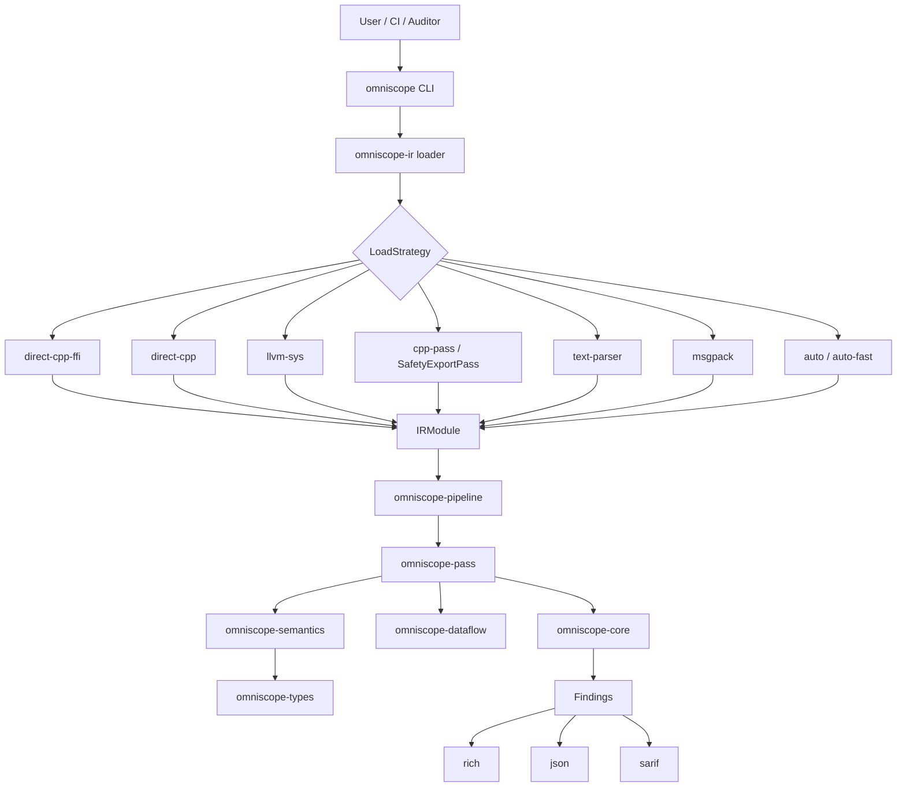
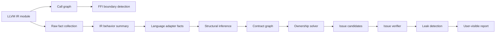

# OmniScope-rs

[](LICENSE)
[](https://www.rust-lang.org)
[](https://llvm.org)

OmniScope-rs is a Rust rewrite and extension of the original OmniScope project:

Original project: <https://github.com/Timwood0x10/OmniScope>

This repository builds an LLVM IR based static analyzer for cross-language FFI security review. Its main goal is to find and explain memory/resource ownership bugs around language boundaries: mismatched allocator/free pairs, ownership escape, leaks, unsafe FFI calls, unchecked returns, and related resource-contract violations.

This project is useful today as an experimental auditor-assist tool and research prototype. It is not yet a stable production scanner, and the current binary still reports version `0.1.0`.

## Status

**Current release recommendation:** open-source the project, but do not tag `1.0.0` yet.

The project is in a credible state for public development because it has an Apache-2.0 license, a Rust workspace split into focused crates, a CLI, CI configuration, tests, benchmarks, SARIF/JSON output, release-readiness notes, and documented limitations.

It is not ready for `1.0.0` because recent validation found accuracy and reporting blockers:

| Validation target | Result | Notes |
|---|---:|---|
| `ffi-demo` corpus, 10 IR files | 68% precision, 62% recall | Results are carried heavily by one strong historical validation fixture. |
| `ffi-demo` without `zig_main.ll` | about 43% precision | Signal is much weaker outside the best case. |
| `bun_alloc.ll` | 0/19 true positives | Known regression after the single-language gate change. |
| `llhttp.ll` | 0 findings | Correctly quiet on this clean vendored parser sample. |

See:

- [`docs/release/release_readiness_v0.2.0.md`](docs/release/release_readiness_v0.2.0.md)
- [`docs/release/ffi_demo_validation.md`](docs/release/ffi_demo_validation.md)
- [`docs/release/bun_validation.md`](docs/release/bun_validation.md)
- [`LIMITATIONS.md`](LIMITATIONS.md)

## What Works

- Loads LLVM IR through multiple strategies, including direct C++ extraction, `llvm-sys`, C++ pass JSON, text parsing, and MessagePack.
- Runs a 21-pass analysis pipeline over call graphs, FFI boundaries, resource facts, semantic summaries, contract graphs, ownership solving, issue candidate building, verification, and leak detection.
- Emits `rich`, `json`, and `sarif` output.
- Supports explicit boundary declarations through `--cross FROM:TO` and `omniscope.toml`.
- Has a growing semantic model for C, C++, Rust, Go, Python, Java, and C# through LLVM IR patterns.
- Zig (historical validation only): the `zig_main.ll` fixture achieved 95% precision and 100% recall in the June 2026 validation report.

## Known Limits

- This is not a formal verification tool.
- It should not be used as the only security gate for production code.
- It analyzes one IR file at a time; full cross-module analysis is not implemented.
- Double-free detection is currently too flow-insensitive in some cases.
- Leak reporting can ignore deallocator pairing data that is already available in the contract graph.
- Single-language module gating can suppress FFI evidence when C extern declarations are present.
- Pure C/C++ memory safety auditing is not the main target and can produce noisy results.
- Some language adapters are pattern/semantic helpers, not complete language frontends.

The safest current use is non-blocking CI, security-review triage, and FFI surface mapping.

## Comparison With The Original OmniScope

The original OmniScope project at <https://github.com/Timwood0x10/OmniScope> is the upstream inspiration and should be credited as the base idea. OmniScope-rs is not a drop-in replacement; it is a Rust implementation that experiments with a broader analysis architecture.

| Area | Original OmniScope | OmniScope-rs |
|---|---|---|
| Implementation language | Zig project | Rust workspace |
| Core input | LLVM IR | LLVM IR |
| Main focus | Multi-language unsafe/FFI analysis | Cross-language FFI ownership/resource analysis |
| Architecture | Original analyzer implementation | Crate-based pipeline with explicit passes and shared types |
| Output | Upstream tool outputs | Rich terminal, JSON, SARIF |
| Loading strategy | Upstream IR loading path | 8 `LoadStrategy` variants, including direct C++ extraction, `llvm-sys`, C++ pass JSON, text parser, and MessagePack |
| Extensibility | Upstream design | Separate crates for IR, passes, semantics, pipeline, core, dataflow, CLI, and shared types |
| Current maturity | Existing upstream release line | Experimental Rust rewrite, not ready for `1.0.0` |

Main Rust-version improvements:

- More explicit modular architecture: `omniscope-ir`, `omniscope-pass`, `omniscope-semantics`, `omniscope-pipeline`, `omniscope-core`, `omniscope-dataflow`, `omniscope-types`, and `omniscope-cli`.
- Stronger typed issue model with 28 issue kinds and CWE mapping.
- Resource-family and contract-graph model for allocator/deallocator relationships.
- SARIF output for GitHub Code Scanning style workflows.
- Parallel pass execution support through Rayon.
- CI, benchmarks, validation reports, and documented release blockers.

Main tradeoff:

OmniScope-rs has more architecture and more planned semantic depth, but the current validation does not justify stable-release claims. Accuracy must improve before this should be marketed as production-grade.

## Architecture



## Analysis Data Flow



## Workspace Layout

| Crate | Role |
|---|---|
| `omniscope-cli` | CLI commands: `analyze`, `audit`, `info`, `init`, `validate` |
| `omniscope-pipeline` | Pipeline orchestration and pass registration |
| `omniscope-pass` | Analysis passes and resource issue construction |
| `omniscope-semantics` | Language/resource semantics and structural inference |
| `omniscope-ir` | LLVM IR loading, parsing, cache, and IR model |
| `omniscope-dataflow` | Generic dataflow framework |
| `omniscope-core` | Issues, diagnostics, reports, scoring, profiler, memory pool |
| `omniscope-types` | Shared config, ABI, evidence, resource-family, and boundary types |

The default pipeline currently registers 21 passes:

`CallGraph`, `FFIBoundary`, `SurfaceClassifier`, `DangerSurface`, `RawFactCollector`, `IRBehaviorSummary`, `LanguageAdapterFact`, `AbiLayout`, `SummaryBuilder`, `StructuralInference`, `ContractGraphBuilder`, `OwnershipSolver`, `IssueCandidateBuilder`, `IssueVerifier`, `LeakDetection`, `RaiiDrop`, `InteriorMutability`, `HeapProvenance`, `BorrowEscape`, `WriteToImmutable`, and `FfiReturnCheck`.

## Build

### Requirements

- Rust 1.75+
- LLVM development libraries for the optional LLVM-backed paths
- `make`, CMake, and a C++ compiler for the SafetyExportPass / extractor path
- Optional: `cargo-nextest`, `cargo-audit`, Miri, Criterion benchmark tooling

### Commands

```bash
# Rust workspace build
cargo build --workspace

# Release build copied to ./build/omniscope
make build

# Full test target used by the Makefile
make test

# Formatting and lint checks
make fmt-check
make check
```

The Makefile test target uses `cargo nextest run --workspace --all-features`, so install `cargo-nextest` if you use `make test`.

## Usage

```bash
# Analyze one LLVM IR file
omniscope analyze file.ll

# Write JSON output
omniscope analyze file.ll --format json --output report.json

# Generate SARIF
omniscope analyze file.bc --format sarif --output results.sarif

# Restrict to boundary issues
omniscope analyze file.ll --boundary-only

# Declare cross-language boundaries explicitly
omniscope analyze file.ll --cross Rust:C --cross C:Rust

# Select a loading strategy
omniscope analyze file.ll --strategy text-parser

# Audit mode requires a target language
omniscope audit file.ll --language rust

# Inspect registered passes
omniscope info --passes

# Create and validate configuration
omniscope init
omniscope validate --config omniscope.toml
```

Supported output formats:

- `rich`: colored terminal output
- `json`: machine-readable output
- `sarif`: static-analysis interchange format for code scanning systems

Supported loading strategy names:

- `auto-fast`
- `auto`
- `direct-cpp-ffi`
- `direct-cpp`
- `llvm-sys`
- `cpp-pass`
- `text-parser`

`LoadStrategy::MsgPack` exists in code for `.msgpack` input, but it is not currently listed in the CLI help string.

## Configuration

The CLI searches `./omniscope.toml` and `~/.config/omniscope/config.toml` when `--config` is omitted. A starter file is included at [`omniscope.toml`](omniscope.toml).

Example:

```toml
[project]
name = "example"
description = "Example project configuration"

[[ffi_boundary]]
from = "rust"
to = "c"
functions = ["rust_callback_handler"]
description = "Rust -> C callback bridge"

[[resource_family]]
name = "custom_allocator"
kind = "ManualHeap"
acquire = ["my_alloc", "my_calloc"]
release = ["my_free"]
compatible_releases = []

[analysis]
cross_language = true
cross_family = true
leak_detection = true
use_after_free = true
```

## Tests And Validation

```bash
cargo test --workspace
cargo test --workspace --all-features
make test
cargo bench
```

Important test and validation areas:

| Area | Location |
|---|---|
| Integration tests | `tests/*.rs` |
| Corpus IR fixtures | `tests/corpus/*.ll` |
| Accuracy regression tests | `tests/accuracy_regression/` |
| Crate-level unit tests | `crates/**/src/**/*tests*.rs` |
| Release validation reports | `docs/release/` |
| Benchmarks | `benches/` |

## Open Source And 1.0.0 Assessment

Open-sourcing is reasonable if the repository is presented honestly:

- Keep Apache-2.0 licensing.
- Credit the original OmniScope project clearly.
- Mark the project as experimental or pre-1.0.
- Publish validation reports and known blockers.
- Avoid claims such as "production-grade" until the release criteria are met.

Do not publish `1.0.0` yet. A realistic next milestone is `v0.2.0-rc.1` or a `v0.1.x` development release.

Suggested minimum bar before `1.0.0`:

- Fix the known double-free, leak-pairing, and single-language gate blockers.
- Re-run `ffi-demo`, `bun_alloc`, and at least one additional real-world FFI target.
- Reach at least 80% precision and 75% recall on the full `ffi-demo` corpus, not only the strongest historical validation fixture.
- Produce at least one reproducible true positive on `bun_alloc` or remove it from release claims.
- Make output deterministic enough for CI diffs.
- Ensure all README examples match the shipped CLI.
- Tag a pre-release first and collect external feedback.

## Roadmap

- [x] Rust workspace and CLI
- [x] LLVM IR loader and text parser
- [x] Direct C++ / C++ pass / `llvm-sys` loading paths
- [x] Call graph and FFI boundary detection
- [x] Resource-family and contract-graph architecture
- [x] SARIF and JSON output
- [x] CI, benchmarks, and release validation notes
- [ ] Fix release blockers documented in `docs/release/release_readiness_v0.2.0.md`
- [ ] Improve cross-module analysis
- [ ] Improve path-sensitive double-free/leak verification
- [ ] Stabilize language adapter coverage
- [ ] Publish a defensible `v0.2.0`
- [ ] Publish `1.0.0` only after repeated external validation

## Acknowledgements

This Rust version exists because of the original OmniScope project:

- Original OmniScope: <https://github.com/Timwood0x10/OmniScope>

Special thanks to @icehawk-hyb for serving as technical advisor and providing critical guidance on cross-language security analysis.

## License

Apache-2.0. See [LICENSE](LICENSE).
