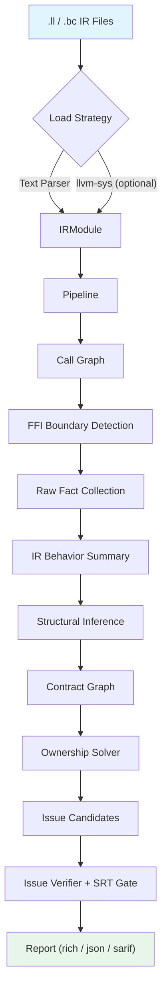
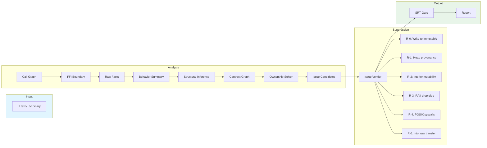

# OmniScope-rs

[](LICENSE)
[](https://www.rust-lang.org)
[](https://llvm.org)

A static analyzer for **cross-language FFI security auditing**, built on LLVM IR.

OmniScope-rs detects memory safety bugs at language boundary crossings — use-after-free, double-free, leaks, ownership violations, and type confusion — where traditional per-language tools lose visibility.

> **This is a Rust rewrite of [OmniScope](https://github.com/Timwood0x10/OmniScope) (Zig).** See [Comparison with Original](#comparison-with-original-omniscope) for what changed.

## Architecture



## Data Flow



## Crates

| Crate | Role | Lines |
|-------|------|-------|
| `omniscope-cli` | CLI (`analyze`, `audit`, `info`) | ~1.2K |
| `omniscope-pipeline` | Pipeline orchestration, pass scheduling | ~1.5K |
| `omniscope-pass` | 22 analysis passes (FFI boundary, RAII, borrow escape, contract graph, ownership solver) | ~18K |
| `omniscope-semantics` | Semantic derivation, structural inference, language detection | ~12K |
| `omniscope-ir` | LLVM IR loader, parser, IR model | ~10K |
| `omniscope-dataflow` | Forward/backward dataflow framework | ~3K |
| `omniscope-core` | Issue model (28 kinds), diagnostics, profiler | ~8K |
| `omniscope-types` | Shared types, ResourceFamily, ABI definitions | ~5K |

**Total: ~105K lines of Rust across 8 crates.**

## Supported Languages

C, C++, Rust, Go, Python (C API), Java (JNI), C# (P/Invoke) — with automatic language detection from IR metadata.

## 28 Issue Kinds

| Category | Issues |
|----------|--------|
| **FFI Boundary** (90% priority) | `CrossLanguageFree`, `OwnershipViolation`, `FfiTypeMismatch`, `AbiMismatch`, `UncheckedReturn`, `FfiUnsafeCall`, `CallbackEscape` |
| **Resource Contract** | `CrossFamilyFree`, `ConditionalLeak`, `DefiniteLeak`, `BorrowEscape`, `CallbackEscapeIssue`, `NeedsModel`, `OwnershipEscapeLeak` |
| **Memory Safety** | `DoubleFree`, `UseAfterFree`, `InvalidFree`, `MemoryLeak`, `BufferOverflow`, `NullDereference`, `IntegerOverflow` |
| **ABI / Type** | `LengthTruncation`, `TypeConfusion`, `WriteToImmutable`, `AbiLayoutMismatch` |

## Default Passes (22)

```text
CallGraphPass → FFIBoundaryPass → SurfaceClassifierPass → DangerSurfacePass
→ RawFactCollectorPass → IRBehaviorSummaryPass → LanguageAdapterFactPass
→ AbiLayoutPass → SummaryBuilderPass → StructuralInferencePass
→ ContractGraphBuilderPass → OwnershipSolverPass → IssueCandidateBuilderPass
→ IssueVerifierPass → LeakDetectionPass
→ RaiiDropPass → InteriorMutabilityPass → HeapProvenancePass
→ BorrowEscapePass → WriteToImmutablePass → FfiReturnCheckPass
```

Passes within each dependency level run in parallel via Rayon.

## Quick Start

```bash
# Build (no LLVM required — text parser is the default)
cargo build --release

# Analyze an IR file
./target/release/omniscope analyze -i input.ll

# JSON output for CI
./target/release/omniscope analyze -i input.ll --format json -o report.json

# SARIF for GitHub Code Scanning
./target/release/omniscope analyze -i input.ll --format sarif -o results.sarif

# FFI-focused audit
./target/release/omniscope analyze -i input.ll --boundary-only
```

## Comparison with Original OmniScope

[OmniScope](https://github.com/Timwood0x10/OmniScope) was originally written in Zig (~125K lines, 319 files). This Rust rewrite redesigns the core analysis architecture while preserving the same goal: cross-language FFI security auditing via LLVM IR.

| Dimension | Original (Zig) | OmniScope-rs |
|-----------|----------------|--------------|
| **Language** | Zig | Rust (8 crates) |
| **IR Parsing** | LLVM C++ bridge (`llvm_cpp_bridge.cpp`) | Structured text parser + optional `llvm-sys` |
| **Pass Count** | ~33 passes | 22 passes |
| **IssueKinds** | ~23 | 28 |
| **Parallelism** | Custom parallel pipeline | Rayon work-stealing across dependency levels |
| **Memory Management** | Zig allocator | Arena allocator (bumpalo), zero-copy Arc |
| **Resource Model** | FFI contract DB (predefined pairs) | ResourceFamily + Contract Graph + Ownership Solver |
| **FP Suppression** | Whitelists + rule filters | 6 suppression rules (R-0 to R-6) + SRT Gate |
| **Output Formats** | Text, JSON, SARIF | rich (terminal), JSON, SARIF |
| **CI Integration** | GitHub Actions | GitHub Actions (3 OS, stable/beta, clippy, miri, audit) |

**Key architectural changes in the Rust version:**
- **ResourceFamily abstraction**: Unifies allocator semantics (C heap, C++ new, Rust alloc, Go GC, Python refcount, JNI, C#) into one model, replacing the hardcoded FFI contract DB
- **Contract Graph + Ownership Solver**: Tracks pointer ownership through alloc/release pairs with cycle detection, replacing the Zig memory graph approach
- **SRT Gate**: Every issue passes through Suppress/Review/Track gate with a precision threshold before emission
- **Structured text parser**: Zero-dependency LLVM IR parsing via tokenizer, no need for LLVM C++ bridge at build time
- **Crate-based architecture**: 8 independent crates with clear dependency boundaries, vs Zig's monolithic module tree

## Test Suite

```bash
cargo test --workspace                # ~1750 tests
cargo bench --no-run                  # compile all benchmarks
```

| Category | Count | Description |
|----------|-------|-------------|
| Unit tests | ~1600 | Per-crate inline tests |
| Integration tests | ~80 | Cross-language FFI corpus |
| Accuracy regression | ~20 | Precision/recall baselines |
| Corpus regression | 5 | Per-language hidden-bug detection |
| Benchmarks | 8 | Pipeline, parsing, accuracy, scaling |

## Benchmarks

```bash
cargo bench
```

| Benchmark | Focus |
|-----------|-------|
| `pipeline` | End-to-end latency across 4 fixture sizes |
| `ir_parsing` | Text parser throughput (7 fixtures) |
| `bugfix_regression` | Post-fix correctness + individual pass throughput |
| `cpp_rust_accuracy` | C++/Rust cross-language accuracy |
| `resource_analysis` | Resource contract inference |
| `context_clone` | Parallel context clone overhead |
| `memory_pool` | Arena allocator performance |
| `regression_bench` | Language detection + surface classification |

## CI/CD

GitHub Actions runs on every push and PR:

- **fmt** — `cargo fmt --check`
- **clippy** — `cargo clippy -- -D warnings`
- **test** — `cargo test --workspace` on Ubuntu/macOS/Windows × stable/beta
- **bench** — `cargo bench --no-run` (compile check)
- **docs** — `cargo doc --no-deps`
- **audit** — `cargo audit`
- **miri** — unsafe code verification
- **FFI boundary check** — informational SARIF report (non-blocking)
- **Benchmark suite** — full benchmark run (non-blocking)

## Configuration

```toml
[analysis]
boundary_only = false
load_strategy = "auto"   # "auto", "text-parser", "llvm-sys"

[boundary]
declare_boundary = [
    { from = "Rust", to = "C" },
    { from = "C", to = "Rust" },
]

[suppression]
enable_r0 = true   # Write-to-immutable
enable_r1 = true   # Heap provenance
enable_r2 = true   # Interior mutability
enable_r3 = true   # RAII drop glue
enable_r4 = true   # POSIX syscalls
enable_r6 = true   # Box::into_raw transfer

[output]
format = "rich"    # "rich", "json", "sarif"
```

## Current Limitations

We believe in being transparent about what this tool can and cannot do.

**What it does well:**
- FFI boundary memory bug detection (cross-language free, ownership violations)
- Resource leak detection with path-sensitive analysis
- False positive suppression via 6 rule layers + SRT gate
- CI/CD integration with SARIF output

**What it does NOT do:**
- **Not a formal verifier** — it uses heuristics, not proofs
- **Not a general-purpose C/C++ memory checker** — focused on FFI boundaries
- **SSA-level data flow is limited** — same-value double-free and load-after-free are known gaps
- **Single-file analysis only** — no cross-function lifetime tracking yet
- **No incremental analysis** — full re-run on every invocation
- **No IDE/LSP integration** — CLI only

**Known regressions (as of v0.2.0-rc):**
- `bun_alloc` precision dropped after single-language gate change (tracked for v0.3.0)
- Some cross-family patterns may produce false positives in complex control flow

See [LIMITATIONS.md](LIMITATIONS.md) for the full list.

## Project Status

**Current version: v0.2.0-rc (release candidate)**

This project is under active development. The API is not yet stable, and the issue model may change between releases. We are working toward a v1.0.0 release that will include:
- Stabilized issue model and API
- Cross-function lifetime tracking
- Incremental analysis cache
- Expanded test corpus with real-world projects

## Roadmap

- [x] LLVM IR parser (text & binary)
- [x] Call graph construction
- [x] FFI boundary detection
- [x] Dataflow analysis framework
- [x] Semantic derivation engine
- [x] Resource contract architecture (Phases 0-4)
- [x] Ownership solver with cycle detection
- [x] False positive suppression (R-0 to R-6)
- [x] SARIF output
- [x] Cross-language corpus (C/C++/Rust/Go/Python/Java/C#)
- [x] Benchmarks & CI/CD
- [ ] v1.0 stable release
- [ ] Incremental analysis cache
- [ ] Cross-function lifetime tracking
- [ ] IDE / LSP integration
- [ ] WASM/JS FFI support

## Contributing

See [CONTRIBUTING.md](CONTRIBUTING.md) for development workflow.

```bash
make dev        # fmt + check + test
make test       # run all tests
make bench      # run benchmarks
```

Branch naming: `feature/description` or `bugfix/description`

## Acknowledgements

Special thanks to **[@icehawk-hyb](https://github.com/icehawk-hyb)** for serving as technical advisor and providing critical guidance on cross-language security analysis.

This project builds on the original [OmniScope](https://github.com/Timwood0x10/OmniScope) by @Timwood0x10, which established the core concept of cross-language FFI auditing via LLVM IR analysis.

## License

Apache-2.0. See [LICENSE](LICENSE).
