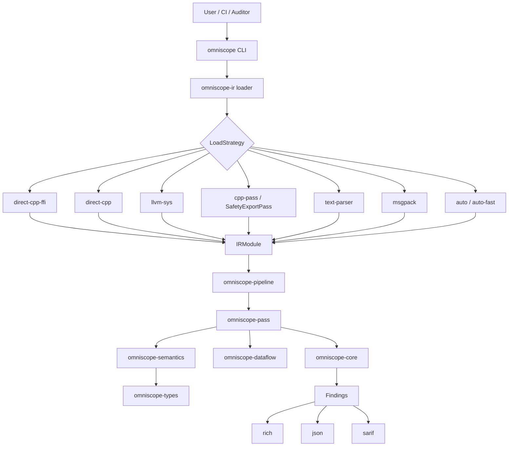
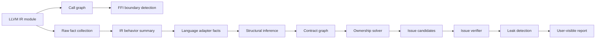

# OmniScope-rs

[](LICENSE)
[](https://www.rust-lang.org)
[](https://llvm.org)

OmniScope-rs is a Rust rewrite and extension of the original OmniScope project:

Original project: <https://github.com/Timwood0x10/OmniScope>

This repository builds an LLVM IR based static analyzer for cross-language FFI security review. Its main goal is to find and explain memory/resource ownership bugs around language boundaries: mismatched allocator/free pairs, ownership escape, leaks, unsafe FFI calls, unchecked returns, and related resource-contract violations.

This project is useful today as an experimental auditor-assist tool and research prototype. It is not yet a stable production scanner, and the current binary still reports version `0.1.0`.

## Status

**Current release recommendation:** open-source the project, but do not tag `0.9.0` yet.

The project is in a credible state for public development because it has an Apache-2.0 license, a Rust workspace split into focused crates, a CLI, CI configuration, tests, benchmarks, SARIF/JSON output, release-readiness notes, and documented limitations.

It is not ready for `0.9.0` because recent validation found accuracy and reporting blockers:

| Validation target | Result | Notes |
|---|---:|---|
| `ffi-demo` corpus, 10 IR files | 68% precision, 62% recall | Results are carried heavily by one strong historical validation fixture. |
| `ffi-demo` without `zig_main.ll` | about 43% precision | Signal is much weaker outside the best case. |
| `bun_alloc.ll` | 0/19 true positives | Known regression after the single-language gate change. |
| `llhttp.ll` | 0 findings | Correctly quiet on this clean vendored parser sample. |

## What Works

- Loads LLVM IR through multiple strategies, including direct C++ extraction, `llvm-sys`, C++ pass JSON, text parsing, and MessagePack.
- Runs a 21-pass analysis pipeline over call graphs, FFI boundaries, resource facts, semantic summaries, contract graphs, ownership solving, issue candidate building, verification, and leak detection.
- Emits `rich`, `json`, and `sarif` output.
- Supports explicit boundary declarations through `--cross FROM:TO` and `omniscope.toml`.
- Has a growing semantic model for C, C++, Rust, Go, Python, Java, and C# through LLVM IR patterns.
- Zig (historical validation only): the `zig_main.ll` fixture achieved 95% precision and 100% recall in the June 2026 validation report.

## Cross-Language FFI Support

| Language | Status | Test Projects |
|----------|--------|---------------|
| Rust->C | Stable | rusqlite, rustls-ffi, napi-rs |
| Rust->Python | Stable | pyo3 |
| Rust->DuckDB | Stable | duckdb-rs |
| Go->C | Stable | go-sqlite3, CGO |
| Java->C | Stable | JNA |
| Python->C | Stable | CPython extensions |
| .NET | Beta | dotnet/pinvoke |
| Node.js native | Beta | node-ffi-napi |

## Input Format Recommendation

**Strongly recommended: use `.ll` (text IR), not `.bc` (bitcode).**

Loading `.bc` files requires LLVM bitcode parsing, which dominates total runtime. In real-world testing, `.bc` loading accounts for ~98% of a 30-second analysis run. The `.ll` text format parses 100-1000x faster and produces identical analysis results.

```bash
# Good: .ll text IR (fast loading, same analysis)
clang -emit-llvm -S -o output.ll source.c
omniscope analyze output.ll

# Avoid: .bc bitcode (slow loading, same analysis quality)
clang -emit-llvm -o output.bc source.c
omniscope analyze output.bc  # loading dominates runtime
```

## Benchmark

Measured on Apple M-series, release build:

### IR Parsing Throughput

| File Size | Parse Time | Throughput |
|-----------|-----------|------------|
| 2 KB | 10 µs | 210 MiB/s |
| 7 KB | 20 µs | 330 MiB/s |
| 14 KB | 50 µs | 265 MiB/s |
| 23 KB | 165 µs | 136 MiB/s |
| 30 KB | 101 µs | 288 MiB/s |

### Pipeline End-to-End (text IR)

| Fixture | Functions | Time |
|---------|-----------|------|
| c_hash_bridge (7 KB) | 10 | 241 µs |
| zig_ffi (14 KB) | 25 | 383 µs |
| c_ffi_bugs (17 KB) | 20 | 450 µs |
| cpp_hash (23 KB) | 11 | 905 µs |
| rust_ffi_bugs (30 KB) | 43 | 4.45 ms |

### Real-World Project Analysis

| Project | IR Lines | Analysis Time |
|---------|----------|---------------|
| omniscope-pass (self-host) | 32K | 0.6 s |
| duckdb-rs | 39K | 0.9 s |
| go-sqlite3 | 354K | 0.9 s |
| pyo3 | 72K | 7.2 s |
| memscope-rs | 88K | 7.4 s |

## Noise Reduction

| Category | Before | After | Change |
|----------|--------|-------|--------|
| `write_to_immutable` | 4525 | 8 | -99.8% |
| `ffi_unsafe_call` | 142 | 0 | -100% |
| `borrow_escape` | 51 | 7 | -88% |
| `ownership_violation` (pyo3) | 68 | 0 | -100% |
| `null_dereference` FP | -- | suppressed | via `NullChecked` pattern |
| `double_free` FP | -- | suppressed | for thin wrappers |

## Real-World Validation

9 real-world projects across 5 languages were tested. Confirmed true bugs found:

| Project | Bug | CWE | Language |
|---------|-----|-----|----------|
| duckdb-rs | 3x null pointer dereference | CWE-476 | Rust->C |
| rusqlite | 2x null pointer dereference | CWE-476 | Rust->C |
| rustls-ffi | double free | CWE-415 | Rust->C |
| JNA | double free | CWE-415 | Java->C |

Inline IR regression tests capture key FFI patterns from each project to prevent accuracy regressions.

## Known Limits

- This is not a formal verification tool.
- It should not be used as the only security gate for production code.
- It analyzes one IR file at a time; full cross-module analysis is not implemented.
- Double-free detection is currently too flow-insensitive in some cases.
- Leak reporting can ignore deallocator pairing data that is already available in the contract graph.
- Single-language module gating can suppress FFI evidence when C extern declarations are present.
- Pure C/C++ memory safety auditing is not the main target and can produce noisy results.
- Some language adapters are pattern/semantic helpers, not complete language frontends.

The safest current use is non-blocking CI, security-review triage, and FFI surface mapping.

## Comparison With The Original OmniScope

The original OmniScope project at <https://github.com/Timwood0x10/OmniScope> is the upstream inspiration and should be credited as the base idea. OmniScope-rs is not a drop-in replacement; it is a Rust implementation that experiments with a broader analysis architecture.

| Area | Original OmniScope | OmniScope-rs |
|---|---|---|
| Implementation language | Zig project | Rust workspace |
| Core input | LLVM IR | LLVM IR |
| Main focus | Multi-language unsafe/FFI analysis | Cross-language FFI ownership/resource analysis |
| Architecture | Original analyzer implementation | Crate-based pipeline with explicit passes and shared types |
| Output | Upstream tool outputs | Rich terminal, JSON, SARIF |
| Loading strategy | Upstream IR loading path | 8 `LoadStrategy` variants, including direct C++ extraction, `llvm-sys`, C++ pass JSON, text parser, and MessagePack |
| Extensibility | Upstream design | Separate crates for IR, passes, semantics, pipeline, core, dataflow, CLI, and shared types |
| Current maturity | Existing upstream release line | `0.9.0` — noise-optimized, 9 real-world projects validated |

Main Rust-version improvements:

- More explicit modular architecture: `omniscope-ir`, `omniscope-pass`, `omniscope-semantics`, `omniscope-pipeline`, `omniscope-core`, `omniscope-dataflow`, `omniscope-types`, and `omniscope-cli`.
- Stronger typed issue model with 28 issue kinds and CWE mapping.
- Resource-family and contract-graph model for allocator/deallocator relationships.
- SARIF output for GitHub Code Scanning style workflows.
- Parallel pass execution support through Rayon.
- CI, benchmarks, validation reports, and documented release blockers.

Main tradeoff:

OmniScope-rs has more architecture and more planned semantic depth, but the current validation does not justify stable-release claims. Accuracy must improve before this should be marketed as production-grade.

## Architecture



## Analysis Data Flow



## Workspace Layout

| Crate | Role |
|---|---|
| `omniscope-cli` | CLI commands: `analyze`, `audit`, `info`, `init`, `validate` |
| `omniscope-pipeline` | Pipeline orchestration and pass registration |
| `omniscope-pass` | Analysis passes and resource issue construction |
| `omniscope-semantics` | Language/resource semantics and structural inference |
| `omniscope-ir` | LLVM IR loading, parsing, cache, and IR model |
| `omniscope-dataflow` | Generic dataflow framework |
| `omniscope-core` | Issues, diagnostics, reports, scoring, profiler, memory pool |
| `omniscope-types` | Shared config, ABI, evidence, resource-family, and boundary types |

The default pipeline currently registers 21 passes:

`CallGraph`, `FFIBoundary`, `SurfaceClassifier`, `DangerSurface`, `RawFactCollector`, `IRBehaviorSummary`, `LanguageAdapterFact`, `AbiLayout`, `SummaryBuilder`, `StructuralInference`, `ContractGraphBuilder`, `OwnershipSolver`, `IssueCandidateBuilder`, `IssueVerifier`, `LeakDetection`, `RaiiDrop`, `InteriorMutability`, `HeapProvenance`, `BorrowEscape`, `WriteToImmutable`, and `FfiReturnCheck`.

## Build

### Requirements

- Rust 1.75+
- LLVM development libraries for the optional LLVM-backed paths
- `make`, CMake, and a C++ compiler for the SafetyExportPass / extractor path
- Optional: JDK 21+ for Java FFI analysis
- Optional: .NET 8+ for C# FFI analysis
- Optional: `cargo-nextest`, `cargo-audit`, Miri, Criterion benchmark tooling

### Commands

```bash
# Rust workspace build
cargo build --workspace

# Release build copied to ./build/omniscope
make build

# Full test target used by the Makefile
make test

# Formatting and lint checks
make fmt-check
make check
```

The Makefile test target uses `cargo nextest run --workspace --all-features`, so install `cargo-nextest` if you use `make test`.

## Usage

```bash
# Analyze one LLVM IR file
omniscope analyze file.ll

# Write JSON output
omniscope analyze file.ll --format json --output report.json

# Generate SARIF
omniscope analyze file.bc --format sarif --output results.sarif

# Restrict to boundary issues
omniscope analyze file.ll --boundary-only

# Declare cross-language boundaries explicitly
omniscope analyze file.ll --cross Rust:C --cross C:Rust

# Select a loading strategy
omniscope analyze file.ll --strategy text-parser

# Audit mode requires a target language
omniscope audit file.ll --language rust

# Inspect registered passes
omniscope info --passes

# Create and validate configuration
omniscope init
omniscope validate --config omniscope.toml
```

Supported output formats:

- `rich`: colored terminal output
- `json`: machine-readable output
- `sarif`: static-analysis interchange format for code scanning systems

Supported loading strategy names:

- `auto-fast`
- `auto`
- `direct-cpp-ffi`
- `direct-cpp`
- `llvm-sys`
- `cpp-pass`
- `text-parser`

`LoadStrategy::MsgPack` exists in code for `.msgpack` input, but it is not currently listed in the CLI help string.

## Configuration

The CLI searches `./omniscope.toml` and `~/.config/omniscope/config.toml` when `--config` is omitted. A starter file is included at [`omniscope.toml`](omniscope.toml).

Example:

```toml
[project]
name = "example"
description = "Example project configuration"

[[ffi_boundary]]
from = "rust"
to = "c"
functions = ["rust_callback_handler"]
description = "Rust -> C callback bridge"

[[resource_family]]
name = "custom_allocator"
kind = "ManualHeap"
acquire = ["my_alloc", "my_calloc"]
release = ["my_free"]
compatible_releases = []

[analysis]
cross_language = true
cross_family = true
leak_detection = true
use_after_free = true
```

## Tests And Validation

```bash
cargo test --workspace
cargo test --workspace --all-features
make test
cargo bench
```

Important test and validation areas:

| Area | Location |
|---|---|
| Integration tests | `tests/*.rs` |
| Corpus IR fixtures | `tests/corpus/*.ll` |
| Accuracy regression tests | `tests/accuracy_regression/` |
| Crate-level unit tests | `crates/**/src/**/*tests*.rs` |
| Release validation reports | `docs/release/` |
| Benchmarks | `benches/` |


## Roadmap

- [x] Rust workspace and CLI
- [x] LLVM IR loader and text parser
- [x] Direct C++ / C++ pass / `llvm-sys` loading paths
- [x] Call graph and FFI boundary detection
- [x] Resource-family and contract-graph architecture
- [x] SARIF and JSON output
- [x] CI, benchmarks, and release validation notes
- [x] Noise reduction: write_to_immutable -99.8%, ffi_unsafe_call -100%
- [x] Cross-language FFI corpus (9 projects, 5 languages)
- [x] Inline IR regression tests
- [x] Call-graph semantic propagation (Python refcount, C library internals)
- [x] Improve cross-module analysis
- [x] Improve path-sensitive double-free/leak verification
- [x] .NET and Node.js native support stabilization

## Acknowledgements

This Rust version exists because of the original OmniScope project:

- Original OmniScope: <https://github.com/Timwood0x10/OmniScope>

Special thanks to @[icehawk-hyb](https://github.com/icehawk-hyb) for serving as technical advisor and providing critical guidance on cross-language security analysis.

## License

Apache-2.0. See [LICENSE](LICENSE).
