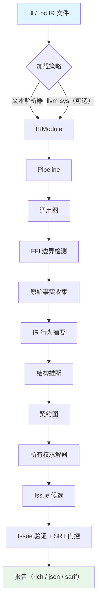
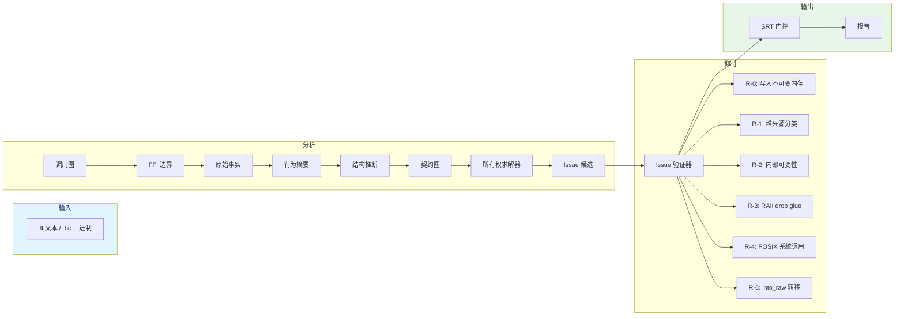

# OmniScope-rs

[](LICENSE)
[](https://www.rust-lang.org)
[](https://llvm.org)

基于 LLVM IR 的**跨语言 FFI 安全审计**静态分析器。

OmniScope-rs 检测语言边界处的内存安全漏洞 — use-after-free、double-free、内存泄漏、所有权违规和类型混淆 — 这些是传统单语言工具无法覆盖的盲区。

> **本项目是 [OmniScope](https://github.com/Timwood0x10/OmniScope)（Zig）的 Rust 重写版本。** 详见[与原版对比](#与原版-omniscope-对比)。

## 架构



## 数据流



## Crate 结构

| Crate | 职责 | 代码行数 |
|-------|------|----------|
| `omniscope-cli` | 命令行界面（`analyze`、`audit`、`info`） | ~1.2K |
| `omniscope-pipeline` | Pipeline 编排、Pass 调度 | ~1.5K |
| `omniscope-pass` | 22 个分析 Pass（FFI 边界、RAII、borrow escape、契约图、所有权求解） | ~18K |
| `omniscope-semantics` | 语义推导、结构推断、语言检测 | ~12K |
| `omniscope-ir` | LLVM IR 加载器、解析器、IR 模型 | ~10K |
| `omniscope-dataflow` | 前向/后向数据流分析框架 | ~3K |
| `omniscope-core` | Issue 模型（28 种）、诊断、性能分析器 | ~8K |
| `omniscope-types` | 共享类型定义、ResourceFamily、ABI 定义 | ~5K |

**总计：8 个 crate，约 105K 行 Rust 代码。**

## 支持的语言

C、C++、Rust、Go、Python（C API）、Java（JNI）、C#（P/Invoke）— 通过 IR 元数据自动检测语言。

## 28 种 Issue 类型

| 类别 | Issue |
|------|-------|
| **FFI 边界**（90% 优先级） | `CrossLanguageFree`、`OwnershipViolation`、`FfiTypeMismatch`、`AbiMismatch`、`UncheckedReturn`、`FfiUnsafeCall`、`CallbackEscape` |
| **资源契约** | `CrossFamilyFree`、`ConditionalLeak`、`DefiniteLeak`、`BorrowEscape`、`CallbackEscapeIssue`、`NeedsModel`、`OwnershipEscapeLeak` |
| **内存安全** | `DoubleFree`、`UseAfterFree`、`InvalidFree`、`MemoryLeak`、`BufferOverflow`、`NullDereference`、`IntegerOverflow` |
| **ABI / 类型** | `LengthTruncation`、`TypeConfusion`、`WriteToImmutable`、`AbiLayoutMismatch` |

## 默认 Pass 列表（22 个）

```text
CallGraphPass → FFIBoundaryPass → SurfaceClassifierPass → DangerSurfacePass
→ RawFactCollectorPass → IRBehaviorSummaryPass → LanguageAdapterFactPass
→ AbiLayoutPass → SummaryBuilderPass → StructuralInferencePass
→ ContractGraphBuilderPass → OwnershipSolverPass → IssueCandidateBuilderPass
→ IssueVerifierPass → LeakDetectionPass
→ RaiiDropPass → InteriorMutabilityPass → HeapProvenancePass
→ BorrowEscapePass → WriteToImmutablePass → FfiReturnCheckPass
```

同一依赖层级内的 Pass 通过 Rayon 并行执行。

## 快速开始

```bash
# 构建（不需要 LLVM — 默认使用文本解析器）
cargo build --release

# 分析 IR 文件
./target/release/omniscope analyze -i input.ll

# JSON 输出（用于 CI）
./target/release/omniscope analyze -i input.ll --format json -o report.json

# SARIF 输出（用于 GitHub Code Scanning）
./target/release/omniscope analyze -i input.ll --format sarif -o results.sarif

# FFI 专项审计
./target/release/omniscope analyze -i input.ll --boundary-only
```

## 与原版 OmniScope 对比

[OmniScope](https://github.com/Timwood0x10/OmniScope) 最初用 Zig 编写（~125K 行，319 个文件）。本 Rust 版本重新设计了核心分析架构，同时保留相同目标：通过 LLVM IR 进行跨语言 FFI 安全审计。

| 维度 | 原版（Zig） | OmniScope-rs |
|------|-------------------|--------------|
| **语言** | Zig（~125K 行，319 文件） | Rust（~105K 行，8 crate） |
| **IR 解析** | LLVM C++ bridge（`llvm_cpp_bridge.cpp`） | 结构化文本解析器 + 可选 `llvm-sys` |
| **Pass 数量** | ~33 个 | 22 个 |
| **IssueKinds** | ~23 种 | 28 种 |
| **并行** | 自定义并行 Pipeline（`parallel.zig`） | Rayon 工作窃取，跨依赖层级并行 |
| **内存管理** | Zig allocator | Arena 分配器（bumpalo），零拷贝 Arc |
| **资源模型** | FFI 契约数据库（预定义对） | ResourceFamily + 契约图 + 所有权求解器 |
| **FP 抑制** | 白名单 + 规则过滤 | 6 条抑制规则（R-0 到 R-6）+ SRT 门控 |
| **输出格式** | Text、JSON、SARIF | rich（终端）、JSON、SARIF |
| **CI 集成** | GitHub Actions | GitHub Actions（3 OS、stable/beta、clippy、miri、audit） |

**Rust 版本的核心架构变更：**
- **ResourceFamily 抽象**：将分配器语义（C heap、C++ new、Rust alloc、Go GC、Python refcount、JNI、C#）统一到一个模型，替代了硬编码的 FFI 契约数据库
- **契约图 + 所有权求解器**：跟踪指针在分配/释放对中的所有权流转（含环检测），替代了 Zig 的 memory graph 方案
- **SRT 门控**：每个 Issue 在输出前经过 Suppress/Review/Track 门控，强制执行精度阈值
- **结构化文本解析器**：通过词法分析器零依赖解析 LLVM IR，构建时不需要 LLVM C++ bridge
- **Crate 架构**：8 个独立 crate，清晰的依赖边界，替代 Zig 的单体模块树

## 测试套件

```bash
cargo test --workspace                # ~1750 个测试
cargo bench --no-run                  # 编译所有 benchmark
```

| 类别 | 数量 | 描述 |
|------|------|------|
| 单元测试 | ~1600 | 各 crate 内联测试 |
| 集成测试 | ~80 | 跨语言 FFI 语料库 |
| 精度回归 | ~20 | 精度/召回基线 |
| 语料回归 | 5 | 每语言隐藏 bug 检测 |
| Benchmark | 8 | Pipeline、解析、精度、扩展性 |

## Benchmark

```bash
cargo bench
```

| Benchmark | 关注点 |
|-----------|--------|
| `pipeline` | 端到端延迟（4 种规模） |
| `ir_parsing` | 文本解析器吞吐量（7 个 fixture） |
| `bugfix_regression` | 修复后正确性 + 单 Pass 吞吐量 |
| `cpp_rust_accuracy` | C++/Rust 跨语言精度 |
| `resource_analysis` | 资源契约推断 |
| `context_clone` | 并行上下文克隆开销 |
| `memory_pool` | Arena 分配器性能 |
| `regression_bench` | 语言检测 + 表面分类 |

## CI/CD

GitHub Actions 在每次 push 和 PR 上运行：

- **fmt** — `cargo fmt --check`
- **clippy** — `cargo clippy -- -D warnings`
- **test** — `cargo test --workspace`（Ubuntu/macOS/Windows × stable/beta）
- **bench** — `cargo bench --no-run`（编译检查）
- **docs** — `cargo doc --no-deps`
- **audit** — `cargo audit`
- **miri** — unsafe 代码验证
- **FFI 边界检查** — 信息性 SARIF 报告（非阻塞）
- **Benchmark 套件** — 完整 benchmark 运行（非阻塞）

## 配置

```toml
[analysis]
boundary_only = false
load_strategy = "auto"   # "auto"、"text-parser"、"llvm-sys"

[boundary]
declare_boundary = [
    { from = "Rust", to = "C" },
    { from = "C", to = "Rust" },
]

[suppression]
enable_r0 = true   # 写入不可变内存
enable_r1 = true   # 堆来源分类
enable_r2 = true   # 内部可变性
enable_r3 = true   # RAII drop glue
enable_r4 = true   # POSIX 系统调用
enable_r6 = true   # Box::into_raw 转移

[output]
format = "rich"    # "rich"、"json"、"sarif"
```

## 当前局限

我坚持坦诚说明工具的能力边界。

**擅长的方面：**
- FFI 边界内存漏洞检测（跨语言 free、所有权违规）
- 路径敏感的资源泄漏检测
- 通过 6 层规则 + SRT 门控抑制误报
- SARIF 输出集成 CI/CD

**不擅长的方面：**
- **不是形式化验证工具** — 使用启发式方法，不是证明
- **不是通用 C/C++ 内存检查器** — 专注于 FFI 边界
- **SSA 级数据流有限** — 同值 double-free 和 load-after-free 是已知盲区
- **仅单文件分析** — 暂不支持跨函数生命周期跟踪
- **无增量分析** — 每次调用全量重跑

**已知回归（v0.2.0-rc）：**
- 单语言门控变更后 `bun_alloc` 精度下降（v0.3.0 跟踪）
- 复杂控制流中部分跨家族模式可能产生误报

详见 [LIMITATIONS.md](LIMITATIONS.md)。

## 项目状态

**当前版本：v0.2.0-rc（候选发布）**

本项目处于活跃开发阶段。API 尚未稳定，Issue 模型可能在版本间变更。我们正在向 v1.0.0 努力，届时将包含：
- 稳定的 Issue 模型和 API
- 跨函数生命周期跟踪
- 增量分析缓存
- 扩展的真实项目测试语料库

## 路线图

- [x] LLVM IR 解析器（文本和二进制）
- [x] 调用图构建
- [x] FFI 边界检测
- [x] 数据流分析框架
- [x] 语义推导引擎
- [x] 资源契约架构（Phase 0-4）
- [x] 所有权求解器（含环检测）
- [x] 误报抑制（R-0 到 R-6）
- [x] SARIF 输出
- [x] 跨语言语料库（C/C++/Rust/Go/Python/Java/C#）
- [x] Benchmark 和 CI/CD
- [ ] v1.0 稳定发布
- [ ] 增量分析缓存
- [ ] 跨函数生命周期跟踪
- [ ] WASM/JS FFI 支持

## 贡献

详见 [CONTRIBUTING.md](CONTRIBUTING.md)。

```bash
make dev        # fmt + check + test
make test       # 运行所有测试
make bench      # 运行 benchmark
```

分支命名：`feature/description` 或 `bugfix/description`

## 致谢

特别感谢 **[@icehawk-hyb](https://github.com/icehawk-hyb)** 担任技术顾问，在跨语言安全分析方向提供了关键指导。

本项目基于 @Timwood0x10 的 [OmniScope](https://github.com/Timwood0x10/OmniScope)，该原版项目确立了通过 LLVM IR 分析进行跨语言 FFI 审计的核心理念。

## 许可证

Apache-2.0。详见 [LICENSE](LICENSE)。
