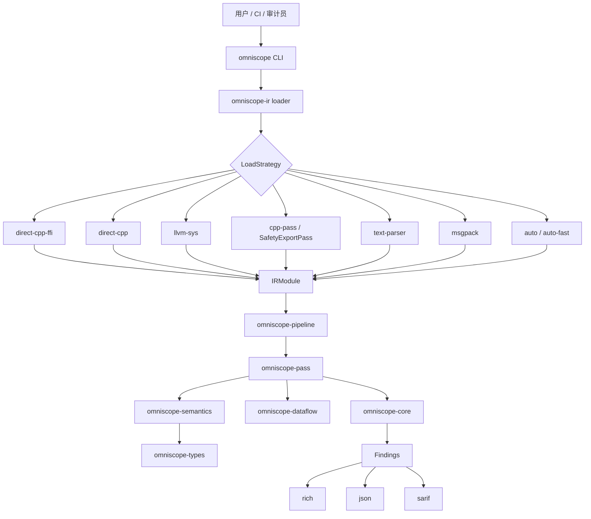
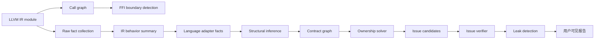

# OmniScope-rs

[](LICENSE)
[](https://www.rust-lang.org)
[](https://llvm.org)

OmniScope-rs 是原版 OmniScope 的 Rust 重写与扩展版本。

原版项目：<https://github.com/Timwood0x10/OmniScope>

本项目基于 LLVM IR 做跨语言 FFI 安全审计，重点关注语言边界上的内存/资源所有权问题，例如 allocator/free 不匹配、所有权逃逸、泄漏、不安全 FFI 调用、未检查返回值以及资源契约违规。

必须坦白说明：当前项目适合作为实验性的审计辅助工具、研究原型和 FFI surface 映射工具；还不是稳定的生产级扫描器。当前二进制版本仍显示为 `0.1.0`。

## 当前状态

但它还不适合打 `1.0.0` 标签。最近的验证暴露了准确率和报告质量方面的 blocker：

| 验证目标                           |                       结果 | 说明                                |
| ------------------------------ | -----------------------: | --------------------------------- |
| `ffi-demo` 语料，10 个 IR 文件       | 68% precision，62% recall | 总体结果很大程度由一个历史验证强样本拉高。          |
| 去掉 `zig_main.ll` 后的 `ffi-demo` |          约 43% precision | 最强样本之外信号明显变弱。                     |
| `bun_alloc.ll`                 |      0/19 true positives | 单语言门控调整后出现的已知回归。                  |
| `llhttp.ll`                    |               0 findings | 对干净 vendored parser 样本保持安静，这是好结果。 |

详见：

- [`docs/release/release_readiness_v0.2.0.md`](docs/release/release_readiness_v0.2.0.md)
- [`docs/release/ffi_demo_validation.md`](docs/release/ffi_demo_validation.md)
- [`docs/release/bun_validation.md`](docs/release/bun_validation.md)
- [`LIMITATIONS.md`](LIMITATIONS.md)

## 现在能做什么

- 通过多种策略加载 LLVM IR，包括 direct C++ extractor、`llvm-sys`、C++ pass JSON、文本解析和 MessagePack。
- 运行 21 个默认分析 pass，覆盖 call graph、FFI boundary、resource facts、semantic summary、contract graph、ownership solver、issue candidate、verification 和 leak detection。
- 输出 `rich`、`json`、`sarif` 三种格式。
- 支持通过 `--cross FROM:TO` 和 `omniscope.toml` 显式声明跨语言边界。
- 对 C、C++、Rust、Go、Python、Java、C# 具备语义建模雏形，通过 LLVM IR 模式分析。
- Zig（历史验证样本）：`zig_main.ll` 验证样本记录为 95% precision、100% recall（2026 年 6 月）。

## 已知局限

- 不是形式化验证工具。
- 不能作为生产安全的唯一 gate。
- 目前一次分析一个 IR 文件，还没有完整跨模块分析。
- Double-free 检测在部分场景中过于 flow-insensitive。
- Leak 报告有时没有正确利用 contract graph 中已有的 deallocator pairing 数据。
- 单语言模块门控可能在存在 C extern declaration 时错误压制 FFI 证据。
- 纯 C/C++ 内存安全审计不是主目标，结果可能比较吵。
- 部分语言 adapter 目前是模式/语义辅助，并不是完整语言前端。

当前最稳妥的定位是：非阻断 CI 检查、安全审计初筛、FFI surface 映射。

## 与原版 OmniScope 的关系和对比

原版 OmniScope 位于 <https://github.com/Timwood0x10/OmniScope>，是本项目的上游灵感来源和需要明确致谢的基础项目。OmniScope-rs 不是原项目的 drop-in replacement，而是一个 Rust 实现，重点实验更模块化的分析架构。

| 方面    | 原版 OmniScope      | OmniScope-rs                                                                      |
| ----- | ----------------- | --------------------------------------------------------------------------------- |
| 实现语言  | Zig 项目            | Rust workspace                                                                    |
| 核心输入  | LLVM IR           | LLVM IR                                                                           |
| 主要方向  | 多语言 unsafe/FFI 分析 | 跨语言 FFI 所有权/资源分析                                                                  |
| 架构    | 原版 analyzer 实现    | crate 拆分的 pipeline/pass/type 架构                                                   |
| 输出    | 原版工具输出            | rich terminal、JSON、SARIF                                                          |
| 加载策略  | 原版 IR 加载路径        | 8 种 `LoadStrategy`，包括 direct C++、`llvm-sys`、C++ pass JSON、text parser、MessagePack |
| 可扩展性  | 原版设计              | IR、pass、semantics、pipeline、core、dataflow、CLI、types 分层                             |
| 当前成熟度 | 已有上游 release line | 实验性 Rust 重写，还不适合 `1.0.0`                                                          |

Rust 版本的主要改进：

- 更明确的模块化架构：`omniscope-ir`、`omniscope-pass`、`omniscope-semantics`、`omniscope-pipeline`、`omniscope-core`、`omniscope-dataflow`、`omniscope-types`、`omniscope-cli`。
- 更强类型化的 issue model，包含 28 类 issue 和 CWE 映射。
- 引入 ResourceFamily 和 contract graph，用于描述 allocator/deallocator 关系。
- 支持 SARIF，便于接入类似 GitHub Code Scanning 的工作流。
- 通过 Rayon 支持并行 pass 执行。
- 有 CI、benchmark、验证报告和 release blocker 文档。

主要代价：

OmniScope-rs 架构更完整，计划中的语义深度也更大；但当前验证数据还不足以支撑“生产级”或“稳定版”宣传。准确率和确定性需要继续提升。

## 架构图



## 数据流图



## Workspace 结构

| Crate                 | 职责                                                 |
| --------------------- | -------------------------------------------------- |
| `omniscope-cli`       | CLI 命令：`analyze`、`audit`、`info`、`init`、`validate`  |
| `omniscope-pipeline`  | Pipeline 编排和 pass 注册                               |
| `omniscope-pass`      | 分析 pass 和资源类 issue 构造                              |
| `omniscope-semantics` | 语言/资源语义和结构推断                                       |
| `omniscope-ir`        | LLVM IR 加载、解析、缓存和 IR model                         |
| `omniscope-dataflow`  | 通用数据流框架                                            |
| `omniscope-core`      | Issue、diagnostic、report、score、profiler、memory pool |
| `omniscope-types`     | 配置、ABI、evidence、ResourceFamily、boundary 等共享类型      |

默认 pipeline 当前注册 21 个 pass：

`CallGraph`、`FFIBoundary`、`SurfaceClassifier`、`DangerSurface`、`RawFactCollector`、`IRBehaviorSummary`、`LanguageAdapterFact`、`AbiLayout`、`SummaryBuilder`、`StructuralInference`、`ContractGraphBuilder`、`OwnershipSolver`、`IssueCandidateBuilder`、`IssueVerifier`、`LeakDetection`、`RaiiDrop`、`InteriorMutability`、`HeapProvenance`、`BorrowEscape`、`WriteToImmutable`、`FfiReturnCheck`。

## 构建

### 环境要求

- Rust 1.75+
- 可选 LLVM 后端需要 LLVM development libraries
- SafetyExportPass / extractor 路径需要 `make`、CMake 和 C++ 编译器
- 可选：`cargo-nextest`、`cargo-audit`、Miri、Criterion benchmark 工具链

### 常用命令

```bash
# 构建 Rust workspace
cargo build --workspace

# release 构建并复制到 ./build/omniscope
make build

# Makefile 中的完整测试目标
make test

# 格式和 lint
make fmt-check
make check
```

注意：Makefile 的测试目标使用 `cargo nextest run --workspace --all-features`，如果使用 `make test`，需要先安装 `cargo-nextest`。

## 用法

```bash
# 分析一个 LLVM IR 文件
omniscope analyze file.ll

# 输出 JSON
omniscope analyze file.ll --format json --output report.json

# 输出 SARIF
omniscope analyze file.bc --format sarif --output results.sarif

# 只看边界相关 issue
omniscope analyze file.ll --boundary-only

# 显式声明跨语言边界
omniscope analyze file.ll --cross Rust:C --cross C:Rust

# 指定加载策略
omniscope analyze file.ll --strategy text-parser

# audit 模式需要指定语言
omniscope audit file.ll --language rust

# 查看注册的 pass
omniscope info --passes

# 生成和校验配置
omniscope init
omniscope validate --config omniscope.toml
```

输出格式：

- `rich`：彩色终端输出
- `json`：机器可读输出
- `sarif`：供代码扫描系统使用的静态分析交换格式

CLI help 中列出的加载策略：

- `auto-fast`
- `auto`
- `direct-cpp-ffi`
- `direct-cpp`
- `llvm-sys`
- `cpp-pass`
- `text-parser`

代码中存在 `LoadStrategy::MsgPack` 用于 `.msgpack` 输入，但当前 CLI help 字符串没有列出它。

## 配置

未显式传入 `--config` 时，CLI 会查找 `./omniscope.toml` 和 `~/.config/omniscope/config.toml`。仓库中已有一个示例配置文件：[`omniscope.toml`](omniscope.toml)。

示例：

```toml
[project]
name = "example"
description = "Example project configuration"

[[ffi_boundary]]
from = "rust"
to = "c"
functions = ["rust_callback_handler"]
description = "Rust -> C callback bridge"

[[resource_family]]
name = "custom_allocator"
kind = "ManualHeap"
acquire = ["my_alloc", "my_calloc"]
release = ["my_free"]
compatible_releases = []

[analysis]
cross_language = true
cross_family = true
leak_detection = true
use_after_free = true
```

## 测试和验证

```bash
cargo test --workspace
cargo test --workspace --all-features
make test
cargo bench
```

重要测试/验证位置：

| 类型           | 位置                            |
| ------------ | ----------------------------- |
| 集成测试         | `tests/*.rs`                  |
| IR 语料        | `tests/corpus/*.ll`           |
| 准确率回归        | `tests/accuracy_regression/`  |
| crate 内单元测试  | `crates/**/src/**/*tests*.rs` |
| release 验证报告 | `docs/release/`               |
| benchmark    | `benches/`                    |

## 开源与 1.0.0 评估

如果诚实表达项目状态，可以开源：

- 保持 Apache-2.0 许可证。
- 明确致谢原版 OmniScope。
- 标注 experimental 或 pre-1.0。
- 公开验证报告和已知 blocker。
- 在达到 release 标准前，不使用“生产级”之类宣传。

不建议现在发布 `1.0.0`。更现实的下一步是 `v0.2.0-rc.1` 或继续发布 `v0.1.x` 开发版本。

建议的 `1.0.0` 最低门槛：

- 修复 release readiness 文档中记录的 double-free、leak-pairing、single-language gate blocker。
- 重新跑 `ffi-demo`、`bun_alloc`，并至少加入一个额外真实 FFI 项目。
- 在完整 `ffi-demo` 语料上达到至少 80% precision 和 75% recall，而不是只依赖最强历史验证样本。
- 在 `bun_alloc` 或替代真实项目上产生至少一个可复现 true positive；否则不要把它写进发布卖点。
- 输出足够确定，能用于 CI diff。
- README 示例全部和实际 CLI 保持一致。
- 先发 pre-release，收集外部反馈后再考虑稳定版。

## 路线图

- [x] Rust workspace 和 CLI
- [x] LLVM IR loader 和文本解析器
- [x] Direct C++ / C++ pass / `llvm-sys` 加载路径
- [x] Call graph 和 FFI boundary detection
- [x] ResourceFamily 和 contract graph 架构
- [x] SARIF 和 JSON 输出
- [x] CI、benchmark、release validation notes
- [ ] 修复 `docs/release/release_readiness_v0.2.0.md` 中记录的 release blocker
- [ ] 改进跨模块分析
- [ ] 改进 path-sensitive double-free/leak verification
- [ ] 稳定语言 adapter 覆盖
- [ ] 发布可信的 `v0.2.0`
- [ ] 在多轮外部验证后再发布 `1.0.0`

## 致谢

这个 Rust 版本建立在原版 OmniScope 项目的启发之上：

- 原版 OmniScope：<https://github.com/Timwood0x10/OmniScope>

Special thanks to @icehawk-hyb for serving as technical advisor and providing critical guidance on cross-language security analysis.

## 许可证

Apache-2.0。详见 [LICENSE](LICENSE)。
