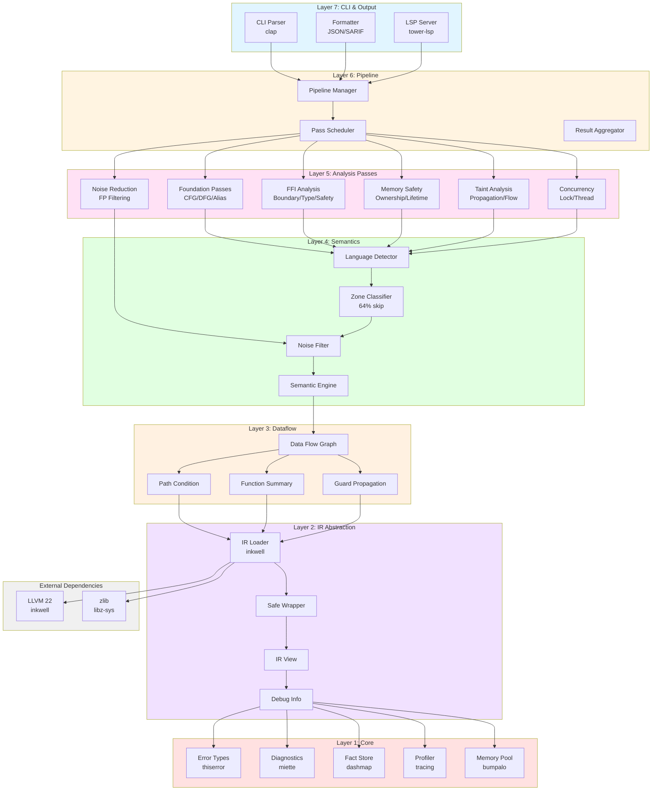
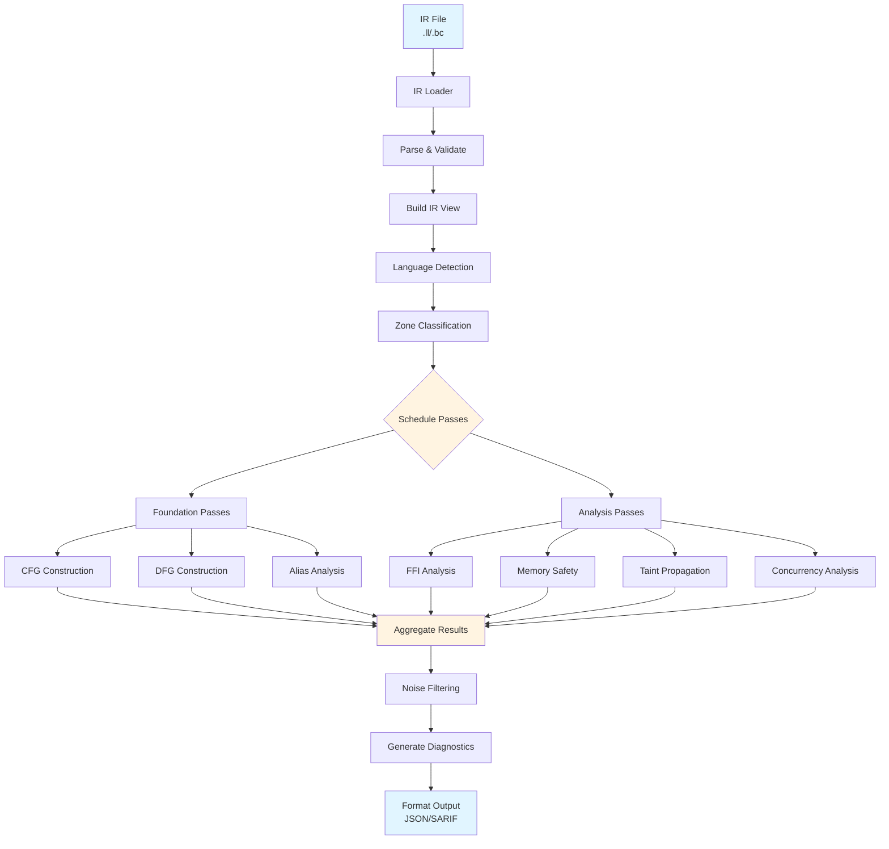
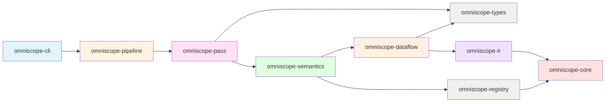
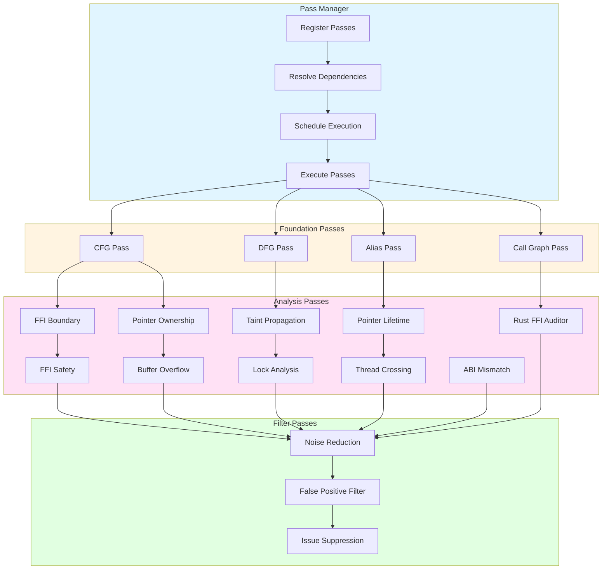
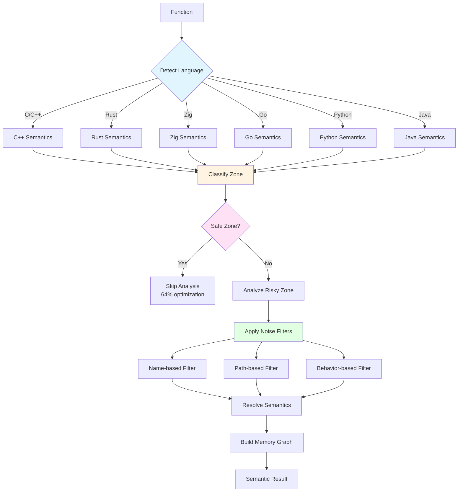
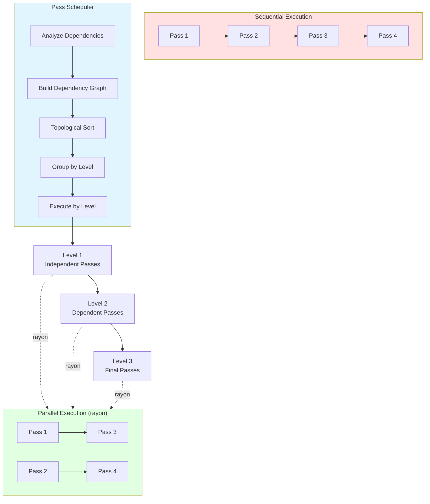
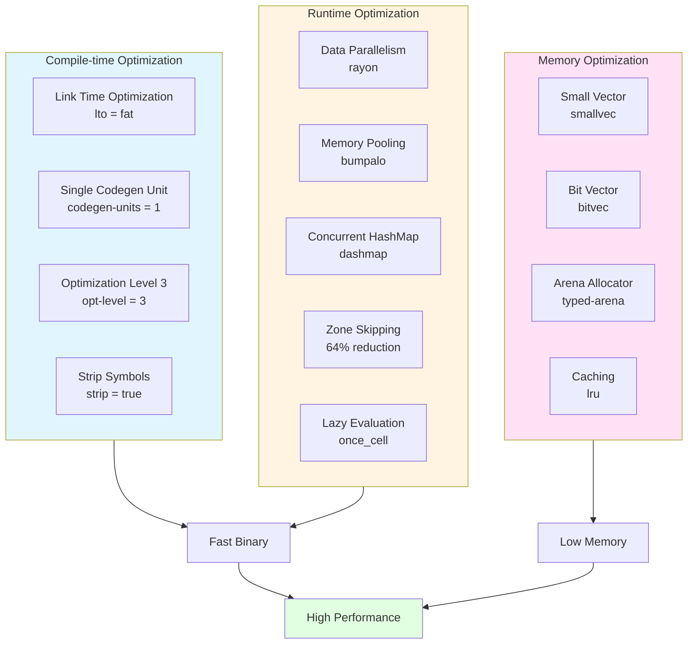
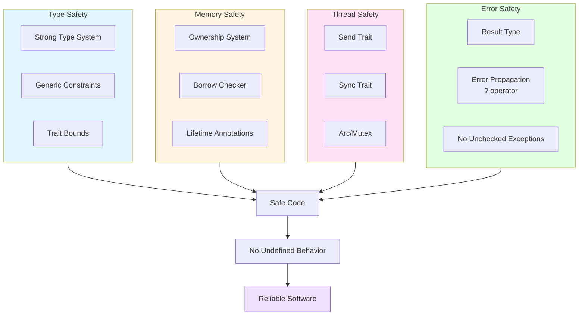
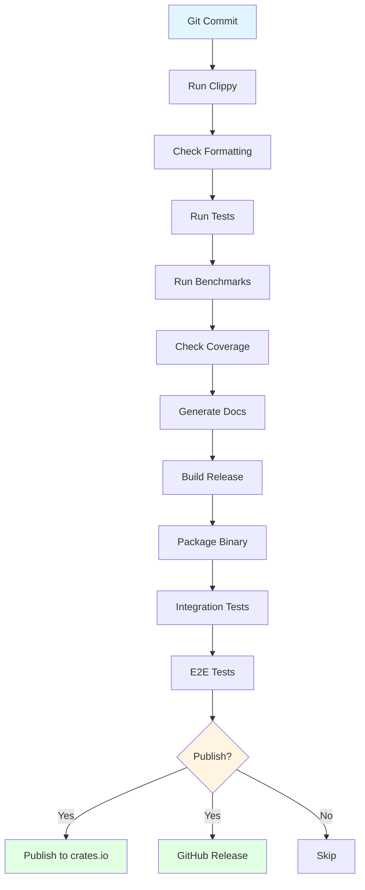
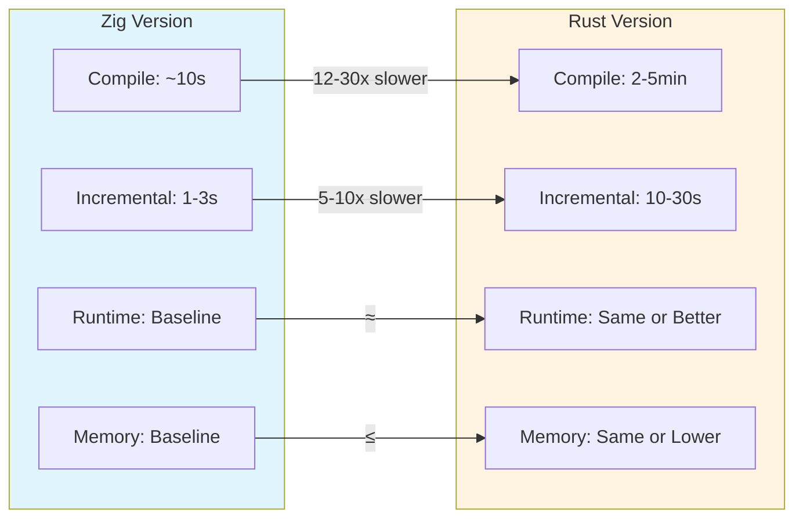

# OmniScope-RS Architecture Diagrams

## 🏗️ 系统架构图



## 🔄 数据流图



## 📦 模块依赖图



## 🎯 Pass 系统架构



## 🔍 语义分析流程



## 🧵 并发执行模型



## 📊 性能优化策略



## 🛡️ 安全保证



## 🔄 CI/CD 流程



## 📈 性能对比



## 🎯 关键指标

| 指标 | 目标值 | 说明 |
|------|--------|------|
| **分析速度** | > 10K LOC/s | 每秒分析代码行数 |
| **内存占用** | < 500MB | 单次分析最大内存 |
| **准确率** | > 95% | 真阳性 / (真阳性 + 假阳性) |
| **召回率** | > 90% | 真阳性 / (真阳性 + 假阴性) |
| **编译时间** | < 5min | 首次编译（release） |
| **增量编译** | < 30s | 修改后重新编译 |
| **测试覆盖率** | > 80% | 代码覆盖率 |
| **Zone 跳过率** | > 60% | 安全区域跳过比例 |

---

## 📝 使用说明

### 查看架构图
1. 将上述 Mermaid 代码复制到支持 Mermaid 的编辑器
2. 推荐工具：
   - VSCode + Mermaid 插件
   - GitHub Markdown 预览
   - Mermaid Live Editor: https://mermaid.live/

### 导出为图片
```bash
# 使用 mermaid-cli
npm install -g @mermaid-js/mermaid-cli
mmdc -i ARCHITECTURE_DIAGRAM.md -o architecture.png
```

### 在文档中使用
- GitHub/GitLab 自动渲染 Mermaid
- 需要确保 Markdown 文件扩展名为 `.md`
