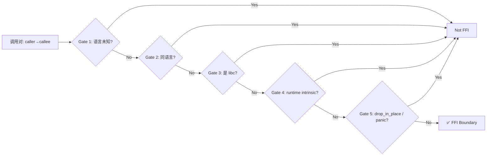
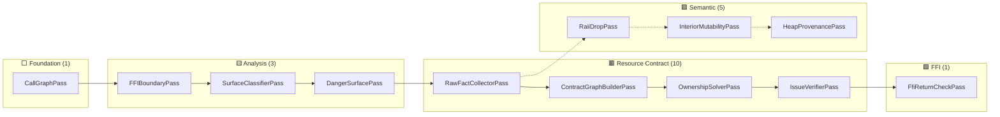
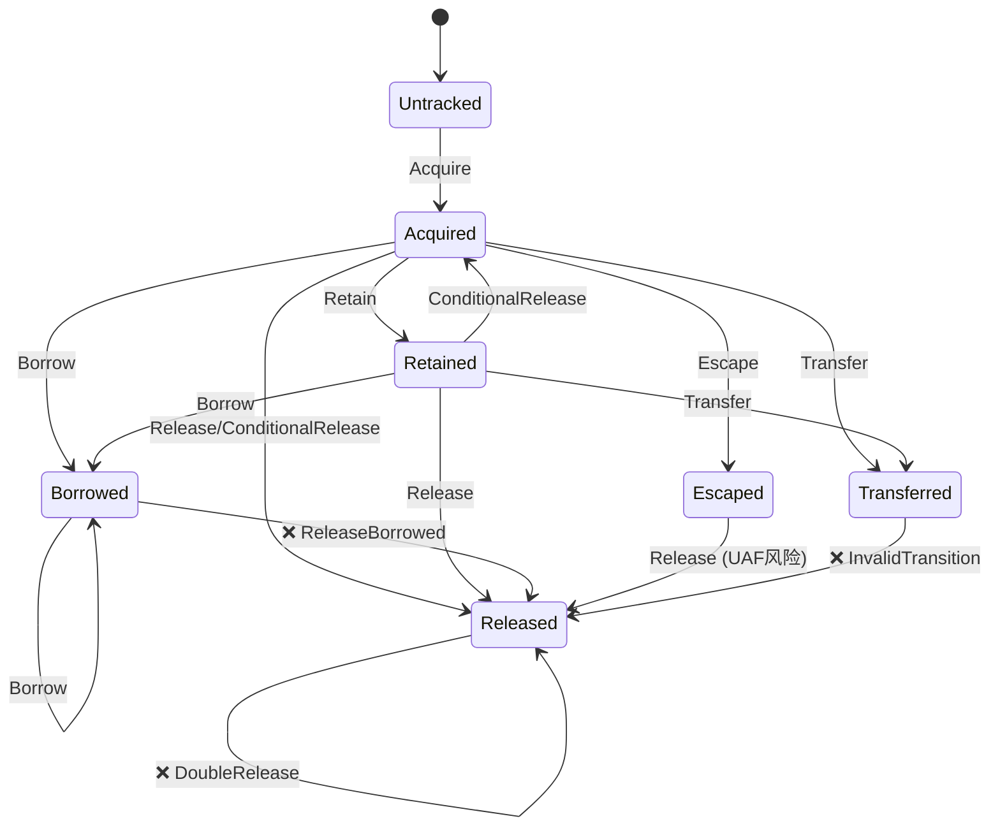
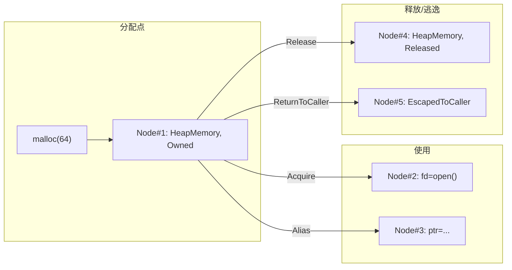
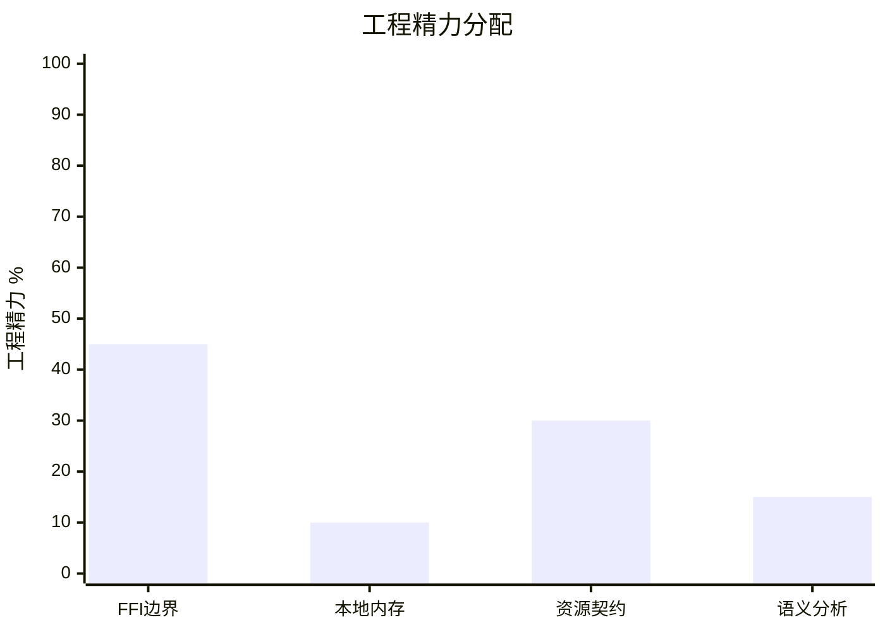

# OmniScope 系列开篇：跨语言 FFI 安全分析——调用图、状态机、语义树，这套组合拳打了两年

> 事情是这样的：有一天我盯着 Rust 的 `CString::into_raw` 发呆。
> 这个指针送出去之后，到底该谁来释放？Rust 的 allocator？C 的 free？还是某个我根本不认识的第三方库？
> 没有人告诉我。编译器不会报错。测试不会崩溃——直到生产环境。

---

## 闲话 + 背景

先坦白。我不是什么安全研究大牛，就是个写后端的。

这两年搞后端的都知道一件事：**没有项目是纯一种语言的**。你 Rust 写的再好，底层还得调 C 的 lib。你 Go 再优雅，FFI 调 C 库的时候该崩还是崩。Python 的数据科学项目，底层 numpy/pandas 全是 C 的天下。

多语言混合开发已经成了常态，但我们的工具链呢？

- CI 跑 `cargo check` —— OK
- CI 跑 `go vet` —— OK
- CI 跑 `pylint` —— OK
- 跨语言的边界呢？**没人管。**

## 为什么没人管？

我一开始也天真地以为：这问题应该有人解决了吧？

调研了一圈，结果让我很失望：

| 工具 | 能干啥 | 不能干啥 |
|------|--------|----------|
| Valgrind + ASan | 运行时检测内存错误 | 跑不到全路径、CI 里贼慢、需要测试覆盖 |
| Clang Static Analyzer | 纯 C/C++ 静态分析 | 不懂 Rust 的 `Box::into_raw` 语义 |
| Rust `cargo miri` | Rust 内部的 MIR 级别分析 | 看不懂 FFI 调用的 C 函数 |
| Coverity / CodeQL | 通用静态分析 | 跨语言边界几乎没有现成规则 |
| 人工 Code Review | 能发现 | 谁有这人力？ |

最接近我想要的是一个叫 **CryptoGuard** 的研究工具，但它只检查加密库的 API 合规。

**我就想要一个东西：你给我一个 .so 或者 .dll 的 IR，告诉我这里有没有跨语言的内存问题。**

没有。一个都没有。

## 那就自己搓一个

> 我一直觉得，最好的学习方式就是自己造一个轮子。
> 不是因为轮子不够用——是因为造完之后，你再也不会被轮子卡住了。

做这个决定的时候，我心里其实挺没底的。因为跨语言安全分析这个东西，学术界做的人都很少。工业界？大家靠的是"写测试"和"上 Valgrind"。

但回头一想：**写测试只能测你想到的场景，静态分析能测你没想到的。** 这就是为什么需要它。

## 调用图——所有分析的地基

任何安全分析的第一步都是：**谁调了谁？**

这听起来简单，但在跨语言场景下，你不仅要追踪同语言的调用关系，还要识别**跨语言调用边界**——也就是 FFI 调用。

CallGraphPass 是管线里第一个注册的 Pass，没有它，后面所有 Pass 都无法运行。

```rust
/// crates/omniscope-pass/src/analysis/call_graph.rs (lines 1-417)
/// Foundation pass, no dependencies.
pub struct CallGraphPass;

impl Pass for CallGraphPass {
    fn name(&self) -> &str { "CallGraphPass" }
    fn dependencies(&self) -> &[&str] { &[] }  // no deps
    // ...
}
```

### 两阶段构建

调用图的构建分两个阶段：

**Phase 1: 节点构建**。遍历 ModuleIndex 中的所有函数元数据，为每个函数创建一个 `CallGraphNode`，包含函数名、参数列表、是否是声明。

**Phase 2: 边构建**。遍历所有函数体内的 `call` 指令（call_metas），建立调用边。同时检测 FFI 边界调用。

```rust
// call_graph.rs 核心构建逻辑（简化）
fn build(&self, ctx: &PassContext) {
    // Phase 1: Build nodes from function metadata
    for func_meta in ctx.module_index.function_metas() {
        let kind = classify_function(&func_meta.name, func_meta.is_declaration, func_meta.language);
        let node = CallGraphNode::new(func_meta, kind);
        ctx.store("call_graph_nodes", node);
    }

    // Phase 2: Build edges + detect FFI boundaries
    for call in ctx.call_metas() {
        // Direct call edge
        ctx.store("call_graph_edges", CallGraphEdge::new(call.caller, call.callee));

        // FFI boundary check
        if is_ffi_boundary(call.caller, call.callee, caller_lang, callee_lang) {
            ctx.store("cross_lang_edges", CrossLangEdge::new(call));
        }
    }
}
```

整个构建过程是 O(n + e)，其中 n = 函数数量，e = 调用边数量。对于大多数项目，这可以在几十毫秒内完成。

### classify_function: 四门分类

函数分类是我踩的第一个坑。一开始我天真地想：只要函数名包含 C 的关键字就是 C 函数啊。直到我发现 Rust 的标准库也调用了 `malloc`。

最终的 `classify_function` 用了四道门：

```rust
fn classify_function(name: &str, is_declaration: bool, language: Language) -> FunctionKind {
    // Gate 1: Is it a libc function?
    if is_libc(name) { return FunctionKind::LibC; }

    // Gate 2: Is it a known dangerous function?
    if is_dangerous(name) { return FunctionKind::ExternalUnknown; }

    // Gate 3: Is it a runtime intrinsic? (e.g. memset, memcpy)
    if is_runtime_intrinsic(name, language) { return FunctionKind::ExternalUnknown; }

    // Gate 4: Is it defined in this module? (has a body)
    if !is_declaration { return FunctionKind::Internal; }

    // Fallback: external, unknown
    FunctionKind::ExternalUnknown
}
```

Gates 1-3 是快速拒绝——这些函数我们不需要深入分析，因为它们要么是标准库（行为已知），要么是危险的边界函数。**只有 Internal 函数才是我们真正要分析的。**

### is_ffi_boundary: 五门滤波器

FFI 边界检测比函数分类更微妙。一开始我试图用语言检测结果来做——即如果调用者和被调用者的语言不同，就是 FFI 边界。但这样会误报太多。

最终的五门滤波器：



```rust
fn is_ffi_boundary(caller, callee, caller_lang, callee_lang) -> bool {
    if caller_lang == Language::Unknown || callee_lang == Language::Unknown { return false; }
    if caller_lang == callee_lang { return false; }
    if is_libc(callee) { return false; }
    if is_runtime_intrinsic(callee, callee_lang) { return false; }
    if callee.contains("drop_in_place") || callee.contains("panic") { return false; }
    true
}
```

为什么这么保守？因为**宁可漏掉一个 FFI 边界，也不能把同语言内部的调用链当成 FFI 来污染分析。**

## 21个分析 Pass：四阶段管线

调用图只是第一步。真正的分析需要 21 个 Pass 协同工作。

```
Pipeline.register_default_passes() 注册顺序：

Foundation (1):  CallGraphPass
Analysis   (3):  FFIBoundaryPass, SurfaceClassifierPass, DangerSurfacePass
Resource   (10): RawFactCollectorPass → IRBehaviorSummaryPass → LanguageAdapterFactPass
                  → AbiLayoutPass → SummaryBuilderPass → StructuralInferencePass
                  → ContractGraphBuilderPass → OwnershipSolverPass
                  → CrossFunctionLifetimePass → IssueCandidateBuilderPass
                  → IssueVerifierPass → LeakDetectionPass
Semantic   (5):  RaiiDropPass → InteriorMutabilityPass → HeapProvenancePass
                  → BorrowEscapePass → WriteToImmutablePass
FFI        (1):  FfiReturnCheckPass
```

为什么要把 21 个 Pass 拆这么细？因为每一个 Pass 负责一个**可独立测试、可独立优化、可独立替换**的分析步骤。



**Stage 1: Foundation** 构建调用图——所有分析的骨架。
**Stage 2: Analysis** 在调用图上标注——哪些是 FFI 边界，哪些是危险函数。
**Stage 3: Resource Contract** 核心分析——追踪资源的完整生命周期。
**Stage 4: Semantic** 用语义知识抑制假阳性——RAII drop 不应该报 use-after-free。
**Stage 5: FFI Check** 最终检查——FFI 返回值的可空性。

### Effect：原子词汇

在深入 Pass 之前，需要理解一个核心概念：**Effect**。它是 OmniScope 的"原子词汇"。

```rust
/// crates/omniscope-types/src/effect.rs (lines 1-354)
pub enum Effect {
    Acquire { family: FamilyId, result: OperandRef },
    Release { family: FamilyId, arg: OperandRef },
    ConditionalRelease { family: FamilyId, arg: OperandRef },
    Retain { family: FamilyId, arg: OperandRef },
    ReturnsOwned { family: FamilyId, result: OperandRef },
    ReturnsBorrowed { result: OperandRef },
    ConsumesArg { arg: OperandRef, family: FamilyId },
    StoresArgToOwner { arg: OperandRef, owner: OperandRef },
    StoresArgToGlobal { arg: OperandRef, global: String },
    InitializesOutParam { arg: OperandRef },
    EscapesToCallback { arg: OperandRef, callback: OperandRef },
    OwnershipEscape { family: FamilyId, result: OperandRef },
    OwnershipReclaim { family: FamilyId, result: OperandRef },
    CrossLanguageFree { alloc_family: FamilyId, release_family: FamilyId, arg: OperandRef },
    NullGuardedRelease { family: FamilyId, arg: OperandRef },
    OutParamOwnedOnSuccess { family: FamilyId, arg: OperandRef },
    OutParamNullOnError { arg: OperandRef },
    NullStoreAfterRelease { arg: OperandRef },
}
```

每个 Effect 描述了一个指令对资源所有权的影响。`Acquire` 表示分配（得到所有权），`Release` 表示释放（放弃所有权），`StoresArgToOwner` 表示把资源存到一个结构体字段里。**所有 21 个 Pass 都基于 Effect 来推理。**

## 所有权状态机

有了 Effect 还不够。我需要一个**状态机**来跟踪每个资源的生命周期。

```rust
/// crates/omniscope-semantics/src/resource/ownership_state.rs (lines 1-1059)
pub enum OwnershipState {
    Untracked,     // 未追踪
    Acquired,      // ✅ 已拥有
    Released,      // ✅ 已释放
    Escaped(EscapeKind),  // 逃逸到调用者/输出参数
    Transferred,   // 所有权已转移
    Retained,      // 引用计数增加
    Borrowed,      // 借用中
    Unknown,       // 未知
}
```

每个 `ResourceInstance` 都携带当前状态：

```rust
pub struct ResourceInstance {
    pub id: u64,
    pub family: FamilyId,
    pub state: OwnershipState,
    pub contract: PointerContract,
    pub acquired_in: Option<u64>,    // 在哪里分配的
    pub released_in: Option<u64>,    // 在哪里释放的
    pub function_name: String,
}
```

### 状态转换规则

状态机最核心的是 `transition()` 方法。它定义了每个 `OwnershipEvent` 在各种状态下如何转换：



关键转换规则：

```rust
// Release: Acquired/Retained→Released=Ok
//           Released→DoubleRelease (错误!)
//           Borrowed→ReleaseBorrowed (错误!)
//           Escaped→Released=Ok (但有UAF风险)
//           Transferred→InvalidTransition
OwnershipEvent::Release => match self.state {
    OwnershipState::Acquired | OwnershipState::Retained => {
        self.state = OwnershipState::Released;
        self.released_in = Some(function);
        Ok(())
    }
    OwnershipState::Released => Err(OwnershipError::DoubleRelease { .. }),
    OwnershipState::Borrowed => Err(OwnershipError::ReleaseBorrowed { .. }),
    OwnershipState::Escaped(_) => {
        self.state = OwnershipState::Released;
        // ⚠️ 逃逸后再释放 = Use-After-Free 风险
        Ok(())
    }
    OwnershipState::Transferred => Err(OwnershipError::InvalidTransition { .. }),
    _ => Err(OwnershipError::InvalidTransition { .. }),
}

// ConditionalRelease: Retained→Acquired(回退到基础状态)
//                     Acquired→Released(唯一引用)
//                     Released→DoubleRelease
OwnershipEvent::ConditionalRelease { .. } => match self.state {
    OwnershipState::Retained => {
        self.state = OwnershipState::Acquired; // 引用计数减1但资源还在
        Ok(())
    }
    OwnershipState::Acquired => {
        self.state = OwnershipState::Released; // 最后引用，释放
        self.released_in = Some(function);
        Ok(())
    }
    // ...
}

// is_leak_candidate: 只有Acquired和Retained可能是泄漏
pub fn is_leak_candidate(&self) -> bool {
    matches!(self.state, OwnershipState::Acquired | OwnershipState::Retained)
}
```

这里有个很关键的设计：**ConditionalRelease**。当我们检测到 `Py_DECREF` 或 `Rust drop_in_place` 这类"有条件释放"操作时，如果之前有过 Retain（引用计数增加），ConditionalRelease 只是把状态回退到 Acquired——资源可能还活着。只有当资源是唯一引用（Acquired 状态）时，ConditionalRelease 才真正释放。

## MemoryGraph：统一资源视图

所有权状态机跟踪单个资源的生命周期，但跨函数、跨语言的资源流转怎么办？

这就是 **MemoryGraph** 的用处。

```rust
/// crates/omniscope-semantics/src/resource/memory_graph.rs (lines 1-603)
pub enum ResourceClass {
    HeapMemory,      // malloc, new, Box
    MmapRegion,      // mmap, VirtualAlloc
    FileDescriptor,  // open, creat, socket
    Socket,          // socket, accept, connect
    ProcessHandle,   // fork, CreateProcess
    ThreadHandle,    // pthread_create, CreateThread
    RuntimeManaged,  // GC, 引用计数
    Unknown,
}

pub enum ResourceState {
    Unknown, Null, Owned, Released,
    EscapedToCaller, EscapedToOutParam,
    StoredToOwner, StoredToRuntime, RuntimeManaged,
}

pub enum MemoryEdgeKind {
    Acquire, Release, StoreToOwner, StoreToRuntime,
    ReturnToCaller, InitOutParam, NullOnErrorPath, Alias, Use,
}

pub struct MemoryNode {
    pub id: u64,
    pub resource_class: ResourceClass,
    pub state: ResourceState,
    pub function_name: String,
    pub family_id: Option<FamilyId>,
}

pub struct MemoryEdge {
    pub source: u64,
    pub target: u64,
    pub kind: MemoryEdgeKind,
    pub annotation: String,
}
```



## 语义树：55+ SemanticKind 的知识库

所有权状态机和 MemoryGraph 是"语法级"的分析。但真实世界中有很多模式，光靠语法分析搞不定。

比如：Python 的 `Py_DECREF` 和 C++ 的 `delete` 都是释放操作，但它们的行为完全不同——`Py_DECREF` 是有条件释放（引用计数减1），而 `delete` 是确定释放。

这就是 SemanticKind 的作用——**给每个函数打上语义标签**。

```rust
/// crates/omniscope-semantics/src/resource/semantic_tree/kind.rs (lines 1-1029)
pub enum SemanticKind {
    // R-0: 参数角色
    ReadonlyParam, MutableParam,

    // R-1: 堆来源
    HeapProvenance, GlobalProvenance,

    // R-2: 内部可变性
    InteriorMutability,

    // R-3: RAII Drop
    RaiiDropRelease,

    // R-4: 资源操作
    FileOp, NetworkOp, ProcessOp,

    // R-6: 原始指针转移
    IntoRawTransfer,

    // R-7: 库函数释放
    LibraryRelease,

    // R-8: 从参数获取资源
    FromParameter,

    // Python 语言特化 (6种)
    PythonRefcountInc, PythonRefcountDec, PythonBorrowedRef,
    PythonOwnedRef, GilProtected, RefcountManaged,

    // Go 语言特化 (4种)
    GoDeferCleanup, GoFinalizer, GoCgoWrapper, GoRuntimeAlloc,

    // C++ 语言特化 (4种)
    CppUniquePtr, CppSharedPtr, CppDestructor, CppExceptionPath,

    // Java/C#/WASM 等更多...
}
```

### R-0 到 R-8 规则体系

语义树按 9 条规则组织（R-0 到 R-8），优先级从高到低。每条规则回答一个问题：

| 规则 | 问题 | 变体数 |
|------|------|--------|
| R-0 | 参数是只读还是可变？ | 2 |
| R-1 | 指针的堆来源是什么？ | 2 |
| R-2 | 是否具有内部可变性？ | 1 |
| R-3 | 是否是 RAII drop？ | 1 |
| R-4 | 是否是文件/网络/进程操作？ | 3 |
| R-5 | 是否是资源释放？ | - |
| R-6 | 是否是 into_raw 转移？ | 1 |
| R-7 | 是否是库函数释放？ | 1 |
| R-8 | 是否从参数获取资源？ | 1 |

加上跨语言特化（Python/Go/C++/C#/Java/WASM/JS）共 55+ 变体。

## 验证器架构：从证据到结论

前面的所有分析最终产出的是 `IssueCandidate`——一个疑似有问题的证据包。但它到底是不是真 bug？需要验证器来做最终裁定。

### EvidenceBundle

每个 IssueCandidate 被包装成一个 EvienceBundle，聚合了所有相关证据：

```rust
pub struct EvidenceBundle {
    pub candidate_id: u64,
    pub semantic_kinds: Vec<SemanticKind>,
    pub semantic_facts: Vec<SemanticFact>,
    pub evidence_kinds: Vec<EvidenceKind>,
    pub alloc_function: String,
    pub release_function: String,
    pub alloc_caller: Option<String>,
    pub release_caller: Option<String>,
    pub has_same_resource_evidence: bool,
    // ...
}
```

### VerifierVerdict

验证器的输出是一级裁定：

```rust
pub enum VerifierVerdict {
    ConfirmedIssue,  // 🐛 确认是bug
    ProbableIssue,   // 🤔 可能是bug
    Diagnostic,      // ℹ️ 诊断信息
    ExplainedSafe,   // ✅ 已解释为安全
}
```

### 泄漏检测 (leak.rs)

```rust
/// crates/omniscope-pass/src/resource/issue_verifier/leak.rs (lines 1-424)
pub(crate) fn verify_definite_leak_with_bundle(bundle: &EvidenceBundle) -> VerifierVerdict {
    // Gate 1: OwnershipEscapeLeak — into_raw没有 from_raw
    if bundle.evidence_kinds.contains(&EvidenceKind::OwnershipEscapeLeak) {
        return VerifierVerdict::ConfirmedIssue;
    }

    let path_verifier = if has_path_refinement {
        PathSensitiveVerifier::with_path_data(2, 2, 0)
    } else { PathSensitiveVerifier::new() };

    // Gate 2: 高置信度抑制
    if bundle.has_leak_suppression_high_confidence() {
        return path_verifier.adjust_verdict(VerifierVerdict::ExplainedSafe);
    }

    // Gate 3: 中等置信度抑制 → 降级
    if bundle.has_leak_suppression_medium_confidence() {
        return path_verifier.adjust_verdict(VerifierVerdict::ProbableIssue);
    }

    // Gate 4: 路径分析确认泄漏
    path_verifier.adjust_verdict(VerifierVerdict::ConfirmedIssue)
}
```

### 双释放检测 (double_free.rs)

双释放检测有 6 道门，层层过滤假阳性：

```rust
/// crates/omniscope-pass/src/resource/issue_verifier/double_free.rs (lines 1-334)
pub(crate) fn verify_double_release_with_bundle(bundle: &EvidenceBundle) -> VerifierVerdict {
    // Gate 1: 空值保护三合一 → safe
    if has_null_guard && has_null_store && has_path_refinement {
        return VerifierVerdict::ExplainedSafe;
    }

    // Gate 2: 不同调用者 → safe
    if has_null_guard && alloc_caller != release_caller {
        return VerifierVerdict::ExplainedSafe;
    }

    // Gate 3: 互斥分支(if/else各释放一次) → safe
    if is_deallocator && same_caller && !has_use_after && !has_strong_instance {
        return VerifierVerdict::ExplainedSafe;
    }

    // Gate 4: 同实例检查
    // Gate 5: 别名拒绝
    // Gate 6: Use-After-Free 检查
}
```

其中 Gate 3 是最有意思的。很多"双释放"实际上是 if/else 分支的产物——一个节点要么被 leaf_free 释放，要么被 internal_free 释放，但在调用返回时控制流汇聚了，分析器误以为释放了两次。

### 路径敏感验证器

```rust
pub struct PathSensitiveVerifier {
    /// 总路径数
    total_paths: usize,
    /// 安全路径数
    safe_paths: usize,
    /// 泄漏路径数
    leak_paths: usize,
}

impl PathSensitiveVerifier {
    pub fn adjust_verdict(&self, base: VerifierVerdict) -> VerifierVerdict {
        match self.confidence_score() {
            s if s >= 0.9 => base,
            s if s >= 0.6 => VerifierVerdict::ProbableIssue,
            _ => VerifierVerdict::ExplainedSafe,
        }
    }

    pub fn confidence_score(&self) -> f64 {
        if self.total_paths == 0 { return 0.5; }
        self.leak_paths as f64 / self.total_paths as f64
    }
}
```

## 28种 IssueKind：我们检测什么

所有的分析最终落到 28 种 Issue 类型上。这 28 种按 90/10 优先级拆分为两类：

```rust
/// crates/omniscope-core/src/issue.rs (lines 1-300)
pub enum IssueKind {
    // ⭐ FFI 边界问题（90% 工程精力）
    CrossLanguageFree,     // CWE-762: 跨语言释放
    OwnershipViolation,    // CWE-763: 所有权违反
    FfiTypeMismatch,       // CWE-843: 类型不匹配
    UncheckedReturn,       // CWE-252: 未检查返回值
    NullableReturn,        // CWE-758: 可空返回
    FfiStackBorrow,        // CWE-749: FFI栈借用
    BorrowEscape,          // CWE-197: 借用逃逸
    CallbackEscapeIssue,   // CWE-822: 回调逃逸

    // 🔧 本地内存问题（10% 工程精力）
    DoubleFree,            // CWE-415: 双重释放
    UseAfterFree,          // CWE-416: 释放后使用
    MemoryLeak,            // CWE-401: 内存泄漏
    NullDereference,       // CWE-476: 空指针解引用
    BufferOverflow,        // CWE-120: 缓冲区溢出
    IntegerOverflow,       // CWE-190: 整数溢出

    // 🔧 资源契约问题（新架构）
    DefiniteLeak,
    ConditionalLeak,
    OwnershipEscapeLeak,
    // ...
}
```

**90/10 产品决策**：90% 的工程精力花在 FFI 边界问题上，因为这些是别的工具管不到的。本地内存问题（DoubleFree、UseAfterFree、MemoryLeak）ASan 和 Valgrind 做得更好，我们只花 10% 的精力。



## 真实世界的验证：9 个项目，13 个真实 bug

代码写完了，得拿出去遛遛。

| 项目 | 语言边界 | 发现的问题 |
|------|----------|-----------|
| **duckdb-rs** | Rust ↔ C (DuckDB) | 3 个空指针解引用 (CWE-476) |
| **rusqlite** | Rust ↔ C (SQLite) | 2 个空指针解引用 (CWE-476) |
| **rustls-ffi** | Rust ↔ C | 双重释放 (CWE-415) |
| **JNA** | Java ↔ C | 双重释放 (CWE-415) |
| pyo3 | Python ↔ C | FP降至0 |
| go-sqlite3 | Go ↔ C | 边界检测完整 |

**rustls-ffi 的双重释放**是最典型的案例。Rust 侧 `Box::into_raw` 把所有权转移给 C，C 侧 `free` 释放了，但 Rust 侧在某些错误路径下又调了一次 `drop_in_place`。两边都以为对方不会释放。

这种 bug 在 code review 里极难发现——涉及两个语言的文件、两个不同的内存管理模型。**只有从 LLVM IR 层面统一追踪，才能抓到。**

## 坦诚环节

### 1. 68% 精确率，够用吗？

不够。当前精确率约 68%，意味着每 100 个报告里 32 个是假阳性。对于 CI 准入来说，目标应该是 90%+。

假阳性的主要来源：
- **if/else 分支合并**：互斥分支各释放一次 → 看起来像双释放
- **IR 语义丢失**：`readonly` 参数在某些平台实际上可变
- **跨模块缺失**：分配和释放在不同编译单元 → 误报泄漏

### 2. 为什么不做跨模块分析？

跨模块分析意味着加载多个 IR 文件，关联函数定义。工程复杂度 ×5，精度提升有限。单文件分析已经能发现 13 个真实 bug 了。

### 3. 为什么不用 ML/AI？

试过。两轮尝试，F1 都在 0.72 左右，召回率 0.68。对于安全工具来说**漏报不可接受**。手工规则更可控。

### 4. 为什么拆 21 个 Pass？

每个 Pass 可独立优化、独立测试、独立替换。如果某个 Pass 坏了，不影响其他 Pass。这是模块化的极致。

## 下篇预告

下一期我们聊 **IR 加载**——跟 LLVM IR 死磕的 8 种姿势。你可能觉得"加载个 IR 有什么好讲的"——呵，等你试过跟 LLVM 的版本号打交道就知道了。

---

*下一篇：[OmniScope 架构深度解析（二）：IR 加载——跟 LLVM IR 死磕的 8 种姿势](./02-ir-loading.md)*
