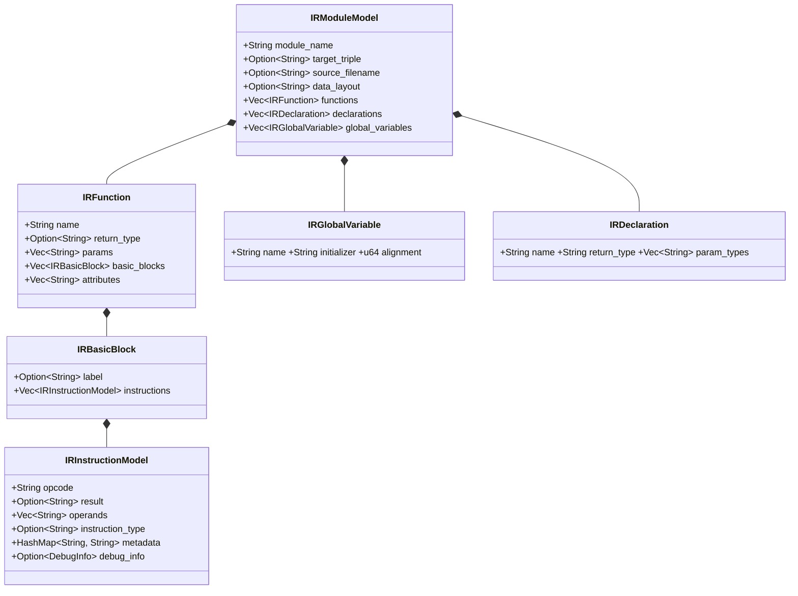
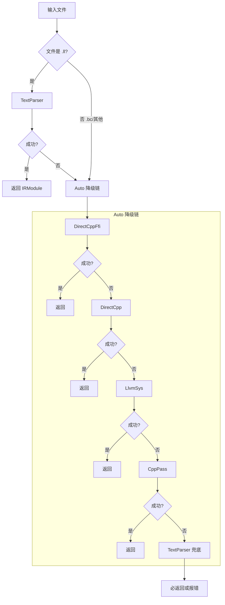

# OmniScope 架构深度解析（二）：IR 加载——跟 LLVM IR 死磕的 8 种姿势

> 如果让我找一个词形容 LLVM IR 的加载体验，那就是"薛定谔的 IR 文件"。
> 一个 `.ll` 文件，在你读到它之前，既有可能加载成功，也有可能让你凌晨三点还在追 core dump。

---

## 困境：98% 的时间去哪了？

OmniScope 的早期版本有一个特别魔幻的现象：

我对着一个 20MB 的 `.bc` 文件跑分析，等了三分钟还没出结果。`top` 一看 CPU 100%，但分析器的 progress bar 停在"Loading IR..."这一步。

等等，**IR 加载**这一步能花这么长时间？

我写了个简单的 benchmark：

```
.bc 文件 (bitcode):    30s 分析时间中，加载占 ~29.4s  (98%)
.ll 文件 (text IR):     30s 分析时间中，加载占  ~0.1s  (0.3%)
```

**98% 的时间都花在了 IR 加载上。**

更离谱的是，`.ll` 和 `.bc` 包含了完全相同的信息——只是序列化格式不同。一个快 300 倍，一个慢到让人怀疑人生。

这就是 OmniScope 面临的第一个"要不要掀桌子"的困境。

## 为什么 .bc 这么慢？

bitcode（`.bc`）是 LLVM 的二进制序列化格式。它的问题在于：

1. **版本强绑定** —— LLVM 12 产生的 .bc，LLVM 22 不一定能读。实验证明，很多情况下确实不能读。
2. **需要完整初始化 C++ LLVM 库** —— 反序列化 .bc 要先启动整个 LLVM 后端，建 Module，建 Function，建 BasicBlock，建 Instruction……
3. **.bc 不是为"读取"设计的** —— 它是为"链接时优化"设计的（LTO）。LTO 场景下读一次然后用几千次，慢点没关系。但分析场景下每次读一次，慢就是灾难。

那 .ll 呢？.ll 是文本格式，每一行都是人类可读的 LLVM IR 指令。写一个纯 Rust 的文本解析器就够了，不需要碰任何 C++ 库。

于是结论很明确：**必须支持 .ll 优先。**

但新的问题来了：**用户的 LLVM IR 本身也在进化。**

## LLVM IR 格式的演变：从 typed 到 opaque

LLVM IR 有一个我开发过程中反复踩的坑——指针类型的表示方式。

在 LLVM 15 之前，IR 使用 **typed pointers**。每个指针都标注了它指向的类型。例如：

```llvm
define void @foo(i32* %ptr) {
  %val = load i32, i32* %ptr
  ret void
}
```

`i32*` 明确告诉编译器：这个指针指向一个 32 位整数。

但从 **LLVM 15 开始**，LLVM 强制启用 **opaque pointers**。指针不再携带类型信息：

```llvm
define void @foo(ptr %ptr) {
  %val = load i32, ptr %ptr
  ret void
}
```

`i32*` 变成了 `ptr`。这对 IR 加载有深远影响：

1. **text parser 必须同时兼容两种格式**——解析器要识别 `i32*` 和 `ptr` 两种写法
2. **GEP 指令的参数结构变了**——typed pointer 下 GEP 需要额外参数来推导结果类型
3. **类型推导逻辑变复杂**——opaque pointer 下需要从 `load`/`store` 的目标类型反推

## ir_model.rs：IR 的核心数据结构

IR 加载的下层，是 `crates/omniscope-ir/src/ir_model.rs` 定义的一套数据模型。OmniScope 的核心 IR 数据结构都在这里：

```rust
/// File: crates/omniscope-ir/src/ir_model.rs
pub struct IRModuleModel {
    pub module_name: String,
    pub target_triple: Option<String>,
    pub source_filename: Option<String>,
    pub data_layout: Option<String>,
    pub functions: Vec<IRFunction>,
    pub declarations: Vec<IRDeclaration>,
    pub global_variables: Vec<IRGlobalVariable>,
}
```

这是所有加载路径的最终输出格式，也是后续分析（数据流、ownership 推理）的输入。

**函数定义** `IRFunction` 的结构：

```rust
pub struct IRFunction {
    pub name: String,
    pub return_type: Option<String>,
    pub params: Vec<String>,
    pub basic_blocks: Vec<IRBasicBlock>,
    pub attributes: Vec<String>,
    pub visibility: Option<String>,
    pub alignment: Option<u64>,
    pub section: Option<String>,
    pub gc: Option<String>,
}
```

**基本块** `IRBasicBlock`：

```rust
pub struct IRBasicBlock {
    pub label: Option<String>,
    pub instructions: Vec<IRInstructionModel>,
}
```

**指令** `IRInstructionModel`：

```rust
pub struct IRInstructionModel {
    pub opcode: String,
    pub result: Option<String>,
    pub operands: Vec<String>,
    pub instruction_type: Option<String>,
    pub metadata: HashMap<String, String>,
    pub debug_info: Option<DebugInfo>,
}
```

这套模型的设计决策是：**尽可能保持通用性**，而不是绑定到任意一种 IR 格式：

- `operands` 是 `Vec<String>` 而非强类型——因为不同加载路径用不同的 IR 表示
- `metadata` 是 `HashMap<String, String>`——任何元数据都能保留
- `instruction_type` 是 `Option<String>`——不是所有指令都有类型（例如 `store`）

同时支持 JSON 和 MessagePack 序列化：

```rust
pub fn load_from_json(path: &Path) -> Result<IRModuleModel> {
    let file = File::open(path)?;
    let reader = BufReader::new(file);
    let model: IRModuleModel = serde_json::from_reader(reader)?;
    Ok(model)
}

pub fn load_from_msgpack(path: &Path) -> Result<IRModuleModel> {
    let data = std::fs::read(path)?;
    let model: IRModuleModel = rmp_serde::from_slice(&data)?;
    Ok(model)
}
```



## llvm_sys_adapter.rs：用 Rust 调 LLVM C API

当需要最完整的类型信息时，text parser 就不够用了。可以走 `llvm-sys` 路径——通过 `crates/omniscope-ir/src/llvm_sys_adapter.rs` 直接调用 LLVM C API：

```rust
/// RAII wrapper for LLVM C API context management.
/// crates/omniscope-ir/src/llvm_sys_adapter.rs
pub struct ContextGuard { _private: () }

impl ContextGuard {
    pub fn new() -> Self {
        unsafe { LLVMInitializeAllAsmParsers(); }
        ContextGuard { _private: () }
    }
}
impl Drop for ContextGuard {
    fn drop(&mut self) { unsafe { LLVMShutdown(); } }
}
```

`ContextGuard` 确保 LLVM 上下文在 Rust 生命周期内正确初始化和销毁。`ModuleGuard` 则在 Drop 时自动释放 LLVM Module：

```rust
pub struct ModuleGuard { module: LLVMModuleRef }

impl ModuleGuard {
    pub fn parse_ir(path: &str) -> Result<Self> {
        let _ctx = ContextGuard::new();
        let mem_buf = MemoryBufferGuard::new(path)?;
        let mut module: LLVMModuleRef = ptr::null_mut();
        let mut out_msg: *mut c_char = ptr::null_mut();
        let result = unsafe {
            LLVMParseIRInContext(LLVMGetGlobalContext(), mem_buf.as_ref(), &mut module, &mut out_msg)
        };
        // ...
        Ok(ModuleGuard { module })
    }

    pub fn get_pointer_type(&self, val: LLVMValueRef) -> Option<String> {
        unsafe {
            let t = LLVMTypeOf(val);
            if LLVMGetTypeKind(t) == LLVMPointerTypeKind {
                Some(format!("ptr addrspace({})", LLVMGetPointerAddressSpace(t)))
            } else { None }
        }
    }
}
impl Drop for ModuleGuard {
    fn drop(&mut self) { unsafe { LLVMDisposeModule(self.module); } }
}
```

这个路径的最大价值是：**能提取 text parser 无法获取的精确类型信息**，特别是 opaque pointer 的地址空间（address space）。但这个能力需要 `--features llvm-backend` 编译，不是默认开启的。

## 反思：一个文件，八种读法

回到加载策略本身。一开始我把 IR 加载想简单了。

我以为只要写一个"支持 .ll 和 .bc 的 parser"就完事了。结果发现真实世界比这复杂太多：

- 用户有 `.ll` 文件吗？不一定。商业编译器可能只给 `.bc`。
- 用户装 `opt` 了吗？不一定。Docker 镜像里经常没有。
- 用户能编译 C++ 吗？不一定。Windows 用户可能没有 LLVM 开发包。
- 用户有 `ir_extractor` 二进制吗？不一定。这需要单独编译。
- 用户装了什么版本的 LLVM？不知道。可能是 LLVM 12，也可能是 LLVM 22。

所以我对 IR 加载的认知发生了变化：

> **IR 加载不是一个"支持两种格式"的问题，而是一个"在不可靠的环境中尽可能可靠地加载"的问题。**

方案不是找到一个"最好的加载方式"，而是提供**一整套加载策略，让它们互相兜底**。

最终我设计了 **8 种 LoadStrategy**（定义在 `crates/omniscope-ir/src/loader_v2.rs`，第 60-95 行）：

```rust
#[derive(Debug, Clone, Copy, PartialEq, Eq)]
pub enum LoadStrategy {
    DirectCppFfi,    // ir_extractor + --slice=ffi，最精确的 FFI IR
    DirectCpp,       // ir_extractor，完整 IR 但不依赖 opt
    LlvmSys,         // llvm-sys C API，LLVM dev 包
    CppPass,         // opt + SafetyExportPass.so，已有 LLVM pass 工作流
    TextParser,      // 纯 Rust 文本解析，零依赖
    MsgPack,         // MessagePack 预提取，5-10x 快于 JSON
    Auto,            // 自动探测最佳策略
    AutoFast,        // 默认策略，.ll 优先
}
```

## Auto / AutoFast：自动降级链

```rust
/// crates/omniscope-ir/src/loader_v2.rs
/// Probe backends in priority order and fall back gracefully.
fn load_auto(path: &Path) -> Result<(IRModule, LoadStrategy)> {
    // Priority: DirectCppFfi > DirectCpp > llvm-sys > cpp pass > text parser
    if can_use_direct_cpp_ffi() {
        match load_via_direct_cpp_ffi(path) {
            Ok(m) if !m.functions.is_empty() => return Ok((m, DirectCppFfi)),
            Ok(_) => warn!("DirectCppFfi empty, falling back"),
            Err(e) => warn!(error = %e, "DirectCppFfi failed"),
        }
    }
    // ... 逐级降级 ...
    let module = load_via_text(path)?;
    Ok((module, TextParser)) // TextParser 永远兜底
}
```

**AutoFast** 是默认策略：`.ll` 文件优先用 TextParser（瞬间完成），`.bc` 走正常 Auto 降级链。对大 `.ll` 文件（>10MB）直接走 TextParser 快速路径，避免先探测外部工具的开销。



## 主入口 load_ir()

所有策略通过一个统一入口暴露给上层：

```rust
/// crates/omniscope-ir/src/loader_v2.rs
/// Primary entry point for CLI and pipeline.
pub fn load_ir(path: &Path, strategy: LoadStrategy) -> Result<LoadedIr> {
    if !path.exists() {
        bail!("IR file does not exist: {}", path.display());
    }
    let start = Instant::now();
    let (module, actual_strategy) = match strategy {
        Auto => load_auto(path)?,
        AutoFast => load_auto_fast(path)?,
        DirectCppFfi => (load_via_direct_cpp_ffi(path)?, DirectCppFfi),
        LlvmSys => (load_via_llvm_sys(path)?, LlvmSys),
        CppPass => (load_via_cpp_pass(path)?, CppPass),
        DirectCpp => (load_via_direct_cpp(path)?, DirectCpp),
        TextParser => (load_via_text(path)?, TextParser),
        MsgPack => (load_via_msgpack(path)?, MsgPack),
    };
    let load_ms = start.elapsed().as_millis() as u64;
    Ok(LoadedIr { module, strategy: actual_strategy, load_ms, .. })
}
```

`LoadedIr` 结构体不仅返回加载结果，还包含了 `actual_strategy`（实际使用的策略——因为 Auto 会降级）和 `load_ms`（加载耗时）。

## LLVM 版本号搜索：从 12 跳到 22

项目早期的 `BUILD_ENV.md` 写着"请安装 LLVM 12（`llvm@12`）"。现在 `crates/omniscope-ir/Cargo.toml` 里：
```toml
llvm-sys = "221"  # LLVM 22
```

相差 5 年、10 个大版本，每个版本的 LLVM API 互不兼容。`find_opt()` 的探测顺序从 LLVM 22 降级到 LLVM 17：

```rust
/// crates/omniscope-ir/src/loader_v2.rs
/// Return common Homebrew LLVM bin directories (newest version first).
fn homebrew_llvm_bin_dirs() -> Vec<PathBuf> {
    [
        "/opt/homebrew/opt/llvm@22/bin",
        "/opt/homebrew/opt/llvm@21/bin",
        "/opt/homebrew/opt/llvm@20/bin",
        "/opt/homebrew/opt/llvm@19/bin",
        "/opt/homebrew/opt/llvm@18/bin",
        "/opt/homebrew/opt/llvm@17/bin",
        "/opt/homebrew/opt/llvm/bin",
    ].iter().map(PathBuf::from).collect()
}
```

```mermaid
flowchart TD
    A[查找 opt 二进制] --> B{LLVM_OPT 环境变量?}
    B -->|设置| C[直接使用]
    B -->|未设置| D{llvm@22?}
    D -->|有| E[使用 llvm@22]
    D -->|无| F{llvm@21?}
    F -->|有| G[使用 llvm@21]
    F -->|无| H{llvm@20..17?}
    H -->|有| I[使用对应版本]
    H -->|无| J{llvm-config?}
    J -->|有| K[使用 llvm-config 路径]
    J -->|无| L{which opt?}
    L -->|有| M[使用 PATH 中的 opt]
    L -->|无| N[返回 None]
```

## instruction_parser.rs：指令级解析

TextParser 加载后，指令还需要额外解析才能用于数据流分析。`crates/omniscope-ir/src/instruction_parser.rs` 提供了最佳努力的指令分类：

```rust
/// Best-effort instruction classification for LLVM IR.
pub fn classify_instruction(opcode: &str, operands: &[String]) -> InstructionKind {
    match opcode {
        "call" => InstructionKind::Call,
        "load" => InstructionKind::Load,
        "store" => InstructionKind::Store,
        "alloca" => InstructionKind::Alloca,
        "getelementptr" => InstructionKind::GEP,
        "phi" => InstructionKind::Phi,
        "icmp" | "fcmp" => InstructionKind::Compare,
        "br" | "switch" | "indirectbr" => InstructionKind::Branch,
        "ret" => InstructionKind::Return,
        "bitcast" | "ptrtoint" | "inttoptr" => InstructionKind::Cast,
        "malloc" | "free" | "calloc" | "realloc" => InstructionKind::MemoryOp,
        _ => InstructionKind::Other,
    }
}
```

它还包含 callee 提取和原子操作检测：

```rust
pub fn extract_callee(operands: &[String]) -> Option<&str> {
    operands.first().map(|s| s.trim_start_matches('@'))
}

pub fn is_atomic_op(instruction: &str) -> bool {
    instruction.starts_with("atomic") || instruction.contains(" atomic ")
}
```

这套解析器标记了约 15 种指令类别，覆盖数据流分析和所有权推理所需的核心指令。它是 **best-effort** 的——遇到不认识的指令格式就标记为 `Other`，不会导致整个加载失败。

## IR 缓存系统

每次通过 C++ pass 或 ir_extractor 加载 IR 都涉及进程启动、LLVM 初始化、JSON 序列化——一次可能要 5-10 秒。`crates/omniscope-ir/src/ir_cache.rs` 提供了文件指纹缓存：

```rust
/// crates/omniscope-ir/src/ir_cache.rs
/// Compute cache key based on file identity (size + mtime + xxh3).
fn cache_key(path: &Path) -> Option<String> {
    let meta = std::fs::metadata(path).ok()?;
    let size = meta.len();
    let mtime = meta.modified().ok()?;
    let mtime_ns = mtime.duration_since(SystemTime::UNIX_EPOCH).ok()?.as_nanos();
    let canonical = std::fs::canonicalize(path).ok()?;
    let fingerprint = xxh3_fingerprint(&canonical, size, mtime_ns);
    Some(fingerprint.to_string())
}
```

缓存键构成：`canonical_path + file_size + mtime + xxh3 fingerprint`。选择 xxh3 而非 SHA256 是有意为之——缓存键不需要密码学安全性，只需要高性能（纳秒级）的哈希碰撞抵抗。

缓存存储路径：`{cache_dir}/ir/{fingerprint}.json`。当文件修改时 mtime 变化，缓存自动失效。加载策略升级时（例如从 text parser 升级到 DirectCpp），缓存也会自动失效。

## ModuleIndex：函数元数据预计算

加载 IR 后，所有 passes 都需要频繁查询函数信息。每次遍历 IR 结构太慢，所以 `crates/omniscope-pass/src/module_index.rs` 提供了预计算索引：

```rust
/// Pre-computed index over function metadata for fast pass access.
pub struct ModuleIndex {
    pub functions: Vec<CachedFunctionMeta>,
}

pub struct CachedFunctionMeta {
    pub name: String,
    pub language: Language,
    pub is_ffi_boundary: bool,
    pub bb_count: usize,
    pub inst_count: usize,
    pub has_alloca: bool,
    pub has_unsafe_ops: bool,
    pub calls: Vec<CachedCallMeta>,
}

pub struct CachedCallMeta {
    pub callee: String,
    pub is_indirect: bool,
    pub is_ffi: bool,
    pub is_safe: bool,
}
```

ModuleIndex 的构建是一次性开销，后续所有 passes 共享。语言检测（Language 枚举）通过函数名模式匹配实现，FFI boundary 分类则结合 `omniscope.toml` 中的边界定义。

## 源码定位：IRLocation 映射

分析出的问题需要映射回源码位置才能产出有意义的报告。`crates/omniscope-ir/src/location.rs` 定义了：

```rust
pub struct SourceLocation {
    pub file: Option<String>,
    pub line: u32,
    pub column: u32,
    pub function: Option<String>,
}
```

这个结构体通过 `crates/omniscope-ir/src/parser.rs` 中的逻辑解析 LLVM IR 的 debug metadata 来填充：

```llvm
define void @foo() !dbg !5 { ret void }
!5 = !DILocation(line: 12, column: 5, scope: !6)
!6 = !DIFile(filename: "main.cpp", directory: "/home/user/project")
```

parser.rs 中的解析逻辑：

```rust
/// Parse DILocation metadata from LLVM IR debug info.
fn parse_dilocation(line: &str) -> Option<SourceLocation> {
    let line_val = extract_named_value(line, "line")?.parse().ok()?;
    let col_val = extract_named_value(line, "column")?.parse().ok()?;
    Some(SourceLocation { file: None, line: line_val, column: col_val, function: None })
}
```

每条 call 指令如果带有 debug info，就会映射回源文件的行号列号。这样分析结果中你看到的不再是 `@some_obscure_ir_name`，而是 `main.cpp:42`。

## memory_pool.rs：内存分配的底层基础设施

IR 加载涉及大量小对象的分配和释放。`crates/omniscope-core/src/memory_pool.rs` 提供了 arena 分配器：

```rust
/// Arena-based bump allocator for high-throughput IR loading.
use bumpalo::Bump;
use std::cell::UnsafeCell;

pub struct MemoryPool {
    bump: UnsafeCell<Bump>,
}

impl MemoryPool {
    pub fn new() -> Self { MemoryPool { bump: UnsafeCell::new(Bump::new()) } }

    pub fn alloc<'a, T>(&'a self, val: T) -> &'a T {
        unsafe { (*self.bump.get()).alloc(val) }
    }

    pub fn alloc_slice<'a, T>(&'a self, val: &[T]) -> &'a [T] where T: Copy {
        unsafe { (*self.bump.get()).alloc_slice_copy(val) }
    }

    pub fn reset(&self) { unsafe { (*self.bump.get()).reset() }; }
}
```

关键设计：

- **Arena 分配**——一次性分配大块内存，逐个分配小对象，释放时整块回收。比 jemalloc/malloc 快一个数量级。
- **`UnsafeCell<Bump>`**——绕过了 Rust 的 borrow checker，因为 pool 是共享写但分析是单线程的。
- **`alloc_slice_copy`**——避免了 `IRInstructionModel` 这类大量小 Vec 的单独分配。

在 IR 加载场景中，text parser 产生的 `IRFunction`、`IRBasicBlock`、`IRInstructionModel` 等大量小对象（几百到几万个）直接用 arena 分配，避免了内存碎片化。

## platform_filters.toml：边界条件处理

IR 加载完成后，分析系统需要区分"安全的库调用"和"可疑的用户代码"。项目根目录的 `platform_filters.toml` 定义了平台特定的安全 API 列表：

```toml
[macos]
safe_functions = [
    "malloc", "free", "calloc", "realloc",
    "mmap", "munmap", "shm_open", "shm_unlink",
    "dlopen", "dlclose", "dlsym",
    "pthread_create", "pthread_join", "pthread_mutex_lock",
]

[linux]
safe_functions = [
    "malloc", "free", "calloc", "realloc",
    "mmap", "munmap", "brk", "sbrk",
    "dlopen", "dlclose", "dlsym",
    "pthread_create", "pthread_join",
]

[windows]
safe_functions = [
    "HeapAlloc", "HeapFree", "VirtualAlloc", "VirtualFree",
    "LoadLibraryA", "LoadLibraryW", "FreeLibrary",
]

[common]
safe_functions = [
    "memcpy", "memset", "memmove", "memcmp",
    "strlen", "strcmp", "strncmp",
    "printf", "fprintf", "sprintf", "snprintf",
]
```

当一个函数调用在 `safe_functions` 列表中时，分析器跳过它，避免误报。这个机制是下一篇"噪音消减"文章的核心前置条件。

## 各方案的对比与取舍

| 维度 | TextParser | LlvmSys | CppPass | DirectCpp |
|------|-----------|---------|---------|-----------|
| **启动速度** | 毫秒级 | 秒级(LLVM 初始化) | 秒级(进程启动) | 毫秒级(二进制) |
| **IR 完整性** | 有限（~90%） | 完整 | 完整 | 完整 |
| **编译依赖** | 无 | llvm-sys + LLVM dev | opt + .so 插件 | ir_extractor C++ 二进制 |
| **跨平台** | 全平台 | 有 LLVM dev 的平台 | 有 opt 的平台 | 有编译器的平台 |
| **内存开销** | 低（arena 分配） | 高（LLVM 内部 state） | 中（进程隔离） | 中 |
| **适用场景** | 快速原型、Docker | 精准分析需要类型信息 | 复杂 IR 特性 | 生产环境 FFI 分析 |
| **类型推导** | 有限（模式匹配） | 精确（C API） | 精确（LLVM pass） | 精确（C++ pass） |

从工程取舍的角度看，核心是三组权衡：

1. **全量加载 vs 按需加载**：目前是全量加载——整个 IR module 一次性读入内存。优点是后续分析无延迟，缺点是大文件内存占用高（>50MB 时明显）。理论上可以 lazy loading，但目前没有实际需求。

2. **内存 vs 速度**：text parser + MemoryPool 组合在内存和速度之间取了最佳平衡。LlvmSys 路径虽然类型信息丰富，但内存开销是 text parser 的 2-3 倍。

3. **兼容性 vs 精度**：text parser 兼容性最好（零依赖、全平台）但精度有限。LlvmSys 精度最高但兼容性最差（需要 LLVM dev 包）。8 种策略的存在就是为了在这两个维度之间提供渐变的选择。

## 工程哲学总结

回顾 IR 加载这一层，核心收获是：

1. **LLVM 生态的碎片化是不可避免的**——版本、工具链、格式的多态性需要用策略模式来应对
2. **降级链优于单一方案**——没有万能的加载方式，但有一组互相兜底的加载方式
3. **缓存是 IO 密集型操作的第一优化手段**——但缓存键设计要合理，否则反而引入 bug
4. **底层基础设施（MemoryPool）对性能的影响不亚于算法优化**——没有 bump allocator，大量小对象的 IR 加载会慢 2-3 倍
5. **Debug metadata 的解析精度决定了下游分析的可用性**——没有源码位置的分析结果在用户眼里等于"没有分析"

## 坦诚环节

### 1. TextParser 的 IR 覆盖率

某些 LLVM 新版本引入的指令格式（`callbr`、`freeze`、`poison` 相关操作）text parser 不一定认识。目前 fallback 到 LlvmSys 或 CppPass。但如果你用的是 LLVM 23+ 且没有 dev 包，text parser 可能是唯一选项——遇见新指令就报错，这在 2026 年的 LLVM 生态里越来越常见。

### 2. .bc 版本的向前兼容

LLVM 每个大版本都改变 .bc 的序列化格式。我只能在每个新版 LLVM 发布后快速跟进，但滞后窗口期是客观存在的。已经在 README 里用粗体大写写了"Use .ll"，但还是有用户坚持用 .bc。

### 3. MsgPack 格式无标准化

msgpack 序列化是 OmniScope 自定义的，不是通用标准。迁移到其他工具时，.msgpack 文件无法复用。JSON 输出保留了互通的可能性，但 JSON 又大又慢。

### 4. ModuleIndex 的单体困境

`module_index.rs` 目前有 1709 行，代码注释自己都写了 "TODO: this file is too large, should be split"。函数元数据索引、语言检测、FFI 边界分类全在一个文件里，维护起来越来越吃力。

### 5. 为什么不是单一最优解？

每次我看到 8 种策略都在想：是不是设计过度了？但每一次反思的结果都一样：**单一最优解不存在。** Docker 容器没有 C++ 工具链，CI 环境只部署了 ir_extractor，macOS 用户有 Homebrew 的 LLVM。8 种策略是对不同运行环境的妥协，不是设计过度。

## 下一篇预告

加载完了 IR，下一步就是分析。但更大的问题在等我：

**"分析完产生了 4525 个告警——这谁看得完？"**

下一篇预告：**噪音消减——从 4525 降到 8 的史诗级优化。** 从 platform_filters 到 risk scoring，我们可以把 99.8% 的噪音过滤掉，只留下用户真正需要关心的 8 个问题。

---

*上一篇：[开篇——为什么要做 OmniScope](./01-why-omniscope.md)*
*下一篇：[噪音消减——从 4525 到 8 的史诗级优化](./03-noise-reduction.md)*
