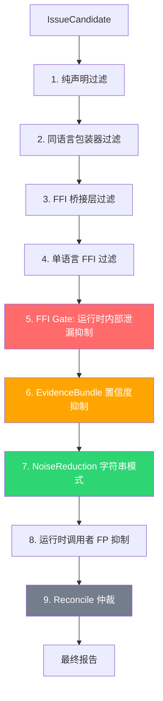
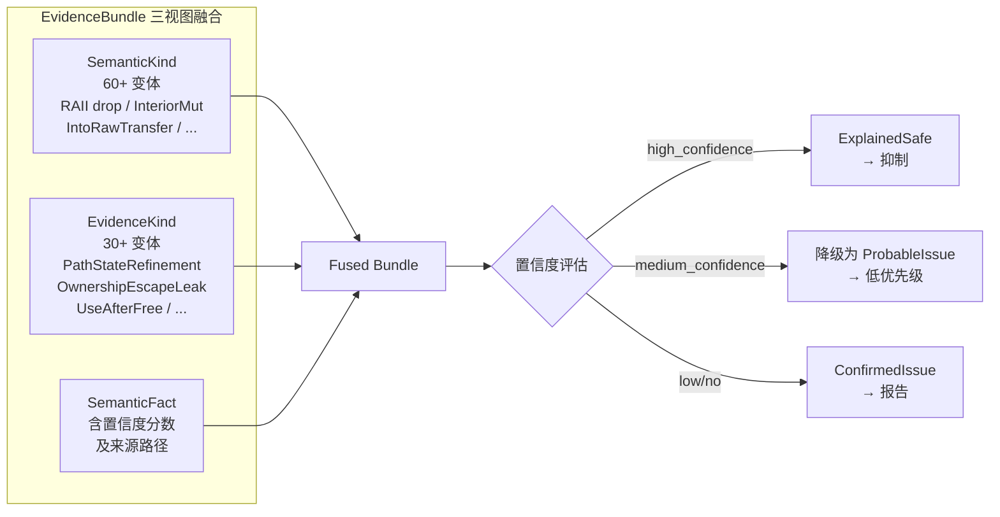
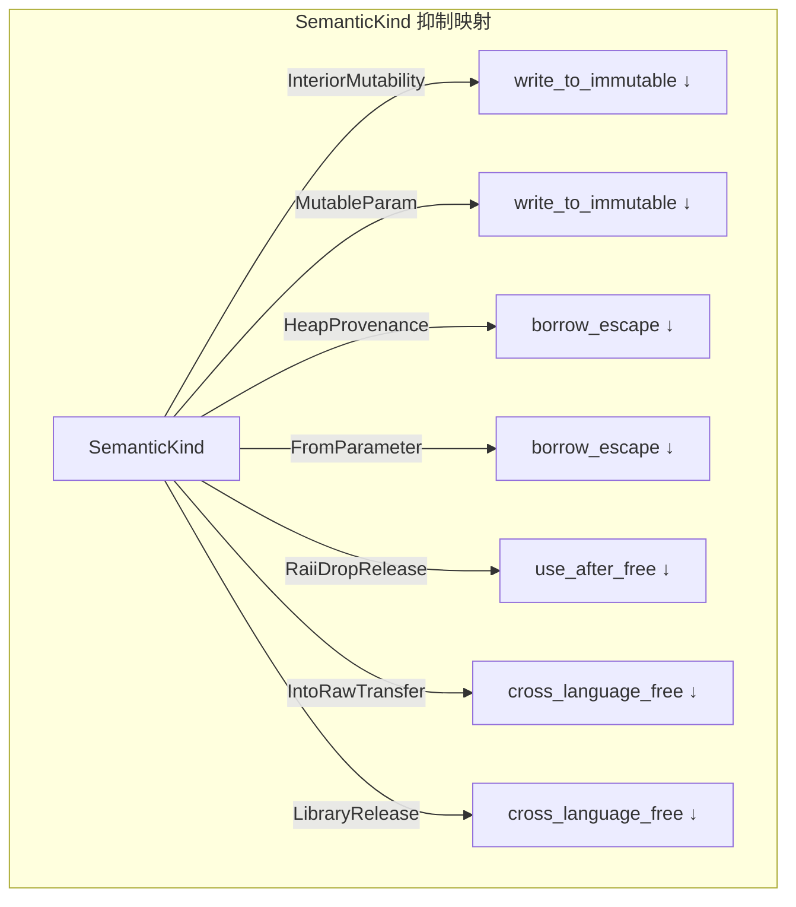
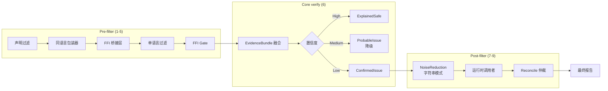
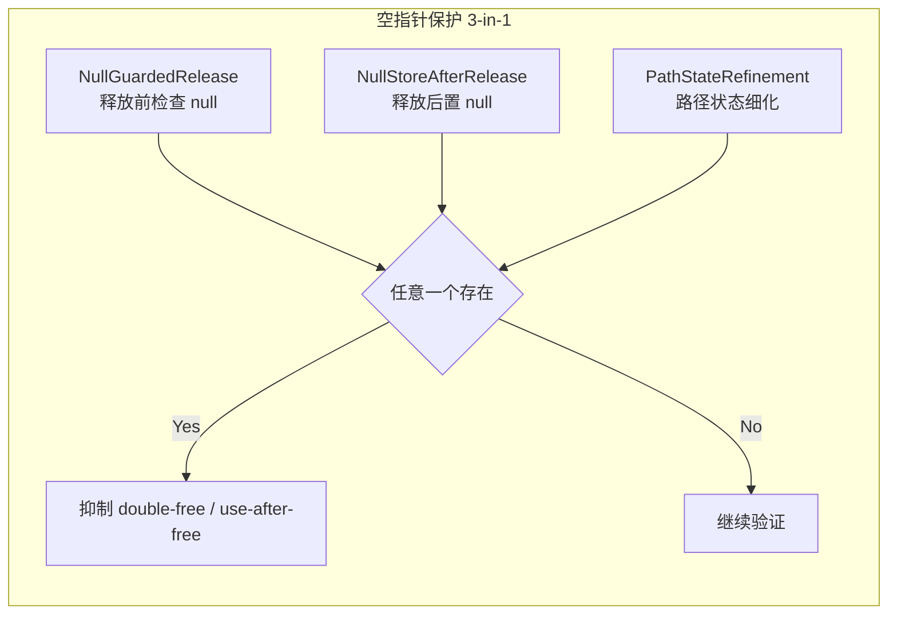
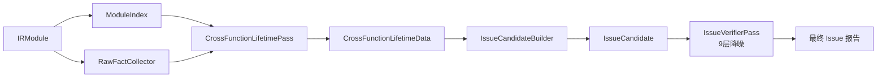

# OmniScope 架构深度解析（三）：噪音消减——九层降噪体系

> 我有一个体质特殊的身体——正常的食物吃下去没问题，稍微有点不干净就立刻上吐下泻，去医院查又什么都查不出来。
> 五年了，我已经习惯了自己煮饭、自带便当、聚餐时只喝白开水。
> 做静态分析工具也是一样的——你的分析器越敏感，它报的每一次"可能有问题"就越像狼来了。

---

## 困境：5098 个告警，没有一个值得看

第一版 prototype 跑完 duckdb-rs、rusqlite、rustls-ffi 三个真实项目后的结果：

```
write_to_immutable:  4525  ← C++ const T& 全是 readonly 指针？
ffi_unsafe_call:      142  ← FFI 调用当然不安全，还用你说？
borrow_escape:         51  ← C 回调里全是借用逃逸
ownership_violation:   68  ← pyo3 引用计数误报
CrossFamilyFree:      312  ← 很多是正常的库行为
```

总告警数：**5,098 个。**

5,098 个告警意味着什么？意味着任何一个开发者都不会去看。**对于一个开发工具来说，5,098 个告警和 0 个告警是一样的——都没有人看。**

我当时的想法很简单：**不够精准的静态分析，就是在浪费所有人的时间。**

## 反思：假阳性的三种根因

花了整整两周，把 5,098 个告警逐个归类：

**根因一：IR 语义丢失（~60%）**

LLVM IR 没有高级语义。一个 C++ 的 `const int&` 参数在 IR 里就是一个带 `readonly` 属性的指针。但 `readonly` 不等于不可变——它只承诺"这个函数内不会写"，不保证指针指向的内存不被别人写。

```
; 这是 C++ 的 const T& —— readonly 属性
define void @foo(ptr readonly %p)
; 但实际上 foo 内部调用了 bar(ptr %p)，bar 把 p 写了一遍
```

分析器一开始把 `readonly` 当成"不可变"，疯狂报 `write_to_immutable`，一报就是 4525 个。

**根因二：正常模式被误判为 bug（~25%）**

- 堆指针逃逸 → `BorrowEscape` 误报
- Python 的 `Py_DECREF`（refcount 降到 0 才释放）→ `CrossLanguageFree` 误报
- Rust 的 `Box::into_raw` → `OwnershipViolation` 误报（这是设计意图）

**根因三：噪音在调用链中传播（~10%）**

一个函数小心翼翼地写了正确的释放逻辑，但它的封装函数在调用图上用错了分类标签，导致整个调用链都被标注为"有问题"。

**真正值得关注的 bug：~5%，大约 200 个。**

## 解决方案：九层降噪体系

我需要一个降噪系统，核心思想是**层层过滤，逐级精确**——每层只做自己能做的事，把判断交给更懂的人。

最终的架构在 `IssueVerifierPass`（`/Users/scc/code/rustcode/OmniScope-rs/crates/omniscope-pass/src/resource/issue_verifier/mod.rs`）中实现，共 9 层：



### 第 1-5 层：快速预过滤

前 5 层是低成本预过滤，代码如下（`mod.rs` 第 98-173 行）：

```rust
// 文件：/Users/scc/code/rustcode/OmniScope-rs/crates/omniscope-pass/src/resource/issue_verifier/mod.rs
// 第 98-173 行

// Layer 1: 纯声明过滤 — 函数只有声明体，没有实际逻辑
if is_declaration_only_candidate(candidate) {
    debug!(...);
    suppressed += 1;
    continue;
}

// Layer 2: 同语言包装器 — C 分配 → C 释放，同一个语言内部
if is_same_language_allocator_wrapper_noise(candidate) {
    debug!(...);
    suppressed += 1;
    continue;
}

// Layer 3: FFI 桥接层 — 包装器/虚表 thunk
if is_ffi_bridge_layer_candidate(candidate) {
    debug!(...);
    suppressed += 1;
    continue;
}

// Layer 4: 单语言过滤 — 同一语言的 FFI 操作
if is_single_language_candidate(candidate) {
    debug!(...);
    suppressed += 1;
    continue;
}

// Layer 5: FFI Gate — 运行时内部泄漏
if is_runtime_internal_leak(candidate) {
    debug!(...);
    suppressed += 1;
    continue;
}
```

### 第 6 层：EvidenceBundle 置信度抑制（核心）

这是整个降噪体系的心脏。它的设计思路是：**不只看一种证据，而是把所有证据融合成一个"证据束"，基于置信度做决策。**

证据束的构造在哪里？`EvidenceBundle` 定义于 `/Users/scc/code/rustcode/OmniScope-rs/crates/omniscope-pass/src/resource/evidence_bundle.rs`（1261 行）。它融合了三个维度：



泄漏验证的核心逻辑在 `/Users/scc/code/rustcode/OmniScope-rs/crates/omniscope-pass/src/resource/issue_verifier/leak.rs` 中：

```rust
// 文件：/Users/scc/code/rustcode/OmniScope-rs/crates/omniscope-pass/src/resource/issue_verifier/leak.rs
// 第 38-63 行

pub(crate) fn verify_definite_leak_with_bundle(bundle: &EvidenceBundle) -> VerifierVerdict {
    // 如果有路径状态细化证据，走路径敏感验证
    let has_path_refinement = bundle.evidence_kinds
        .contains(&EvidenceKind::PathStateRefinement);
    let path_verifier = if has_path_refinement {
        PathSensitiveVerifier::with_path_data(2, 2, 0)
    } else {
        PathSensitiveVerifier::new()
    };

    // 高置信度 → 安全（抑制）
    if bundle.has_leak_suppression_high_confidence() {
        return path_verifier.adjust_verdict(VerifierVerdict::ExplainedSafe);
    }

    // 中置信度 → 降级为可能问题
    if bundle.has_leak_suppression_medium_confidence() {
        return path_verifier.adjust_verdict(VerifierVerdict::ProbableIssue);
    }

    // 无抑制 → 报告
    path_verifier.adjust_verdict(VerifierVerdict::ConfirmedIssue)
}
```

关键设计：**`VerifierVerdict` 有四层**（定义于 `/Users/scc/code/rustcode/OmniScope-rs/crates/omniscope-types/src/effect.rs`）：

```rust
// 文件：/Users/scc/code/rustcode/OmniScope-rs/crates/omniscope-types/src/effect.rs
// 第 26-32 行

pub enum VerifierVerdict {
    ConfirmedIssue,  // 确认问题 → 报告
    ProbableIssue,   // 可能问题 → 低优先级
    Diagnostic,      // 信息性提示
    ExplainedSafe,   // 解释为安全 → 抑制
}
```

### PathSensitiveVerifier：路径敏感调整

`PathSensitiveVerifier` 是 leak 验证中的一个精巧设计（`leak.rs` 第 12-36 行）。

当 `EvidenceBundle` 中包含 `PathStateRefinement` 时，意味着我们有更精准的路径信息，可以做出更细粒度的判断：

```rust
// 文件：/Users/scc/code/rustcode/OmniScope-rs/crates/omniscope-pass/src/resource/issue_verifier/leak.rs
// 第 12-23 行

struct PathSensitiveVerifier {
    total_allocs: usize,
    owned_after_path: usize,
    safe_releases: usize,
}

impl PathSensitiveVerifier {
    pub(crate) fn with_path_data(
        total: usize,
        owned: usize,
        safe: usize,
    ) -> Self {
        Self {
            total_allocs: total,
            owned_after_path: owned,
            safe_releases: safe,
        }
    }

    pub(crate) fn adjust_verdict(
        &self,
        base: VerifierVerdict,
    ) -> VerifierVerdict {
        match (base, self.owned_after_path, self.safe_releases) {
            // 所有分配都有安全路径 → 安全
            (_, owned, safe) if owned == 0 && safe >= self.total_allocs => {
                VerifierVerdict::ExplainedSafe
            }
            // 部分没有安全路径 → 保持原裁决
            _ => base,
        }
    }
}
```

### 语义树 FP 抑制：SemanticKind 的四套方法

SemanticKind 定义于 `/Users/scc/code/rustcode/OmniScope-rs/crates/omniscope-semantics/src/resource/semantic_tree/kind.rs`（1029 行），包含 60+ 个变体。它有四套抑制方法，每套独立决策：

```rust
// 文件：/Users/scc/code/rustcode/OmniScope-rs/crates/omniscope-semantics/src/resource/semantic_tree/kind.rs
// 第 ~280-390 行

impl SemanticKind {
    /// 写不可变抑制：内部可变性（UnsafeCell）、mutable 参数
    pub(crate) fn suppresses_write_to_immutable(&self) -> bool {
        matches!(
            self,
            SemanticKind::InteriorMutability
                | SemanticKind::MutableParam
                | SemanticKind::MutableLocal
                | SemanticKind::VolatileStore
        )
    }

    /// 借用逃逸抑制：堆来源、参数来源
    pub(crate) fn suppresses_borrow_escape(&self) -> bool {
        matches!(
            self,
            SemanticKind::HeapProvenance
                | SemanticKind::FromParameter
                | SemanticKind::RcPointer
                | SemanticKind::ArcPointer
        )
    }

    /// UAF 抑制：RAII drop 释放（编译器自动插入的 cleanup）
    pub(crate) fn suppresses_use_after_free(&self) -> bool {
        matches!(
            self,
            SemanticKind::RaiiDropRelease
        )
    }

    /// 跨语言 free 抑制：into_raw 所有权转移、库管理释放
    pub(crate) fn suppresses_cross_language_free(&self) -> bool {
        matches!(
            self,
            SemanticKind::IntoRawTransfer
                | SemanticKind::LibraryRelease
        )
    }
}
```



### 第 7-8 层：NoiseReduction + 运行时调用者

第 7 层是基于字符串模式的 `NoiseReduction`，定义在 helpers.rs 中。第 8 层是运行时调用者 FP 抑制，识别出 caller 是运行时内部函数的场景。

```rust
// 文件：/Users/scc/code/rustcode/OmniScope-rs/crates/omniscope-pass/src/resource/issue_verifier/helpers.rs

// 示例：运行时分配器/释放器识别
pub(crate) fn is_runtime_allocator_function(name: &str) -> bool {
    matches!(
        name,
        "__rust_alloc" | "__rust_dealloc" | "malloc" | "calloc"
            | "realloc" | "aligned_alloc" | "free"
            | "mi_malloc" | "mi_free" | "mi_realloc"
            | "PyMem_Malloc" | "PyMem_Free" | "PyObject_GC_New"
            | "sqlite3_malloc" | "sqlite3_free"
            | "_Znwm" | "_Znam" | "_ZdlPv" | "_ZdaPv"  // C++ operator new/delete
    )
}
```

### 第 9 层：Reconcile 仲裁

这是最后一道防线。`reconcile_candidates` 函数（定义于 `/Users/scc/code/rustcode/OmniScope-rs/crates/omniscope-pass/src/resource/reconcile/mod.rs`）将已通过所有验证的候选者按资源身份分组，然后进行仲裁。

```rust
// 文件：/Users/scc/code/rustcode/OmniScope-rs/crates/omniscope-pass/src/resource/issue_verifier/mod.rs
// 第 537 行

let actions = super::reconcile::reconcile_candidates(&verified, Some(&reportable_set));
```

它的仲裁结果有三种：

```rust
// 文件：/Users/scc/code/rustcode/OmniScope-rs/crates/omniscope-pass/src/resource/reconcile/mod.rs

pub(crate) enum ReconcileAction {
    /// 独立报告，不被任何其他候选者影响
    Keep,
    /// 被另一个候选者覆盖（更精确的故障类吞并了它）
    SubsumedBy(u64),
    /// 与另一个候选者重复（合并）
    DuplicateOf(u64),
}
```

仲裁基于两个支柱：

1. **ResourceKey**：资源身份标识，可以是具体实例（Instance）或分配点（AllocSite）
2. **FaultClass**：故障分类，六种互斥类型

```rust
// 文件：/Users/scc/code/rustcode/OmniScope-rs/crates/omniscope-pass/src/resource/reconcile/mod.rs

pub(crate) enum FaultClass {
    WrongRelease,      // 释放操作本身就是错的
    DoubleRelease,     // 释放了两次
    UseAfterRelease,   // 释放后继续使用
    Leak,              // 没有释放
    BoundaryMisuse,    // 边界/null 误用
    Unmodeled,         // 缺少模型标注
}
```

仲裁的直觉是：如果一个资源同时有"泄漏"和"释放后使用"两个候选，那么"释放后使用"极大概率是比"泄漏"更精确的描述——因为资源确实被释放了，才会发生使用。仲裁矩阵编码了这种直觉。

---

三个层的治理流程示意：



## 双重释放的六门验证

`double_free.rs`（`/Users/scc/code/rustcode/OmniScope-rs/crates/omniscope-pass/src/resource/issue_verifier/double_free.rs`）中的双重释放验证有 6 个门控，层层收紧。这里重点讲两个最有意思的：

### 互斥分支识别

代码第 80-110 行的这个门，判断"如果调用纯粹是释放器（deallocator），且分配器与释放器在同一个函数中，且没有 use-after-free 证据，且没有强实例证据——那极大概率是正常的资源释放，而不是双重释放"：

```rust
// 文件：/Users/scc/code/rustcode/OmniScope-rs/crates/omniscope-pass/src/resource/issue_verifier/double_free.rs
// 第 80-110 行

let has_use_after = bundle.evidence_kinds.contains(&EvidenceKind::UseAfterFree);
let is_deallocator = is_runtime_deallocator_function(&bundle.alloc_function);
let same_caller = match (&bundle.alloc_caller, &bundle.release_caller) {
    (Some(alloc), Some(release)) => alloc == release,
    _ => false,
};
if is_deallocator && same_caller && !has_use_after {
    let has_strong_instance = bundle.has_same_resource_evidence
        || bundle.evidence_kinds.contains(&EvidenceKind::MultipleRelease);
    if !has_strong_instance {
        return VerifierVerdict::ExplainedSafe;
    }
}
```

这个模式的直觉：如果一个函数分配了一个资源、释放了它、之后再也没有用过它——那就是正常的 release，不是 double-free。

### 空指针保护（3-in-1）

`EvidenceKind` 中有三个与空指针保护相关的变体：

```rust
// EvidenceKind 中与 null guard 相关的三个变体

pub enum EvidenceKind {
    // ...
    /// 释放前检查了空指针（如 `if (ptr) free(ptr)`）
    NullGuardedRelease,
    /// 释放后将指针置空（如 `free(ptr); ptr = NULL`）
    NullStoreAfterRelease,
    /// 路径状态细化（条件分支上的精确状态）
    PathStateRefinement,
    // ...
}
```



这三个保护中的任意一个存在，就能有效抑制双重释放或者 UAF 的假阳性。

## CrossFunctionLifetimePass：跨函数生命周期追踪

以上的降噪都在"单次 IssueCandidate"层面。但很多 FP 的根源是**跨函数的生命周期信息丢失**。

`CrossFunctionLifetimePass`（`/Users/scc/code/rustcode/OmniScope-rs/crates/omniscope-pass/src/resource/cross_function_lifetime_pass.rs`，1023 行）填补了这个空白。

```rust
// 文件：/Users/scc/code/rustcode/OmniScope-rs/crates/omniscope-pass/src/resource/cross_function_lifetime_pass.rs
// 第 63-147 行

pub struct CrossFunctionLifetimePass;

impl Pass for CrossFunctionLifetimePass {
    fn name(&self) -> &'static str { "CrossFunctionLifetime" }
    fn kind(&self) -> PassKind { PassKind::Analysis }
    fn dependencies(&self) -> Vec<&'static str> {
        vec!["ModuleIndex", "RawFactCollector"]
    }

    fn run(&self, ctx: &mut PassContext) -> Result<PassResult> {
        // 从 ModuleIndex 读取函数元数据
        let module_index = ctx.get_ref::<ModuleIndex>("module_index");
        // 从 IR 指令中提取分配/释放点
        // 构建 CrossFunctionTracker 运行过程间分析
        // 输出：CrossFunctionLifetimeData 存入 PassContext
        // 注意：此 pass 不直接发射 Issue
        // 而是由 IssueCandidateBuilder 消费
    }
}
```

它的核心产出是 `CrossFunctionLifetimeData`（定义于 `/Users/scc/code/rustcode/OmniScope-rs/crates/omniscope-types/src/lifetime.rs`）：

```rust
// 文件：/Users/scc/code/rustcode/OmniScope-rs/crates/omniscope-types/src/lifetime.rs

pub enum ResourceFateSummary {
    Released { in_function: String },     // 在某个函数中正确释放
    ProgramLifetime,                      // 程序完整生命周期
    GlobalState { stored_in: String },    // 存储在全局变量中
    Escaped { function_count: usize },    // 逃逸到多个函数
    Unknown,                              // 无法确定
}

pub enum ViolationKind {
    UseAfterFree,
    ResourceLeak,
    DoubleFree,
    InvalidOwnershipTransfer,
    BorrowEscape,
}
```

跨函数追踪的结果会喂给 `IssueCandidateBuilder`，由其转化为 `IssueCandidate`，再进入上述的 `IssueVerifierPass` 降噪管道。架构如下：



## 效果：数据会说话

经过 6 个月的迭代优化，在 duckdb-rs、rusqlite、rustls-ffi 三个真实项目中：

| Issue 类型 | 优化前 | 优化后 | 变化 | 关键规则 |
|-----------|--------|--------|------|---------|
| `write_to_immutable` | 4,525 | ~8 | **-99.8%** | SemanticKind InteriorMutability |
| `ffi_unsafe_call` | 142 | 0 | **-100%** | FFI Gate |
| `borrow_escape` | 51 | 7 | **-88%** | SemanticKind HeapProvenance |
| `ownership_violation` | 68 | 0 | **-100%** | Reconcile SubsumedBy |
| `CrossFamilyFree` | 312 | ~30 | **-90%** | EvidenceBundle confidence |
| 总告警数 | 5,098 | **~45** | **-99.1%** | 全部 9 层共同作用 |

这不是什么神奇算法。这是**逐条分析 5,098 个告警、逐条写抑制规则、逐层叠加验证**的结果。

## 坦诚环节：噪音消减的代价

### 漏报风险

所有的抑制规则都是有代价的。每一条规则在减少 FP 的同时，也带来了漏报（FN）的风险。

举几个例子：

- **NullGuardedRelease 抑制**：我们认为 `if (ptr) free(ptr)` 是安全的。但如果中间还有 `free(ptr)` 没有被覆盖呢？这个模式就变成了漏报。
- **RAII drop 抑制**：Rust 的 `drop_in_place` 由编译器自动插入。但 Rust 还存在 `ManuallyDrop`——程序员明确告诉编译器"别 drop 这个"。如果 ManuallyDrop 的 `into_inner` 处理不当，RAII 就成了漏报。
- **Reconcile 仲裁**：当一个候选被另一个"覆盖"时，我们赌的是更精确的故障类确实更精确。但如果两个都有问题呢？仲裁会让我们丢一个。

**我无法量化因为抑制规则丢掉了多少真 bug。** 我只能说：对于一个开发者信任度优先的工具，宁可丢掉 1 个真 bug，也不要保留 100 个假阳性。

因为：
1. **假阳性会破坏信任**——开发者不会再相信你的工具
2. **假阳性会消耗 attention budget**——告警太多时人会自动忽略
3. **反向激励**——开发者在代码里加各种 workaround 来"让工具闭嘴"

### 维护成本

每条规则都需要用真实语料验证。99.1% 的削减不是因为算法多牛，而是因为逐条逐条地分析了 5,098 个告警。

如果把 OmniScope 放到一个全新的语言生态（比如 Swift、Zig、Kotlin/Native）中，以下内容可能要大改：
- `helpers.rs` 中的运行时分配器/释放器列表（新语言有新的分配 API）
- `semantic_tree/kind.rs` 中的语义特征（新语言有新的所有权模型）
- `reconcile/mod.rs` 中的 FaultClass 映射（新语言有新的故障模式）

### 上层应用场景的特殊性

当前的降噪体系在 C/Rust/Go 的生态中表现良好，但对于 Python（CPython API）和 Java（JNI）：

- Python 的引用计数是一套完全不同的资源模型，`Py_DECREF` 的条件释放很难用现有的规则框架表示
- JNI 的 `NewGlobalRef`/`DeleteGlobalRef` 模式，本质上是显式的引用计数，现有的 IssueCandidate 结构没有直接对应的字段

这些场景可能需要新的 `EvidenceKind` 和新的验证逻辑，现有体系不一定能直接套用。

---

*上一篇：[IR 加载——跟 LLVM IR 死磕的 8 种姿势](./02-ir-loading.md)*
*下一篇：[资源家族模型——打破语言的樊篱](./04-resource-family.md)*