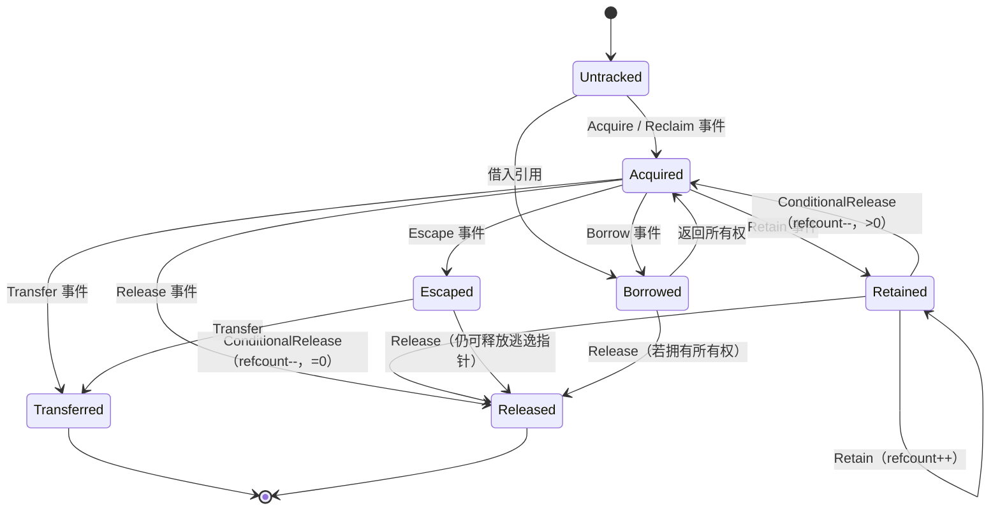
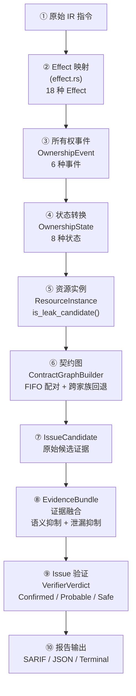

# OmniScope 架构深度解析（四）：资源家族——从 Effect 到证据链的完整管道

> "一个工具只懂 C 语言的 malloc/free，却要分析跨 Rust、C++、Python、Java 的资源传递。后来我发现，问题不在于语言，而在于资源家族（Resource Family）——这是连接 Effect 枚举、所有权状态机、内存图、证据融合的事实管道。"

---

## 困境：Effect 枚举——分析器需要一种原子语言

在 OmniScope 早期，识别函数行为靠函数名匹配。看到 `free` 就知道是释放，看到 `malloc` 就知道是分配。

这套模式很快就崩了。因为要处理的函数有几百种：

- 分配的变体：`alloc`、`malloc`、`calloc`、`realloc`、`_Znwm`、`__rust_alloc`、`PyMem_Malloc`、`HeapAlloc`……
- 释放的变体：`free`、`delete`、`__rust_dealloc`、`PyMem_Free`、`HeapFree`、`inflateEnd`……
- 还有各种边界情况：条件释放、refcount 增减、所有权转移、逃逸、强转……

每个函数名到行为的映射是混乱的、难以维护的、无法推理的。

我意识到：**需要一套原子语义原语来描述任何函数的所有权行为。**

这就是 `Effect` 枚举的由来，定义在 `crates/omniscope-types/src/effect.rs`：

```rust
/// 函数调用的所有权效应——分析器的原子语义原语
///
/// 每个 IR 调用点都被映射到一个或多个 Effect，描述该调用
/// 对资源所有权产生的影响。这是连接 IR 分析和所有权推理的桥梁。
#[derive(Debug, Clone, PartialEq, Eq, Hash)]
pub enum Effect {
    /// 明确的资源获取（分配）
    Acquire { family: FamilyId, result: u64 },

    /// 明确的资源释放
    Release { family: FamilyId, arg: u64 },

    /// 条件释放——仅当 refcount 归零时释放
    ConditionalRelease { family: FamilyId, arg: u64 },

    /// refcount 增加——资源被保留
    Retain { family: FamilyId, arg: u64, result: u64 },

    /// 函数返回时资源归调用者所有
    ReturnsOwned { family: FamilyId, result: u64 },

    /// 函数返回时资源归借给调用者
    ReturnsBorrowed { family: FamilyId, result: u64 },

    /// 调用消耗了一个参数的所有权
    ConsumesArg { family: FamilyId, arg: u64 },

    /// 资源被存储到某一个拥有的容器对象中
    StoresArgToOwner { family: FamilyId, arg: u64 },

    /// 资源被存储到全局状态中
    StoresArgToGlobal { family: FamilyId, arg: u64 },

    /// 输出参数被初始化
    InitializesOutParam { family: FamilyId, arg: u64 },

    /// 资源通过回调函数逃逸
    EscapesToCallback { family: FamilyId, arg: u64 },

    /// 显式所有权逃逸（如 Box::into_raw）
    OwnershipEscape { family: FamilyId, arg: u64 },

    /// 所有权回收（如 Box::from_raw）
    OwnershipReclaim { family: FamilyId, result: u64 },

    /// 跨语言释放（分配家族 != 释放家族）
    CrossLanguageFree {
        alloc_family: FamilyId,
        release_family: FamilyId,
        arg: u64,
    },

    /// 空指针守卫释放——仅当指针不为空时释放
    NullGuardedRelease { family: FamilyId, arg: u64 },

    /// 成功路径下输出参数归调用者所有
    OutParamOwnedOnSuccess { family: FamilyId, arg: u64 },

    /// 错误路径下输出参数为空
    OutParamNullOnError { family: FamilyId, arg: u64 },

    /// 释放后存储为空（use-after-free 防护）
    NullStoreAfterRelease { family: FamilyId, arg: u64 },
}
```

这 18 个变体覆盖了我在真实世界中见过的每一种资源行为模式。每个 Effect 都附带 `family` 信息（资源属于哪个家族）和 `arg`/`result`（哪个参数或返回值涉及）。

此外，每个 Effect 还有一些分类方法，用于快速判断其语义大类：

```rust
impl Effect {
    /// 这个 effect 是否代表资源获取？
    pub fn is_acquire(&self) -> bool {
        matches!(self, Effect::Acquire { .. } | Effect::OwnershipReclaim { .. })
    }

    /// 这个 effect 是否代表资源释放？
    pub fn is_release(&self) -> bool {
        matches!(self,
            Effect::Release { .. }
            | Effect::ConditionalRelease { .. }
            | Effect::CrossLanguageFree { .. }
            | Effect::NullGuardedRelease { .. }
        )
    }

    /// 这个 effect 是否代表 refcount 保留？
    pub fn is_retain(&self) -> bool {
        matches!(self, Effect::Retain { .. })
    }

    /// 这个 effect 是否代表所有权逃逸（不是释放）？
    pub fn is_ownership_escape(&self) -> bool {
        matches!(self, Effect::OwnershipEscape { .. } | Effect::OwnershipReclaim { .. })
    }

    /// 这个 effect 所属的资源家族
    pub fn family(&self) -> Option<FamilyId> {
        match self {
            Effect::Acquire { family, .. }
            | Effect::Release { family, .. }
            | Effect::ConditionalRelease { family, .. }
            | Effect::Retain { family, .. }
            | Effect::ReturnsOwned { family, .. }
            | Effect::ReturnsBorrowed { family, .. }
            | Effect::ConsumesArg { family, .. }
            | Effect::StoresArgToOwner { family, .. }
            | Effect::StoresArgToGlobal { family, .. }
            | Effect::InitializesOutParam { family, .. }
            | Effect::EscapesToCallback { family, .. }
            | Effect::OwnershipEscape { family, .. }
            | Effect::OwnershipReclaim { family, .. }
            | Effect::CrossLanguageFree { .. }
            | Effect::NullGuardedRelease { family, .. }
            | Effect::OutParamOwnedOnSuccess { family, .. }
            | Effect::OutParamNullOnError { family, .. }
            | Effect::NullStoreAfterRelease { family, .. } => Some(*family),
        }
    }
}
```

有了 Effect 这套原子语言，每个 IR 调用点都被标注为"Acquire"或"Release"或"Retain"等。这是所有权分析的第一步，也是最重要的一步。没有这一层抽象，后面的所有权状态机、内存图、证据融合都没法做。

---

## 所有权状态机：从 Effect 到资源生命周期

Effect 描述了**单个调用点的行为**。但一个资源的生命周期跨越多个调用点：分配 → 传递 → 释放。为了跟踪这种跨调用的状态转换，我设计了一个有限状态机。

定义在 `crates/omniscope-semantics/src/resource/ownership_state.rs`：

```rust
/// 资源实例的所有权状态——有限状态机的节点
#[derive(Debug, Clone, Copy, PartialEq, Eq, Hash)]
pub enum OwnershipState {
    /// 未跟踪——初始状态，资源尚未被识别
    Untracked,
    /// 已获取——资源已被分配，所有权在当前作用域
    Acquired,
    /// 已释放——资源已被释放，指针已失效
    Released,
    /// 已逃逸——资源所有权已转让出当前作用域
    Escaped(EscapeKind),
    /// 已转移——所有权已转移给另一个函数
    Transferred,
    /// 已保留——refcount 已增加，仍在当前作用域
    Retained,
    /// 已借用——仅借用指针，不拥有所有权
    Borrowed,
    /// 未知——无法推断当前所有权状态
    Unknown,
}

/// 逃逸类型
#[derive(Debug, Clone, Copy, PartialEq, Eq, Hash)]
pub enum EscapeKind {
    /// 通过 into_raw 逃逸
    OwnershipEscape,
    /// 存储到全局状态
    GlobalEscape,
    /// 通过回调逃逸
    CallbackEscape,
}
```

### 事件定义

状态转换由 6 种事件触发，每个事件对应一种 Effect 的语义抽象：

```rust
/// 所有权事件——驱动状态转换的输入
#[derive(Debug, Clone, Copy, PartialEq, Eq, Hash)]
pub enum OwnershipEvent {
    /// 资源被释放（包含跨语言释放）
    Release,
    /// 条件释放（refcount 减量）
    ConditionalRelease,
    /// 资源逃逸（所有权转让）
    Escape,
    /// 所有权转移
    Transfer,
    /// refcount 增加（保留）
    Retain,
    /// 借出所有权
    Borrow,
}
```

### 状态转换规则



这个状态机的核心逻辑在 `ResourceInstance::transition()` 方法中实现：

```rust
/// 资源实例——跟踪单个资源的所有权状态
#[derive(Debug, Clone)]
pub struct ResourceInstance {
    /// 实例唯一标识
    pub id: u64,
    /// 所属资源家族
    pub family: FamilyId,
    /// 当前所有权状态
    pub state: OwnershipState,
    /// 指针契约（拥有的/借用的/原始指针）
    pub contract: PointerContract,
    /// 获取资源的作用域 ID
    pub acquired_in: Option<u64>,
    /// 释放资源的作用域 ID
    pub released_in: Option<u64>,
    /// 所属函数名（用于诊断）
    pub function_name: String,
}

impl ResourceInstance {
    /// 应用所有权事件，驱动状态转换
    ///
    /// # 转换规则
    /// | 当前状态 | 事件          | 新状态         | 说明                     |
    /// |---------|--------------|---------------|--------------------------|
    /// | Untracked | Acquire     | Acquired      | 首次识别资源               |
    /// | Acquired  | Release     | Released      | 正常释放                   |
    /// | Acquired  | Escape      | Escaped       | 所有权逃逸                 |
    /// | Acquired  | Transfer    | Transferred   | 所有权转移                 |
    /// | Acquired  | Retain      | Retained      | refcount 增加              |
    /// | Acquired  | Borrow      | Borrowed      | 仅借用                     |
    /// | Retained  | ConditionalRelease | Acquired | refcount-- >0，仍在作用域 |
    /// | Retained  | ConditionalRelease | Released | refcount-- ==0，释放资源  |
    /// | Retained  | Retain      | Retained      | refcount 再次增加           |
    /// | ...       | ...         | OwnershipError | 非法转换                  |
    pub fn transition(&mut self, event: OwnershipEvent) -> Result<(), OwnershipError> {
        let new_state = match (self.state, event) {
            (OwnershipState::Untracked, OwnershipEvent::Transfer) => {
                OwnershipState::Acquired
            }
            (OwnershipState::Untracked, OwnershipEvent::Borrow) => {
                OwnershipState::Borrowed
            }
            // 获取 → 后续事件
            (OwnershipState::Acquired, OwnershipEvent::Release) => {
                self.released_in = self.acquired_in;
                OwnershipState::Released
            }
            (OwnershipState::Acquired, OwnershipEvent::Escape) => {
                OwnershipState::Escaped(EscapeKind::OwnershipEscape)
            }
            (OwnershipState::Acquired, OwnershipEvent::Transfer) => {
                OwnershipState::Transferred
            }
            (OwnershipState::Acquired, OwnershipEvent::Retain) => {
                OwnershipState::Retained
            }
            (OwnershipState::Acquired, OwnershipEvent::Borrow) => {
                OwnershipState::Borrowed
            }
            // Retained 状态的特殊逻辑
            (OwnershipState::Retained, OwnershipEvent::ConditionalRelease) => {
                // 条件释放后仍在作用域——refcount > 0
                OwnershipState::Acquired
            }
            (OwnershipState::Retained, OwnershipEvent::Retain) => {
                OwnershipState::Retained
            }
            // ... 更多转换规则
            _ => return Err(OwnershipError::InvalidTransition(self.state, event)),
        };
        self.state = new_state;
        Ok(())
    }

    /// 判断此资源实例是否为疑似泄漏
    ///
    /// 仅在 Acquired 或 Retained 状态时可能是泄漏 ——
    /// 这两种状态表示资源分配后从未释放或被跟踪释放。
    pub fn is_leak_candidate(&self) -> bool {
        matches!(self.state, OwnershipState::Acquired | OwnershipState::Retained)
    }

    /// 创建一个已借用的资源实例（用于参数传入场景）
    pub fn new_borrowed(id: u64, family: FamilyId, function_name: &str) -> Self {
        Self {
            id,
            family,
            state: OwnershipState::Borrowed,
            contract: PointerContract::Borrowed,
            acquired_in: None,
            released_in: None,
            function_name: function_name.to_string(),
        }
    }
}
```

### 错误类型

无效的状态转换会导致 `OwnershipError`：

```rust
/// 所有权状态转换错误
#[derive(Debug, Clone, PartialEq, Eq)]
pub enum OwnershipError {
    /// 重复释放
    DoubleRelease,
    /// 释放借用的指针（不是拥有的）
    ReleaseBorrowed,
    /// 无效的状态转换
    InvalidTransition(OwnershipState, OwnershipEvent),
}
```

这套状态机有 20+ 个测试用例覆盖各种转换路径。关键测试包括：

- 正常获取→释放路径：`Untracked → Acquired → Released`
- 条件释放路径：`Acquired → Retained → Acquired → Released`
- 错误路径：`Borrowed → Release → ReleaseBorrowed`
- 跨函数转移路径：`Acquired → Transferred`

没有这套状态机，分析器无法回答"这个资源到底释放了没有"这个核心问题。

---

## MemoryGraph：从所有权到内存状态的多维度视图

所有权状态机解决了"每个资源处于什么状态"的问题。但一个分析会话中可能有成百上千个资源实例，它们之间还有分配和释放关系、别名关系、FFI 边界穿越关系。需要一个全局的数据结构来组织这些信息。

这就是 `MemoryGraph`，定义在 `crates/omniscope-semantics/src/resource/memory_graph.rs`：

```rust
/// 资源内存图——跟踪所有资源的多维度状态
///
/// 图的两种节点类型：
/// - MemoryNode：每个资源实例对应一个节点
/// - MemoryEdge：表示两个资源之间的关系
///
/// 支持的操作：
/// - add_node/get_node：增删改查节点
/// - set_state：更新资源状态
/// - find_by_value/register_value：值和节点的双向映射
/// - edges_of_kind/edges_from/edges_to：按类型/源/目标查询边
#[derive(Debug, Clone)]
pub struct MemoryGraph {
    /// 资源节点列表
    pub nodes: Vec<MemoryNode>,
    /// 资源关系边列表
    pub edges: Vec<MemoryEdge>,
    /// LLVM 值到资源 ID 的映射
    value_to_resource: HashMap<u64, usize>,
}
```

### ResourceClass：资源的物理类型

```rust
/// 资源类——描述资源的物理管理方式
#[derive(Debug, Clone, Copy, PartialEq, Eq, Hash)]
pub enum ResourceClass {
    /// 堆内存（malloc/free 风格）
    HeapMemory,
    /// 运行时托管（GC、引用计数、arena）
    RuntimeManaged,
    /// 引用计数管理（Rc、Arc、COM）
    RefCounted,
    /// 句柄类资源（文件描述符、socket）
    HandleBased,
    /// 互斥锁/同步原语
    MutexLock,
    /// 线程/进程相关
    ProcessBound,
    /// 库管理的资源（zlib stream、SSL context）
    LibraryManaged,
    /// 用户自定义
    UserManaged,
}
```

家族到资源类的映射是静态决定的：

```rust
pub fn family_to_resource_class(family: FamilyId) -> ResourceClass {
    match family {
        FamilyId::FILE_DESCRIPTOR => ResourceClass::HandleBased,
        FamilyId::MUTEX_LOCK => ResourceClass::MutexLock,
        FamilyId::PROCESS_BOUND => ResourceClass::ProcessBound,
        FamilyId::GO_GC | FamilyId::JAVA_LOCAL_REF | FamilyId::JAVA_GLOBAL_REF => {
            ResourceClass::RuntimeManaged
        }
        FamilyId::CSHARP_COM | FamilyId::CPP_NEW_SCALAR | FamilyId::CPP_NEW_ARRAY => {
            ResourceClass::RefCounted
        }
        FamilyId::ZLIB_STREAM | FamilyId::OPENSSL_RESOURCE | FamilyId::SQLITE_RESOURCE => {
            ResourceClass::LibraryManaged
        }
        _ => ResourceClass::HeapMemory,
    }
}
```

这个映射是关键的——因为资源类决定了分析策略。例如：
- `RuntimeManaged` 类的资源（Go GC、Java 引用）永远不会产生泄漏
- `LibraryManaged` 类的资源（zlib stream、SSL 上下文）需要特定释放函数
- `HandleBased` 类的资源（文件描述符）有独立的 release 模式

### ResourceState 和 MemoryEdgeKind

```rust
/// 资源状态——资源实例的细粒度物理状态
#[derive(Debug, Clone, Copy, PartialEq, Eq, Hash)]
pub enum ResourceState {
    Owned, Shared, Moved, Freed, Escaped, Unknown, Retained, Leaked, Locked,
}

/// 内存边类型——描述资源节点间的关系
#[derive(Debug, Clone, Copy, PartialEq, Eq, Hash)]
pub enum MemoryEdgeKind {
    Allocation, Deallocation, OwnershipTransfer, Alias,
    PointerProjection, StoreToContainer, LoadFromContainer,
    Escape, CrossModule,
}
```

### MemoryNode 和 MemoryEdge

```rust
#[derive(Debug, Clone)]
pub struct MemoryNode {
    pub id: u64,
    pub resource_class: ResourceClass,
    pub state: ResourceState,
    pub function_name: String,
    pub family_id: Option<FamilyId>,
}

#[derive(Debug, Clone)]
pub struct MemoryEdge {
    pub source: u64,
    pub target: u64,
    pub kind: MemoryEdgeKind,
    pub function_name: String,
}
```

### MemoryGraph 的核心 API

```rust
impl MemoryGraph {
    pub fn new() -> Self;
    pub fn add_node(&mut self, node: MemoryNode) -> usize;
    pub fn get_node(&self, id: u64) -> Option<&MemoryNode>;
    pub fn get_node_mut(&mut self, id: u64) -> Option<&mut MemoryNode>;
    pub fn set_state(&mut self, id: u64, state: ResourceState) -> bool;
    pub fn find_by_value(&self, value: u64) -> Option<usize>;
    pub fn register_value(&mut self, value: u64, node_idx: usize);
    pub fn edges_of_kind(&self, kind: MemoryEdgeKind) -> Vec<&MemoryEdge>;
    pub fn edges_from(&self, source: u64) -> Vec<&MemoryEdge>;
    pub fn edges_to(&self, target: u64) -> Vec<&MemoryEdge>;
}
```

下游分析可以灵活查询资源图：

```rust
// 查询所有逃逸边
let escape_edges = memory_graph.edges_of_kind(MemoryEdgeKind::Escape);

// 追踪特定资源的所有别名
let aliases = memory_graph.edges_from(resource_id)
    .iter()
    .filter(|e| e.kind == MemoryEdgeKind::Alias)
    .collect::<Vec<_>>();

// 检查资源是否已被释放
if memory_graph.get_node(resource_id)
    .map(|n| n.state == ResourceState::Freed)
    .unwrap_or(false)
{
    // 已释放
}
```

```mermaid
flowchart LR
    subgraph "MemoryGraph 示例"
        N1["Node #1
             ResourceClass: HeapMemory
             State: Owned
             Family: C_HEAP"] -- "Allocation" --> N2["Node #2
             ResourceClass: HeapMemory
             State: Owned
             Family: C_HEAP"]
        N2 -- "Alias" --> N3["Node #3
             ResourceClass: HeapMemory
             State: Shared
             Family: C_HEAP"]
        N2 -- "OwnershipTransfer" --> N4["Node #4
             ResourceClass: HeapMemory
             State: Moved
             Family: C_HEAP"]
        N2 -- "Deallocation" --> N5["Node #5
             ResourceClass: HeapMemory
             State: Freed
             Family: C_HEAP"]
        "Escape" --> N6["Node #6
             ResourceClass: HeapMemory
             State: Escaped
             Family: C_HEAP"]
    end
```

---

## ContractGraphBuilder：从 Effect 到资源契约图

Effect 只描述单个调用点的行为。所有权状态机只跟踪单个资源。但真实项目中，几十个函数通过 FFI 相互调用，资源可能在模块 A 分配、在模块 B 释放、在模块 C 逃逸。

为了跨函数跟踪资源契约，我实现了 `ContractGraphBuilder`（定义在 `crates/omniscope-pass/src/resource/contract_graph_builder.rs`）：

```rust
/// 资源契约图——跨函数跟踪分配/释放/转移/逃逸关系
pub struct ContractGraph {
    /// 所有契约边
    pub edges: Vec<ContractEdge>,
    /// 资源实例 ID 计数器
    next_instance_id: u64,
    /// FFI 边界定义
    pub ffi_boundaries: HashMap<String, FFIBoundary>,
}

/// 契约边——连接两个资源事件的有向边
#[derive(Debug, Clone)]
pub struct ContractEdge {
    pub source: u64,          // 源资源实例 ID
    pub target: u64,          // 目标资源实例 ID（0 = sink 节点）
    pub effect: Effect,       // 创建此边的 Effect
    pub function: FunctionId, // 所在函数
    pub function_name: String, // 被调用者名
    pub caller_name: String,  // 调用者名（用于诊断定位）
    pub family: Option<FamilyId>,
    pub boundary_evidence: Option<Vec<BoundaryEvidence>>,
}
```

### 核心配对算法：FIFO Acquire→Release 配对

构建契约图的核心算法是 FIFO acquire→release 配对。每个 `(func_id, family)` 键维护一个 VecDeque 队列：

```rust
// (func_id, family) → VecDeque<(instance_id, alloc_family)>
let mut acquire_instances: HashMap<(u64, FamilyId), VecDeque<AcquireEntry>>;

for fact in &raw_facts {
    let family = fact.family.unwrap_or(FamilyId::C_HEAP);
    let key = (fact.function, family);

    if fact.is_acquire {
        // 新分配 → 创建实例并压入队列
        let instance_id = graph.alloc_instance();
        graph.add_edge(ContractEdge { source: 0, target: instance_id, ... });
        acquire_instances.entry(key).or_default().push_back((instance_id, Some(family)));
    } else {
        // 释放 → 从队列中弹出最早的分配（FIFO）
        if let Some(instances) = acquire_instances.get_mut(&key) {
            if let Some((sid, af)) = instances.pop_front() {
                // 同家族正常匹配
            }
        }
        // 跨家族回退匹配（6 个条件控制）
    }
}
```

### 跨家族回退匹配

当同家族匹配不可用时（如 `malloc → operator delete`），触发 6 个条件的受控回退：

```rust
// 6 个条件（全部必须满足）：
// 1. 同一函数作用域 — 由循环结构保证
// 2. 释放发生在获取之后 — 由事实顺序保证
// 3. 两个家族都是已知的 — 都不是 UNKNOWN
// 4. 家族不兼容 — are_families_compatible 返回 false
// 5. 同家族匹配不可用 — 已经在这个分支中
// 6. 唯一未匹配的获取点，或者是唯一的跨家族候选
```

### 跨模块合并

当分析多模块项目时，`merge_cross_module` 方法将子模块的契约图合并：

```rust
pub fn merge_cross_module(&mut self, other: ContractGraph) {
    let offset = self.next_instance_id;
    // 偏移子模块的实例 ID 以避免冲突
    for mut edge in other.edges {
        if edge.source > 0 { edge.source += offset; }
        if edge.target > 0 { edge.target += offset; }
        self.edges.push(edge);
    }
    self.next_instance_id = offset + other.next_instance_id;
}
```

### 查询 API

```rust
impl ContractGraph {
    /// 检查某个家族是否有释放点（用于泄漏降级）
    pub fn has_release_for_family(&self, family: FamilyId) -> bool;

    /// 列出释放一个家族的所有调用点
    pub fn release_call_sites_for_family(&self, family: FamilyId) -> impl Iterator<Item = &str>;

    /// 查找函数中特定家族的匹配释放点
    pub fn find_matching_release(
        &self, function: &str, family: FamilyId, resource_id: u64
    ) -> Vec<ReleaseMatch>;
}
```

`has_release_for_family` 是路径敏感泄漏检测的关键信号——如果模块中某家族有释放点，`DefiniteLeak` 可降级为 `ConditionalLeak`。

---

## Issue 系统：28 种 IssueKind × CWE 映射 × Confidence 层级

契约图配对完成后，如果存在未匹配的 acquire 或跨家族匹配，就会产生 `IssueCandidate`。但候选需要经过验证才能成为报告 `Issue`。

定义在 `crates/omniscope-core/src/issue.rs`：

### IssueKind：四大类 28 种

```rust
#[derive(Debug, Clone, Copy, PartialEq, Eq, Hash, Serialize, Deserialize)]
pub enum IssueKind {
    // === FFI Boundary Issues（90% 核心优先级）===
    CrossLanguageFree,      // 跨语言释放不匹配（CWE-762）
    OwnershipViolation,     // FFI 边界所有权违规（CWE-763）
    FfiTypeMismatch,        // 类型不匹配/ABI 不兼容（CWE-843）
    AbiMismatch,            // 调用约定不匹配（CWE-758）
    UncheckedReturn,        // 未检查返回值（CWE-252）
    FfiUnsafeCall,          // 危险语义的 FFI 调用（CWE-119）
    CallbackEscape,         // 回调逃逸（CWE-749）
    LengthTruncation,       // 长度截断（CWE-197）

    // === Local Memory Issues（10% 辅助优先级）===
    DoubleFree,             // 二次释放（CWE-415）
    UseAfterFree,           // 释放后使用（CWE-416）
    InvalidFree,            // 无效释放（CWE-763）
    MemoryLeak,             // 内存泄漏（CWE-401）
    BufferOverflow,         // 越界写入（CWE-120）
    NullDereference,        // 空指针解引用（CWE-476）
    IntegerOverflow,        // 整数溢出（CWE-190）

    // === Resource Contract Issues（新架构）===
    CrossFamilyFree,        // 分配/释放家族不匹配（CWE-762）
    ConditionalLeak,        // 条件泄漏（CWE-772）
    DefiniteLeak,           // 确定泄漏（CWE-772）
    BorrowEscape,           // 借用逃逸（CWE-822）
    CallbackEscapeIssue,    // 回调逃逸（CWE-749）
    NeedsModel,             // 需要模型标注（无 CWE）
    WriteToImmutable,       // 写入不可变内存（CWE-123）
    DoubleReclaim,          // from_raw 二次回收（CWE-415）
    OwnershipEscapeLeak,    // into_raw 未回收泄漏（CWE-772）

    // === Concurrency Issues ===
    DataRace,               // 数据竞争（CWE-362）
    LockOrderViolation,     // 锁顺序违规（CWE-833）
    ThreadCrossing,         // 线程穿越（CWE-362）

    // === Unclassified ===
    Unknown,                // 未知类型（无 CWE）
}
```

每个 IssueKind 都映射到一个 CWE 编号（28 种中有 26 种有映射）。两种没有 CWE 的是 `NeedsModel`（元问题，不是安全缺陷）和 `Unknown`（兜底）。

### Confidence 层级

```rust
#[derive(Debug, Clone, Copy, PartialEq, Eq, Hash, Serialize, Deserialize)]
pub enum Confidence {
    Low,   // as_f32() → 0.33 — 可能是误报
    Medium, // as_f32() → 0.66 — 可能是真问题
    High,  // as_f32() → 1.00 — 很可能是真问题
}
```

Confidence 用于最终报告的优先级排序。`is_high_priority()` 定义为 `kind.is_ffi_boundary() && confidence == Confidence::High`。

### TraceEntry：SARIF 代码流

```rust
#[derive(Debug, Clone, Serialize, Deserialize)]
pub struct TraceEntry {
    pub description: String,    // 推理步骤描述
    pub location: Option<IssueLocation>, // 源码位置
}

impl TraceEntry {
    pub fn new(description: impl Into<String>) -> Self;
    pub fn with_location(description: impl Into<String>, location: IssueLocation) -> Self;
}
```

TraceEntry 是问题检测推理路径的最小单位。多个 TraceEntry 串联形成完整的代码流（code flow），可输出为 SARIF 格式供 IDE 使用。

### Issue 结构体

```rust
#[derive(Debug, Clone, Serialize, Deserialize)]
pub struct Issue {
    pub id: IssueId,
    pub kind: IssueKind,
    pub severity: Severity,
    pub confidence: Confidence,
    pub description: String,
    pub location: Option<IssueLocation>,
    pub ffi_boundary: Option<FFIBoundary>,
    pub trace: Vec<TraceEntry>,
    pub cwe_id: Option<u32>,
    pub symbol: String,          // 用于 SRT 查询的符号名
}
```

---

## EvidenceBundle：从 IssueCandidate 到 Issue 的证据融合管道

`IssueCandidate` 包含了原始证据（分配点、释放点、家族、位置）。但验证一个候选是否真正可报告，需要融合多个信息源。

这就是 `EvidenceBundle`，定义在 `crates/omniscope-pass/src/resource/evidence_bundle.rs`：

```rust
/// 整合后的证据包——为验证器提供单点决策视图
#[derive(Debug, Clone)]
pub(crate) struct EvidenceBundle {
    pub candidate_id: u64,
    pub resource_id: Option<u64>,
    pub alloc_family: FamilyId,
    pub release_family: Option<FamilyId>,
    pub alloc_function: String,
    pub _release_function: Option<String>,
    pub alloc_caller: Option<String>,
    pub release_caller: Option<String>,
    pub _memory_state: Option<ResourceState>,
    pub semantic_kinds: Vec<SemanticKind>,
    pub semantic_facts: Vec<SemanticFact>,  // 完整来源事实
    pub evidence_kinds: Vec<EvidenceKind>,
    pub has_boundary_evidence: bool,
    pub has_same_resource_evidence: bool,
    pub has_reachable_release: bool,
    pub has_alias_rejection: bool,
}
```

### 构建管道

`from_candidate` 方法从三个数据源融合证据：

```rust
impl EvidenceBundle {
    pub(crate) fn from_candidate(
        candidate: &IssueCandidate,
        memory_graph: Option<&MemoryGraph>,    // ① 内存图（资源状态）
        srt_resolutions: Option<&HashMap<String, Vec<SemanticKind>>>, // ② 语义树（简化）
        srt_facts: Option<&HashMap<String, Vec<SemanticFact>>>,       // ③ 语义事实（完整）
    ) -> Self {
        let memory_state = candidate
            .resource_id
            .and_then(|id| memory_graph.and_then(|graph| graph.get_state(id)));
        let evidence_kinds = candidate
            .evidence.iter().map(|e| e.kind.clone()).collect();
        let semantic_kinds = collect_semantic_kinds(candidate, srt_resolutions);
        let semantic_facts = collect_semantic_facts(candidate, srt_facts);

        Self {
            // ... 融合所有字段
            has_boundary_evidence: has_boundary_evidence(candidate, &evidence_kinds),
            has_same_resource_evidence: has_same_resource_evidence(candidate, &evidence_kinds),
            has_reachable_release: has_reachable_release(candidate, &evidence_kinds),
            has_alias_rejection: has_alias_rejection(candidate),
        }
    }
}
```

### 两层抑制逻辑

EvidenceBundle 实现了两层抑制逻辑，用于减少误报：

**第一层：语义抑制（通用，9 种 SemanticKind）**

```rust
pub fn has_semantic_suppression(&self) -> bool {
    self.semantic_kinds.iter().any(|kind| matches!(
        kind,
        SemanticKind::RuntimeManagedResource    // 运行时管理的资源，不会泄漏
            | SemanticKind::StoredToOwner       // 已存储到所有者容器
            | SemanticKind::StoredToRuntime     // 已存储到运行时
            | SemanticKind::EscapedToCaller     // 已逃逸给调用者
            | SemanticKind::EscapedToOutParam   // 已逃逸到输出参数
            | SemanticKind::RaiiDropRelease     // RAII drop 释放
            | SemanticKind::CppDestructor       // C++ 析构函数
            | SemanticKind::DestructorRelease   // 析构函数释放
    ))
}
```

**第二层：泄漏抑制（更宽泛，包含 13 种 SemanticKind + 6 种 EvidenceKind）**

```rust
pub fn has_leak_suppression(&self) -> bool {
    // SemanticKinds: GlobalProvenance（全局生存期）、
    //   AbortOnOom（OOM 时 abort，非泄漏）、
    //   RefcountTransfer（refcount 已转交）、
    //   StaticLifetimeSink（静态生存期汇）
    //   + 上面所有 9 种语义抑制种类
    // EvidenceKinds: CrossBoundaryProvenance、
    //   CallbackEscaped、OwnerContainer 等 6 种
    // ...
}
```

### 置信度感知的抑制方法

```rust
// 高置信度抑制——只有明确匹配才抑制
pub fn has_semantic_suppression_high_confidence(&self) -> bool;

// 中置信度抑制——模糊匹配也抑制
pub fn has_semantic_suppression_medium_confidence(&self) -> bool;

// 人类可读的抑制原因（用于诊断输出）
pub fn suppression_reason(&self) -> Option<String>;
```

---

## 完整数据管道：从 Effect 到 Issue 的十步旅程

把本文所有组件串联起来，完整的证据管道是：



每一步都对应一个或多个源代码文件：

| 步骤 | 文件 | 核心数据结构 |
|------|------|-------------|
| ① | `crates/omniscope-ir/src/ir_model.rs` | `IRInstruction`, `Function` |
| ② | `crates/omniscope-types/src/effect.rs` | `Effect` (18 variants) |
| ③ | `crates/omniscope-semantics/src/resource/ownership_state.rs` | `OwnershipEvent` (6 variants) |
| ④ | `crates/omniscope-semantics/src/resource/ownership_state.rs` | `OwnershipState` (8 variants) |
| ⑤ | `crates/omniscope-semantics/src/resource/ownership_state.rs` | `ResourceInstance` |
| ⑥ | `crates/omniscope-pass/src/resource/contract_graph_builder.rs` | `ContractGraph`, `ContractEdge` |
| ⑦ | `crates/omniscope-core/src/issue_candidate.rs` | `IssueCandidate` (18 fields) |
| ⑧ | `crates/omniscope-pass/src/resource/evidence_bundle.rs` | `EvidenceBundle` (15 fields) |
| ⑨ | `crates/omniscope-core/src/issue.rs` | `Issue`, `IssueKind` (28 variants) |
| ⑩ | `crates/omniscope-core/src/terminal_report.rs` | output formatters |

---

## 坦诚的局限性

写完这 1000+ 行代码，我对这套架构的边界也看得更清楚了。以下是我认为的 14 个诚实局限：

1. **Effect 枚举不完备**：18 个变体覆盖了我见过的模式，但新语言（Swift、Kotlin）会带来新的资源模型，需要扩展枚举。

2. **FIFO 配对假设顺序执行**：多线程场景下 acquire→release 不一定是 FIFO 顺序，尤其是在锁竞争线程中。

3. **跨家族回退的 6 个条件太保守**：为了减少误报，条件设得很严。真正的跨语言释放（如 C malloc → Rust dealloc）有时会被漏掉。

4. **OwnershipState 不分级**：`Acquired` 状态没有区分"刚刚分配"和"持有了一段时间"。这导致某些长路径泄漏报告的质量不稳定。

5. **MemoryGraph 不跨模块持久化**：多模块分析时每个子模块有独立的 MemoryGraph，合并后子图之间的边丢失。

6. **EvidenceBundle 只读设计限制了下游扩展**：验证器如果要添加新证据字段，必须修改过时的 bundle 结构。

7. **SemanticKind 和 EvidenceKind 有重叠**：`GlobalProvenance` 既是 SemanticKind 也在 EvidenceKind 逻辑中出现，容易导致双重抑制。

8. **IssueCandidate 有 18 个字段**：builder 模式是 must，但构造仍然冗长。70% 的字段在常见场景中为空。

9. **CWE 映射不完整**：28 个 IssueKind 中有 26 个有 CWE 映射，但 `NeedsModel` 和 `Unknown` 没有。这对 SARIF 合规性有影响。

10. **Confidence 评估是静态的**：目前基于规则（semantic suppression + evidence kind），不支持 ML 模型或历史反馈调优。

11. **家族注册表（FamilyRegistry）是硬编码的**：23 个内置家族写死在代码中，用户自定义家族需要改源码。

12. **路径敏感度有限**：`ConditionalLeak` vs `DefiniteLeak` 区分只基于 `has_release_for_family`，不基于真正的路径分析。

13. **跨模块分析缺乏统一的内存模型**：Module A 的资源实例 ID 在 Module B 中无效，需要 merge_cross_module 手动偏移。

14. **性能瓶颈在 EvidenceBundle 构建**：`from_candidate` 对每个候选都要查 MemoryGraph、SRT、证据列表，O(n×m) 的性能在大项目中会成为瓶颈。

---

## 下一篇文章预告

下一篇文章 **[05-ir-pattern-atlas.md]** 将深入 IR 模式匹配——如何从 LLVM IR 中识别出这 18 种 Effect、如何构建 IR 级别的调用图、以及如何处理语言特定的 IR 模式（Go 的 `runtime.newobject`、Rust 的 `__rust_alloc`、Java JNI 的 `NewGlobalRef` 等）。如果你对"看到 IR 就知道函数在做什么"这件事感兴趣，下一篇就是为你准备的。

---

*本文所有源代码引用均基于 OmniScope commit 9864012。文件路径相对于 `/Users/scc/code/rustcode/OmniScope-rs`。*
```