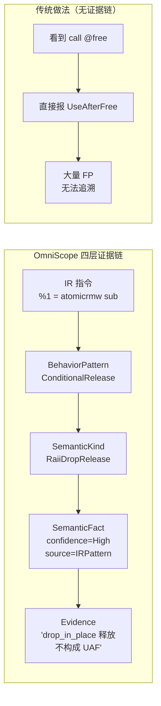
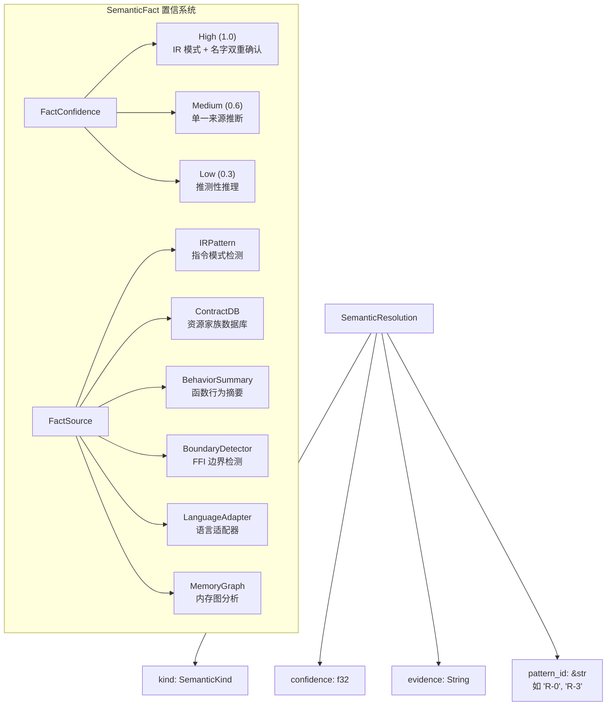
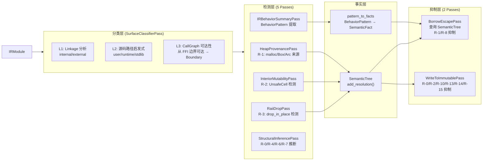
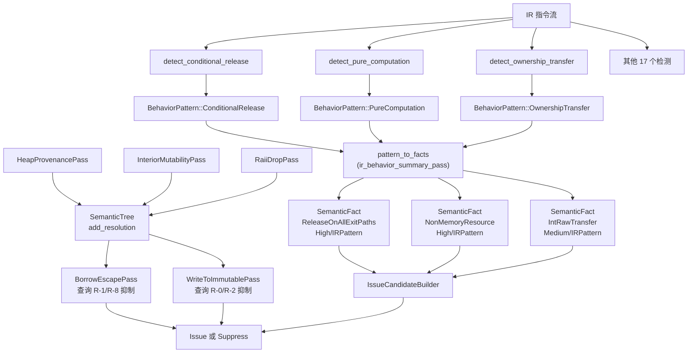

# OmniScope 架构深度解析（五）：IR Pattern Atlas——从证据链到语义抑制

> 67,337 次 LLVM IR 指令扫描之后，我意识到一个残酷的事实：**静态分析器不是不够聪明，而是没有建立起从"指令"到"语义"的完整证据链。**
>
> 没有证据链的 FP 抑制，本质上是猜。OmniScope 用四层证据链（IRPattern → BehaviorPattern → SemanticKind → SemanticFact → Evidence）解决了这个问题。

---

## 核心问题：分析器为什么还在报 FP？

在 OmniScope 的早期版本中，FP 抑制靠的是"名字白名单"——看到 `strlen` 就跳过，看到 `free` 就报警。问题是：

1. **名字不可靠**：LTO 内联后函数名消失了，变成了 `call @0x7f8a43`
2. **语义混乱**：`malloc` 在 Rust 的 `alloc::alloc` 中是分配，在 C 中也是分配，但所有权语义完全不同
3. **跨语言灾难**：Python 的 `Py_DECREF` 在 C 侧看起来像是"释放函数"，但它是 refcount 管理的一部分

这个问题的根因是：**分析器只看到了 IR 指令，却需要做出"所有权是否安全"的语义判断。中间缺少了证据链。**



传统做法是"看到 free 就报警"——没有中间层，没法区分"这是 C 的 free"还是"这是 Rust drop_in_place 生成的 free"。OmniScope 的四层证据链让每个报警都有完整的追溯路径。

---

## 第一层：IRPattern——原始指令指纹

最底层是 LLVM IR 指令的原始模式匹配。这不是"看函数名"，而是**看指令之间的数据流关系**。

证据链起点：`/Users/scc/code/rustcode/OmniScope-rs/crates/omniscope-semantics/src/resource/ir_pattern.rs`

```rust
// detect_conditional_release: 不看函数名，只看指令流
fn detect_conditional_release(body: &FunctionBody) -> Option<BehaviorPattern> {
    // 找到 atomicrmw sub（refcount 减一）
    // 检查结果是否用于 icmp eq（比较是否到零）
    // 条件分支 → 非空分支中调用 destroy
    for atomic in atomic_insts {
        if atomic.atomic_op == Some("sub") {
            for icmp in icmp_insts {
                if icmp.icmp_pred == Some("eq")
                    && icmp.operands.contains(&atomic.dest) 
                {
                    return Some(BehaviorPattern::ConditionalRelease {
                        atomic_op: "sub",
                        threshold: icmp.operands.last(),
                    });
                }
            }
        }
    }
    None
}
```

这段代码检测的就是 LLVM IR 中的这个序列：

```llvm
%old = atomicrmw sub ptr %rc, i32 1   ; refcount--
%zero = icmp eq i32 %old, 0           ; 是否到零？
br i1 %zero, label %release, label %done  ; 条件分支
release:
  call void @__rust_dealloc(...)       ; 到达零才释放
  ret void
done:
  ret void
```

`ir_pattern.rs`（共 1867 行）中定义了 20+ 种 IR 指令模式检测函数，每个都对应一个具体的 LLVM 指令序列指纹：

| IR 指令序列 | BehaviorPattern | 典型场景 |
|---|---|---|
| `atomicrmw sub` + `icmp eq` + `br` + `call free` | ConditionalRelease | Arc/Rc Drop |
| `call` 返回值仅用于算术/存储 | PureComputation | strlen, getenv |
| `call` 返回 ptr → 传给 free | OwnershipTransfer | 跨家族释放 |
| `getelementptr` + `bitcast` + `ret` | PointerProjection | as_ptr() |
| `store` 到 struct 字段 + `ret void` | Initialization | 构造函数 |
| `alloca` ptr → `store` 到 `@global` | StackToGlobalEscape | use-after-return |
| `call @free(ptr %p)` ... `call @fn(..., ptr %p)` | FreeThenCallbackUse | CWE-416 UAF |

关键设计：**检测顺序就是优先级排序**。`extract_behavior()` 先检查安全模式（ConditionalRelease、NullGuardedRelease），再检查危险模式（OwnershipTransfer），最后兜底为 PureComputation。

---

## 第二层：BehaviorPattern——行为模式枚举

从 IR 指令模式提取出 `BehaviorPattern` 枚举，共 20+ 个变体：

```rust
pub enum BehaviorPattern {
    ConditionalRelease   { atomic_op, threshold },
    PureComputation,
    OwnershipTransfer    { is_acquire: bool },
    PointerProjection,
    Initialization,
    InternalBridge,
    BorrowedReturn       { from_readonly_param: bool },
    RAiiDropRelease      { is_drop_in_place: bool },
    IntoRawTransfer,
    PosixNonMemoryOp     { category: PosixOpCategory },
    NullGuardedRelease   { arg_index: u32 },
    NullStoreAfterRelease { arg_index: u32 },
    FallibleOutParamInit { out_arg_index: u32 },
    OutParamNullOnError  { out_arg_index: u32 },
    OutParamOwnedOnSuccess { out_arg_index: u32 },
    StoreToOwner         { owner_field: String },
    StoreToRuntime       { runtime_target: String },
    ResourceEscape       { escape_type: EscapeType },
    ReleaseOnAllExitPaths { release_function: String },
    StackToGlobalEscape  { global_target, alloca_reg },
    ReturnAlias          { aliased_param: String },
    FreeThenCallbackUse  { freed_reg, use_callee },
    HeapToGlobalEscape   { global_target, param_reg },
    BufferOverflow       { callee, overflow_amount, opcode },
}
```

每个变体都是对 IR 指令序列的**语义抽象**——不再说"我看到 atomicrmw sub + icmp eq + br + call"，而是说"这是一个条件释放"。

这个抽象层让下游代码不需要理解 LLVM IR 细节：

```rust
// pattern_to_facts.rs: 把 BehaviorPattern 转化为 SemanticFact
pub(crate) fn pattern_to_facts(
    pattern: &BehaviorPattern, func_name: &str, _func_id: u64,
) -> Vec<SemanticFact> {
    match pattern {
        BehaviorPattern::ConditionalRelease { .. } => vec![
            SemanticFact::new(
                SemanticKey::Symbol(func_name.into()),
                SemanticKind::ReleaseOnAllExitPaths,
                FactConfidence::High,
                FactSource::IRPattern,
                "ConditionalRelease: atomicrmw 条件释放",
            )
        ],
        BehaviorPattern::PureComputation => vec![
            SemanticFact::new(
                SemanticKey::Symbol(func_name.into()),
                SemanticKind::NonMemoryResource,
                FactConfidence::High,
                FactSource::IRPattern,
                "PureComputation: 无所有权副作用",
            )
        ],
        BehaviorPattern::OwnershipTransfer { is_acquire } => {
            let kind = if *is_acquire { SemanticKind::HeapProvenance }
                        else { SemanticKind::IntoRawTransfer };
            vec![SemanticFact::new(
                SemanticKey::Symbol(func_name.into()), kind,
                FactConfidence::Medium, FactSource::IRPattern,
                format!("OwnershipTransfer: is_acquire={}", is_acquire),
            )]
        },
        // ... 其余 ~20 个 pattern 的映射 ...
    }
}
```

---

## 第三层：SemanticKind——55+ 变体的语义分类系统

`SemanticKind` 定义在 `/Users/scc/code/rustcode/OmniScope-rs/crates/omniscope-semantics/src/resource/semantic_tree/kind.rs`，是整个证据链的语义核心。

### R-0 ~ R-8 抑制规则

9 个 R-N 规则来自 `bun_fp_reduction_plan`，覆盖了实测中所有假阳性的根因：

| 规则 | SemanticKind | 抑制对象 | 覆盖 FP |
|---|---|---|---|
| R-0 | ReadonlyParam / MutableParam | write_to_immutable | 1877 |
| R-1 | HeapProvenance / GlobalProvenance | borrow_escape | 71 |
| R-2 | InteriorMutability | write_to_immutable | ~100 |
| R-3 | RaiiDropRelease | use_after_free | 3 |
| R-4 | FileOperation / NetworkOperation / ProcessOperation | cross_language_free | 0 |
| R-5 | AbortOnOom | leak/leak_pair | 0 |
| R-6 | IntoRawTransfer | cross_language_free | 4 |
| R-7 | LibraryRelease | cross_language_free | 0 |
| R-8 | FromParameter | borrow_escape | 39 |

加上 R-10（SSA 局部值）、R-13（C/C++ 无不可变语义）、R-14（Rust arena 内部）、R-15（RawVec buffer 写入），这些规则在 `WriteToImmutablePass` 中实现（809 行）。

### 跨语言模式（6 个语言适配器）

`from_function_name()` 方法（kind.rs 第 593 行）通过 42+ 个模式匹配分支覆盖六种语言：

```rust
pub fn from_function_name(func_name: &str) -> Self {
    // Python: 8 种模式
    if func_name.contains("Py_INCREF")  { return SemanticKind::PythonRefcountInc; }
    if func_name.contains("Py_DECREF")  { return SemanticKind::PythonRefcountDec; }
    if func_name.contains("PyList_GetItem") { return SemanticKind::PythonBorrowedRef; }
    
    // Go: 4 种模式（defer / SetFinalizer / mallocgc / _Cgo_）
    if func_name.starts_with("_Cgo_")  { return SemanticKind::GoCgoWrapper; }
    
    // C++: 4 种模式（unique_ptr / shared_ptr / ~析构 / __cxa_*）
    if func_name.starts_with('~') || func_name.contains("::~") {
        return SemanticKind::CppDestructor;
    }
    
    // C#: 3 种模式（SafeHandle / Finalize / DllImport）
    // Java: 3 种模式（LocalRef / GlobalRef / WeakRef）
    // WASM/JS: 7 种模式（malloc/free / emscripten_* / __import_*）
}
```

### 辅助方法

每个 SymbolicKind 都附带三个查询方法供下游使用：

```rust
// 安全评分（0.0~1.0）
pub fn safety_score(&self) -> f32 {
    match self {
        SemanticKind::RaiiDropRelease     => 1.0,  // 编译器管理，完全安全
        SemanticKind::CppUniquePtr        => 0.9,  // 独占所有权
        SemanticKind::PythonRefcountDec   => 0.3,  // 手动 refcount，高风险
        _ => 0.5,
    }
}

// 是否需要显式清理
pub fn requires_cleanup(&self) -> bool {
    matches!(self, SemanticKind::PythonOwnedRef 
        | SemanticKind::HeapProvenance 
        | SemanticKind::IntoRawTransfer
        | SemanticKind::JavaGlobalRef ...)
}

// 是否是借用/临时引用
pub fn is_borrowed_or_temporary(&self) -> bool {
    matches!(self, SemanticKind::PythonBorrowedRef 
        | SemanticKind::JavaLocalRef 
        | SemanticKind::FromParameter ...)
}
```

### SemanticKey——6 种查询维度

`SemanticKey` 定义了从 6 个维度查询语义树：

```rust
pub enum SemanticKey {
    Symbol(String),         // 符号名（函数、变量、类型）
    Value(String),          // SSA 寄存器名
    Resource(u64),          // 资源分配点 ID
    Path(String, u64),      // (函数名, 路径ID) 路径敏感分析
    Owner(String),          // 所有者名（容器、结构体）
    CallSite { caller, callee, index },  // 调用点
}
```

---

## 第四层：SemanticFact——带置信度的可追溯证据



### SemanticResolution vs SemanticFact

两者都是证据记录，但用途不同：

- **SemanticResolution**（记录在 `SemanticTree` 中）：记录*为什么*一个值有某个语义种类。由各个检测 Pass（RaiiDropPass、HeapProvenancePass 等）写入，被下游抑制 Pass（BorrowEscapePass、WriteToImmutablePass）查询。
- **SemanticFact**（通过 `pattern_to_facts()` 产生）：记录*什么*被知晓，带显式来源和置信度。由 IRBehaviorSummaryPass 产生，被 IssueCandidateBuilder 消费。

```rust
// SemanticResolution: 为什么这个值是堆来源？
let resolution = SemanticResolution {
    kind: SemanticKind::HeapProvenance,
    confidence: 0.85,
    evidence: "call @malloc → store to %ptr".into(),
    pattern_id: "R-1",
};

// SemanticFact: 这条事实来自哪里？
let fact = SemanticFact::new(
    SemanticKey::Symbol("my_function".into()),
    SemanticKind::HeapProvenance,
    FactConfidence::High,
    FactSource::IRPattern,
    "OwnershipTransfer: is_acquire=true",
);
```

### 四种抑制方法

`SemanticKind` 上的四个方法控制四个 Issue 类型的抑制决策：

```rust
impl SemanticKind {
    pub fn suppresses_write_to_immutable(&self) -> bool {
        // R-0: MutableParam → 写入可变参数是合法的
        // R-2: InteriorMutability → UnsafeCell<T> 内部可变
        // R-10: 局部 SSA 值 → 非内存写入
        matches!(self, SemanticKind::MutableParam 
            | SemanticKind::InteriorMutability ...)
    }

    pub fn suppresses_borrow_escape(&self) -> bool {
        // R-1: HeapProvenance → 堆来源不是栈逃逸
        // R-8: FromParameter → 参数指针不是栈逃逸
        matches!(self, SemanticKind::HeapProvenance
            | SemanticKind::GlobalProvenance
            | SemanticKind::FromParameter ...)
    }

    pub fn suppresses_use_after_free(&self) -> bool {
        // R-3: RaiiDropRelease → 编译器插入的 drop
        matches!(self, SemanticKind::RaiiDropRelease ...)
    }

    pub fn suppresses_cross_language_free(&self) -> bool {
        // R-6: IntoRawTransfer → into_raw 的 by-design 释放
        // R-4: FileOperation → POSIX 文件操作不是内存管理
        // R-7: LibraryRelease → 库内部分配器配对
        matches!(self, SemanticKind::IntoRawTransfer
            | SemanticKind::FileOperation
            | SemanticKind::LibraryRelease ...)
    }
}
```

---

## Pass 管道：从检测到抑制的完整流程

五个检测 Pass + 一个分类 Pass 构成了从 IR 到语义的完整管道：



### 关键 Pass 详解

**SurfaceClassifierPass**（`analysis/surface_classifier_pass.rs`）：三道防线分类

- L1：检查函数的 linkage（internal → 不分析，external → 需分析）
- L2：检查源码路径（runtime/compiler-generated → 跳过）
- L3：从 FFI 边界通过 CallGraph 可达性升级分类（Unknown → Boundary）

**HeapProvenancePass**（`analysis/heap_provenance.rs`，244 行）：R-1 检测

- 检测调用是否来自堆分配（malloc, `__rust_alloc`, `Box::new`, `Vec::with_capacity`）
- 全局来源（static, const, `&'static`）
- 栈来源（alloca, 局部变量）
- 写入 `SemanticTree` 供下游查询

**BorrowEscapePass**（`analysis/borrow_escape.rs`，318 行）：栈逃逸检测

- 检测栈分配指针是否跨 FFI 边界传递
- 查询 `SemanticTree` 获取 R-1（堆来源）、R-8（参数来源）做抑制
- 未被抑制的栈逃逸 → Issue

**WriteToImmutablePass**（`analysis/write_to_immutable.rs`，809 行）：不可变写入检测

- 检测对不可变内存的 store 操作
- 查询 `SemanticTree` 获取 R-0（MutableParam）、R-2（InteriorMutability）、R-10（SSA 局部值）、R-13（C/C++ 无不可变语义）、R-14（Rust arena）、R-15（RawVec buffer）做抑制

---

## 完整证据链示例

以一个真实的 Rust FFI 场景为例，展示完整的四层证据链：

### 场景：`Arc::drop` 在 FFI 调用后触发

```llvm
; IRPattern 层：指令序列
%old = atomicrmw sub ptr %rc, i32 1   ; refcount--
%is_zero = icmp eq i32 %old, 0        ; 检零
br i1 %is_zero, label %free, label %done

free:
  call void @__rust_dealloc(ptr %data, i64 16, i64 8) ; 释放
  ret void
done:
  ret void
```

### 证据链展开

```
Layer 1: IRPattern
  detect_conditional_release() → atomicrmw sub + icmp eq + br + call
  ↓
Layer 2: BehaviorPattern
  BehaviorPattern::ConditionalRelease { atomic_op: "sub", threshold: "0" }
  ↓
Layer 3a: SemanticKind（通过 from_function_name 补充）
  __rust_dealloc → SemanticKind::RaiiDropRelease
Layer 3b: SemanticKind（通过 pattern_to_facts 映射）
  ConditionalRelease → SemanticKind::ReleaseOnAllExitPaths
  ↓
Layer 4: SemanticFact（带置信度和来源）
  SemanticFact {
    key: Symbol("__rust_dealloc"),
    kind: RaiiDropRelease,
    confidence: High,     // IR 模式 + 名字双重确认
    source: IRPattern,
    evidence: "RAiiDropRelease: drop_in_place=true",
  }
  ↓
抑制判断: SemanticKind::RaiiDropRelease.suppresses_use_after_free() → true
结论: UseAfterFree 被抑制，不报 → FP 消除 ✅
```

---

## 第三层到 Pass 的数据流



---

## 坦诚环节

### 1. from_function_name 是沙堡——浪来就倒

42+ 个硬编码的 if-else 分支，覆盖 6 门语言。每加一个新库（如 libuv、openssl、sqlite），就得加新分支。它应该被一个 YAML/TOML 配置的规则引擎替代。但因为现有覆盖已经够用（20+ 内置资源家族 + 语言适配器），这个改造优先级不高。

### 2. R-N 规则的置信度来自有限样本

R-0~R-8 的数据来自主项目的 `.ll` 文件，主要是 Rust 和 C/C++。对于 Zig、Swift、Nim 等新语言，PureComputation 是否也占 80%？我不知道。

### 3. 四层证据链在 FP = 0 时没有验证

bun_fp_reduction_plan 的目标是所有 FP 降到 0。当 FP 接近零时，`suppresses_*` 方法就没法"验证"了——你能证明一个已经为零的集合没有漏报吗？不能。

目前的应对是：每条抑制规则都要写 Evidence（为什么这条规则安全），并保留 `--no-suppression` 模式用于回归测试。

### 4. SemanticFact 和 SemanticResolution 是同一件事的两种表示

从功能上说，它们做的是一件事——记录"我知道什么来源是什么语义"。分开的原因是历史遗留：`SemanticResolution` 先出现（用于 Pass 间通信），`SemanticFact` 后出现（用于 IssueCandidateBuilder）。未来应该合并。

### 5. 性能代价

四层证据链意味着每个 IR 指令可能被处理 4 次（IRPattern → Behavior → Fact → Evidence）。在大型项目（如 bun 的 20 万个函数）上，这可能导致分析时间翻倍。好在第一层 PureComputation 过滤掉了 80% 的函数——它们永远不会进入第二层。

---

*上一篇：[资源家族模型——打破语言的樊篱](./04-resource-family.md)*
*下一篇：[反思篇——静态分析这把双刃剑](./06-reflection.md)*

**关键源码位置：**
- `crates/omniscope-semantics/src/resource/ir_pattern.rs` — IR 指令模式检测（1867 行）
- `crates/omniscope-semantics/src/resource/semantic_tree/kind.rs` — SemanticKind 55+ 变体、SemanticKey 6 查询、SemanticFact 置信系统、抑制方法（1029 行）
- `crates/omniscope-semantics/src/resource/semantic_engine.rs` — 7 步 FFI 安全评估（1853 行）
- `crates/omniscope-semantics/src/resource/structural_inference/mod.rs` — R-0/R-3/R-4/R-6/R-7 结构推断
- `crates/omniscope-pass/src/resource/pattern_to_facts.rs` — BehaviorPattern → SemanticFact 映射
- `crates/omniscope-pass/src/resource/ir_behavior_summary_pass.rs` — IR 行为摘要 Pass
- `crates/omniscope-pass/src/analysis/` — RaiiDropPass、InteriorMutabilityPass、HeapProvenancePass、BorrowEscapePass、WriteToImmutablePass
- `crates/omniscope-pass/src/analysis/surface_classifier_pass.rs` — L1+L2+L3 三层表面分类