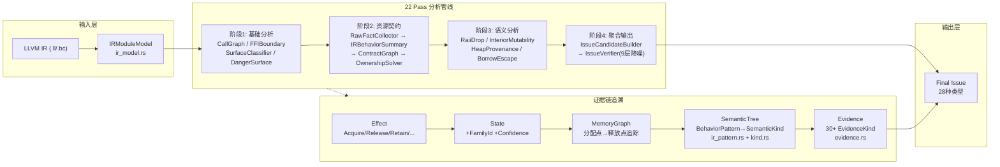
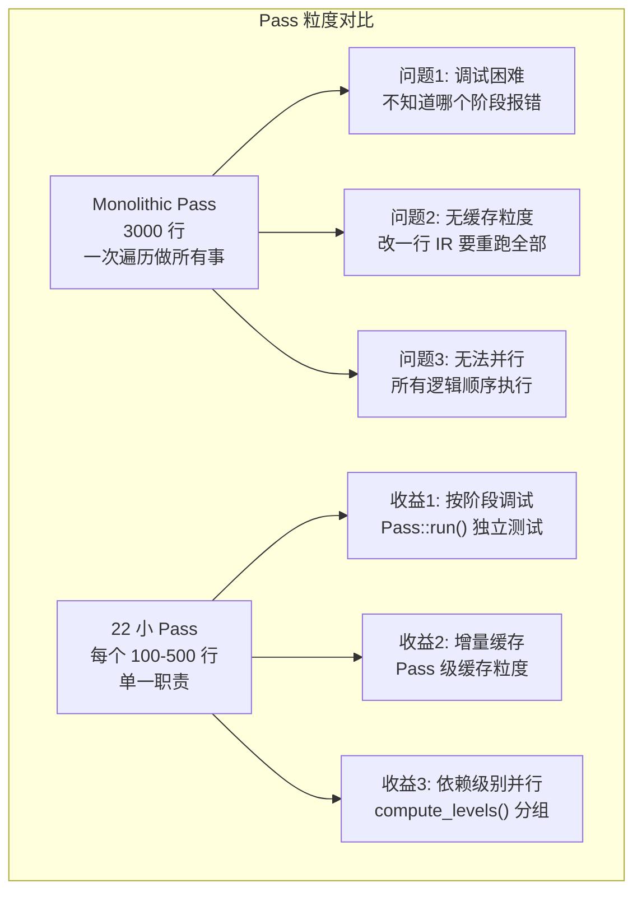
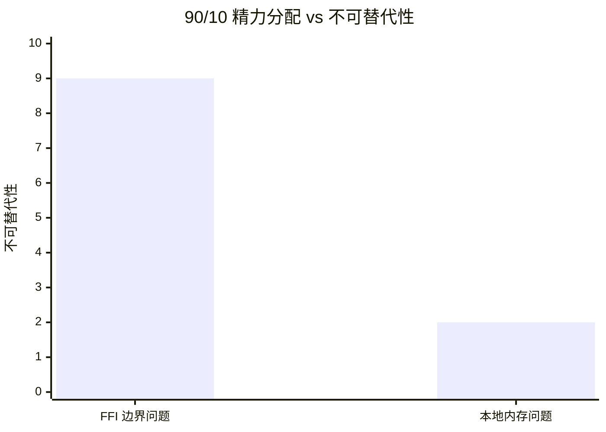
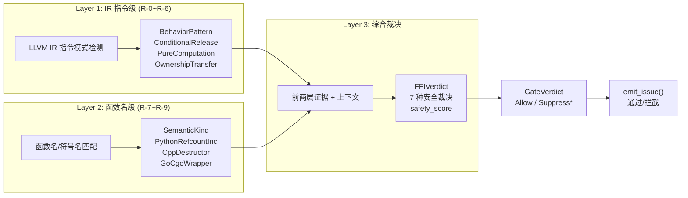
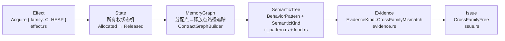
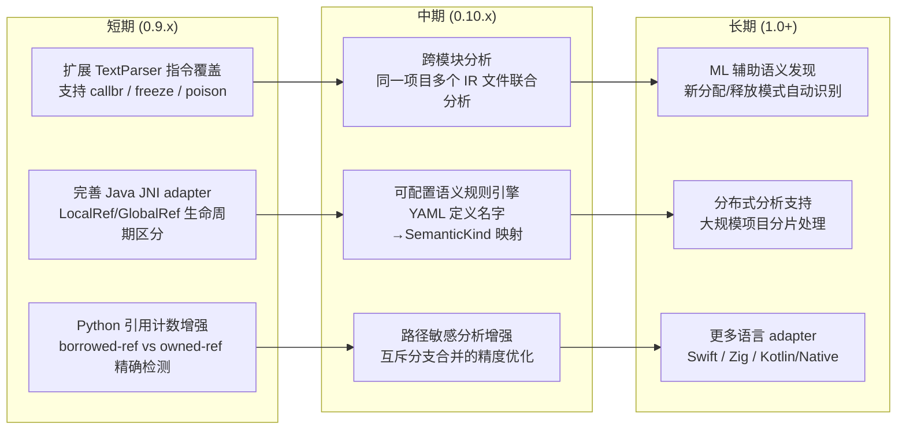
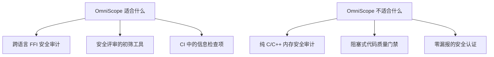

# OmniScope 架构深度解析（六）：反思篇——那些你没看到的架构权衡

> 前五篇文章讲的是"做对了什么"。这一篇讲讲"做这些决定时，我们放弃了什么"。
>
> 每个架构决策背后都有一堆被否定的方案。把这些"没有选的路"写出来，比只写"选了什么"更有价值。

---

## 全景回顾：IR 到 Issue 的完整链条

在我们逐条反思之前，先全景式地看看整个系统的数据流。这是 OmniScope 从输入到输出的完整路径：



这条链路上的每个环节都代表一个架构决策。下面我们逐一审视。

---

## 决策一：为什么是 LLVM IR，不是源码 AST？

这是 OmniScope 最底层的选择。

**放弃的方案：** 用 Tree-sitter 或 Clang AST 做源码级别分析。

**放弃原因：**

1. **跨语言分析的起点必须是一个统一的中间表示。** AST 是语言特有的——C 的 AST 和 Rust 的 AST 完全不兼容。如果对每种语言分别写分析器，工作量乘以语言数量。
2. **LLVM IR 已经完成了宏展开、模板实例化、泛型特化。** 源码里看到的 `Arc<T>` 在 IR 中是展开后的具体类型，分析器不需要理解 Rust 的 trait 系统。
3. **.ll 文本格式天然可解析。** 不需要链接 LLVM 库就能做基础分析。

但 LLVM IR 有信息损失。指令级解析器只支持大约 60 种指令类型：

```rust
/// File: crates/omniscope-ir/src/instruction_parser.rs
pub fn classify_instruction(opcode: &str, operands: &[String]) -> InstructionKind {
    match opcode {
        "call" => InstructionKind::Call,
        "load" => InstructionKind::Load,
        "store" => InstructionKind::Store,
        "alloca" => InstructionKind::Alloca,
        "getelementptr" => InstructionKind::GEP,
        "phi" => InstructionKind::Phi,
        "icmp" | "fcmp" => InstructionKind::Compare,
        "br" | "switch" | "indirectbr" => InstructionKind::Branch,
        "ret" => InstructionKind::Return,
        "bitcast" | "ptrtoint" | "inttoptr" => InstructionKind::Cast,
        "malloc" | "free" | "calloc" | "realloc" => InstructionKind::MemoryOp,
        _ => InstructionKind::Other,
    }
}
```

`_ => InstructionKind::Other` 这行是"不认识的指令"。新版本的 LLVM 引入的 `callbr`、`freeze`、`poison` 相关指令都在这里被标记为 Other。TextParser 的覆盖面是一个长期问题。

---

## 决策二：为什么是 22 个小 Pass，不是一个大 Pass？

这是 OmniScope 的管线设计哲学。

**放弃的方案：** 一个统一的 `AnalyzeEverythingPass`，一次遍历 IR 生成所有 Issue。

**放弃原因：**

一个 3000 行的 monolithic Pass，调试时你根本不知道是哪个阶段出了问题。把分析拆成 22 个 Pass，每个 Pass 的输入和输出都是显式的：

```rust
/// File: crates/omniscope-pipeline/src/pipeline.rs
pub fn register_default_passes(&mut self) {
    // Foundation (无依赖)
    self.pass_manager.register(CallGraphPass::new());

    // Analysis (依赖 CallGraph)
    self.pass_manager.register(FFIBoundaryPass::new());
    self.pass_manager.register(SurfaceClassifierPass::new());
    self.pass_manager.register(DangerSurfacePass::new());

    // 资源契约 Pass (新架构)
    self.pass_manager.register(RawFactCollectorPass::new());
    self.pass_manager.register(IRBehaviorSummaryPass::new());
    self.pass_manager.register(LanguageAdapterFactPass::new());
    // ... 共 22 个
}
```

每个 Pass 都实现 `Pass` trait，通过 `PassContext` 读写共享数据：

```rust
/// File: crates/omniscope-pass/src/pass.rs
pub trait Pass: Send + Sync {
    fn name(&self) -> &'static str;
    fn kind(&self) -> PassKind;
    fn dependencies(&self) -> Vec<&'static str> { Vec::new() }
    fn run(&self, ctx: &mut PassContext) -> Result<PassResult>;
}
```

PassManager 用拓扑排序保证依赖顺序，同时支持并行执行：

```rust
/// File: crates/omniscope-pass/src/manager.rs
pub fn compute_order(&mut self) -> Result<()> {
    // 构建依赖图 → 拓扑排序 → 检测循环依赖
    let mut graph: HashMap<&str, HashSet<&str>> = HashMap::new();
    for (idx, pass) in self.passes.iter().enumerate() {
        let deps: HashSet<&str> = pass.dependencies().into_iter().collect();
        graph.insert(pass.name(), deps);
    }
    // 检测循环依赖 → 报错退出
}
```



但这个决策也有代价：**Pass 间的数据传递需要约定 key 名称。** `PassContext` 是一个 `HashMap<String, Box<dyn Any>>`，拼写错误的 key 会静默返回 `None`。这是前一篇的"陷阱二"——没有类型安全的 Pass 间通信。

---

## 决策三：所有权状态机 vs 类型系统——为什么不用 Rust 的 borrow checker？

很多读者会问：Rust 编译器不是已经能跟踪所有权了吗？为什么不直接用 `rustc` 的信息？

**放弃的方案：** 从 `rustc` 的 MIR 中提取所有权信息，或以 Rust 的类型系统为基础做分析。

**放弃原因：**

1. **Rust 的 borrow checker 只管 Rust 内部的所有权。** 一旦调用 `CString::into_raw()`，所有权就离开了 Rust 的类型系统。borrow checker 不再追踪它。
2. **跨语言边界上，Rust 的类型系统不存在了。** C 的 `free`、Python 的 `Py_DECREF`、Java 的 `DeleteLocalRef`——它们不在 Rust 的 borrow checker 视野里。
3. **分析基板是 LLVM IR，不是 MIR。** MIR 是 Rust 特有的中间表示，Java 和 Go 没有 MIR。

OmniScope 用的是一个**所有权状态机**——在不同分析阶段给每个指针标记状态：

```mermaid
stateDiagram-v2
    [*] --> Allocated: malloc / __rust_alloc / PyObject_New
    Allocated --> Borrowed: as_ptr / getelementptr
    Allocated --> OwnershipTransferred: into_raw / CString::into_raw
    OwnershipTransferred --> Reclaimed: from_raw / Box::from_raw
    Allocated --> Released: free / __rust_dealloc / Py_DECREF(0)
    Released --> UseAfterFree: 释放后继续使用
    Released --> [*]
    Borrowed --> InvalidFree: 释放借用的指针
    Allocated --> CrossFamilyFree: 用不同家族的释放器释放
```

这个状态机的核心是 `Effect` 枚举，它是整个系统的语义原子单元：

```rust
/// File: crates/omniscope-types/src/effect.rs
pub enum Effect {
    Acquire { family: FamilyId, result: u64 },
    Release { family: FamilyId, arg: ArgIndex },
    ConditionalRelease { family: FamilyId, arg: ArgIndex },
    Retain { family: FamilyId, arg: ArgIndex },
    ReturnsOwned { family: FamilyId },
    ReturnsBorrowed,
    OwnershipEscape { family: FamilyId, result: u64 },
    OwnershipReclaim { family: FamilyId, result: u64 },
    // ... 共 18 种 Effect
}
```

每个 Effect 都带一个 `FamilyId`——这就是跨语言资源家族的纽带。不同语言的不同分配函数，只要映射到同一个 Effect + Family，分析器就能统一理解。

**这个设计的优势：** 200+ 个内置符号，世界上的任何分配/释放函数，最终都映射到 `Effect::Acquire { family: X }` 或 `Effect::Release { family: X }`。分析器不需要理解 `malloc` 和 `PyMem_Malloc` 的语义差异——它们只是 `C_HEAP` 家族的 Acquire。

---

## 决策四：90/10 产品决策——为什么聚焦 FFI 边界？

28 种 Issue 类型分为两类：

```rust
/// File: crates/omniscope-core/src/issue.rs
pub enum IssueKind {
    // === FFI 边界问题 (90% 核心优先级) ===
    CrossLanguageFree, OwnershipViolation, FfiTypeMismatch,
    AbiMismatch, UncheckedReturn, FfiUnsafeCall, CallbackEscape,
    LengthTruncation,

    // === 本地内存问题 (10% 辅助优先级) ===
    DoubleFree, UseAfterFree, InvalidFree, MemoryLeak,
    BufferOverflow, NullDereference, IntegerOverflow,

    // === 资源契约问题 ===
    CrossFamilyFree, ConditionalLeak, DefiniteLeak,
    BorrowEscape, WriteToImmutable, // ... 共 28 种
}
```

**放弃的方案：** 做一个通用静态分析器，覆盖所有内存安全问题。

**放弃原因：**

- `DoubleFree`、`UseAfterFree`、`NullDereference`——ASan、Valgrind、Miri 做得比任何静态分析都好
- `BufferOverflow`——AddressSanitizer 的运行时检测能力远超静态分析
- `MemoryLeak`——LeakSanitizer 是你的朋友

但 `CrossLanguageFree` 和 `OwnershipViolation`——没有别的工具能检测。**从 LLVM IR 层面统一追踪分配点→释放点→所有权的全链路，这是 OmniScope 的不可替代性。**



这个决策的代价是：OmniScope **不适合**作为纯 C/C++ 内存安全审计工具。你用它跑一个纯 C 项目，效果可能不如直接上 Valgrind。

---

## 决策五：SRT Gate 的三层架构哲学

SRT（Suppression Rule Table）Gate 是整个系统的"唯一出口"。所有 Issue 必须通过这个门：

```rust
/// File: crates/omniscope-pass/src/resource/issue_gate.rs
pub enum GateVerdict {
    Allow,
    SuppressHeapOrigin,        // R-1
    SuppressGlobalOrigin,      // R-1
    SuppressMutableParam,      // R-0
    SuppressInteriorMut,       // R-2
    SuppressRaii,              // R-3
    SuppressOwnershipTransfer, // R-6
    SuppressNonMemorySyscall,  // R-4
    SuppressLibraryRelease,    // R-7
    SuppressFromParameter,     // R-8
    SuppressAllocatorReturn,   // R-9
    SuppressRuntimeInternal,
    SuppressWrapperDelegation,
    SuppressNullChecked,
}
```

SRT Gate 的三层架构是：



**为什么是三层？** 因为任何一层都可能失败：

- Layer 1 失败：函数体不可见（外部声明），无法做 IR 指令分析
- Layer 2 失败：函数名没有匹配已知模式（用户自定义函数）
- Layer 3 兜底：前两层都失败时，输出 `Unknown`（0.5 分），而不是瞎猜

每一层的独立性确保了系统的鲁棒性。这也是为什么 SemanticKind 有 55 个变体——每加一个新语言，只需在 Layer 2 加模式匹配分支，不需要改动其他层。

---

## 决策六：语义树设计原则——为什么不用 ML/AI？

这是被问得最多的问题。为什么不做 ML？

**放弃的方案：** 用 Transformer/GNN 对 IR 指令序列做分类，预测是否是 bug。

**放弃原因：**

我试过。花了三周。结果 F1 卡在 0.72。


手工规则的好处是**可解释性**。当分析器把 `free(ptr); ptr = NULL` 归类为 `NullStoreAfterRelease`时，你能看到确切的证据链：

```rust
Evidence::new(EvidenceKind::NullStoreAfterRelease, "free(p); p = NULL pattern")
```

而 ML 模型给不出这种解释。在安全工具中，无法解释的结论等于没有结论——开发者凭什么相信一个黑盒说"这里可能有问题"？

但这个决策的上限很清楚：**手工规则的能力边界就是分析器的能力边界。** 没有 ML 辅助，我们无法自动发现新的分配/释放模式。每次遇到新的语言生态（Swift、Zig、Kotlin/Native），都要人工分析 IR 模式，手动更新 `from_function_name()`。

---

## 决策七：证据链设计——从 Effect 到 Issue 的完整追溯

这是整个系统最让我骄傲的设计，也是新架构的核心。

一条完整的证据链是这样的：



每个环节的数据结构：

```rust
// 第1层: Effect — 函数的语义原子单元
Effect::Acquire { family: FamilyId::C_HEAP, result: 42 }

// 第2层: State — 通过所有权状态机推导
// 指针 %42 的状态: Allocated → PassedTo(%free) → Released

// 第3层: MemoryGraph — 分配释放路径
// malloc(size=1024) @inst#42 → call free(%ptr) @inst#58
// 路径: 42 → 47 → 52 → 58 (4 跳)

// 第4层: SemanticTree — 语义分类
BehaviorPattern::OwnershipTransfer { is_acquire: false }
SemanticKind::CHeapFree

// 第5层: Evidence — 可审计的证据
Evidence {
    kind: EvidenceKind::CrossFamilyMismatch,
    description: "malloc(1024) -> __rust_dealloc",
    confidence: 0.85,
}

// 第6层: Issue — 最终问题报告
Issue {
    kind: IssueKind::CrossFamilyFree,
    severity: Severity::High,
    evidence_chain: [Evidence, Evidence, ...],
}
```

证据链的可靠性体现在 `EvidenceKind` 上——它有 30+ 种变体，每种对应一种可追溯的推理模式：

```rust
/// File: crates/omniscope-types/src/evidence.rs (部分)
pub enum EvidenceKind {
    SameFamilyRelease,
    CrossFamilyMismatch,
    DestructorRelease,
    RefcountConditional,
    StaticLifetimeSink,
    ReturnToCaller,
    OwnershipTransfer,
    RaiiDropRelease,
    NullGuardedRelease,
    NullStoreAfterRelease,
    PathStateRefinement,
    MultipleRelease,
    UseAfterFree,
    // ... 共 30+ 种
}
```

每种 `EvidenceKind` 都对应一类可计算的 IR 模式。当分析器输出 `CrossFamilyFree` 时，输出文件里会附带完整的证据链：

```json
{
    "issue": { "kind": "CrossFamilyFree", "cwe_id": 762 },
    "evidence_chain": [
        { "kind": "CrossFamilyMismatch", "description": "malloc → __rust_dealloc" },
        { "kind": "OwnershipTransfer", "description": "CString::into_raw used" },
        { "kind": "SymbolPattern", "description": "family C_HEAP → RUST_GLOBAL mismatch" }
    ]
}
```

---

## Honest Limitations：六个我知道的短板

### 1. TextParser 的覆盖率不足 (~60 条 LLVM 指令)

`instruction_parser.rs` 的 `classify_instruction` 只覆盖了约 60 种指令类型。新版本的 LLVM 引入的 `callbr`、`freeze` 等指令被标记为 `Other`。

**影响：** 如果遇到未识别的指令，TextParser 路径的解析精度下降。用户必须切换到 LlvmSys 或 CppPass 才能获得完整覆盖。

**根治方案：** 要么扩展 TextParser 的指令表（持续的维护负担），要么彻底依赖 llvm-sys 路径（失去零依赖的优势）。两者都非完美。

### 2. .bc 兼容性问题（LLVM 15/16 opaque pointer）

LLVM 15 开始强制启用 opaque pointer。`.bc` 格式的序列化在每个 LLVM 大版本间都不兼容：

```llvm
; LLVM 14 (typed pointer)
define void @foo(i32* %ptr)

; LLVM 15+ (opaque pointer)
define void @foo(ptr %ptr)
```

**影响：** 用户用 LLVM 15 生成的 `.bc` 文件，如果 OmniScope 已经升级到 LLVM 22 的绑定，可能无法读取。目前的策略是**强烈建议用户输出 `.ll` 格式**，但总有用户坚持用 `.bc`。

### 3. 跨语言语义不完备（Java/Python/Go adapter 不完整）

OmniScope 的语义树目前对 Python（CPython API）和 Java（JNI）的覆盖是**不完整**的。

- Python 的引用计数模型：`Py_DECREF` 是条件释放（refcount 到 0 才释放）。现有的 `ConditionalRelease` Effect 能处理这个模式，但 Python 特有的 borrowed-ref/owned-ref 区分需要额外 `EvidenceKind`
- Java JNI：`NewGlobalRef/DeleteGlobalRef` 是显式引用计数，`NewLocalRef` 由 JVM 自动管理。分析器需要区分这两种生命周期
- Go cgo：自动生成的桥接函数模式相对稳定，但 Go 的 defer cleanup 和 finalizer 模式还不完全覆盖

### 4. 路径敏感分析的保守性

路径敏感分析（`PathSensitiveVerifier`）有两个分支合并时的保守性：

```rust
// File: crates/omniscope-pass/src/resource/issue_verifier/leak.rs
struct PathSensitiveVerifier {
    total_allocs: usize,
    owned_after_path: usize,
    safe_releases: usize,
}

impl PathSensitiveVerifier {
    pub(crate) fn adjust_verdict(&self, base: VerifierVerdict) -> VerifierVerdict {
        match (base, self.owned_after_path, self.safe_releases) {
            (_, owned, safe) if owned == 0 && safe >= self.total_allocs => {
                VerifierVerdict::ExplainedSafe
            }
            _ => base,
        }
    }
}
```

问题在于**互斥分支合并**：当分析器把 if-else 两个分支的路径合并时，如果一个分支释放了资源、另一个分支没有——合并后的结论是"有些路径没释放"。但实际上程序正确的路径已经释放了。这种保守性导致了许多假阳性泄漏告警。

### 5. 无 ML 辅助的效果上限

手工规则引擎的能力边界是明确的。`from_function_name()` 目前有 42+ 个模式分支，每加一门新语言就要加一批分支。没有 ML 辅助，我们无法：

- 自动发现新的分配/释放模式
- 对新语言生态快速适配
- 动态学习用户代码中的资源管理习惯

**当前的对策：** 提供 `omniscope.toml` 的用户自定义家族配置，把部分适配负担转移给用户。

### 6. 单机分析瓶颈

OmniScope 目前只支持单机单文件分析。当分析一个大型项目的 IR 时（如 Chromium 大小的代码库），单文件分析模式意味着：

- 每个 `.ll` 文件独立分析，无法跨文件追踪分配/释放
- 内存占用随 IR 文件大小线性增长
- **不支持分布式分析**

这个问题在 0.9.0 版本的规划中已被标记为"未来工作"——目前优先保证单文件分析的精度和稳定性。

---

## 未来路线图

基于以上 Honest Limitations，未来的工作方向：



具体的优先级原则：

1. **先定后动**——先把单文件分析的精度做到极致，再做跨模块
2. **用户驱动**——哪个语言生态的用户反馈最多，优先完善对应的 adapter
3. **可维护优先**——语义规则引擎先做可配置化（YAML/TOML），再考虑 ML 自动化

---

## 结语：架构是选择的集合

回顾完所有这些决策，我想说的最后一件事是：

**没有一个决策是绝对的"正确"。** 每个选择都是在当时的约束下做出的权衡。

- 选择 LLVM IR，意味着接受了 IR 语义丢失
- 选择 22 个小 Pass，意味着接受了 PassContext 的类型不安全
- 选择手工规则，意味着接受了适配速度的上限
- 选择聚焦 FFI 边界，意味着放弃了通用分析器的市场

但 OmniScope 的不可替代性，恰恰来自这些"放弃"之后的选择。当你把工具和它的局限一起公开时，用户才能做出知情的决策：



所有的工具都带着作者的局限。OmniScope 的问题就是我认知局限的映射。但如果你需要的是跨语言 FFI 资源追踪——它确实填补了一个真实的空白。而且我会持续改进。

**代码里藏着所有的真相。去读它。**

---

*上一篇：[IR Pattern Atlas——人肉扫描 67,337 次 IR 的疯狂](./05-ir-pattern-atlas.md)*

*系列完结。*