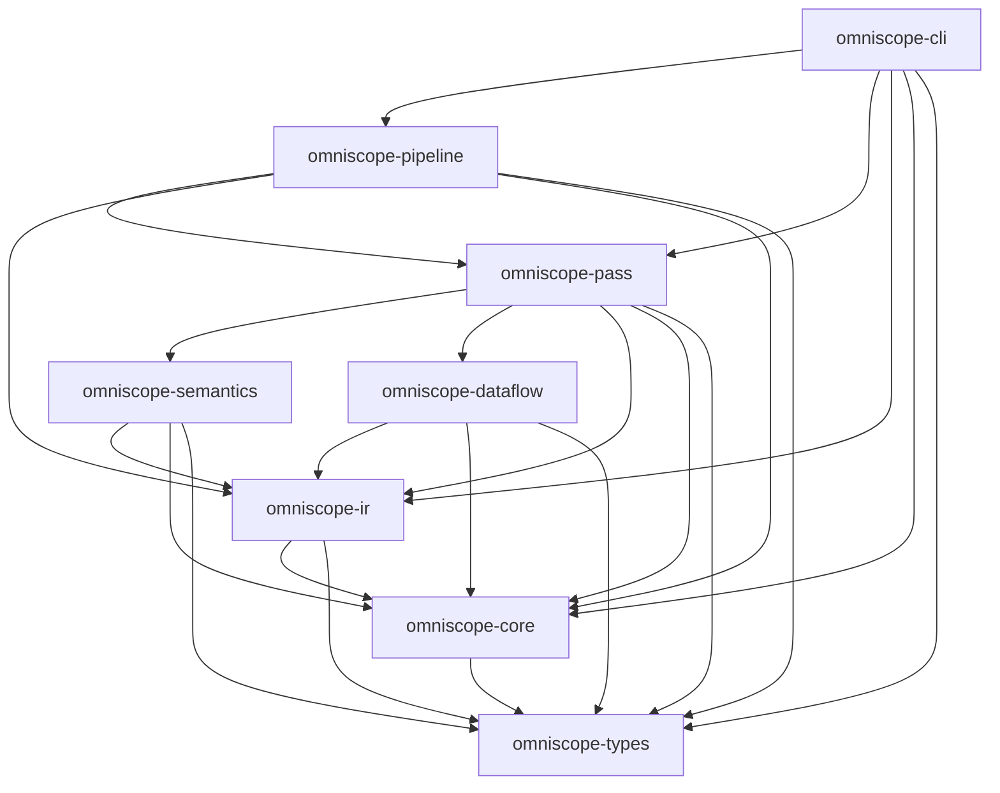
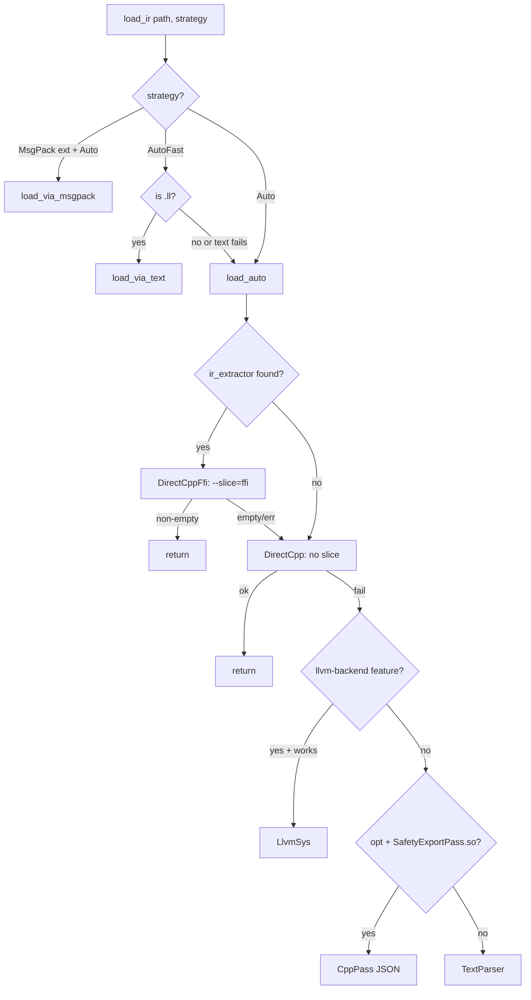

# Architecture

This document describes the actual implementation of OmniScope-rs as found in
the source tree. Every claim is traced to a file path.

## Workspace layout

OmniScope-rs is a Cargo workspace. The members are declared in
`Cargo.toml:65-75`:

- `crates/omniscope-core`
- `crates/omniscope-types`
- `crates/omniscope-ir`
- `crates/omniscope-dataflow`
- `crates/omniscope-semantics`
- `crates/omniscope-pass`
- `crates/omniscope-pipeline`
- `crates/omniscope-cli`

The top-level package `omniscope` (declared in `Cargo.toml:1-12`) is the
workspace root binary crate. It hosts only the criterion benchmarks
(`Cargo.toml:33-63`); it has no `[lib]` and no `[[bin]]` of its own. The
user-facing binary is produced by `omniscope-cli`
(`crates/omniscope-cli/Cargo.toml:12-14`):

```toml
[[bin]]
name = "omniscope"
path = "src/main.rs"
```

So the installed/built executable is named `omniscope`, not `omniscope-rs`.

## Crate dependency graph

The graph below is derived from the `[dependencies]` section of each crate's
`Cargo.toml`.



Notable detail: `omniscope-ir` has an optional `llvm-backend` feature that
pulls in `llvm-sys = 221` (`crates/omniscope-ir/Cargo.toml:13-23`). When the
feature is off, llvm-sys is not linked at all. The workspace feature
`llvm-backend` defined in `Cargo.toml:14-16` forwards to this.

## Crate responsibilities

| Crate | Key contents | Source directory |
|---|---|---|
| `omniscope-types` | `Language`, `FamilyId`, `OmniScopeConfig`, `BoundaryContext`, `VerifierVerdict`, `Effect`, `Evidence`, `IssueCandidateKind`, `PointerContract` | `crates/omniscope-types/src/` |
| `omniscope-core` | `Issue`, `IssueKind`, `Severity`, `Confidence`, `Diagnostic`, `Fact`, `IssueCandidate`, `FfiEvidence`, `MemoryPool`, `Profiler` | `crates/omniscope-core/src/` |
| `omniscope-ir` | IR text parser, `IRModule`, three loading backends (DirectCpp, llvm-sys, CppPass), msgpack support, `IrCache` | `crates/omniscope-ir/src/` |
| `omniscope-semantics` | `LanguageDetector`, `FamilyRegistry`, language adapters (C++/Python/Java/Go/C#), `SemanticTree`, `SemanticEngine`, `SurfaceClassifier` | `crates/omniscope-semantics/src/` |
| `omniscope-pass` | `Pass` trait, `PassManager`, `PassContext`, `ModuleIndex`, all 21 analysis passes | `crates/omniscope-pass/src/` |
| `omniscope-pipeline` | `Pipeline`, registers default passes, drives `PassManager`, `PipelineResult` | `crates/omniscope-pipeline/src/` |
| `omniscope-cli` | Binary `omniscope`, five subcommands (`analyze`/`audit`/`info`/`init`/`validate`) | `crates/omniscope-cli/src/` |
| `omniscope-dataflow` | Generic forward/backward dataflow framework (standalone, not currently consumed by the pipeline) | `crates/omniscope-dataflow/src/` |

## CLI entry point

`crates/omniscope-cli/src/main.rs:100-116` defines five subcommands via clap:

- `analyze` — run the full pipeline on an IR file
- `audit` — run the pipeline with a language-specific message wrapper
- `info` — print version and a hard-coded pass list
- `init` — write a default `omniscope.toml` config file
- `validate` — validate an `omniscope.toml` config file

The README only mentions `analyze`, `audit`, and `info`. `init` and `validate`
are real subcommands but not documented in the README.

## End-to-end pipeline (analyze)

`run_analyze` in `crates/omniscope-cli/src/main.rs:268-426` orchestrates a
single analysis:

1. Load config from `--config` or default locations
   (`crates/omniscope-cli/src/main.rs:435-475`).
2. Parse the IR file via `omniscope_ir::loader_v2::load_ir`
   (`crates/omniscope-ir/src/loader_v2.rs:186-238`).
3. Construct a `Pipeline`
   (`crates/omniscope-pipeline/src/pipeline.rs:32-39`).
4. If neither `--cross` nor `ffi_boundary` config is present, run
   `omniscope_pass::infer_boundaries` on the module and feed the result back
   into the config
   (`crates/omniscope-cli/src/main.rs:311-333`,
   `crates/omniscope-pass/src/analysis/boundary_inference.rs:26`).
5. Register the default passes (21 passes)
   (`crates/omniscope-pipeline/src/pipeline.rs:85-127`).
6. Run the pipeline (`Pipeline::run`,
   `crates/omniscope-pipeline/src/pipeline.rs:129-142`).
7. Optionally filter to FFI-boundary issues only
   (`crates/omniscope-cli/src/main.rs:482-531`).
8. Format the result as `rich`, `json`, or `sarif`
   (`crates/omniscope-cli/src/output/mod.rs:8-40`).

```mermaid
sequenceDiagram
    participant User
    participant CLI as omniscope-cli main
    participant Loader as loader_v2::load_ir
    participant Pipeline
    participant PassMgr as PassManager
    participant Out as OutputFormatter

    User->>CLI: omniscope analyze --strategy auto-fast <input>
    CLI->>CLI: load_config (TOML + --cross)
    CLI->>Loader: load_ir(path, strategy)
    Loader-->>CLI: LoadedIr { module, strategy, load_ms }
    CLI->>CLI: infer_boundaries(&module) if no config
    CLI->>Pipeline: set_config, set_ir_module, register_default_passes
    CLI->>Pipeline: run()
    Pipeline->>PassMgr: run_all_with_ir_and_config(module, config)
    PassMgr->>PassMgr: compute_order (topological sort)
    PassMgr->>PassMgr: execute passes (sequential or per-level parallel)
    PassMgr->>Pipeline: ModuleIndex, (pass_results, pass_timings, issues)
    Pipeline-->>CLI: PipelineResult
    CLI->>CLI: filter_boundary_issues if --boundary-only
    CLI->>Out: format(&result)
    Out-->>CLI: rich/json/sarif string
    CLI-->>User: stdout or file
```



## IR loading strategy

`crates/omniscope-ir/src/loader_v2.rs:118-155` defines a `LoadStrategy` enum
with the following variants:

- `DirectCppFfi` — runs the `ir_extractor` binary with `--slice=ffi
  --slice-hops=2 --format=msgpack` (`loader_v2.rs:516-601`).
- `DirectCpp` — runs `ir_extractor --format=msgpack` without the FFI slice
  filter (`loader_v2.rs:615-682`).
- `LlvmSys` — uses the llvm-sys C API adapter; only compiled when
  `llvm-backend` feature is enabled (`loader_v2.rs:385-418`).
- `CppPass` — invokes `opt -load-pass-plugin SafetyExportPass.so
  -passes=safety-export` and parses the JSON it emits
  (`loader_v2.rs:441-502`).
- `TextParser` — pure-Rust text parser via `IRModule::load_from_file`
  (`loader_v2.rs:692-694`). Always available.
- `MsgPack` — loads a pre-extracted `.msgpack` file
  (`loader_v2.rs:704-707`).
- `Auto` — probes backends in priority order
  (`loader_v2.rs:251-326`).
- `AutoFast` — same as `Auto`, but for `.ll` files (especially > 10 MB),
  prefer the text parser first (`loader_v2.rs:333-375`).

The CLI default is `auto-fast` (`crates/omniscope-cli/src/main.rs:162-164`).



Cached extractor output is stored under the project's `.omniscope-cache` via
`IrCache` (`crates/omniscope-ir/src/ir_cache.rs`, used at
`loader_v2.rs:432-434`).

## Pass manager and execution model

`crates/omniscope-pass/src/manager.rs:11-18` defines `PassManager`:

```rust
pub struct PassManager {
    passes: Vec<Box<dyn Pass>>,
    execution_order: Vec<usize>,
    parallel: bool,
}
```

The `Pass` trait is at `crates/omniscope-pass/src/pass.rs:13-27`. Every pass
declares `name()`, `kind()`, optional `dependencies()`, and a `run()` that
mutates a shared `PassContext`.

### Ordering

`compute_order` (`manager.rs:41-70`) does a topological sort over the
dependency graph declared by each pass. Cycles are detected via the
temp-marking variant of DFS (`manager.rs:73-106`) and surface as
`AnalysisError::DependencyNotSatisfied`.

### Sequential execution

The default mode is sequential (`manager.rs:25-28`: `parallel: false`). Passes
share a single mutable `PassContext` and run in topological order
(`manager.rs:254-268`).

### Parallel execution

When `set_parallel(true)` is called, `run_with_context` groups passes into
dependency levels via `compute_levels` (`manager.rs:274-308`) and runs each
level with Rayon's `par_iter` (`manager.rs:200-252`). Each pass in a level
receives its own `PassContext` produced by `ctx.clone_for_parallel()`
(`pass.rs` — `clone_for_parallel` clones write-only state empty and shares
read-only state via `Arc<HashMap<...>>` declared at
`pass.rs:160-181`). After each level finishes, results are merged back via
`ctx.merge(local_ctx)` (`manager.rs:243-251`).

This matches the README's "topologically sorted into dependency levels;
within each level, Rayon runs them in parallel" claim. However, the CLI
defaults `--parallel` to `false` (`crates/omniscope-cli/src/main.rs:158-161`),
so parallel mode is opt-in.

## PassContext shared state

`PassContext` (`crates/omniscope-pass/src/pass.rs:156-181`) holds:

- `ir_module: Option<Arc<IRModule>>` — the IR module being analyzed.
- `shared: Arc<HashMap<String, Arc<dyn Any + Send + Sync>>>` — typed
  blackboard for passes to communicate (used via `store` and `get`).
- `diagnostics`, `facts`, `issues`, `suppressed_issues` — per-pass outputs.
- `pool: MemoryPool` — arena allocator for short-lived data.
- `config: Option<OmniScopeConfig>` — the merged config (FFI boundaries,
  resource families, analysis flags).
- `next_issue_id: u64` — monotonic issue counter.

Issue emission goes through `emit_issue`, which routes through the SRT
(Suppress/Review/Track) gate before recording the issue in `issues` or
`suppressed_issues`. The return type `EmitOutcome` is declared at
`pass.rs:60-79`.

## ModuleIndex cache

When a module is supplied, `run_all_with_ir_and_config` also builds and
stores a `ModuleIndex` in the context (`manager.rs:175-183`,
`crates/omniscope-pass/src/module_index.rs`). This pre-computes language
detection results, registry lookups, and call classification so subsequent
passes do not re-scan the IR. `FFIBoundaryPass`, for example, reads
`is_single_language` from the index and short-circuits if true
(`crates/omniscope-pass/src/analysis/mod.rs:84-92`).

## Boundary context

`omniscope-types/src/boundary.rs:68` provides `BoundaryContext::from_config`,
which materializes a `BoundaryContext` from configured
`FFIBoundaryConfig` entries. The pass manager always stores a
`BoundaryContext` (possibly empty) in the context under the key
`"boundary_context"` (`manager.rs:155-173`), so verifier passes can rely on
its presence.

## PipelineResult deduplication

`PipelineResult::with_issues` (`crates/omniscope-pipeline/src/result.rs:62-82`)
deduplicates issues by precise key `(IssueKind, function, file, line, column, description_hash)`.
On collision, the issue with higher `(severity, confidence)` is kept and the
loser is counted in `dedup_dropped`. This ensures that two real findings at
distinct source positions are both preserved while byte-identical duplicates
from multiple passes are collapsed.