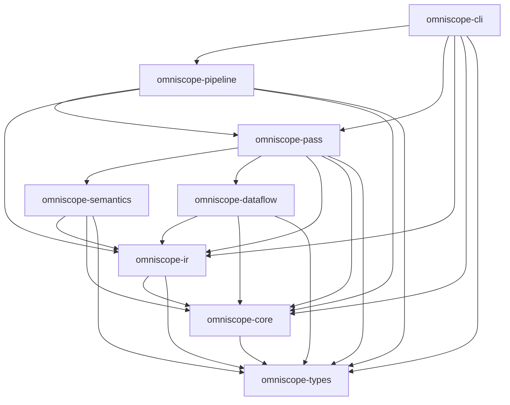
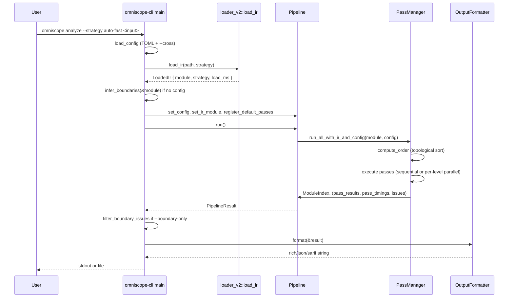
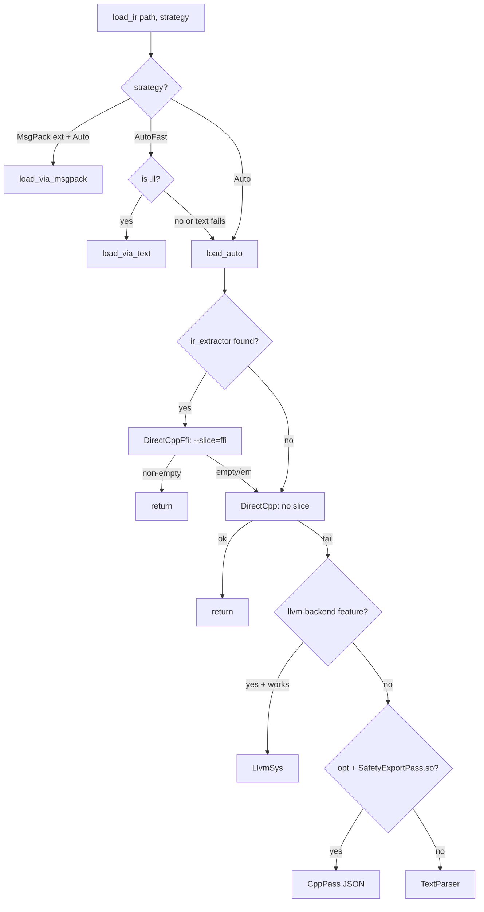

# Architecture

This document describes the actual implementation of OmniScope-rs as found in
the source tree. Every claim is traced to a file path.

## Workspace layout

OmniScope-rs is a Cargo workspace. The members are declared in
`Cargo.toml:65-75`:

- `crates/omniscope-core`
- `crates/omniscope-types`
- `crates/omniscope-ir`
- `crates/omniscope-dataflow`
- `crates/omniscope-semantics`
- `crates/omniscope-pass`
- `crates/omniscope-pipeline`
- `crates/omniscope-cli`

The top-level package `omniscope` (declared in `Cargo.toml:1-12`) is the
workspace root binary crate. It hosts only the criterion benchmarks
(`Cargo.toml:33-63`); it has no `[lib]` and no `[[bin]]` of its own. The
user-facing binary is produced by `omniscope-cli`
(`crates/omniscope-cli/Cargo.toml:12-14`):

```toml
[[bin]]
name = "omniscope"
path = "src/main.rs"
```

So the installed/built executable is named `omniscope`, not `omniscope-rs`.

## Crate dependency graph

The graph below is derived from the `[dependencies]` section of each crate's
`Cargo.toml`.


```mermaid
graph TD
    cli[omniscope-cli]
    pipeline[omniscope-pipeline]
    pass[omniscope-pass]
    semantics[omniscope-semantics]
    dataflow[omniscope-dataflow]
    ir[omniscope-ir]
    core[omniscope-core]
    types[omniscope-types]

    cli --> pipeline
    cli --> pass
    cli --> ir
    cli --> core
    cli --> types

    pipeline --> pass
    pipeline --> ir
    pipeline --> core
    pipeline --> types

    pass --> semantics
    pass --> dataflow
    pass --> ir
    pass --> core
    pass --> types

    semantics --> ir
    semantics --> core
    semantics --> types

    dataflow --> ir
    dataflow --> core
    dataflow --> types

    ir --> core
    ir --> types

    core --> types
```

Notable detail: `omniscope-ir` has an optional `llvm-backend` feature that
pulls in `llvm-sys = 221` (`crates/omniscope-ir/Cargo.toml:13-23`). When the
feature is off, llvm-sys is not linked at all. The workspace feature
`llvm-backend` defined in `Cargo.toml:14-16` forwards to this.

## Design Philosophy

This section explains the rationale behind several architectural decisions
that may not be obvious from the code alone.

### Why LLVM IR?

OmniScope does **not** analyze source code, debug info (DWARF), or BTF. It
operates exclusively on LLVM IR. This choice was made for three reasons:

1. **Language-agnostic foundation.** LLVM IR is the common lowering target for
   C, C++, Rust, Go (via LLVM), Swift, and many others. A single analysis
   pipeline can handle multiple source languages without per-language AST
   parsers. DWARF and BTF are debug formats — they lack control-flow graphs,
   call graphs, and instruction-level detail.

2. **Semantic density.** LLVM IR preserves enough high-level information
   (allocas, loads/stores, calls, GEPs, memcpy) to reconstruct ownership and
   lifetime semantics, while stripping away syntactic noise. Source-level ASTs
   would require a separate parser and semantic model for every language.

3. **Ecosystem leverage.** LLVM provides mature tooling (`opt`, `llvm-dis`,
   `llvm-sys`) for IR extraction and transformation. OmniScope's
   `LoadStrategy` enum (`loader_v2.rs:60-95`) reflects a pragmatic, tiered
   approach: it probes multiple backends in priority order and falls back
   gracefully, rather than requiring a single rigid extraction path.

> **Tradeoff acknowledged:** LLVM IR is lossy. Macros, templates, and
> high-level type information (e.g., Rust's lifetime annotations, C++'s
> move semantics) are lowered to generic load/store/call instructions.
> OmniScope compensates with language-specific semantic adapters in
> `omniscope-semantics`, but some precision is inherently unrecoverable.

### Why the 4-stage pipeline?

`pipeline.rs:85-127` shows `register_default_passes`, which registers
passes in four conceptual stages:

- **Foundation** — `CallGraphPass` (no dependencies). Builds the call graph
  that everything else depends on.
- **Analysis** — `FFIBoundaryPass`, `SurfaceClassifierPass`, `DangerSurfacePass`,
  `RawFactCollectorPass`, etc. Extract facts from IR and classify patterns.
- **Verification** — `IssueVerifierPass`, `LeakDetectionPass`. Formulate and
  verify issue candidates against the evidence.
- **Reporting** — Deduplication and output formatting (handled by
  `PipelineResult` and the CLI output layer).

This separation ensures that a fact-producing pass (e.g., `RawFactCollector`)
can be replaced or augmented without touching consumers (e.g.,
`OwnershipSolver`). The dependency declarations (`dependencies()`) act as a
contract: the topological sort in `PassManager::compute_order`
(`manager.rs:41-70`) guarantees that producers run before consumers.

### Why the blackboard pattern?

`PassContext` (`pass.rs:156-181`) stores shared data as
`Arc<HashMap<String, Arc<dyn Any + Send + Sync>>>` — a typed blackboard —
rather than defining a trait-based visitor or a fixed struct with named
fields. The rationale:

1. **Decoupled pass evolution.** A new pass can introduce a new data type
   (e.g., `ContractGraph`, `SummaryStore`) without modifying a central
   context struct. Passes opt in to reading data by key; they are not forced
   to implement a visitor interface.

2. **Parallel safety.** `Arc<HashMap<...>>` enables cheap clone-for-parallel
   (`pass.rs:725`): shared data is Arc-cloned (refcount bump), while
   write-only state (diagnostics, facts, issues) starts empty in each
   parallel context. After a parallel level, `merge()` (`manager.rs:243-251`)
   combines results.

3. **Dynamic dispatch is the right tool here.** A trait-based visitor would
   require all data types to be known at compile time and would couple every
   pass to a central visitor trait. The blackboard trades compile-time type
   safety for flexibility — an acceptable tradeoff in a plugin-like pass
   architecture where data types are added incrementally.

### Why parallel execution is opt-in

`PassManager::new()` sets `parallel: false` (`manager.rs:25-28`). Parallel
execution requires explicit opt-in via `set_parallel(true)`. The CLI defaults
to sequential (`crates/omniscope-cli/src/main.rs:158-161`). The reasons:

1. **Sequential is simpler to debug.** When a pass produces wrong results,
   sequential execution gives deterministic, reproducible ordering. Parallel
   execution introduces race-condition bugs in pass communication (e.g., two
   passes writing to the same blackboard key) that are hard to reproduce.

2. **Overhead outweighs benefit for small modules.** For a single `.ll` file
   with <100 functions, the overhead of cloning contexts and merging results
   (`manager.rs:200-252`) can exceed the parallelism gain. Parallel mode
   shines on large modules (>500 functions) with many independent passes.

3. **The dependency graph limits parallelism.** `compute_levels`
   (`manager.rs:274-308`) groups passes into levels; if most passes depend on
   `CallGraphPass`, the first level contains only one pass, and subsequent
   levels contain few independent passes. The effective parallelism is bounded
   by the DAG width, not the number of passes.

### Why ModuleIndex is a blackboard entry, not a pass

`run_all_with_ir_and_config` builds a `ModuleIndex` and stores it in the
context directly (`manager.rs:175-183`), rather than defining it as a pass.
This is intentional:

1. **ModuleIndex is read-only metadata.** It pre-computes language detection,
   registry lookups, and call classification from the IR module. It does not
   produce issues, facts, or diagnostics. Making it a pass would require it
   to participate in the pass lifecycle (dependency resolution, execution,
   result collection) for no benefit.

2. **It is a cache, not an analysis.** Multiple passes (`FFIBoundaryPass`,
   `LanguageAdapterFactPass`) read from `ModuleIndex`, but none write to it.
   Building it eagerly before any pass runs ensures that all passes see a
   consistent snapshot.

3. **Avoids circular dependencies.** If `ModuleIndex` were a pass, it would
   need to depend on nothing (it uses only the IR module), but several passes
   would depend on it. That creates a virtual pass that exists only to be
   depended upon — misleading in `compute_order`. Storing it as a blackboard
   entry communicates that it is infrastructure, not analysis.

## Crate responsibilities

| Crate | Key contents | Source directory |
|---|---|---|
| `omniscope-types` | `Language`, `FamilyId`, `OmniScopeConfig`, `BoundaryContext`, `VerifierVerdict`, `Effect`, `Evidence`, `IssueCandidateKind`, `PointerContract` | `crates/omniscope-types/src/` |
| `omniscope-core` | `Issue`, `IssueKind`, `Severity`, `Confidence`, `Diagnostic`, `Fact`, `IssueCandidate`, `FfiEvidence`, `MemoryPool`, `Profiler` | `crates/omniscope-core/src/` |
| `omniscope-ir` | IR text parser, `IRModule`, three loading backends (DirectCpp, llvm-sys, CppPass), msgpack support, `IrCache` | `crates/omniscope-ir/src/` |
| `omniscope-semantics` | `LanguageDetector`, `FamilyRegistry`, language adapters (C++/Python/Java/Go/C#), `SemanticTree`, `SemanticEngine`, `SurfaceClassifier` | `crates/omniscope-semantics/src/` |
| `omniscope-pass` | `Pass` trait, `PassManager`, `PassContext`, `ModuleIndex`, all 21 analysis passes | `crates/omniscope-pass/src/` |
| `omniscope-pipeline` | `Pipeline`, registers default passes, drives `PassManager`, `PipelineResult` | `crates/omniscope-pipeline/src/` |
| `omniscope-cli` | Binary `omniscope`, five subcommands (`analyze`/`audit`/`info`/`init`/`validate`) | `crates/omniscope-cli/src/` |
| `omniscope-dataflow` | Generic forward/backward dataflow framework (standalone, not currently consumed by the pipeline) | `crates/omniscope-dataflow/src/` |

## CLI entry point

`crates/omniscope-cli/src/main.rs:100-116` defines five subcommands via clap:

- `analyze` — run the full pipeline on an IR file
- `audit` — run the pipeline with a language-specific message wrapper
- `info` — print version and a hard-coded pass list
- `init` — write a default `omniscope.toml` config file
- `validate` — validate an `omniscope.toml` config file

The README only mentions `analyze`, `audit`, and `info`. `init` and `validate`
are real subcommands but not documented in the README.

## End-to-end pipeline (analyze)

`run_analyze` in `crates/omniscope-cli/src/main.rs:268-426` orchestrates a
single analysis:

1. Load config from `--config` or default locations
   (`crates/omniscope-cli/src/main.rs:435-475`).
2. Parse the IR file via `omniscope_ir::loader_v2::load_ir`
   (`crates/omniscope-ir/src/loader_v2.rs:186-238`).
3. Construct a `Pipeline`
   (`crates/omniscope-pipeline/src/pipeline.rs:32-39`).
4. If neither `--cross` nor `ffi_boundary` config is present, run
   `omniscope_pass::infer_boundaries` on the module and feed the result back
   into the config
   (`crates/omniscope-cli/src/main.rs:311-333`,
   `crates/omniscope-pass/src/analysis/boundary_inference.rs:26`).
5. Register the default passes (21 passes)
   (`crates/omniscope-pipeline/src/pipeline.rs:85-127`).
6. Run the pipeline (`Pipeline::run`,
   `crates/omniscope-pipeline/src/pipeline.rs:129-142`).
7. Optionally filter to FFI-boundary issues only
   (`crates/omniscope-cli/src/main.rs:482-531`).
8. Format the result as `rich`, `json`, or `sarif`
   (`crates/omniscope-cli/src/output/mod.rs:8-40`).


```mermaid
sequenceDiagram
    participant User
    participant CLI as omniscope-cli main
    participant Loader as loader_v2::load_ir
    participant Pipeline
    participant PassMgr as PassManager
    participant Out as OutputFormatter

    User->>CLI: omniscope analyze --strategy auto-fast <input>
    CLI->>CLI: load_config (TOML + --cross)
    CLI->>Loader: load_ir(path, strategy)
    Loader-->>CLI: LoadedIr { module, strategy, load_ms }
    CLI->>CLI: infer_boundaries(&module) if no config
    CLI->>Pipeline: set_config, set_ir_module, register_default_passes
    CLI->>Pipeline: run()
    Pipeline->>PassMgr: run_all_with_ir_and_config(module, config)
    PassMgr->>PassMgr: compute_order (topological sort)
    PassMgr->>PassMgr: execute passes (sequential or per-level parallel)
    PassMgr->>Pipeline: ModuleIndex, (pass_results, pass_timings, issues)
    Pipeline-->>CLI: PipelineResult
    CLI->>CLI: filter_boundary_issues if --boundary-only
    CLI->>Out: format(&result)
    Out-->>CLI: rich/json/sarif string
    CLI-->>User: stdout or file
```

## IR loading strategy

`crates/omniscope-ir/src/loader_v2.rs:118-155` defines a `LoadStrategy` enum
with the following variants:

- `DirectCppFfi` — runs the `ir_extractor` binary with `--slice=ffi
  --slice-hops=2 --format=msgpack` (`loader_v2.rs:516-601`).
- `DirectCpp` — runs `ir_extractor --format=msgpack` without the FFI slice
  filter (`loader_v2.rs:615-682`).
- `LlvmSys` — uses the llvm-sys C API adapter; only compiled when
  `llvm-backend` feature is enabled (`loader_v2.rs:385-418`).
- `CppPass` — invokes `opt -load-pass-plugin SafetyExportPass.so
  -passes=safety-export` and parses the JSON it emits
  (`loader_v2.rs:441-502`).
- `TextParser` — pure-Rust text parser via `IRModule::load_from_file`
  (`loader_v2.rs:692-694`). Always available.
- `MsgPack` — loads a pre-extracted `.msgpack` file
  (`loader_v2.rs:704-707`).
- `Auto` — probes backends in priority order
  (`loader_v2.rs:251-326`).
- `AutoFast` — same as `Auto`, but for `.ll` files (especially > 10 MB),
  prefer the text parser first (`loader_v2.rs:333-375`).

The CLI default is `auto-fast` (`crates/omniscope-cli/src/main.rs:162-164`).


```mermaid
flowchart TD
    A[load_ir path, strategy] --> B{strategy?}
    B -->|MsgPack ext + Auto| MP[load_via_msgpack]
    B -->|AutoFast| AF{is .ll?}
    AF -->|yes| TX1[load_via_text]
    AF -->|no or text fails| AU[load_auto]
    B -->|Auto| AU
    AU --> D1{ir_extractor found?}
    D1 -->|yes| DCF[DirectCppFfi: --slice=ffi]
    DCF -->|non-empty| OK1[return]
    DCF -->|empty/err| D2[DirectCpp: no slice]
    D1 -->|no| D2
    D2 -->|ok| OK2[return]
    D2 -->|fail| LS{llvm-backend feature?}
    LS -->|yes + works| LSO[LlvmSys]
    LS -->|no| CPP{opt + SafetyExportPass.so?}
    CPP -->|yes| CPPO[CppPass JSON]
    CPP -->|no| TX2[TextParser]
```

Cached extractor output is stored under the project's `.omniscope-cache` via
`IrCache` (`crates/omniscope-ir/src/ir_cache.rs`, used at
`loader_v2.rs:432-434`).

## Pass manager and execution model

`crates/omniscope-pass/src/manager.rs:11-18` defines `PassManager`:

```rust
pub struct PassManager {
    passes: Vec<Box<dyn Pass>>,
    execution_order: Vec<usize>,
    parallel: bool,
}
```

The `Pass` trait is at `crates/omniscope-pass/src/pass.rs:13-27`. Every pass
declares `name()`, `kind()`, optional `dependencies()`, and a `run()` that
mutates a shared `PassContext`.

### Ordering

`compute_order` (`manager.rs:41-70`) does a topological sort over the
dependency graph declared by each pass. Cycles are detected via the
temp-marking variant of DFS (`manager.rs:73-106`) and surface as
`AnalysisError::DependencyNotSatisfied`.

### Sequential execution

The default mode is sequential (`manager.rs:25-28`: `parallel: false`). Passes
share a single mutable `PassContext` and run in topological order
(`manager.rs:254-268`).

### Parallel execution

When `set_parallel(true)` is called, `run_with_context` groups passes into
dependency levels via `compute_levels` (`manager.rs:274-308`) and runs each
level with Rayon's `par_iter` (`manager.rs:200-252`). Each pass in a level
receives its own `PassContext` produced by `ctx.clone_for_parallel()`
(`pass.rs` — `clone_for_parallel` clones write-only state empty and shares
read-only state via `Arc<HashMap<...>>` declared at
`pass.rs:160-181`). After each level finishes, results are merged back via
`ctx.merge(local_ctx)` (`manager.rs:243-251`).

This matches the README's "topologically sorted into dependency levels;
within each level, Rayon runs them in parallel" claim. However, the CLI
defaults `--parallel` to `false` (`crates/omniscope-cli/src/main.rs:158-161`),
so parallel mode is opt-in.

## PassContext shared state

`PassContext` (`crates/omniscope-pass/src/pass.rs:156-181`) holds:

- `ir_module: Option<Arc<IRModule>>` — the IR module being analyzed.
- `shared: Arc<HashMap<String, Arc<dyn Any + Send + Sync>>>` — typed
  blackboard for passes to communicate (used via `store` and `get`).
- `diagnostics`, `facts`, `issues`, `suppressed_issues` — per-pass outputs.
- `pool: MemoryPool` — arena allocator for short-lived data.
- `config: Option<OmniScopeConfig>` — the merged config (FFI boundaries,
  resource families, analysis flags).
- `next_issue_id: u64` — monotonic issue counter.

Issue emission goes through `emit_issue`, which routes through the SRT
(Suppress/Review/Track) gate before recording the issue in `issues` or
`suppressed_issues`. The return type `EmitOutcome` is declared at
`pass.rs:60-79`.

## ModuleIndex cache

When a module is supplied, `run_all_with_ir_and_config` also builds and
stores a `ModuleIndex` in the context (`manager.rs:175-183`,
`crates/omniscope-pass/src/module_index.rs`). This pre-computes language
detection results, registry lookups, and call classification so subsequent
passes do not re-scan the IR. `FFIBoundaryPass`, for example, reads
`is_single_language` from the index and short-circuits if true
(`crates/omniscope-pass/src/analysis/mod.rs:84-92`).

## Boundary context

`omniscope-types/src/boundary.rs:68` provides `BoundaryContext::from_config`,
which materializes a `BoundaryContext` from configured
`FFIBoundaryConfig` entries. The pass manager always stores a
`BoundaryContext` (possibly empty) in the context under the key
`"boundary_context"` (`manager.rs:155-173`), so verifier passes can rely on
its presence.

## PipelineResult deduplication

`PipelineResult::with_issues` (`crates/omniscope-pipeline/src/result.rs:62-82`)
deduplicates issues by precise key `(IssueKind, function, file, line, column, description_hash)`.
On collision, the issue with higher `(severity, confidence)` is kept and the
loser is counted in `dedup_dropped`. This ensures that two real findings at
distinct source positions are both preserved while byte-identical duplicates
from multiple passes are collapsed.

## Honest Limitations

This section documents known gaps and half-finished features. They are not
secrets — they are engineering tradeoffs that were consciously deferred.

### `omniscope-dataflow` is standalone, not consumed

`crates/omniscope-dataflow/src/` contains a generic forward/backward dataflow
analysis framework (`analysis.rs`, `graph.rs`). It was built as a reusable
foundation for path-sensitive analyses. However, it is **not currently
consumed by any pass in the pipeline**. The leak detection pass
(`LeakDetectionPass`) implements its own path enumeration directly on the
contract graph rather than using the dataflow framework.

> **Honest admission:** This was over-engineering. The dataflow crate was
> extracted early because "we'll need it for path-sensitive analysis," but
> the path-sensitive analysis was never wired up to use it. The crate
> compiles, has tests, and is dependency-ordered in the workspace, but it
> contributes zero issues to any pipeline run. A future refactor should
> either consume it or remove it.

### `LeakDetectionPass` has dead configuration fields

`crates/omniscope-pass/src/resource/path_sensitive_leak/mod.rs:71-74` defines:

```rust
pub struct LeakDetectionPass {
    pub path_budget: usize,     // NOT read by run()
    pub max_path_length: usize, // NOT read by run()
}
```

Both fields are initialized to defaults (`DEFAULT_PATH_BUDGET: usize = 64`,
`DEFAULT_MAX_PATH_LENGTH: usize = 256` at lines 43-46) and exposed via
builder methods (`with_path_budget`, `with_max_path_length` at lines 87-94),
but **neither field is read in the `run()` method**. The pass currently
performs non-path-sensitive matching: it finds allocation/release pairs from
the contract graph and reports unmatched allocations. The path-sensitive
enumeration that would use these budgets was planned but never implemented.

> **Impact:** Setting `--leak-path-budget 128` has no effect today. The
> fields exist for API stability and future use.

### `LanguageAdapterFactPass` declares a fake dependency

`LanguageAdapterFactPass::dependencies()` returns `vec!["ModuleIndex"]`
(`crates/omniscope-pass/src/resource/language_adapter_fact_pass.rs:69`).
However, `"ModuleIndex"` is **not a registered pass** — it is a blackboard
entry key stored by `PassManager::run_all_with_ir_and_config`
(`manager.rs:175-183`).

The dependency string acts as a **marker** that tells the topological sorter:
"I need the module index to be built before I run." But since `ModuleIndex` is
not a pass, the dependency is never resolved by `compute_order`. It works in
practice because `ModuleIndex` is built eagerly in
`run_all_with_ir_and_config` before any pass runs, so it is always available
by the time `LanguageAdapterFactPass` executes. The dependency declaration is
documentation for human readers, not a real constraint for the scheduler.

> **Honest admission:** This is technically a lie to the type system. A
> cleaner design would either make `ModuleIndex` a real pass (with the
> baggage that entails) or use a separate pre-run hook system. The current
> approach works but is misleading.

### Single-module analysis only

OmniScope analyzes one LLVM IR module at a time. Cross-module relationships
(e.g., a C library calling into a Rust library across an FFI boundary where
each library is compiled to a separate `.bc` file) are **not tracked**. The
`--cross` config flag and `BoundaryContext` infrastructure exist to let users
describe cross-module boundaries manually, but automatic cross-module
analysis is not implemented.

> **Practical consequence:** If `libfoo.bc` (C) calls `libbar.bc` (Rust) via
> an FFI boundary, analyzing `libfoo.bc` alone will not see the Rust-side
> allocation/deallocation patterns in `libbar.bc`. The user must provide
> `--cross` annotations to bridge the gap. This is a known limitation and is
> the single largest source of false positives in real-world usage.