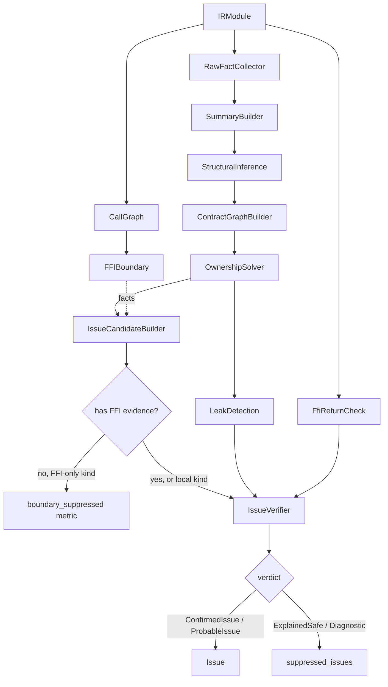

# FFI boundary detection

This document describes how OmniScope-rs detects cross-language FFI
boundaries and decides which candidates to report.

## Language detection

`omniscope-semantics/src/language_detector.rs` exposes
`LanguageDetector` (`language_detector.rs:10-21`). It supports three
entry points:

- `detect_from_function(&str) -> Language`
  (`language_detector.rs:24-40`) — pattern-match the mangled function name.
- `detect_from_module(&str) -> Language`
  (`language_detector.rs:43-70`) — match common module-name suffixes
  (`.rs`, `.zig`, `.go`, `.py`, `.java`, `.cs`, `.cpp`, `.cc`, `.c`).
- `detect_from_functions(&[&str]) -> Language`
  (`language_detector.rs:73-87`) — majority vote over a function list,
  using a `HashMap<Language, usize>` of per-language scores.

The detector is rule-driven. Patterns are built statically in
`LanguageDetector::build_patterns` (`language_detector.rs:90-131`).
Representative rules (full list in source):

- Rust: `_R` prefix (v0 mangling), `__rust_` prefix, several `_ZN`-prefixed
  std names (`_ZN4core`, `_ZN5alloc`, `_ZN3std`), and the
  `is_rust_zn_mangling` helper at `language_detector.rs:184-216`. That
  helper checks for Rust dollar-sign encodings (`$LT$`, `$GT$`, `$u20$`,
  `$RF$`, `$BP$`, `$u5b$`, `$u5d$`) and the `17h<hex>E` hash suffix that
  C++ Itanium mangling never produces.
- C++: `_ZN`, `_ZS`, `_Z` prefixes; `std::` and `::` substrings.
- Zig: `zig.`, `zig_allocator_`, `heap.`, `Io.`, `posix.`, `Thread.`,
  `main.` prefixes.
- Go: `_Cfunc_`, `_cgo_`, `runtime.` prefixes.
- Python: `Py` prefix; `PyObject` substring.
- Java: `Java_` prefix; `JNI` substring.
- C#: `System.Runtime.InteropServices`, `DllImport`, `P/Invoke`
  substrings.

The Rust pre-check at `language_detector.rs:30-32` runs before the generic
`_ZN` → C++ pattern to avoid misclassifying Rust as C++.

The `Language` enum itself is in
`omniscope-types/src/config.rs` and is referenced from
`omniscope-cli/src/main.rs:60-75` (which accepts the aliases `cpp`/`c++`,
`rust`/`rs`, `python`/`py`, `csharp`/`c#`/`cs`).

## Single-language short-circuit

`ModuleIndex` records `is_single_language` during construction
(`crates/omniscope-pass/src/module_index.rs`). `FFIBoundaryPass` reads it at
`crates/omniscope-pass/src/analysis/mod.rs:84-92` and returns immediately
when true:

```rust
if let Some(index) = ctx.get_ref::<ModuleIndex>("module_index") {
    if index.is_single_language {
        return Ok(PassResult::new(self.name())...);
    }
}
```

This optimization was added in commit `bd21984`
("Single-language module skips FFI detection ...").

## Boundary inference vs. configuration

There are two ways FFI boundaries enter the pipeline:

1. **Explicit configuration.** A TOML file at `./omniscope.toml` or
   `~/.config/omniscope/config.toml` may declare `[[ffi_boundary]]` blocks
   with `from`, `to`, `functions`, and `pattern` fields
   (`omniscope-types/src/config.rs`). The CLI `--cross FROM:TO` flag
   (`omniscope-cli/src/main.rs:138-139`) appends additional boundaries.
2. **Automatic inference.** When no explicit boundary is provided, the CLI
   calls `omniscope_pass::infer_boundaries(&module)`
   (`omniscope-cli/src/main.rs:317`,
   `omniscope-pass/src/analysis/boundary_inference.rs:26`). The inferred
   edges are converted to `FFIBoundaryConfig` entries before passes are
   registered.

Both paths converge in `BoundaryContext::from_config`
(`omniscope-types/src/boundary.rs:68`), which is stored in `PassContext`
under the key `"boundary_context"` by `run_all_with_ir_and_config`
(`crates/omniscope-pass/src/manager.rs:155-173`).

## ResourceFamily

The `FamilyId` newtype is defined in
`crates/omniscope-types/src/resource_family.rs:14-16`. It is a `u16` with
the following built-in constants (`resource_family.rs:18-96`):

| ID | Family | Notes |
|---|---|---|
| 1 | `C_HEAP` | `malloc`/`calloc`/`realloc` + `free` |
| 2 | `CPP_NEW_SCALAR` | C++ scalar `new`/`delete` |
| 3 | `CPP_NEW_ARRAY` | C++ array `new[]`/`delete[]` |
| 4 | `RUST_GLOBAL` | `__rust_alloc` / `__rust_dealloc` |
| 5 | `PYTHON_OBJECT` | `PyObject_New` / `PyObject_Free` |
| 6 | `PYTHON_MEM` | `PyMem_Malloc` / `PyMem_Free` |
| 7 | `PYTHON_MEM_RAW` | `PyMem_RawMalloc` / `PyMem_RawFree` |
| 8 | `JAVA_LOCAL_REF` | JNI `NewLocalRef` / `DeleteLocalRef` |
| 9 | `JAVA_GLOBAL_REF` | JNI `NewGlobalRef` / `DeleteGlobalRef` |
| 10 | `CSHARP_HGLOBAL` | `Marshal.AllocHGlobal` / `FreeHGlobal` |
| 11 | `CSHARP_COTASK` | `CoTaskMemAlloc` / `CoTaskMemFree` |
| 12 | `GO_GC` | `runtime.mallocgc` |
| 13 | `ZIG_ALLOCATOR` | Modeled via allocator-vtable evidence |
| 14 | `ZLIB_STREAM` | `inflateInit_`/`inflateEnd` etc. |
| 15 | `OPENSSL_RESOURCE` | `EVP_CIPHER_CTX_new`/`_free` etc. |
| 16 | `SQLITE_RESOURCE` | `sqlite3_open`/`_close` etc. |
| 17 | `GO_CGO` | `_cgo_allocate`/`_cgo_free` |
| 18 | `MIMALLOC` | `mi_malloc`/`mi_free` |
| 19 | `CSHARP_COM` | `CoTaskMemAlloc`/`CoTaskMemFree` (COM) |
| 20 | `RUST_RAW_OWNERSHIP` | `Box::into_raw`/`from_raw` etc. |
| 21 | `FILE_DESCRIPTOR` | `open`/`socket` + `close` |
| 22 | `UNKNOWN` | Placeholder for unresolved families |
| 23 | `WIN32_HEAP` | `HeapAlloc`/`HeapFree` |
| 24 | `WIN32_VIRTUAL` | `VirtualAlloc`/`VirtualFree` |

User-mined families start from `USER_FAMILY_START = 256`
(`resource_family.rs:99`) via the `FamilyId::custom(name)` constructor
which hashes the name (`resource_family.rs:111-123`).

The README mentions "Win32/Zig resource families" added in commit
`f533a4d` — these are `WIN32_HEAP`, `WIN32_VIRTUAL`, and `ZIG_ALLOCATOR`
above.

## Cross-family matching

The release-vs-alloc family check happens in
`verify_cross_family_free`
(`crates/omniscope-pass/src/resource/issue_verifier.rs:804`). A candidate
of kind `CrossFamilyFree` is created in `IssueCandidateBuilderPass` when
the release function's family differs from the allocation family. The
verifier then consults `FamilyRegistry`
(`crates/omniscope-semantics/src/resource/family_registry.rs`) plus the
configured `BoundaryContext` to decide whether the mismatch is a real
issue (`ConfirmedIssue`), a likely issue (`ProbableIssue`), or explained
by configuration (`ExplainedSafe`).

The risk score for a confirmed cross-family mismatch is 0.9
(`crates/omniscope-pass/src/resource/risk_scoring.rs:77`).

## Dual-evidence gating

Commit `0117c19` introduces "dual-evidence gating". The implementation is
in `IssueCandidateBuilderPass`
(`crates/omniscope-pass/src/resource/issue_candidate_builder/mod.rs:995-1032`):

```rust
let boundary_suppressed = candidates
    .iter()
    .filter(|c| {
        matches!(c.kind,
            IssueCandidateKind::CrossFamilyFree
                | IssueCandidateKind::CrossLanguageFree
                | IssueCandidateKind::OwnershipEscapeLeak
                | IssueCandidateKind::BorrowEscape,
        ) && !c.has_ffi_evidence()
    })
    .count();
```

`has_ffi_evidence` is defined at
`crates/omniscope-core/src/issue_candidate.rs:207-209` and returns true
when the candidate carries an `FfiEvidence` payload. The gate's purpose:
a cross-family/cross-language candidate that lacks a second piece of
evidence (the FFI evidence) is not reported as an FFI boundary issue. The
candidate is still tracked (it counts toward `boundary_suppressed`), but
gets downgraded to a resource-only issue at most. The verifier then
re-checks each candidate in `IssueVerifierPass::run`
(`resource/issue_verifier.rs:160-220`, see lines 167, 365, 378 for
`has_ffi_evidence` consumers).

The complementary helper `CrossBoundaryEvidence` lives in
`omniscope-types/src/evidence.rs` (re-exported through
`omniscope-core::issue_candidate`). It records caller/callee languages
and is the "first" piece of evidence (the boundary itself).

## Issue kinds

The reported issue type is `IssueKind`
(`crates/omniscope-core/src/issue.rs:27-96`). The full list of variants:

FFI boundary group (`is_ffi_boundary` returns true,
`issue.rs:100-112`):
1. `CrossLanguageFree`
2. `OwnershipViolation`
3. `FfiTypeMismatch`
4. `AbiMismatch`
5. `UncheckedReturn`
6. `FfiUnsafeCall`
7. `CallbackEscape`
8. `LengthTruncation`

Local-only memory group (`is_local_memory`, `issue.rs:115-126`):
9. `DoubleFree`
10. `UseAfterFree`
11. `InvalidFree`
12. `MemoryLeak`
13. `BufferOverflow`
14. `NullDereference`
15. `IntegerOverflow`

Resource contract group (`is_resource_contract`, `issue.rs:132-145`):
16. `CrossFamilyFree`
17. `ConditionalLeak`
18. `DefiniteLeak`
19. `BorrowEscape`
20. `CallbackEscapeIssue`
21. `NeedsModel`
22. `WriteToImmutable`
23. `DoubleReclaim`
24. `OwnershipEscapeLeak`

Concurrency group:
25. `DataRace`
26. `LockOrderViolation`
27. `ThreadCrossing`

Catch-all:
28. `Unknown`

That is **28 variants** in total. The README's "23 issue kinds" is out of
date: counting only the FFI boundary + local-only + resource contract
groups (8 + 7 + 9) gives 24; counting only the resource-contract +
FFI-boundary groups gives 17. No subset of the enum sums to exactly 23.
The number 23 also matches the highest `FamilyId` constant
(`WIN32_HEAP = FamilyId(23)`), but families are distinct from issue
kinds — these may have been conflated in the README.

CWE mappings for each variant are listed in
`IssueKind::cwe_id` (`issue.rs:158-194`).

## Pipeline flow for FFI candidates


