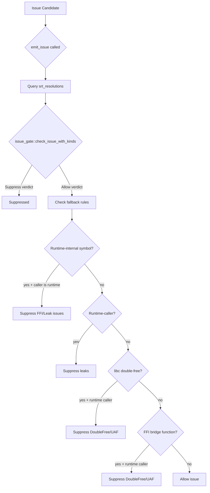

# FP Suppression (SRT Gate)

OmniScope-rs uses a multi-layer false-positive suppression system called
the **SRT Gate** (Suppress/Review/Track). This document describes the
suppression rules and how they work.

## Overview

The SRT gate lives in `PassContext::emit_issue`
(`crates/omniscope-pass/src/pass.rs:377-580`). Every issue passes through
this gate before being recorded. The gate queries `srt_resolutions` (a
`HashMap<String, Vec<SemanticKind>>` populated by `StructuralInferencePass`)
and applies layered suppression rules.



## R-N suppression rules

The rules are defined in `crates/omniscope-pass/src/resource/issue_gate.rs:14-39`.
Each rule corresponds to a "R-N" label from the README's false-positive
suppression table.

| Rule | Issue Kind | Suppression Signal | Source |
|---|---|---|---|
| R-0 | `WriteToImmutable` | `MutableParam` (LLVM readonly/noalias attributes) | `issue_gate.rs` |
| R-1 | `BorrowEscape` | `HeapProvenance` / `GlobalProvenance` | `issue_gate.rs` |
| R-2 | `WriteToImmutable` | `InteriorMutability` (UnsafeCell, mutable) | `issue_gate.rs` |
| R-3 | `UseAfterFree`, `DoubleFree`, `ConditionalLeak`, `DefiniteLeak`, `OwnershipEscapeLeak` | `RaiiDropRelease` (drop_in_place, tail dealloc) | `issue_gate.rs` |
| R-4 | `CrossLanguageFree` | `FileOp`, `NetworkOp`, `ProcessOp` (POSIX syscall class) | `issue_gate.rs` |
| R-6 | `CrossLanguageFree`, `OwnershipEscapeLeak` | `IntoRawTransfer` (Box::into_raw, CString::into_raw) | `issue_gate.rs` |
| R-7 | `CrossLanguageFree` | `LibraryRelease` (library-owned resource) | `issue_gate.rs` |
| R-8 | `BorrowEscape` | `FromParameter` (non-stack provenance) | `issue_gate.rs` |
| R-9 | `UncheckedReturn` | `HeapProvenance` (allocator return) | `issue_gate.rs` |

## Fallback suppression rules

Beyond the SRT gate, `emit_issue` applies four additional fallback rules
(`pass.rs:443-577`):

### 1. Runtime-internal symbol suppression

When `is_runtime_internal(symbol)` is true **and** the caller is also a
runtime-internal function, these issue kinds are suppressed:

- `FfiUnsafeCall`
- `ConditionalLeak`
- `DefiniteLeak`
- `OwnershipEscapeLeak`
- `CrossLanguageFree`
- `OwnershipViolation`

### 2. Runtime-caller leak suppression

When the caller is a runtime-internal function, leak-related issues
(`ConditionalLeak`, `DefiniteLeak`, `OwnershipEscapeLeak`) are suppressed
regardless of the callee symbol.

### 3. libc double-free suppression

When `symbol` is a known libc function and the caller is runtime-internal,
`DoubleFree` and `UseAfterFree` are suppressed. This handles the common
case of runtime allocators calling free on their own allocations.

### 4. FFI bridge function suppression

When the function name starts with `c_`, `rust_`, `py_`, `java_`,
or `go_` and the caller is runtime-internal, `DoubleFree` and
`UseAfterFree` are suppressed. These bridge functions are trusted FFI
glue code.

## Dual-evidence gating

The dual-evidence gate (`IssueCandidateBuilderPass`) is a separate
suppression mechanism that operates at the candidate level:

```rust
// crates/omniscope-pass/src/resource/issue_candidate_builder/mod.rs:995-1032
let boundary_suppressed = candidates
    .iter()
    .filter(|c| {
        matches!(c.kind,
            IssueCandidateKind::CrossFamilyFree
                | IssueCandidateKind::CrossLanguageFree
                | IssueCandidateKind::OwnershipEscapeLeak
                | IssueCandidateKind::BorrowEscape,
        ) && !c.has_ffi_evidence()
    })
    .count();
```

Candidates matching an FFI/cross-family pattern but lacking `FfiEvidence`
are downgraded and not reported as FFI issues. See
[docs/en/ffi_detection.md](ffi_detection.md) for details.

## Dual-evidence gating in IssueVerifier

The verifier applies additional FFI gates (`issue_verifier.rs:155-182`):

1. **Runtime-internal leak gate**: Suppresses leaks when the candidate
   has no FFI evidence **and** the alloc function is runtime-internal
   **and** the caller is runtime-internal.
2. **Runtime allocator/deallocator gate**: Suppresses candidates when
   the allocator/deallocator is a known runtime function and no FFI
   evidence exists.

## Single-language short-circuit

When `ModuleIndex.is_single_language == true`:

- `FFIBoundaryPass` returns empty results (`analysis/mod.rs:84-92`)
- `LanguageAdapterFactPass` skips language-specific facts
  (`language_adapter_fact_pass.rs:79-84`)
- `IssueVerifierPass` only processes local memory issues
  (`issue_verifier.rs:128-153`), skipping `CrossLanguageFree`,
  `CrossFamilyFree`, `OwnershipViolation`, etc.

## Key source files

| Component | File |
|---|---|
| SRT Gate (emit_issue) | `crates/omniscope-pass/src/pass.rs:377-580` |
| issue_gate rules | `crates/omniscope-pass/src/resource/issue_gate.rs:14-39` |
| NoiseReduction utility | `crates/omniscope-pass/src/analysis/noise_reduction.rs` |
| Dual-evidence gating | `crates/omniscope-pass/src/resource/issue_candidate_builder/mod.rs:995-1032` |
| Verifier FFI gates | `crates/omniscope-pass/src/resource/issue_verifier.rs:155-182` |
| StructuralInference (populates SRT) | `crates/omniscope-pass/src/resource/structural_inference_pass.rs` |
| SemanticKind enum | `crates/omniscope-semantics/src/resource/semantic_tree/kind.rs` |
| RaiiDrop detection (R-3) | `crates/omniscope-pass/src/analysis/raii_drop.rs` |
| InteriorMutability detection (R-2) | `crates/omniscope-pass/src/analysis/interior_mutability.rs` |
| HeapProvenance detection (R-1) | `crates/omniscope-pass/src/analysis/heap_provenance.rs` |