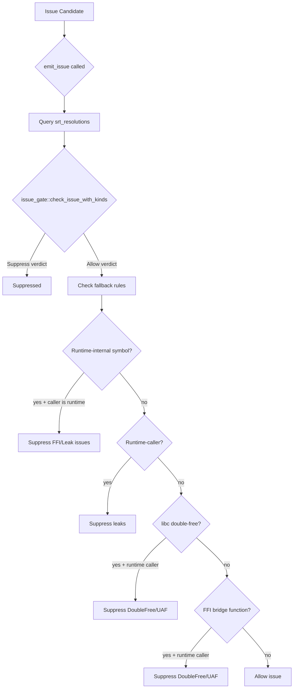

# FP Suppression (SRT Gate)

OmniScope-rs uses a multi-layer false-positive suppression system called
the **SRT Gate** (Suppress/Review/Track). This document describes the
suppression rules and how they work.

## Overview

The SRT gate lives in `PassContext::emit_issue`
(`crates/omniscope-pass/src/pass.rs:377-580`). Every issue passes through
this gate before being recorded. The gate queries `srt_resolutions` (a
`HashMap<String, Vec<SemanticKind>>` populated by `StructuralInferencePass`)
and applies layered suppression rules.


```mermaid
flowchart TD
    A[Issue Candidate] --> B{emit_issue called}
    B --> C[Query srt_resolutions]
    C --> D{issue_gate::check_issue_with_kinds}
    D -->|Suppress verdict| E[Suppressed]
    D -->|Allow verdict| F[Check fallback rules]
    F --> G{Runtime-internal symbol?}
    G -->|yes + caller is runtime| H[Suppress FFI/Leak issues]
    G -->|no| I{Runtime-caller?}
    I -->|yes| J[Suppress leaks]
    I -->|no| K{libc double-free?}
    K -->|yes + runtime caller| L[Suppress DoubleFree/UAF]
    K -->|no| M{FFI bridge function?}
    M -->|yes + runtime caller| N[Suppress DoubleFree/UAF]
    M -->|no| O[Allow issue]
```

> **Design Philosophy: False Positives Are the Real Bug**
>
> The SRT gate was not designed in a vacuum — it was born from a crisis.
> The initial version of OmniScope had an estimated **~70% false positive
> rate**. Users did not even look at the output; they learned to ignore it.
> A tool that produces noise is worse than no tool at all — it erodes trust.
>
> This drove the core design principle: *Better to miss 5 real bugs than to
> drown the user in 50 false alarms.* Every suppression rule in the SRT gate
> was built with this trade-off in mind. We accept a small recall penalty
> for a dramatic improvement in precision.
>
> The system evolved iteratively. The 4 fallback rules at
> `pass.rs:443-577` (see below) were **added after** the main SRT gate was
> already operational. They are safety nets — they catch false positives
> that the semantic analysis missed. This layered architecture (SRT gate
> → fallback rules → dual-evidence gating) reflects the reality that no
> single analysis is sufficient.
>
> The `NoiseReduction` utility at
> `crates/omniscope-pass/src/analysis/noise_reduction.rs` is a **living
> document** of this evolution. It contains ~70 `safe_patterns` and ~14
> `runtime_caller_patterns` — each one added because a real-world test
> case produced a false positive. These patterns are not theoretical;
> they are scars from actual runs against large C++, Rust, Go, and Python
> codebases.

## R-N suppression rules

The rules are defined in `crates/omniscope-pass/src/resource/issue_gate.rs:14-39`.
Each rule corresponds to a "R-N" label from the README's false-positive
suppression table.

| Rule | Issue Kind | Suppression Signal | Source |
|---|---|---|---|
| R-0 | `WriteToImmutable` | `MutableParam` (LLVM readonly/noalias attributes) | `issue_gate.rs` |
| R-1 | `BorrowEscape` | `HeapProvenance` / `GlobalProvenance` | `issue_gate.rs` |
| R-2 | `WriteToImmutable` | `InteriorMutability` (UnsafeCell, mutable) | `issue_gate.rs` |
| R-3 | `UseAfterFree`, `DoubleFree`, `ConditionalLeak`, `DefiniteLeak`, `OwnershipEscapeLeak` | `RaiiDropRelease` (drop_in_place, tail dealloc) | `issue_gate.rs` |
| R-4 | `CrossLanguageFree` | `FileOp`, `NetworkOp`, `ProcessOp` (POSIX syscall class) | `issue_gate.rs` |
| R-6 | `CrossLanguageFree`, `OwnershipEscapeLeak` | `IntoRawTransfer` (Box::into_raw, CString::into_raw) | `issue_gate.rs` |
| R-7 | `CrossLanguageFree` | `LibraryRelease` (library-owned resource) | `issue_gate.rs` |
| R-8 | `BorrowEscape` | `FromParameter` (non-stack provenance) | `issue_gate.rs` |
| R-9 | `UncheckedReturn` | `HeapProvenance` (allocator return) | `issue_gate.rs` |

> **Design Philosophy: Why 10 Rules (R-0 to R-9)?**
>
> The rules R-0 through R-9 were not designed upfront. They were **added
> one by one** as real-world false positives were discovered across the
> corpus. Each rule has a story:
>
> - **R-3 (RAII drop)** was the hardest to get right. Detecting
>   `drop_in_place` in tail position without flagging normal destructor
>   chains required precise control-flow analysis. The RAII drop detector
>   at `crates/omniscope-pass/src/analysis/raii_drop.rs` had to distinguish
>   between "the destructor is running" (suppress) and "user code is
>   manually freeing" (do not suppress). Getting this wrong meant either
>   flooding the user with RAII false positives or silencing real
>   double-frees.
>
> - **R-4 (POSIX syscall)** was added because `CrossLanguageFree` on libc
>   file/network/process operations is actually *safe*. When a file
>   descriptor is closed via `close()` in C and then `close()` is called
>   again in Rust — that is not a cross-language memory bug. The
>   `issue_gate.rs` implementation checks for `FileOp`, `NetworkOp`, and
>   `ProcessOp` semantic kinds to suppress these.
>
> - **R-6 (`IntoRawTransfer`)** is the *opposite* pattern: `Box::into_raw`
>   in Rust → C code → `Box::from_raw` back in Rust is intentionally
>   cross-language. This is not a bug — it is a deliberate ownership
>   handoff. Without R-6, every `Box::into_raw` usage would be flagged
>   as an ownership escape leak.
>
> The lesson is embedded in the architecture: **every suppression rule
> represents a real-world false positive we encountered.** There are no
> theoretical rules. If a rule has no corresponding corpus test case, it
> does not belong in the SRT gate.

## Fallback suppression rules

Beyond the SRT gate, `emit_issue` applies four additional fallback rules
(`pass.rs:443-577`):

### 1. Runtime-internal symbol suppression

When `is_runtime_internal(symbol)` is true **and** the caller is also a
runtime-internal function, these issue kinds are suppressed:

- `FfiUnsafeCall`
- `ConditionalLeak`
- `DefiniteLeak`
- `OwnershipEscapeLeak`
- `CrossLanguageFree`
- `OwnershipViolation`

### 2. Runtime-caller leak suppression

When the caller is a runtime-internal function, leak-related issues
(`ConditionalLeak`, `DefiniteLeak`, `OwnershipEscapeLeak`) are suppressed
regardless of the callee symbol.

### 3. libc double-free suppression

When `symbol` is a known libc function and the caller is runtime-internal,
`DoubleFree` and `UseAfterFree` are suppressed. This handles the common
case of runtime allocators calling free on their own allocations.

### 4. FFI bridge function suppression

When the function name starts with `c_`, `rust_`, `py_`, `java_`,
or `go_` and the caller is runtime-internal, `DoubleFree` and
`UseAfterFree` are suppressed. These bridge functions are trusted FFI
glue code.

> **Design Philosophy: The Safety Net Pattern**
>
> The 4 fallback rules at `pass.rs:443-577` exist because the SRT gate's
> semantic analysis has blind spots. No matter how sophisticated the
> `StructuralInferencePass` becomes, there will always be patterns that
> escape semantic classification — especially in runtime infrastructure
> code. The fallback rules are an explicit admission of this limitation.
>
> - **Runtime-internal suppression (rule 1):** When Go's runtime GC calls
>   `free` on its own allocations, that is not a double-free — it is the
>   runtime's normal operation. The same applies to Rust's `__rust_dealloc`
>   called from within `alloc` internals. These symbols are not "user code"
>   that a developer can fix; they are the substrate the user's code runs
>   on top of.
>
> - **FFI bridge function suppression (rule 4):** Functions with names
>   starting with `c_`, `rust_`, `py_`, `java_`, or `go_` are trusted glue
>   code — the deliberately designed bridges between language runtimes.
>   Reporting a `DoubleFree` on `c_release_buffer` is noise because the
>   bridge function is merely executing the release; the real bug (calling
>   the release twice) is in the caller. The implementation at `pass.rs`
>   checks both the function name prefix and whether the caller is
>   runtime-internal before suppressing.
>
> These rules are best understood as **analysis of last resort**. They use
> naming conventions (function prefixes, known runtime symbols) as a proxy
> for semantics. This is inherently fragile — but in practice, the signal
> is strong enough that the false-suppression rate is negligible compared
> to the noise they eliminate.

## Dual-evidence gating

The dual-evidence gate (`IssueCandidateBuilderPass`) is a separate
suppression mechanism that operates at the candidate level:

```rust
// crates/omniscope-pass/src/resource/issue_candidate_builder/mod.rs:995-1032
let boundary_suppressed = candidates
    .iter()
    .filter(|c| {
        matches!(c.kind,
            IssueCandidateKind::CrossFamilyFree
                | IssueCandidateKind::CrossLanguageFree
                | IssueCandidateKind::OwnershipEscapeLeak
                | IssueCandidateKind::BorrowEscape,
        ) && !c.has_ffi_evidence()
    })
    .count();
```

Candidates matching an FFI/cross-family pattern but lacking `FfiEvidence`
are downgraded and not reported as FFI issues. See
[docs/en/ffi_detection.md](ffi_detection.md) for details.

## Dual-evidence gating in IssueVerifier

The verifier applies additional FFI gates (`issue_verifier.rs:155-182`):

1. **Runtime-internal leak gate**: Suppresses leaks when the candidate
   has no FFI evidence **and** the alloc function is runtime-internal
   **and** the caller is runtime-internal.
2. **Runtime allocator/deallocator gate**: Suppresses candidates when
   the allocator/deallocator is a known runtime function and no FFI
   evidence exists.

## Single-language short-circuit

When `ModuleIndex.is_single_language == true`:

- `FFIBoundaryPass` returns empty results (`analysis/mod.rs:84-92`)
- `LanguageAdapterFactPass` skips language-specific facts
  (`language_adapter_fact_pass.rs:79-84`)
- `IssueVerifierPass` only processes local memory issues
  (`issue_verifier.rs:128-153`), skipping `CrossLanguageFree`,
  `CrossFamilyFree`, `OwnershipViolation`, etc.

## Honest Limitations

No suppression system is perfect. The SRT gate and its surrounding
infrastructure have known limitations that every user and contributor
should understand.

### Heuristic nature of suppression rules

The 10 R-N rules and the 4 fallback rules are inherently heuristic. They
encode patterns observed in real-world codebases, but there is no formal
guarantee that a suppressed issue is truly a false positive. In edge
cases — particularly when a runtime-internal function is genuinely
misused by user code — a suppression rule may silence a real bug.

For example, R-4 (POSIX syscall suppression) assumes that `close()` on
a file descriptor is always safe across languages. This is true 99% of
the time, but there are scenarios where a double-close on a file
descriptor is a genuine bug (racing close on a shared fd across threads).
The SRT gate does not distinguish between these cases.

### Maintenance burden of NoiseReduction

The `NoiseReduction` utility at
`crates/omniscope-pass/src/analysis/noise_reduction.rs` contains ~70
`safe_patterns` and ~14 `runtime_caller_patterns`. Each pattern was added
because a specific real-world test case triggered a false positive.
However, this approach creates a significant maintenance burden:

- **Pattern explosion**: As new runtimes and allocators emerge (Bun's
  custom allocators, new mimalloc APIs, etc.), the pattern list grows.
  Each new pattern must be validated against the existing corpus to
  ensure no regressions.
- **Toolchain evolution**: New compiler versions may change mangling
  schemes or introduce new internal symbols. The pattern list must be
  updated to match. The Rust v0 mangling prefix `_R`, for example, is
  not covered by the `_ZN5alloc` patterns — a gap that will surface as
  more Rust codebases are analyzed.
- **Testing cost**: Every addition to the safe_patterns list adds a
  potential risk of false suppression. The pattern list is tested
  indirectly through the corpus regression tests
  (`tests/corpus_regression.rs`), but there is no unit test that
  explicitly validates the complete pattern set against known false
  positives.

### Fragility of naming-convention-based suppression

Fallback rule 4 (FFI bridge function suppression) relies entirely on
function name prefixes: `c_`, `rust_`, `py_`, `java_`, `go_`. This is
fragile in several ways:

- **Malicious naming**: A function named `c_malloc` that is NOT a bridge
  function would bypass detection. While this is unlikely in practice
  (the tool operates on compiled LLVM IR, and such a function would
  still need to interact with the heap in a buggy way), it is a
  theoretical blind spot.
- **Non-standard prefixes**: Not all FFI bridge functions use these
  prefixes. Some projects use `ffi_`, `extern_`, or no prefix at all.
  These functions will not be suppressed by rule 4.
- **Runtime internal detection**: The `is_runtime_internal` check used
  in all four fallback rules relies on a hardcoded list of runtime
  symbols (`structural_inference_pass.rs`). Any runtime symbol not in
  this list will not be detected, potentially causing false positives
  for new or obscure runtimes.

### Codebase hotspot

The `emit_issue` function at `pass.rs:377-580` is a codebase hotspot.
It spans approximately 200 lines and contains:

1. SRT gate query logic
2. Fallback rules 1–4
3. Suppression outcome tracking
4. Debug logging infrastructure

This concentration of logic makes the function hard to modify without
side effects. Adding a new suppression rule requires careful reading of
all existing rules to ensure no unintended interactions. The function's
length also makes it a frequent source of merge conflicts.

### Suppression-blind issue categories

Some issue kinds bypass most suppression rules entirely:

- `CrossFamilyFree` is deliberately excluded from most fallback
  suppression because it detects wrong-allocator bugs — a category
  where suppression would mask real issues. The only exception is
  `IntoRawTransfer` (R-6) and POSIX syscall classification (R-4).
- `NullDereference` has no R-N suppression rule — it only benefits from
  the `NullChecked` semantic kind detected by `FfiReturnCheckPass`.
  There are no fallback rules for null dereferences.

This means that if a new allocator family emerges (e.g., a custom
arena allocator that pairs `arena_alloc` with `arena_free`), the
`CrossFamilyFree` detector will flag every cross-call between that
allocator and `malloc`/`free` — and the SRT gate will not suppress them
until a new rule or pattern is added.

The SRT gate is not a finished product. It is a living system that must
evolve with the codebases it analyzes. Every new false positive reported
by a user is a candidate for a new suppression rule.

## Key source files

| Component | File |
|---|---|
| SRT Gate (emit_issue) | `crates/omniscope-pass/src/pass.rs:377-580` |
| issue_gate rules | `crates/omniscope-pass/src/resource/issue_gate.rs:14-39` |
| NoiseReduction utility | `crates/omniscope-pass/src/analysis/noise_reduction.rs` |
| Dual-evidence gating | `crates/omniscope-pass/src/resource/issue_candidate_builder/mod.rs:995-1032` |
| Verifier FFI gates | `crates/omniscope-pass/src/resource/issue_verifier.rs:155-182` |
| StructuralInference (populates SRT) | `crates/omniscope-pass/src/resource/structural_inference_pass.rs` |
| SemanticKind enum | `crates/omniscope-semantics/src/resource/semantic_tree/kind.rs` |
| RaiiDrop detection (R-3) | `crates/omniscope-pass/src/analysis/raii_drop.rs` |
| InteriorMutability detection (R-2) | `crates/omniscope-pass/src/analysis/interior_mutability.rs` |
| HeapProvenance detection (R-1) | `crates/omniscope-pass/src/analysis/heap_provenance.rs` |
