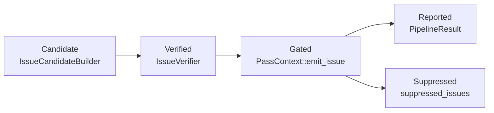

# Issue Model

This document describes the core issue types used throughout OmniScope-rs,
including `IssueKind`, `Severity`, `Confidence`, `VerifierVerdict`, and the
issue lifecycle from detection to reporting.

## Issue lifecycle

Issues flow through the pipeline in four stages:



1. **Candidate** — `IssueCandidateBuilderPass` produces raw candidates with
   evidence from the ownership solver and contract graph.
2. **Verified** — `IssueVerifierPass` checks each candidate against
   `BoundaryContext`, `FamilyRegistry`, and `NoiseReduction`, assigning a
   `VerifierVerdict`.
3. **Gated** — `PassContext::emit_issue` routes the issue through the SRT
   (Suppress/Review/Track) gate, which may suppress it based on semantic
   evidence from earlier passes.
4. **Reported** — Surviving issues are collected in `PipelineResult.issues`
   and output by the formatter.

## IssueKind

`IssueKind` (`crates/omniscope-core/src/issue.rs:27-96`) has **28 variants**
across four groups:

### FFI boundary group (8 variants)

These are the core 90% priority issues. `is_ffi_boundary()` returns true
(`issue.rs:100-112`).

| Variant | CWE | Description |
|---|---|---|
| `CrossLanguageFree` | 762 | Resource allocated in one language, freed in another |
| `OwnershipViolation` | 763 | Ownership transfer violated across FFI boundary |
| `FfiTypeMismatch` | 843 | Type incompatibility at FFI interface |
| `AbiMismatch` | 758 | ABI calling convention mismatch |
| `UncheckedReturn` | 252 | Nullable FFI return dereferenced without null check |
| `FfiUnsafeCall` | 119 | FFI call with dangerous semantics |
| `CallbackEscape` | 749 | Callback escapes across language boundary |
| `LengthTruncation` | 197 | Length/size truncation (e.g., usize → u32) |

### Local-only memory group (7 variants)

Auxiliary 10% priority. `is_local_memory()` returns true
(`issue.rs:115-126`).

| Variant | CWE | Description |
|---|---|---|
| `DoubleFree` | 415 | Same allocation freed twice |
| `UseAfterFree` | 416 | Dangling pointer dereference |
| `InvalidFree` | 763 | Free of pointer not from malloc |
| `MemoryLeak` | 401 | Allocation never freed |
| `BufferOverflow` | 120 | Write past allocation bounds |
| `NullDereference` | 476 | NULL pointer dereference |
| `IntegerOverflow` | 190 | Integer overflow leading to memory corruption |

### Resource contract group (9 variants)

`is_resource_contract()` returns true (`issue.rs:132-145`).

| Variant | CWE | Description |
|---|---|---|
| `CrossFamilyFree` | 762 | Alloc and free from different resource families |
| `ConditionalLeak` | 772 | Resource not freed on some execution paths |
| `DefiniteLeak` | 772 | Resource not freed on all analyzed paths |
| `BorrowEscape` | 822 | Borrowed pointer escapes to ownership context |
| `CallbackEscapeIssue` | 749 | Pointer escapes to callback that may assume ownership |
| `NeedsModel` | — | Requires model annotation |
| `WriteToImmutable` | 123 | Write to immutable memory location |
| `DoubleReclaim` | 415 | Multiple `from_raw` on same raw pointer |
| `OwnershipEscapeLeak` | 772 | `into_raw` never reclaimed via `from_raw` |

### Concurrency group (3 variants)

| Variant | CWE | Description |
|---|---|---|
| `DataRace` | 362 | Data race across FFI boundary |
| `LockOrderViolation` | 833 | Lock ordering violation |
| `ThreadCrossing` | 362 | Unsafe pointer crossing thread boundary |

### Catch-all (1 variant)

| Variant | Description |
|---|---|
| `Unknown` | Unclassifiable issue |

## Severity

`Severity` (`crates/omniscope-core/src/diagnostics.rs:16-27`) has four levels:

| Level | Description |
|---|---|
| `Error` | Critical — analysis cannot continue or confirmed vulnerability |
| `Warning` | Potential issue requiring human review |
| `Note` | Additional diagnostic information |
| `Help` | Suggestion for fixing |

Filtering methods: `is_error()`, `is_warning()`.

## Confidence

`Confidence` (`crates/omniscope-core/src/issue.rs`) reflects how certain the
analysis is about a finding:

| Level | Value | Meaning |
|---|---|---|
| `High` | 1.0 | Confirmed by multiple evidence sources |
| `Medium` | 0.85 | Strong evidence but not definitive |
| `Low` | 0.5-0.7 | Heuristic pattern match, may be false positive |

## VerifierVerdict

`VerifierVerdict` (`crates/omniscope-types/src/effect.rs:250-260`) is the
output of `IssueVerifierPass` for each candidate:

| Verdict | Reportable | Meaning |
|---|---|---|
| `ConfirmedIssue` | Yes | Confirmed real issue with high confidence |
| `ProbableIssue` | Yes | Likely real, needs human review |
| `Diagnostic` | No | Not a bug, useful for debugging analysis |
| `ExplainedSafe` | No | Investigated and found benign |

Only `ConfirmedIssue` and `ProbableIssue` appear in default output. The
`is_reportable()` method (`effect.rs:264-269`) controls this.

## Issue deduplication

`PipelineResult::with_issues` (`crates/omniscope-pipeline/src/result.rs:62-82`)
deduplicates by precise key:

```
(IssueKind, function, file, line, column, description_hash)
```

On collision, the issue with higher `(severity, confidence)` wins and the
loser is counted in `dedup_dropped` (`result.rs:38-39`). This prevents
duplicate reporting across multiple passes while preserving distinct
findings at different source positions.

## Source files

| Type | File |
|---|---|
| `IssueKind` | `crates/omniscope-core/src/issue.rs:27-96` |
| `Severity` | `crates/omniscope-core/src/diagnostics.rs:16-27` |
| `Confidence` | `crates/omniscope-core/src/issue.rs` |
| `VerifierVerdict` | `crates/omniscope-types/src/effect.rs:250-260` |
| `Issue` struct | `crates/omniscope-core/src/issue.rs` |
| `IssueCandidate` | `crates/omniscope-core/src/issue_candidate.rs` |
| `IssueCandidateKind` | `crates/omniscope-types/src/evidence.rs:283-332` |
| `EmitOutcome` | `crates/omniscope-pass/src/pass.rs:60-79` |