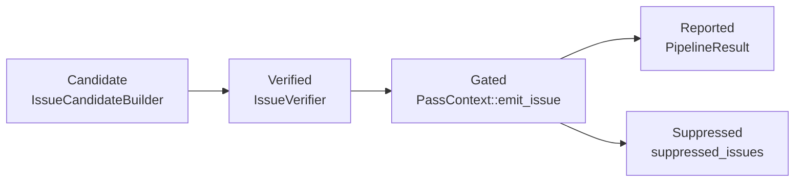

# Issue Model

This document describes the core issue types used throughout OmniScope-rs,
including `IssueKind`, `Severity`, `Confidence`, `VerifierVerdict`, and the
issue lifecycle from detection to reporting.

## Issue lifecycle

Issues flow through the pipeline in four stages:


```mermaid
flowchart LR
    A[Candidate<br/>IssueCandidateBuilder] --> B[Verified<br/>IssueVerifier]
    B --> C[Gated<br/>PassContext::emit_issue]
    C --> D[Reported<br/>PipelineResult]
    C --> E[Suppressed<br/>suppressed_issues]
```

1. **Candidate** — `IssueCandidateBuilderPass` produces raw candidates with
   evidence from the ownership solver and contract graph.
2. **Verified** — `IssueVerifierPass` checks each candidate against
   `BoundaryContext`, `FamilyRegistry`, and `NoiseReduction`, assigning a
   `VerifierVerdict`.
3. **Gated** — `PassContext::emit_issue` routes the issue through the SRT
   (Suppress/Review/Track) gate, which may suppress it based on semantic
   evidence from earlier passes.
4. **Reported** — Surviving issues are collected in `PipelineResult.issues`
   and output by the formatter.

## IssueKind

`IssueKind` (`crates/omniscope-core/src/issue.rs:27-96`) has **28 variants**
across four groups:

> **Design Philosophy: 4 Groups, 28 Variants — Why Not More? Why Not Less?**
>
> The 28 variants were iteratively reduced from an initial ~60+ during
> development. Each variant must answer one question: *"What action does the
> user take?"* If two variants lead to the same fix, they are merged. This
> ensures every variant in the enum corresponds to a distinct remediation
> workflow.
>
> The 90/10 priority split is embedded in the analysis pipeline:
> **FFI boundary issues (8 variants)** receive 90% of engineering effort
> because they are OmniScope's unique value proposition — no other tool
> detects cross-language memory errors with this precision. **Local memory
> issues (7 variants, CWE 415/416/401)** get 10% because existing tools
> (Valgrind, ASan, Miri) already handle them well.
>
> The 4 groups map to different fix workflows:
> - **FFI boundary** issues require cross-team communication (C dev + Rust dev
>   need to agree on ownership protocol)
> - **Resource contract** issues need a code audit of the
>   allocation/deallocation paths
> - **Concurrency** issues require locking design review
> - **Local memory** issues can often be fixed with local refactoring
>
> See `issue.rs:27-96` (IssueKind enum) and the `is_ffi_boundary()` /
> `is_local_memory()` / `is_resource_contract()` methods.

### FFI boundary group (8 variants)

These are the core 90% priority issues. `is_ffi_boundary()` returns true
(`issue.rs:100-112`).

| Variant | CWE | Description |
|---|---|---|
| `CrossLanguageFree` | 762 | Resource allocated in one language, freed in another |
| `OwnershipViolation` | 763 | Ownership transfer violated across FFI boundary |
| `FfiTypeMismatch` | 843 | Type incompatibility at FFI interface |
| `AbiMismatch` | 758 | ABI calling convention mismatch |
| `UncheckedReturn` | 252 | Nullable FFI return dereferenced without null check |
| `FfiUnsafeCall` | 119 | FFI call with dangerous semantics |
| `CallbackEscape` | 749 | Callback escapes across language boundary |
| `LengthTruncation` | 197 | Length/size truncation (e.g., usize → u32) |

### Local-only memory group (7 variants)

Auxiliary 10% priority. `is_local_memory()` returns true
(`issue.rs:115-126`).

| Variant | CWE | Description |
|---|---|---|
| `DoubleFree` | 415 | Same allocation freed twice |
| `UseAfterFree` | 416 | Dangling pointer dereference |
| `InvalidFree` | 763 | Free of pointer not from malloc |
| `MemoryLeak` | 401 | Allocation never freed |
| `BufferOverflow` | 120 | Write past allocation bounds |
| `NullDereference` | 476 | NULL pointer dereference |
| `IntegerOverflow` | 190 | Integer overflow leading to memory corruption |

### Resource contract group (9 variants)

`is_resource_contract()` returns true (`issue.rs:132-145`).

| Variant | CWE | Description |
|---|---|---|
| `CrossFamilyFree` | 762 | Alloc and free from different resource families |
| `ConditionalLeak` | 772 | Resource not freed on some execution paths |
| `DefiniteLeak` | 772 | Resource not freed on all analyzed paths |
| `BorrowEscape` | 822 | Borrowed pointer escapes to ownership context |
| `CallbackEscapeIssue` | 749 | Pointer escapes to callback that may assume ownership |
| `NeedsModel` | — | Requires model annotation |
| `WriteToImmutable` | 123 | Write to immutable memory location |
| `DoubleReclaim` | 415 | Multiple `from_raw` on same raw pointer |
| `OwnershipEscapeLeak` | 772 | `into_raw` never reclaimed via `from_raw` |

### Concurrency group (3 variants)

| Variant | CWE | Description |
|---|---|---|
| `DataRace` | 362 | Data race across FFI boundary |
| `LockOrderViolation` | 833 | Lock ordering violation |
| `ThreadCrossing` | 362 | Unsafe pointer crossing thread boundary |

### Catch-all (1 variant)

| Variant | Description |
|---|---|
| `Unknown` | Unclassifiable issue |

## Severity

`Severity` (`crates/omniscope-core/src/diagnostics.rs:16-27`) has four levels:

| Level | Description |
|---|---|
| `Error` | Critical — analysis cannot continue or confirmed vulnerability |
| `Warning` | Potential issue requiring human review |
| `Note` | Additional diagnostic information |
| `Help` | Suggestion for fixing |

Filtering methods: `is_error()`, `is_warning()`.

## Confidence

`Confidence` (`crates/omniscope-core/src/issue.rs`) reflects how certain the
analysis is about a finding:

| Level | Value | Meaning |
|---|---|---|
| `High` | 1.0 | Confirmed by multiple evidence sources |
| `Medium` | 0.85 | Strong evidence but not definitive |
| `Low` | 0.5-0.7 | Heuristic pattern match, may be false positive |

> **Design Philosophy: Why 0.85 for Medium?**
>
> The confidence values are not arbitrary thresholds. They encode a specific
> epistemology about evidence quality:
>
> - **High (1.0)** means multiple *independent* evidence sources agree. For
   example, cross-family verification (`issue_verifier/mod.rs:806`,
   `verify_cross_family_free`) plus FFI boundary evidence from
>   `BoundaryContext` constitutes dual-evidence gating — two different analysis
>   engines reached the same conclusion through different reasoning paths.
>
> - **Medium (0.85)** means a strong pattern match from a single evidence
>   source. The verifier found a cross-family call but cannot confirm the
>   boundary — the pattern is correct but lacks corroboration.
>
> - **Low (0.5–0.7)** means a heuristic match. The IR pattern resembles a known
>   unsafe pattern (e.g., a `free()` call after a function pointer invocation),
>   but the signal-to-noise ratio is poor.
>
> This tiered system prevents the common pitfall of averaging confidence scores
> that are not comparable across analysis techniques. A single Low source plus
> another Low source does not equal Medium — they remain Low unless they are
> *independent* and *convergent*.

## VerifierVerdict

`VerifierVerdict` (`crates/omniscope-types/src/effect.rs:250-260`) is the
output of `IssueVerifierPass` for each candidate:

| Verdict | Reportable | Meaning |
|---|---|---|
| `ConfirmedIssue` | Yes | Confirmed real issue with high confidence |
| `ProbableIssue` | Yes | Likely real, needs human review |
| `Diagnostic` | No | Not a bug, useful for debugging analysis |
| `ExplainedSafe` | No | Investigated and found benign |

Only `ConfirmedIssue` and `ProbableIssue` appear in default output. The
`is_reportable()` method (`effect.rs:264-269`) controls this.

> **Design Philosophy: Why 4 Verdicts Instead of Binary?**
>
> A binary "bug / not bug" verdict would lose critical nuance. The
> four-verdict system serves distinct purposes:
>
> - **`ConfirmedIssue` vs `ProbableIssue`** — The distinction is evidence
>   count. A `ConfirmedIssue` has ≥2 independent evidence sources (e.g.,
>   cross-family evidence *and* FFI boundary confirmation). A `ProbableIssue`
>   has only one source. This maps directly to actionable workflow:
>   `ConfirmedIssue` auto-escalates; `ProbableIssue` requires human triage.
>
> - **`ExplainedSafe`** — This verdict is critical for noise reduction. It
>   documents *why* the analysis decided against reporting, which is essential
>   for debugging false-positive regressions. Without this verdict, suppressed
>   candidates vanish silently and maintainers cannot distinguish "was not
>   checked" from "was checked and found safe."
>
> - **`Diagnostic`** — Exists for debugging the analysis pipeline itself, not
>   for end users. It surfaces cases where the verifier received a candidate
>   it cannot evaluate (e.g., `NeedsModel`), helping developers add missing
>   annotations.
>
> See `effect.rs:250-260` (VerifierVerdict enum) and `effect.rs:264-269`
> (`is_reportable()`).

## Issue deduplication

`PipelineResult::with_issues` (`crates/omniscope-pipeline/src/result.rs:62-82`)
deduplicates by precise key:

```
(IssueKind, function, file, line, column, description_hash)
```

On collision, the issue with higher `(severity, confidence)` wins and the
loser is counted in `dedup_dropped` (`result.rs:38-39`). This prevents
duplicate reporting across multiple passes while preserving distinct
findings at different source positions.

## Source files

| Type | File |
|---|---|
| `IssueKind` | `crates/omniscope-core/src/issue.rs:27-96` |
| `Severity` | `crates/omniscope-core/src/diagnostics.rs:16-27` |
| `Confidence` | `crates/omniscope-core/src/issue.rs` |
| `VerifierVerdict` | `crates/omniscope-types/src/effect.rs:250-260` |
| `Issue` struct | `crates/omniscope-core/src/issue.rs` |
| `IssueCandidate` | `crates/omniscope-core/src/issue_candidate.rs` |
| `IssueCandidateKind` | `crates/omniscope-types/src/evidence.rs:283-332` |
| `EmitOutcome` | `crates/omniscope-pass/src/pass.rs:60-79` |

## Honest Limitations

The issue model makes tradeoffs that users should understand:

- **Deduplication lacks call context.** The deduplication key uses
  `(IssueKind, function, file, line, column, description_hash)` but does not
  include call context. Two calls to the same function at the same source
  location but in different stack contexts are merged into one issue. This
  means a function called from two independent call sites with different
  ownership semantics will only produce one finding.

- **Low confidence issues (0.5–0.7) are essentially guesswork.** These
  heuristic matches should be treated as hints, not findings. The analysis
  detected a pattern that *resembles* an unsafe idiom, but the signal is
  weak. Users should not block CI on Low confidence issues.

- **28 variants is a lot to learn.** While the 28-variant taxonomy is
  precise for analysis, it imposes a steep learning curve on users. A
  future UI improvement should collapse the variants to 5–8 fix-level
  categories (e.g., "fix ownership protocol", "add null check", "fix
  allocation family") for human consumption while keeping the 28-variant
  taxonomy for the analysis engine.

- **`Unknown` is an admission of ignorance.** The `Unknown` variant catches
  all patterns the analysis could not classify. It means the pipeline hit
  something it did not understand — either a new pattern not covered by the
  taxonomy or a bug in the classifier. Users should treat `Unknown` issues
  as a prompt to file a bug report or add a model annotation.