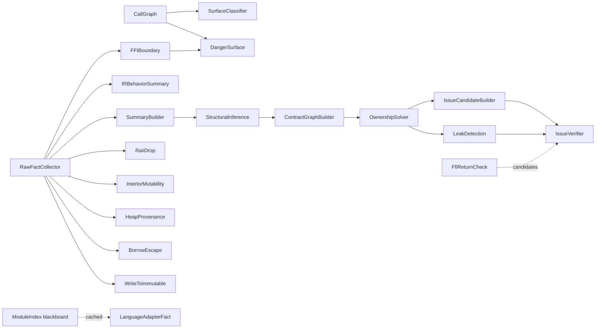

# Analysis passes

This document lists every pass that is actually registered by
`Pipeline::register_default_passes`
(`crates/omniscope-pipeline/src/pipeline.rs:85-126`), with the name string,
dependencies, kind, and source file as found in the code.

The pipeline test at `crates/omniscope-pipeline/src/pipeline.rs:190-199`
asserts that `register_default_passes` produces exactly 20 passes. The
README's "20+ analysis passes" matches that count.

## Registered passes (in source order)

| Pass struct | name() | kind() | dependencies() | Source |
|---|---|---|---|---|
| `CallGraphPass` | `CallGraph` | (default) | `[]` | `analysis/call_graph.rs:36` |
| `FFIBoundaryPass` | `FFIBoundary` | `Analysis` | `["RawFactCollector"]` | `analysis/mod.rs:67-78` |
| `SurfaceClassifierPass` | `SurfaceClassifier` | — | `["CallGraph"]` | `analysis/surface_classifier_pass.rs` |
| `DangerSurfacePass` | `DangerSurface` | — | `["CallGraph", "FFIBoundary"]` | `analysis/danger_surface.rs` |
| `RawFactCollectorPass` | `RawFactCollector` | `Foundation` | `[]` | `resource/raw_fact_collector.rs:315` |
| `IRBehaviorSummaryPass` | `IRBehaviorSummary` | — | `["RawFactCollector"]` | `resource/ir_behavior_summary_pass.rs:52` |
| `LanguageAdapterFactPass` | `LanguageAdapterFact` | — | `["ModuleIndex"]` | `resource/language_adapter_fact_pass.rs:54` |
| `SummaryBuilderPass` | `SummaryBuilder` | `Foundation` | `["RawFactCollector"]` | `resource/summary_builder.rs:35` |
| `StructuralInferencePass` | `StructuralInference` | `Analysis` | `["SummaryBuilder"]` | `resource/structural_inference_pass.rs:57` |
| `ContractGraphBuilderPass` | `ContractGraphBuilder` | — | `["StructuralInference"]` | `resource/contract_graph_builder.rs:229` |
| `OwnershipSolverPass` | `OwnershipSolver` | `Analysis` | `["ContractGraphBuilder"]` | `resource/ownership_solver.rs:62` |
| `IssueCandidateBuilderPass` | `IssueCandidateBuilder` | — | `["OwnershipSolver"]` | `resource/issue_candidate_builder/mod.rs` |
| `IssueVerifierPass` | `IssueVerifier` | — | `["IssueCandidateBuilder", "FfiReturnCheck", "LeakDetection"]` | `resource/issue_verifier.rs:51` |
| `LeakDetectionPass` | `LeakDetection` | — | `["OwnershipSolver"]` | `resource/path_sensitive_leak.rs:97` |
| `RaiiDropPass` | `RaiiDrop` | — | `["RawFactCollector"]` | `analysis/raii_drop.rs` |
| `InteriorMutabilityPass` | `InteriorMutability` | — | `["RawFactCollector"]` | `analysis/interior_mutability.rs` |
| `HeapProvenancePass` | `HeapProvenance` | — | `["RawFactCollector"]` | `analysis/heap_provenance.rs` |
| `BorrowEscapePass` | `BorrowEscape` | — | `["RawFactCollector"]` | `analysis/borrow_escape.rs` |
| `WriteToImmutablePass` | `WriteToImmutable` | — | `["RawFactCollector"]` | `analysis/write_to_immutable.rs` |
| `FfiReturnCheckPass` | `FfiReturnCheck` | — | `[]` (reads `IRModule` directly) | `resource/ffi_return_check.rs:40` |

All source paths are relative to `crates/omniscope-pass/src/`.

The `LanguageAdapterFactPass` declares a dependency on `"ModuleIndex"`. There
is no pass named `ModuleIndex` — `ModuleIndex` is a cached blackboard entry
stored by `PassManager::run_all_with_ir_and_config`
(`crates/omniscope-pass/src/manager.rs:179-183`). The topological sort treats
unknown dependencies as already-satisfied, so this name acts as a
documentation marker rather than a real ordering constraint.

## What each pass does

The descriptions below summarize the `run()` implementation of each pass.

### CallGraphPass
File: `analysis/call_graph.rs`. Reads `ir_module` from context, walks
`IRModule.calls`, builds a call graph, and emits `CrossLangEdge` entries
under the `cross_lang_edges` blackboard key. Consumed by `FFIBoundaryPass`,
`SurfaceClassifierPass`, and `DangerSurfacePass`.

### FFIBoundaryPass
File: `analysis/mod.rs:67-200`. Short-circuits when
`ModuleIndex.is_single_language` is true (`analysis/mod.rs:84-92`). Otherwise
reads `cross_lang_edges`, classifies each call against `FamilyRegistry`, and
emits FFI-boundary `Issue` entries plus `Fact` entries
(`FactKind::FFIBoundary`).

### SurfaceClassifierPass
File: `analysis/surface_classifier_pass.rs`. Classifies each function's
"surface" (entry/exit/escape/internal) by delegating to
`omniscope_semantics::SurfaceClassifier`. Uses cached `LanguageDetector`
from `ModuleIndex` when present.

### DangerSurfacePass
File: `analysis/danger_surface.rs`. Computes a danger surface from
`CrossLangEdge` data plus `FamilyRegistry` to highlight functions that
expose dangerous APIs across language boundaries.

### RawFactCollectorPass
File: `resource/raw_fact_collector.rs`. Foundation pass. Walks
`IRModule.calls` once and produces raw allocation, release, FFI, and
syscall facts under the `raw_facts` blackboard key. Most downstream resource
passes depend on this.

### IRBehaviorSummaryPass
File: `resource/ir_behavior_summary_pass.rs`. Builds a behavior summary
keyed by function ID (`name_to_stable_id` at line 191 hashes the function
name). Consumes raw facts and emits a per-function behavior view used by
later inference.

### LanguageAdapterFactPass
File: `resource/language_adapter_fact_pass.rs`. Runs the language adapters
(`GoAdapter`, `PythonAdapter`, `CppAdapter`, `JavaAdapter`, `CSharpAdapter`
from `omniscope-semantics`) over the indexed function list and produces
semantic facts. This is the "language adapter semantic fact extraction"
referenced in commit `0117c19`. Depends on the cached `ModuleIndex`
(`crates/omniscope-pass/src/manager.rs:179-183`).

### SummaryBuilderPass
File: `resource/summary_builder.rs`. Foundation pass. Consumes raw facts to
build a `SummaryStore` (`omniscope_semantics::resource::summary`) of
per-symbol resource summaries. This is the input to structural inference.

### StructuralInferencePass
File: `resource/structural_inference_pass.rs`. Analysis pass. Runs
`infer_destructor_summary`, `infer_refcount_release_summary`,
`infer_bridge_summary`, and `infer_static_lifetime_summary` from
`omniscope-semantics` over the summary store, filling in inferred behaviors.

### ContractGraphBuilderPass
File: `resource/contract_graph_builder.rs`. Builds a `ContractGraph` of
resource flow (alloc → use → release) across functions. Accepts an optional
`OmniScopeConfig` (`pipeline.rs:101-106`) so user-declared FFI boundaries
contribute edges.

### OwnershipSolverPass
File: `resource/ownership_solver.rs`. Analysis pass. Solves the contract
graph using union-find (`resource/union_find.rs`). Determines which
allocations are owned by which release sites and detects ownership cycles.

### IssueCandidateBuilderPass
File: `resource/issue_candidate_builder/mod.rs`. Walks the solved ownership
state and produces `IssueCandidate` entries (cross-family free, leak,
borrow escape, etc.). Implements the dual-evidence gating discussed in
`docs/en/ffi_detection.md`: candidates that match an FFI/cross-family
pattern but lack `ffi_evidence` are counted in `boundary_suppressed`
(`issue_candidate_builder/mod.rs:1019-1032`). Custom allocator shims are
filtered out (`issue_candidate_builder/mod.rs:1037-1047`).

### LeakDetectionPass
File: `resource/path_sensitive_leak.rs`. Runs path-sensitive analysis over
the contract graph to detect conditional vs. definite leaks. Produces
candidates of kind `ConditionalLeak` / `DefiniteLeak`.

### IssueVerifierPass
File: `resource/issue_verifier.rs`. Consumes candidates from
`IssueCandidateBuilder`, `FfiReturnCheck`, and `LeakDetection`. Runs each
through type-specific verifiers (e.g. `verify_cross_family_free` at
`issue_verifier.rs:804`), checks `BoundaryContext`, and assigns a
`VerifierVerdict` (`ConfirmedIssue` / `ProbableIssue` / `ExplainedSafe` /
`Diagnostic`). Only reportable verdicts are surfaced as `Issue`.

### RaiiDropPass
File: `analysis/raii_drop.rs`. R-3 in the README's FP suppression table.
Detects Rust drop glue (`drop_in_place`) and C++ destructor calls in tail
position so that resource releases performed by RAII are not re-reported
as double-free or leak.

### InteriorMutabilityPass
File: `analysis/interior_mutability.rs`. R-2 in the README. Detects Rust
`UnsafeCell` and C++ `mutable` patterns so that writes through
`&T` / `const T*` to interior-mutable storage are not flagged as
write-to-immutable.

### HeapProvenancePass
File: `analysis/heap_provenance.rs`. R-1 in the README. Classifies pointer
provenance (heap vs. stack vs. static) so that downstream passes can avoid
false positives on non-heap pointers.

### BorrowEscapePass
File: `analysis/borrow_escape.rs`. Detects stack pointer escape across FFI
boundaries and emits issue candidates / facts for downstream verification.

### WriteToImmutablePass
File: `analysis/write_to_immutable.rs`. R-0 in the README. Uses LLVM
parameter attributes (`readonly`, `noalias`) to determine whether a store
is illegal. Emits `WriteToImmutable` candidates only when no interior-
mutability evidence applies.

### FfiReturnCheckPass
File: `resource/ffi_return_check.rs`. Independent pass (no declared
dependencies). Walks `IRModule` directly and emits `UncheckedFfiReturn`
candidates when a nullable FFI return is dereferenced without a null check.

## Helper modules that are NOT registered passes

The `Available Passes` list printed by `omniscope info --passes`
(`crates/omniscope-cli/src/main.rs:785-805`) includes two entries that
are not actually registered:

- `NoiseReduction` (`analysis/noise_reduction.rs`) — defined as a plain
  struct with no `impl Pass`. It is a utility used in-line by other passes
  for false-positive suppression.
- `PrecisionMetrics` (`analysis/noise_reduction.rs`) — same: a struct, not a
  pass. Re-exported from `analysis::mod.rs:48`.

These two names appear in `omniscope info` output but are never passed to
`PassManager::register`. The README's claim that there is a
"PrecisionMetrics (Precision gate with 88% threshold)" pass refers to the
SRT gate logic embedded in `resource/issue_gate.rs` and the helper struct,
not a registered pass.

`MemorySafety`, `PointerOwnership`, and `BufferOverflow` are listed in
`info --passes` (`main.rs:794-797`) but they do not correspond to any
registered pass either. They map roughly to behaviors implemented across
`IssueCandidateBuilder`, `OwnershipSolver`, and the semantic
`buffer_overflow_detector` in `omniscope-semantics`, but no pass with
those exact names is registered.

## Dependency level diagram

The following graph shows the actual edges produced by the declared
`dependencies()` of the registered passes. (`FfiReturnCheck` has no
dependencies but is consumed by `IssueVerifier`, so the dashed arrow shows
the data flow, not a declared dependency.)

