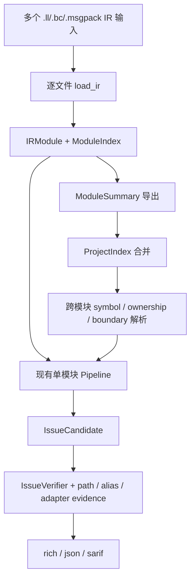

# 跨模块分析、路径敏感验证与语言 Adapter 稳定化开发方案

> 目标读者：OmniScope-rs 维护者和即将参与分析精度改进的贡献者。
>
> 范围：本文只规划三个 README roadmap 项：
>
> - 改进跨模块分析
> - 改进 path-sensitive double-free / leak verification
> - 稳定 language adapter 覆盖
>
> 本方案建立在当前代码库事实上：`ModuleIndex`、boundary evidence、FFI slice、`ContractGraphBuilder`、`OwnershipSolver`、`IssueCandidateBuilder`、`IssueVerifier`、`may_alias`、`LeakDetectionPass`、`LanguageAdapterFactPass` 已经存在，但跨模块、路径语义和部分语言 adapter 仍不稳定。

## 1. 背景和问题

当前工具已经能在单个 LLVM IR module 内跑完整 pipeline，但 release validation 暴露了三个系统性问题：

1. **跨模块缺失**：一次只分析一个 IR 文件，无法把“模块 A 返回拥有权、模块 B 释放/丢弃/误用”的事实连接起来。结果是 factory/wrapper 函数容易被误报为 leak，真正跨边界 caller bug 又可能漏报。
2. **路径敏感不足**：double-free、leak、UAF 仍会被“同一模块出现多个 free”或“存在 release 但路径关系不清”影响。`may_alias` 已经提供了轻量 alias gate，但还没有形成统一的路径证据层。
3. **语言 adapter 覆盖不对称**：当前有 C++、Python、Java/JNI、Go、C#、Wasm adapter 路径，但 Rust 语义仍散落在 registry、structural inference、stdlib whitelist 和 drop tracker 中。下游很难用统一方式判断"这是语言运行时安全模式"还是"真实 FFI 所有权 bug"。bug”。

本方案不追求一次做完整静态分析器。优先目标是：用较小、可验证的改动把误报集中点压下去，并让真实跨边界 bug 有更可靠的证据链。

## 2. 成功标准

### 2.1 v0.2.x 可接受目标

- `ffi-demo` 全量 corpus precision 达到 80% 以上，recall 达到 75% 以上。
- `bun_alloc.ll` 不再出现“两个独立 free 就确认 DoubleFree”的高置信误报。
- allocator factory / wrapper 函数不再默认被报成自身 leak；只有 caller 丢弃返回值或跨模块所有权断裂时才报。
- `omniscope info --passes`、README、release readiness 文档能解释当前 adapter 覆盖状态。

### 2.2 1.0.0 前最低目标

- 支持同一项目内多个 IR module 的摘要合并和跨模块调用解析。
- DoubleFree 报告必须同时具备 release-path 证据和 alias/resource-id 证据。
- DefiniteLeak 和 ConditionalLeak 必须能区分：
  - 返回/写出给 caller 的所有权转移；
  - 同函数所有路径释放；
  - 部分路径释放；
  - 无模型、无法确认。
- Rust 语义有显式 adapter 或等价的统一 fact producer，不再只依赖散落的 name pattern。
- 每个 adapter 有独立的 fact count、测试矩阵和已知限制。

## 3. 总体架构方向

新增一层“项目级事实汇总”，但不重写现有 pipeline：



核心原则：

- 单模块 pipeline 保持可用，不强制用户一次提供全项目 IR。
- 跨模块能力以 summary 形式增量加入，而不是把所有 IR 粘成一个巨型 module。
- Path-sensitive 验证只对候选资源切片运行，不对全程序做指数级路径枚举。
- Language adapter 输出统一的 `SemanticFact`，下游不直接依赖 adapter 私有类型。

## 4. 工作流 A：改进跨模块分析

### A1. 定义 `ModuleSummary`

位置建议：

- 新增 `crates/omniscope-types/src/module_summary.rs`
- 或先放在 `crates/omniscope-pipeline/src/project_index.rs`，稳定后再下沉到 types。

最小字段：

```text
ModuleSummary {
  module_id,
  input_path,
  target_triple,
  defined_functions,
  declarations,
  exports,
  imports,
  call_edges,
  resource_summaries,
  boundary_evidence,
  semantic_facts,
}
```

`resource_summaries` 先只表达函数级契约：

```text
FunctionResourceSummary {
  function,
  acquires: [family, return_value/out_param/global],
  releases: [family, parameter/global],
  transfers_to_caller,
  borrows_returned,
  callbacks_registered,
  confidence,
}
```

验收：

- 对单个 IR 文件导出的 `ModuleSummary` 与当前 `ModuleIndex`/`SummaryStore` 事实数量一致或可解释。
- 不改变现有 `omniscope analyze file.ll` 输出。
- 添加单元测试：一个 module 定义 `make_token`，summary 能表达“返回 C\_HEAP owned resource”。

### A2. 增加多输入入口

CLI 方案分两步：

1. 先支持重复输入参数或目录扫描的内部 API，不急着暴露稳定 CLI。
2. CLI 试验参数可用：

```bash
omniscope analyze-project path/to/ir-dir --format json --output report.json
```

如果暂时不想新增 subcommand，可先做库 API：

```text
ProjectPipeline::from_inputs(Vec<PathBuf>)
ProjectPipeline::run()
```

验收：

- 可以加载 2 个小 IR：`producer.ll` 定义 allocator factory，`consumer.ll` 调用并释放。
- 项目级结果中能把 declaration 解析到另一个 module 的 definition。

### A3. 构建 `ProjectIndex`

`ProjectIndex` 负责跨模块 symbol resolve：

```text
ProjectIndex {
  modules,
  defs_by_symbol,
  decls_by_symbol,
  callers_by_symbol,
  summaries_by_function,
  boundary_edges,
}
```

解析规则先保守：

- 同名强匹配优先。
- C++ demangled 名只作为辅助，不覆盖原符号。
- Rust mangled 名先不做复杂跨 crate 解码，只保留原符号和语言检测结果。
- 多个定义冲突时标记 `AmbiguousDefinition`，不用于高置信 issue。

验收：

- 跨模块调用边能被解析到唯一 definition。
- ambiguous symbol 不产生 ConfirmedIssue，只产生 Diagnostic/NeedsModel。

### A4. 跨模块所有权传播

先处理三类高收益场景：

1. `alloc_factory()` 返回 owned pointer，caller 没有 release。
2. `alloc_factory()` 返回 owned pointer，caller 用错误 family release。
3. module A register callback/userdata，module B unregister/release 或丢失 release。

不要一开始做完整 interprocedural dataflow。先把函数 summary 当作 contract：

```text
callee summary says: returns owned C_HEAP
caller callsite says: result ignored / returned / freed by family X
=> leak / transfer / cross-family free
```

验收：

- Factory 函数本身不被报 leak；丢弃 factory 返回值的 caller 被报 leak。
- 跨模块 `malloc` wrapper + `free` wrapper 不再因为分处两个文件而丢失配对。

## 5. 工作流 B：改进 path-sensitive double-free / leak verification

### B1. 明确候选生成和确认边界

现状中 `IssueCandidateBuilder` 可以多报候选，`IssueVerifier` 决定是否确认。这个边界要继续保持：

- Builder：宁可生成候选，但必须携带足够的 resource/release/free-site 信息。
- Verifier：没有 path + alias/resource 证据，不得给 `ConfirmedIssue`。

新增或补齐候选字段：

```text
free_sites: Vec<FreeSite>
alloc_site
resource_id
path_evidence
alias_evidence
release_order_evidence
```

验收：

- 所有 DoubleFree candidate 至少带两个 `FreeSite`。
- 缺失 IR body 时不能默认 ConfirmedIssue，只能 Probable/Diagnostic，除非有同一 resource\_id 的强证据。

### B2. 将 `may_alias` 结果事实化

当前 `crates/omniscope-pass/src/resource/may_alias.rs` 是 gate，建议把命中结果写成 `SemanticFact`：

```text
SemanticKind::AliasOfReleased
key: Resource(resource_id) or CallSite(free_site_pair)
source: MemoryGraph / IRPattern
confidence: High/Medium
```

作用：

- verifier 可以解释“为什么这两个 free 是同一资源”。
- SRT/IssueGate 可以用同一种 fact 机制降噪。
- JSON/SARIF 能输出更清楚的 trace。

验收：

- `free(p); free(p);` 产生 `AliasOfReleased` fact。
- `free(a); free(b);` 不产生该 fact，且不报告 DoubleFree。
- `store p -> load q; free(p); free(q);` 至少为 ProbableIssue，并带 alias trace。

### B3. 引入候选级 CFG/path 切片

不要对整个函数做重型 path analysis。只对候选相关 basic block 做切片：

输入：

- alloc instruction / acquire edge
- release sites
- use sites
- return/exit blocks

输出：

```text
PathEvidence {
  all_paths_release,
  some_paths_release,
  release_before_use_paths,
  duplicate_release_paths,
  unreachable_release_sites,
  budget_exhausted,
}
```

实现位置：

- 扩展 `crates/omniscope-pass/src/resource/path_sensitive_leak/`
- 或新建 `crates/omniscope-pass/src/resource/path_sensitive_resource/`

阶段限制：

- 第一阶段只支持 legacy `FunctionBody.instructions` 的线性顺序和 rich model CFG successors。
- 没有 CFG 的文本 parser fallback 用“同函数顺序 + return 分段”近似，结果不得高置信确认复杂路径。

验收：

- 互斥分支各自 free 同一变量后 return，不报 DoubleFree。
- `free(p); if (err) free(p);` 报 Conditional/Probable DoubleFree。
- `free(p); use(p);` 报 UAF，且 trace 中 release 在 use 前。

### B4. Leak verification 与 contract graph 对齐

当前 leak 误报的一类根因是“已经存在 release pairing，但 leak pass 没用上”。修复方向：

- `LeakDetectionPass` 查询 `ContractGraph` 中同 family release reachability。
- 如果函数返回 owned resource 或写入 out-param，不能在 callee 内直接报 DefiniteLeak。
- 如果 release 存在但只覆盖部分路径，报 ConditionalLeak。
- 如果 release 在另一个 module 的 caller 中，交给 ProjectIndex 处理。

验收：

- `return malloc(...)` 不在 callee 内报 DefiniteLeak；summary 标记为 `transfers_to_caller`。
- `p = malloc(); if (ok) free(p); return;` 报 ConditionalLeak。
- `p = malloc(); free(p); return;` 不报 leak。

### B5. 输出层解释升级

每个 Confirmed/Probable issue 至少包含：

- boundary evidence：为什么是 FFI/边界相关，或说明是 local memory issue。
- resource evidence：alloc/release/use 对应哪个 resource/family。
- path evidence：哪条路径导致 bug。
- adapter evidence：如果由语言语义支持，说明来自哪个 adapter/fact。

验收：

- JSON 中可看到 evidence kinds。
- rich 输出不需要非常长，但要能说明“为什么不是普通两个 free 文本匹配”。

## 6. 工作流 C：稳定 language adapter 覆盖

### C1. 定义 adapter 覆盖矩阵

当前状态应明确写入开发文档和测试输出：

| 语言/运行时       | 当前状态                                                               | 优先工作                                                     |
| ------------ | ------------------------------------------------------------------ | -------------------------------------------------------- |
| C/C++        | 有 C++ adapter、family registry、RAII/drop/exception 语义               | 补齐 operator new/delete、array delete、exception cleanup 路径 |
| Rust         | 无显式 `rust_adapter` 模块，语义散落在 registry/drop tracker/stdlib whitelist | 新增 adapter 或统一 fact producer                             |
| Zig          | 无显式 `zig_adapter` 模块                                               | **NOT PLANNED - withdrawn** (historical reference only)  |
| Python C API | 有 adapter                                                          | 稳定 borrowed/stolen/owned ref 和 GIL fact                  |
| Java/JNI     | 有 adapter                                                          | 稳定 local/global/weak ref lifetime                        |
| Go/cgo       | 有 adapter                                                          | 区分 Go runtime allocation、C heap、cgo pointer escape       |
| C# P/Invoke  | 有 adapter                                                          | SafeHandle/finalizer/marshal fact 稳定化                    |
| Wasm         | 代码已有 adapter 路径                                                    | 明确是否纳入当前 release 范围                                      |

### C2. 统一 adapter 输出契约

当前 `LanguageAdapterFactPass` 统一收集 `SemanticFact`，这是正确方向。建议把每个 adapter 的输出要求写死：

```text
AdapterFactContract {
  emits SemanticFact only,
  every fact has key/kind/confidence/source/evidence,
  every fact can be counted by language,
  no adapter starts IR loader,
  no adapter emits reportable Issue directly,
}
```

验收：

- `LanguageAdapterFactPass` 输出每个语言的 fact count。
- 单语言模块如果存在 foreign extern evidence，不应简单跳过 adapter。
- 所有 adapter 单元测试都断言输出的 `SemanticKind`，不是只断言 bool。

### C3. Rust adapter 第一阶段

建议新增：

```text
crates/omniscope-semantics/src/resource/rust_adapter/
```

第一阶段只做五类事实：

- `Box::into_raw` / `CString::into_raw` ownership transfer。
- `Box::from_raw` / `CString::from_raw` ownership reclaim。
- `__rust_alloc` / `__rust_dealloc` runtime allocator fact。
- drop glue / RAII cleanup fact。
- panic/unwind boundary suppression fact。

验收：

- `rust_hash.ll`、`rust_merkle.ll` 不再因为 single-language gate 完全失明；如果存在 C extern，adapter 仍能发 fact。
- Rust runtime allocator wrapper 不被误报为跨语言 free。
- `into_raw` 后无 reclaim 能形成 OwnershipEscapeLeak 或 Probable leak，带 Rust adapter evidence。

### C5. Adapter regression matrix

新增一张轻量测试矩阵，不要求一开始接真实项目：

| Corpus                       | 目标                                   |
| ---------------------------- | ------------------------------------ |
| inline Rust raw ownership IR | into\_raw/from\_raw/drop glue        |
| inline Python C API IR       | owned/borrowed/stolen ref            |
| inline JNI IR                | local/global ref                     |
| inline Go/cgo IR             | C heap vs Go runtime                 |
| inline C++ RAII IR           | destructor/operator delete/exception |

验收：

- 每个语言至少 1 个 TP fixture、1 个 safe fixture、1 个 noisy runtime fixture。
- 每个 fixture 同时断言：
  - fact count；
  - issue kind；
  - 不该出现的 issue kind。

## 7. 实施顺序

### Phase 0：基线冻结

目标：先把现在的行为量化，避免修一个点破坏另一个点。

任务：

- 固化 `ffi-demo`、`bun_alloc`、`llhttp` 的当前指标。
- 增加 per-language fact count 输出快照。
- 整理现有 release blocker 到一张 checklist。

验收：

- 有一条命令能生成 validation summary。
- 任何后续 PR 都能说明 precision/recall 变化。

### Phase 1：DoubleFree alias/path gate 收紧

优先级最高，因为它直接影响信任度。

任务：

- 所有 DoubleFree candidate 必须携带 `FreeSite`。
- `may_alias` 命中结果写入 `SemanticFact`。
- Verifier 没有 alias/path 证据不得 ConfirmedIssue。
- 添加互斥分支、独立 allocation、store-load alias 三类测试。

验收：

- `free(a); free(b);` 不报 DoubleFree。
- `free(p); free(p);` 报 Confirmed DoubleFree。
- `free(p); if (err) free(p);` 至少报 Probable/Conditional。

### Phase 2：Leak 与 ownership transfer 修正

任务：

- Factory return owned resource 转为 function summary，不在 callee 内直接报 DefiniteLeak。
- `LeakDetectionPass` 使用 `ContractGraph` release pairing。
- 对部分路径 release 使用 ConditionalLeak。

验收：

- `return malloc()` safe-as-transfer。
- caller drop return value 报 leak。
- matched alloc/free 不报 leak。

### Phase 3：ProjectIndex 原型

任务：

- 导出 `ModuleSummary`。
- 合并多个 module 的 defs/decls/calls/summaries。
- 支持唯一 symbol resolve。
- 跨模块 factory/caller ownership propagation。

验收：

- 两文件 fixture 可产生跨模块 leak/cross-family issue。
- ambiguous definitions 不产生高置信 issue。

### Phase 4：Rust adapter 补齐 / Zig adapter (NOT PLANNED)

任务：

- 新增 Rust adapter fact producer。
- **Zig adapter: NOT PLANNED - withdrawn.** (Zig support removed from product scope; existing `zig_main.ll` fixture kept as historical validation reference.)
- `LanguageAdapterFactPass` 加入 Rust count。
- 调整 single-language short-circuit：存在 foreign extern/boundary evidence 时不得跳过 adapter。

验收：

- Rust fixture 均有 fact count。
- `rust_hash.ll` / `rust_merkle.ll` 的 0 issue 情况得到重新评估。
- `zig_main.ll` 不回退（保留为 historical fixture）。

### Phase 5：发布前再验证

任务：

- 重跑 release validation。
- 更新 README、LIMITATIONS、release readiness。
- 明确剩余 false positives / false negatives。

验收：

- 达到 v0.2.x 可接受目标，才发布 `v0.2.0`。
- 没达到则只发 `v0.2.0-rc.N`，并公开 blocker。

## 8. 风险和取舍

| 风险                               | 影响           | 处理                                  |
| -------------------------------- | ------------ | ----------------------------------- |
| 跨模块做成全程序分析，复杂度爆炸                 | 开发周期失控       | 只做 summary + unique symbol resolve  |
| Path analysis 过重                 | 大项目性能下降      | 只对候选切片运行，设置 path budget             |
| Adapter 继续堆 name whitelist       | 短期过拟合，长期不可维护 | adapter 必须输出 typed `SemanticFact`   |
| Rust adapter 与已有 registry 重复 | 行为冲突         | adapter 先只发 fact，不直接生成 issue        |
| 为了 recall 放宽 gate                | FP 反弹        | ConfirmedIssue 必须满足 evidence bundle |

## 9. 推荐文件改动清单

首批 PR 可以按这个顺序拆：

1. `crates/omniscope-pass/src/resource/may_alias.rs`
   - 输出 alias fact 或返回结构化 alias trace。
2. `crates/omniscope-pass/src/resource/issue_candidate_builder/`
   - 确保 DoubleFree candidate 带完整 free-site 信息。
3. `crates/omniscope-pass/src/resource/issue_verifier/`
   - 没有 alias/path evidence 不确认 DoubleFree。
4. `crates/omniscope-pass/src/resource/path_sensitive_leak/`
   - 把 transfer-to-caller、partial release、matched release 区分清楚。
5. `crates/omniscope-types/src/`
   - 增加 `ModuleSummary` / `ProjectIndex` 所需共享类型。
6. `crates/omniscope-pipeline/src/`
   - 增加 `ProjectPipeline` 原型。
7. `crates/omniscope-semantics/src/resource/rust_adapter/`
   - Rust raw ownership/drop/runtime facts。
   - (Zig adapter: NOT PLANNED - withdrawn.)
8. `crates/omniscope-pass/src/resource/language_adapter_fact_pass.rs`
   - 注册 Rust adapter，修正 single-language short-circuit。
10. `tests/`
    - 增加 path、cross-module、adapter matrix regression。

## 10. 不做什么

短期内明确不做：

- 不做完整 pointer-analysis / whole-program dataflow。
- 不把多个 IR 文件直接拼成一个巨大 LLVM module。
- 不让 adapter 直接产出 reportable issue。
- 不靠无限添加安全函数字符串表来解决 precision。
- 不承诺 pure C/C++ 内存安全扫描能力。

## 11. 最小可交付里程碑

如果只选一个最小闭环，建议先做：

1. DoubleFree candidate 带 `FreeSite`。
2. `may_alias` 输出结构化 alias evidence。
3. `IssueVerifier` 没有 alias evidence 不确认 DoubleFree。
4. 添加 3 个 regression：
   - same pointer double free；
   - independent frees；
   - mutually exclusive frees。

这个闭环最小、风险低、能直接提升用户对报告的信任度。完成后再进入 leak transfer 和 ProjectIndex。
