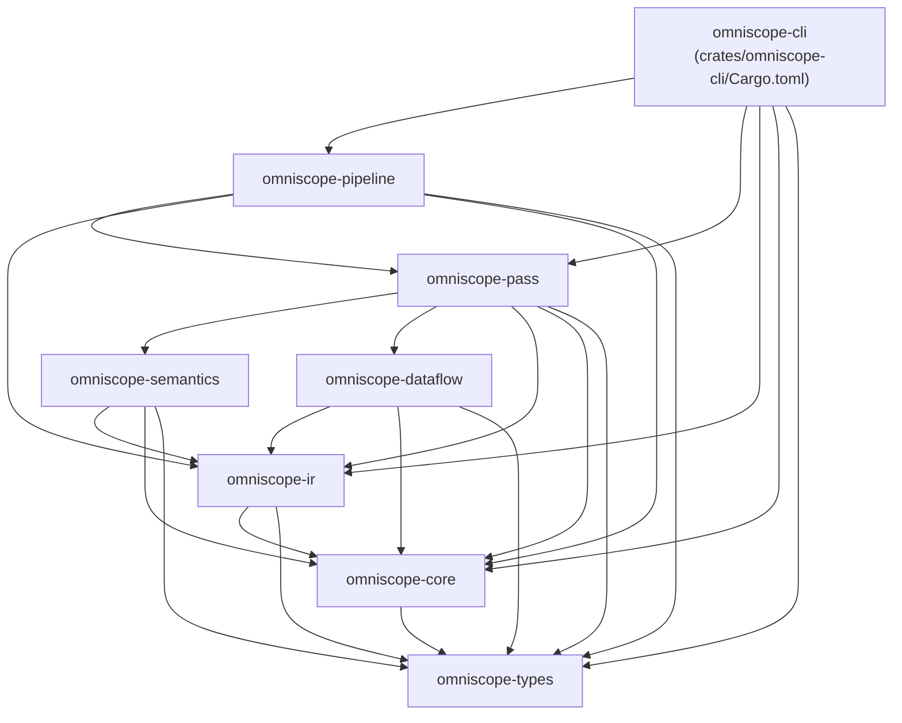
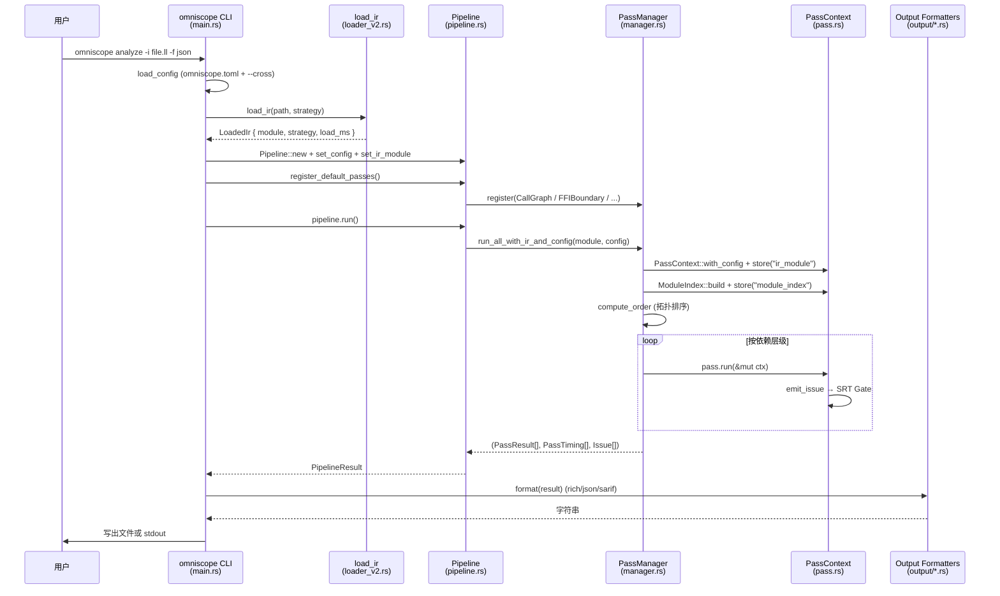
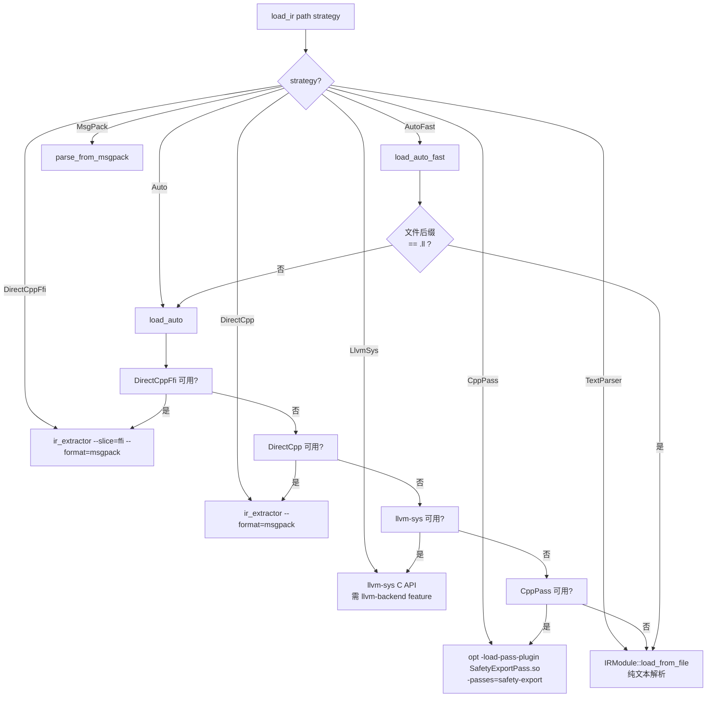

# OmniScope-rs 整体架构

本文档以源码为唯一依据，描述 OmniScope-rs 的 crate 划分、流水线阶段、IR 加载策略以及 Pass 调度模型。除非另行注明，所有引用均指向真实文件路径与行号。

## 1. Workspace 与 Crate 依赖

工作区在 `Cargo.toml:65-75` 列出 8 个成员 crate；顶级 `[package]` 同时声明一个名为 `omniscope` 的 dev-only 入口（仅在 `[dev-dependencies]` 中拉入其它 crate，用于 bench 构建，见 `Cargo.toml:22-29`）。

各 crate 的依赖关系来自每个子 crate 的 `Cargo.toml` 实际 `[dependencies]` 段：

### 各 crate 职责

| Crate | 主要内容 | 源码目录 |
|---|---|---|
| `omniscope-types` | `Language`、`FamilyId`、`OmniScopeConfig`、`BoundaryContext`、`VerifierVerdict`、`Effect`、`Evidence`、`IssueCandidateKind`、`PointerContract` | `crates/omniscope-types/src/` |
| `omniscope-core` | `Issue`、`IssueKind`、`Severity`、`Confidence`、`Diagnostic`、`Fact`、`IssueCandidate`、`FfiEvidence`、`MemoryPool`、`Profiler` | `crates/omniscope-core/src/` |
| `omniscope-ir` | IR 文本解析器、`IRModule`、三种加载后端（DirectCpp、llvm-sys、CppPass）、msgpack 支持、`IrCache` | `crates/omniscope-ir/src/` |
| `omniscope-semantics` | `LanguageDetector`、`FamilyRegistry`、语言适配器（C++/Python/Java/Go/C#）、`SemanticTree`、`SemanticEngine`、`SurfaceClassifier` | `crates/omniscope-semantics/src/` |
| `omniscope-pass` | `Pass` trait、`PassManager`、`PassContext`、`ModuleIndex`、所有 21 个分析 Pass | `crates/omniscope-pass/src/` |
| `omniscope-pipeline` | `Pipeline`，注册默认 Pass，驱动 `PassManager`，`PipelineResult` | `crates/omniscope-pipeline/src/` |
| `omniscope-cli` | 二进制 `omniscope`，五个子命令（`analyze`/`audit`/`info`/`init`/`validate`） | `crates/omniscope-cli/src/` |
| `omniscope-dataflow` | 通用前向/后向数据流框架（独立 crate，目前**未被流水线引用**） | `crates/omniscope-dataflow/src/` |

## 2. 端到端流水线

CLI 的 `analyze` 子命令（`crates/omniscope-cli/src/main.rs:268`）串起整套流程；`omniscope-pipeline` 的 `Pipeline::run`（`crates/omniscope-pipeline/src/pipeline.rs:129`）真正驱动 PassManager。

### 并行模式

`PassManager::run_with_context`（`crates/omniscope-pass/src/manager.rs:193`）同时支持串行与并行两种模式：

- **默认串行**（`manager.rs:27` 中 `parallel: false`）：按拓扑顺序依次调用 `pass.run(ctx)`。
- **并行模式**（`--parallel` 触发）：由 `compute_levels`（`manager.rs:274`）计算依赖层级，每层用 Rayon `into_par_iter` 并发执行；每个 Pass 拿到 `ctx.clone_for_parallel()` 生成的局部上下文（`pass.rs:688`），层结束后再 `ctx.merge(local_ctx)`（`pass.rs:714`）合并 issues、facts、shared 数据。

`Pipeline::register_default_passes`（`pipeline.rs:85-127`）注册 **21** 个默认 Pass（包括新增的 `AbiLayoutPass`）。

## 3. IR 加载策略

`LoadStrategy` 枚举在 `crates/omniscope-ir/src/loader_v2.rs:120-155` 定义了 **8 个变体**：

CLI 的 `parse_strategy`（`crates/omniscope-cli/src/main.rs:589-600`）把命令行字符串映射到 `LoadStrategy`，默认值为 `auto-fast`（`main.rs:163`）。

## 4. Pass 管理与并行模型

`Pass` trait 在 `crates/omniscope-pass/src/pass.rs:13-27` 定义：

- `name() -> &'static str`：拓扑排序的稳定键。
- `kind() -> PassKind`：`Foundation` / `Analysis` / `Transformation`。
- `dependencies() -> Vec<&'static str>`：列出本 Pass 依赖的其它 Pass 名称。
- `run(&self, &mut PassContext) -> Result<PassResult>`：执行入口。

### PassContext 的共享数据模型

`PassContext`（`pass.rs:156-181`）核心字段：

- `ir_module: Option<Arc<IRModule>>` —— 独立字段，零拷贝读取。
- `shared: Arc<HashMap<String, Arc<dyn Any + Send + Sync>>>` —— 跨 Pass 共享的 type-erased 存储。
- `diagnostics`、`facts`、`issues`、`suppressed_issues` —— 累积的诊断、事实、问题。
- `next_issue_id: u64` —— 单调递增的 issue 编号。
- `pool: MemoryPool` —— `bumpalo` arena，`reset_pool` 在 Pass 起始处清空。
- `config: Option<OmniScopeConfig>` —— FFI 边界与资源族配置。

### ModuleIndex —— 共享元数据缓存

`PassManager::run_all_with_ir_and_config`（`manager.rs:151-187`）在注入 `ir_module` 的同时构建 `ModuleIndex` 并 `store("module_index", ...)`。该索引一次性计算并缓存语言检测、寄存器查找、调用分类结果。

### PipelineResult 的 Issue 去重

`PipelineResult::with_issues`（`crates/omniscope-pipeline/src/result.rs:62-82`）按 `(IssueKind, function, file, line, column, description_hash)` 精确去重。碰撞时保留 `(severity, confidence)` 较高的 issue，丢失的 issue 计入 `dedup_dropped`。

## 5. 关键架构事实修正

| README 说法 | 源码事实 |
|---|---|
| "Plan A/B/C 三种加载策略" | 实际有 8 种 `LoadStrategy`，见 `loader_v2.rs:120-155` |
| "20+ 分析 Pass" | `Pipeline::register_default_passes` 注册 **21 个** Pass |
| "23 类 Issue" | `IssueKind` 实际包含 **28 个变体** |
| "omniscope-dataflow 提供数据流框架" | `omniscope-dataflow` 未被 `omniscope-pass` 或 `omniscope-pipeline` 引入 |
| "Pass 按拓扑排序到依赖层级，由 Rayon 并行执行" | 正确，但**默认是串行**，需 `--parallel` CLI flag 才进入并行分支 |