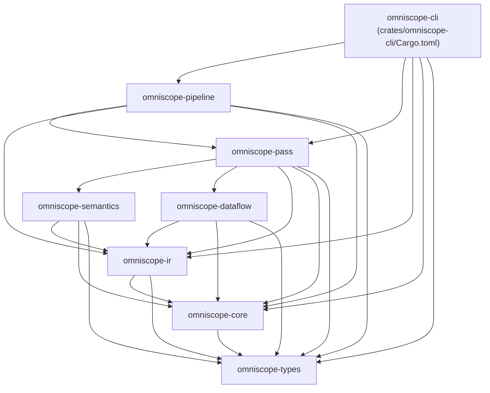
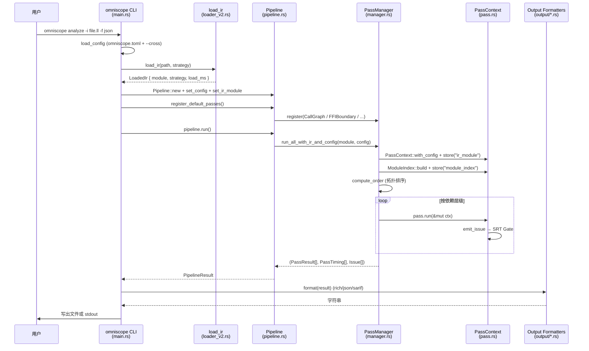
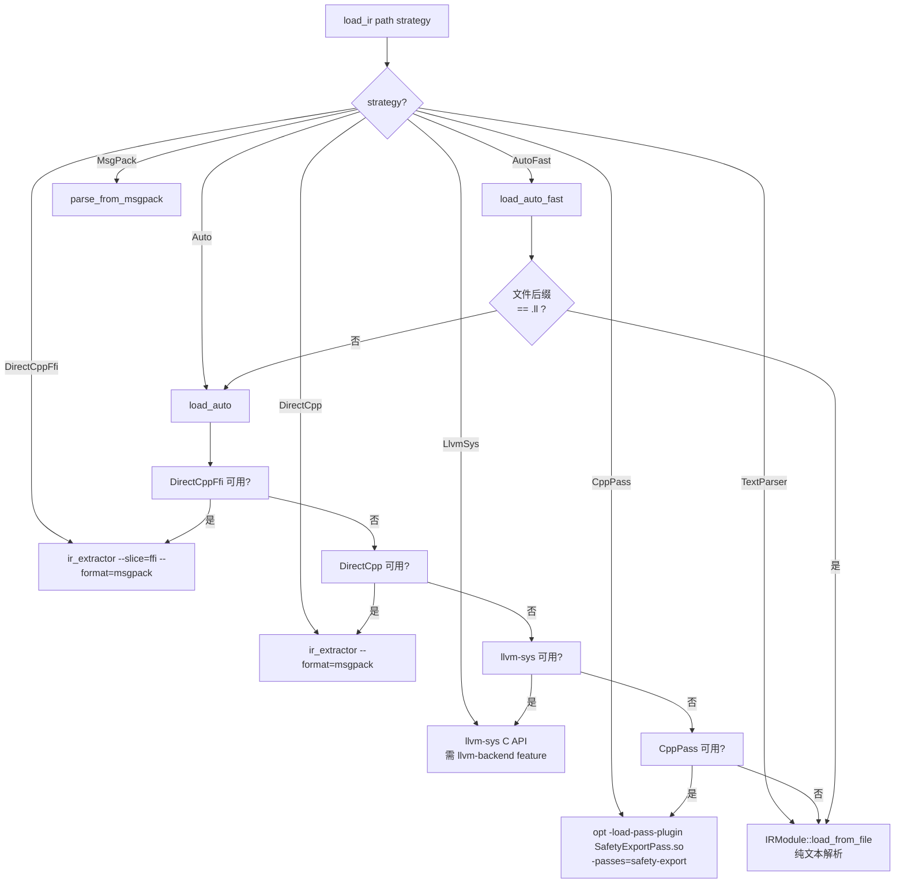
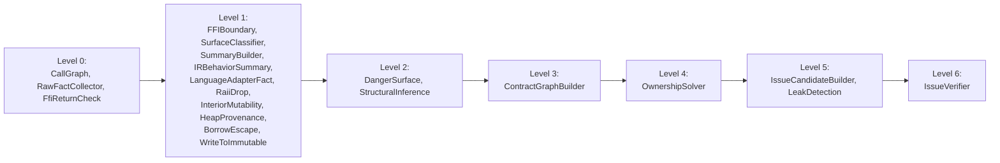

# OmniScope-rs 整体架构

本文档以源码为唯一依据，描述 OmniScope-rs 的 crate 划分、流水线阶段、IR 加载策略以及 Pass 调度模型。除非另行注明，所有引用均指向真实文件路径与行号。

## 1. Workspace 与 Crate 依赖

工作区在 `Cargo.toml:65-75` 列出 8 个成员 crate；顶级 `[package]` 同时声明一个名为 `omniscope` 的 dev-only 入口（仅在 `[dev-dependencies]` 中拉入其它 crate，用于 bench 构建，见 `Cargo.toml:22-29`）。

各 crate 的依赖关系来自每个子 crate 的 `Cargo.toml` 实际 `[dependencies]` 段：

> 关键事实修正：`omniscope-dataflow` 在源码中**不被任何上层 crate** 引入（`omniscope-pass/Cargo.toml` 与 `omniscope-pipeline/Cargo.toml` 均没有 `omniscope-dataflow = { path = ... }`）。流水线实际使用的“数据流”代码大多内联在 `omniscope-pass/src/resource/ownership_solver.rs` 和 `omniscope-semantics/src/resource/memory_graph.rs` 等模块中。`omniscope-dataflow` 本身仅在自身 crate 内部使用。

各 crate 的实际职责（基于 `lib.rs` 公开 API）：

| Crate | 主要内容 | 关键文件 |
|---|---|---|
| `omniscope-types` | `Language`、`FamilyId`、`OmniScopeConfig`、`BoundaryContext`、`PointerContract`、`IssueCandidateKind`、`Evidence` | `crates/omniscope-types/src/resource_family.rs`、`config.rs`、`evidence.rs` |
| `omniscope-core` | `Issue`、`IssueKind`、`Severity`、`Diagnostic`、`Fact`、`IssueCandidate`、`MemoryPool`、`Profiler` | `crates/omniscope-core/src/issue.rs`、`issue_candidate.rs`、`memory_pool.rs` |
| `omniscope-ir` | IR 文本解析器、`IRModule`、三种加载后端（见 §3） | `crates/omniscope-ir/src/loader_v2.rs`、`parser.rs`、`ir_model.rs` |
| `omniscope-semantics` | `LanguageDetector`、`FamilyRegistry`、语言适配器（C++/Python/Java/Go/C#）、`SemanticTree`、`SemanticEngine` | `crates/omniscope-semantics/src/language_detector.rs`、`resource/family_registry.rs`、`resource/{cpp,python,java,csharp,go}_adapter*` |
| `omniscope-pass` | Pass trait、PassManager、ModuleIndex、所有分析 Pass | `crates/omniscope-pass/src/pass.rs`、`manager.rs`、`module_index.rs`、`analysis/`、`resource/` |
| `omniscope-pipeline` | `Pipeline` 注册默认 Pass 集并驱动 PassManager | `crates/omniscope-pipeline/src/pipeline.rs` |
| `omniscope-cli` | 二进制 `omniscope`，子命令 `analyze` / `audit` / `info` / `init` / `validate` | `crates/omniscope-cli/src/main.rs` |
| `omniscope-dataflow` | 通用前向/后向数据流框架（独立 crate，目前**未被流水线引用**） | `crates/omniscope-dataflow/src/{analysis,graph}.rs` |

## 2. 端到端流水线

CLI 的 `analyze` 子命令（`crates/omniscope-cli/src/main.rs:268`）串起整套流程；`omniscope-pipeline` 的 `Pipeline::run`（`crates/omniscope-pipeline/src/pipeline.rs:129`）真正驱动 PassManager。

`PassManager::run_with_context`（`crates/omniscope-pass/src/manager.rs:193`）同时支持串行与并行两种模式：

- **默认串行**（`manager.rs:27` 中 `parallel: false`）：按拓扑顺序依次调用 `pass.run(ctx)`。
- **并行模式**（`--parallel` 触发）：由 `compute_levels`（`manager.rs:274`）计算依赖层级，每层用 Rayon `into_par_iter` 并发执行；每个 Pass 拿到 `ctx.clone_for_parallel()` 生成的局部上下文（`pass.rs:688`），层结束后再 `ctx.merge(local_ctx)`（`pass.rs:714`）合并 issues、facts、shared 数据。

`Pipeline::register_default_passes`（`pipeline.rs:85-126`）按 `omniscope-pipeline/src/pipeline.rs:196` 的测试断言注册 **20** 个默认 Pass。

## 3. IR 加载三层（实际为七种策略）

README 把 IR 加载概括为 “Plan A / Plan B / Plan C”，但代码中真正的策略枚举在 `crates/omniscope-ir/src/loader_v2.rs:120-155` 共有 **8 个变体**（含两种自动选择）：

逐项核实：

- **`DirectCppFfi`** / **`DirectCpp`**（`loader_v2.rs:516-682`）：调用外部二进制 `ir_extractor`（位于 `tools/ir_extractor/build/`），输出 MessagePack，由 `omniscope-ir/src/ir_model.rs` 中 `parse_from_msgpack` 反序列化。带 `--slice=ffi` 的版本会先做 FFI 切片，遇到 `NO_FFI_SEEDS` 则直接返回空模块（`loader_v2.rs:567-570`）。
- **`LlvmSys`**（`loader_v2.rs:411-418`）：仅在编译期开启 `llvm-backend` feature 时可用（`omniscope-ir/Cargo.toml:14-15` 把 `llvm-backend` 映射到 `llvm-sys` 依赖）。否则 `load_via_llvm_sys` 直接返回错误。
- **`CppPass`**（`loader_v2.rs:441-502`）：调用 `opt` 加载 `SafetyExportPass.so`/`.dylib` 插件运行 `-passes=safety-export`，输出 JSON 由 `IRModuleModel::from_json_str` 反序列化。
- **`TextParser`**（`loader_v2.rs:692-694`）：调用 `IRModule::load_from_file`（实现在 `omniscope-ir/src/parser.rs`），需要 `llvm-dis` 把 `.bc` 转成 `.ll`；纯 `.ll` 直接逐行解析。这是“零外部依赖”的兜底路径。
- **`MsgPack`**（`loader_v2.rs:704-707`）：直接读 `.msgpack` 文件，使用 `omniscope-ir/src/ir_model.rs` 的 `load_from_msgpack`。

工具发现顺序与缓存逻辑：

- `find_ir_extractor`（`loader_v2.rs:719-752`）：先看 `IR_EXTRACTOR` 环境变量，再查 `tools/ir_extractor/build/...`，最后 `$PATH`。
- `find_opt`（`loader_v2.rs:761-798`）：优先 `LLVM_OPT` env，然后 Homebrew `llvm@22 → llvm@17`，最后 `llvm-config --bindir` 与 `which opt`。
- `find_pass_plugin`（`loader_v2.rs:806-857`）：环境变量 → 项目根 `pass/build/{lib,Release}/libSafetyExportPass.{so,dylib}` → 当前目录。
- 缓存：`CppPass`、`DirectCpp`、`DirectCppFfi` 三个后端会调用 `IrCache`（`omniscope-ir/src/ir_cache.rs`）按文件指纹缓存反序列化前的字节，避免重复运行 C++ 工具。空模块不入缓（`loader_v2.rs:586-598`）。

CLI 的 `parse_strategy`（`crates/omniscope-cli/src/main.rs:589-600`）把命令行字符串映射到 `LoadStrategy`，默认值为 `auto-fast`（`main.rs:163`）。

## 4. Pass 管理与并行模型

`Pass` trait 在 `crates/omniscope-pass/src/pass.rs:13-27` 定义，主要约束：

- `name() -> &'static str`：拓扑排序的稳定键。
- `kind() -> PassKind`：`Foundation` / `Analysis` / `Transformation`（`pass.rs:30-38`）。
- `dependencies() -> Vec<&'static str>`：列出本 Pass 依赖的其它 Pass 名称，默认空。
- `run(&self, &mut PassContext) -> Result<PassResult>`：执行入口。

### 4.1 `PassContext` 的共享数据模型

`PassContext`（`pass.rs:156-181`）核心字段：

- `ir_module: Option<Arc<IRModule>>` —— 独立字段，零拷贝读取，避免 `shared` HashMap 借用冲突。
- `shared: Arc<HashMap<String, Arc<dyn Any + Send + Sync>>>` —— 跨 Pass 共享的“type-erased”存储。`store`（`pass.rs:306-309`）通过 `Arc::make_mut` 实现写时复制；`get_ref`（`pass.rs:322-324`）零克隆访问大对象（如 `ContractGraph`、`SummaryStore`）。
- `diagnostics`、`facts`、`issues`、`suppressed_issues` —— 累积的诊断、事实、问题。
- `next_issue_id: u64` —— 单调递增的 issue 编号。
- `pool: MemoryPool` —— `bumpalo` arena，`reset_pool` 在 Pass 起始处清空。
- `config: Option<OmniScopeConfig>` —— FFI 边界与资源族配置。

### 4.2 `emit_issue` 是 SRT 抑制门控的唯一入口

`PassContext::emit_issue`（`pass.rs:377-580`）是**所有 Issue 落地的单点**。除了查询 `srt_resolutions`（由 `StructuralInferencePass` 填入）调用 `issue_gate::check_issue_with_kinds` 外，还有四条 fallback 规则（`pass.rs:443-577`）：

1. **Runtime-internal 符号抑制**：当 `is_runtime_internal(symbol)` 为真且 caller 也是运行时内部时，抑制 `FfiUnsafeCall`、`ConditionalLeak`、`DefiniteLeak`、`OwnershipEscapeLeak`、`CrossLanguageFree`、`OwnershipViolation`。
2. **Runtime-caller leak 抑制**：caller 是运行时内部时，抑制泄漏类问题。
3. **libc 双重释放抑制**：`symbol` 是 libc 函数且 caller 是运行时内部时，抑制 `DoubleFree`/`UseAfterFree`。
4. **FFI 桥接函数抑制**：function 名以 `c_` / `rust_` / `zig_` / `py_` / `java_` / `go_` 开头且 caller 为运行时内部时，抑制 `DoubleFree`/`UseAfterFree`。

这些规则保证用户代码的真实 bug 不会被误抑（caller 是 user code 时 fallback 不生效）。

### 4.3 ModuleIndex —— 共享元数据缓存

`PassManager::run_all_with_ir_and_config`（`manager.rs:151-187`）在注入 `ir_module` 的同时构建 `ModuleIndex`（`crates/omniscope-pass/src/module_index.rs:97-138`）并 `store("module_index", ...)`。该索引一次性计算并缓存：

- `call_metas: Vec<CachedCallMeta>` —— 每条 call 指令的语言、是否外部、是否 alloc/dealloc、是否 FFI 边界、家族 lookup、boundary evidence。
- `function_metas: IndexMap<String, CachedFunctionMeta>` —— 每个函数的语言、参数数、是否含 store、是否调用 alloc/dealloc、是否运行时内部。`IndexMap` 用来保证迭代顺序确定（修复了非确定 issue 顺序的回归）。
- `family_registry`、`language_detector` —— 共享实例。
- `is_single_language: bool` —— 关键短路标志：当模块仅一种已知语言时，`FFIBoundaryPass`（`analysis/mod.rs:84-92`）、`LanguageAdapterFactPass`（`resource/language_adapter_fact_pass.rs:79-84`）、`IssueVerifierPass`（`resource/issue_verifier.rs:128-153`）等都会直接跳过 FFI 专用逻辑。

### 4.4 并行执行调度

`compute_levels`（`manager.rs:274-308`）按依赖关系生成一组 “层级”：第 0 层是无依赖的 Pass，第 N 层是所有依赖均在前 N 层已完成的 Pass。`run_with_context` 在并行分支中（`manager.rs:208-252`）：

> 上图层级是从每个 Pass 的 `dependencies()` 推导出的近似结果（FfiReturnCheck 无依赖也排在第 0 层；IssueVerifier 同时依赖 `IssueCandidateBuilder`、`FfiReturnCheck`、`LeakDetection`，故落在最后一层）。

并行实现要点：

- 每层先为每个 Pass 预克隆 `local_ctx = ctx.clone_for_parallel()`（`manager.rs:212-214`），共享 `ir_module` 与 `shared` 的 Arc 引用，但 `diagnostics/facts/issues/suppressed_issues/pool` 是空的。
- 用 `par_iter().zip(par_drain).map(...)` 并发跑 Pass；Pass 错误时只记录日志并产出空 `PassResult`（`manager.rs:226-235`），不传播错误。
- 层结束后串行 `ctx.merge(local_ctx)`（`pass.rs:714-746`）把各局部 ctx 的 issues 与 shared 数据合并回主 ctx，同时把 `next_issue_id` 向前推进到最大值。

### 4.5 PipelineResult 的 issue 去重

`PipelineResult::with_issues`（`crates/omniscope-pipeline/src/result.rs:62-82`）按 `(kind, symbol, description)` 三元组去重：多个 Pass 报告同一个 bug 时只保留首次出现的实例。这与 `IssueVerifier` 中针对 leak candidate 的 `deduplicate_leak_candidates`（`issue_verifier.rs:98`）配合，避免重复条目。

## 5. 关键架构事实修正

| README 说法 | 源码事实 |
|---|---|
| “Plan A/B/C 三种加载策略” | 实际有 8 种 `LoadStrategy`（Auto、AutoFast、DirectCppFfi、DirectCpp、LlvmSys、CppPass、TextParser、MsgPack），见 `loader_v2.rs:120-155` |
| “20+ 分析 Pass” | `Pipeline::register_default_passes` 注册 **20 个** Pass；测试断言写死 20（`pipeline.rs:196`） |
| “23 类 Issue” | `IssueKind` 实际包含 **28 个变体**（见 `crates/omniscope-core/src/issue.rs:27-96`，含 `Unknown`） |
| “omniscope-dataflow 提供数据流框架” | `omniscope-dataflow` 未被 `omniscope-pass` 或 `omniscope-pipeline` 引入；流水线使用的状态机/CFG 切片直接在 `resource/ownership_solver.rs`、`semantics/resource/memory_graph.rs` 中实现 |
| “Pass 按拓扑排序到依赖层级，由 Rayon 并行执行” | 正确，但**默认是串行**（`manager.rs:27`），需 `--parallel` CLI flag 才进入并行分支 |
