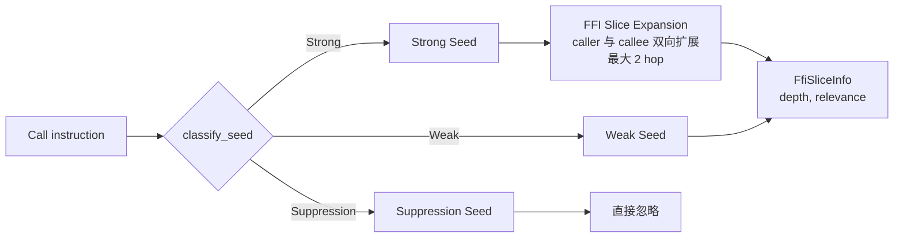

# FFI 边界检测

OmniScope-rs 的 FFI 边界识别由“语言识别 → 边界种子 → 双证据门控 → 资源族跨族匹配 → Issue 候选”五层叠加组成。本文按真实代码路径逐层说明。

## 1. 语言识别

源文件：`crates/omniscope-semantics/src/language_detector.rs`。

`LanguageDetector::detect_from_function`（`language_detector.rs:24-40`）的优先级：

1. **Rust v0 / Itanium 预检**：`function_name.starts_with("_ZN")` 且 `is_rust_zn_mangling(name)` 为真时直接返回 `Language::Rust`。这是为了避免 Rust 的 `_ZN5alloc...` 被泛 `_Z*` 模式错认为 C++。
2. **通用模式匹配**：遍历 `build_patterns()`（`language_detector.rs:90-131`）声明的模式表，按声明顺序匹配第一个命中：

| 语言 | 关键模式（节选） |
|---|---|
| Rust | `_R`（v0 mangling，前缀）、`__rust_`、`_ZN4core` / `_ZN5alloc` / `_ZN3std` |
| C++ | `_ZN` / `_ZS` / `_Z` 前缀、`std::` / `::` 包含 |
| Zig | `zig.` / `zig_allocator_` / `heap.` / `Io.` / `posix.` / `Thread.` / `main.` 前缀 |
| Go | `_Cfunc_` / `_cgo_` / `runtime.` 前缀 |
| Python | `Py` 前缀、`PyObject` 包含 |
| Java | `Java_` 前缀、`JNI` 包含 |
| C# | `System.Runtime.InteropServices` / `DllImport` / `P/Invoke` 包含 |

3. **未命中**：返回 `Language::Unknown`。

`detect_from_module`（`language_detector.rs:42-70`）按文件扩展名识别（`.rs` / `.zig` / `.go` / `.py` / `.java` / `.cs` / `.cpp` / `.cc` / `.c`），用于模块级语言指纹。

`detect_from_functions`（`language_detector.rs:72-87`）对一组函数名做多数投票，过滤掉 `Unknown` 后取出现频率最高的语言，是 `ModuleIndex` 判断 `is_single_language` 的主要依据。

## 2. 边界种子分类

源文件：`crates/omniscope-pass/src/analysis/boundary_seeds.rs`。

每个 call site 进入 `classify_seed`，落入三种 `SeedClassification` 之一（在 `crates/omniscope-types/src/boundary.rs` 中定义）：



**Strong seed**（明确跨语言边界）：

- 已知 cross-lang edge（两端语言皆已知且不同）
- 用户配置的边界函数（来自 `OmniScopeConfig.ffi_boundary`）
- 非 C 语言调用外部 Unknown 声明
- C 语言调用 C++ Itanium 符号（已排除 Rust `_ZN` mangling）
- 含指针参数/返回值的导出包装函数
- 把函数指针传给/取自外部调用
- 回调注册模式

**Weak seed**（可能边界，间接证据）：

- 同语言下出现已知 FFI 契约符号
- 包装函数内部出现 dangerous libc / 资源调用
- runtime bridge 符号连接到用户边界流程

**Suppression seed**（明确排除）：

- LLVM intrinsics（`llvm.*`）
- 与用户边界无关的编译器/运行时胶水
- 无所有权传递的纯 libc helper
- 同语言纯内部调用且无 external/callback/exported ABI 证据

种子分类的输出最终通过 `ModuleIndex.call_metas[i].boundary_evidence`（`crates/omniscope-pass/src/module_index.rs:62-67`）与 `ffi_slice_info`（`module_index.rs:66-67`）携带到下游 Pass。

## 3. 双证据门控

最新一次 commit `0117c19` 提交信息描述 “Implementing dual-evidence gating and language adapter semantic fact extraction”。在源码里有两套配合：

### 3.1 `FfiEvidence` 枚举与 `has_ffi_evidence`

`crates/omniscope-core/src/issue_candidate.rs:21-43`：

```rust
pub enum FfiEvidence {
    CrossLanguageCall { caller_lang, callee_lang },
    CrossFamilyRelease { alloc_family, release_family },
    CallbackEscape,
    OwnershipTransfer,
    FfiReturnUnchecked { callee },
    ConfiguredBoundary,
}
```

`IssueCandidate::has_ffi_evidence`（`issue_candidate.rs:207`）判断候选是否带有上述任意一种证据。

### 3.2 在 IssueCandidateBuilder 中的统计与降级

`IssueCandidateBuilder` 在生成候选之后做精度统计（`crates/omniscope-pass/src/resource/issue_candidate_builder/mod.rs:995-1032`）：

- `ffi_evidence_count` —— 带 `FfiEvidence` 的候选数。
- `boundary_evidence_count` —— `candidate.boundary` 字段非空（带 `CrossBoundaryEvidence`）。
- `needs_model_count` —— `NeedsModel` 候选数。
- `local_bug_count` —— 仅本地 bug（`DoubleRelease`/`UseAfterFree`/`ConditionalLeak`/`DoubleReclaim`/`InvalidBorrowedFree`）。
- `boundary_suppressed` —— `CrossFamilyFree` / `CrossLanguageFree` / `OwnershipEscapeLeak` / `BorrowEscape` **且** 没有 FFI evidence 的候选。这就是双证据门控降级的目标：这些候选在旧实现里会作为 FFI Issue 报出，新实现因为缺乏跨语言证据而被记为 “boundary suppressed”，不会升级为 FFI 报告。

源码注释明确（`issue_candidate_builder/mod.rs:1018-1020`）：“Cross-family candidates without FFI evidence: suppressed by dual-evidence gating. These would have been FFI reports under the old system but are now downgraded to resource-only issues.”

### 3.3 在 IssueVerifier 中的 FFI Gate

`crates/omniscope-pass/src/resource/issue_verifier.rs:155-182`：

```text
当且仅当：
  !candidate.has_ffi_evidence()
  AND is_leak_candidate(candidate)
  AND is_runtime_internal(alloc_function)
  AND caller_is_runtime
→ 标记为 Diagnostic（不报为 issue）
```

此外，第 365-372 行 / 378-397 行还有两条针对 runtime allocator / deallocator 函数的细化抑制：当候选没有 FFI evidence 且 alloc_function 命中已知 runtime allocator/deallocator 名表，则降级为 `ExplainedSafe`。

### 3.4 单语言短路

`ModuleIndex.is_single_language == true` 时：

- `FFIBoundaryPass`、`LanguageAdapterFactPass` 直接返回空（`analysis/mod.rs:84-92`、`language_adapter_fact_pass.rs:79-84`）；
- `IssueVerifierPass` 跳过所有 FFI 专属 Issue 类型（`issue_verifier.rs:128-153`），只保留 `DoubleRelease`、`UseAfterFree`、`UseAfterRelease` 与泄漏类。

## 4. ResourceFamily 与跨族匹配

源文件：`crates/omniscope-types/src/resource_family.rs`（659 行）、`crates/omniscope-semantics/src/resource/family_registry.rs`。

### 4.1 内置家族列表

`FamilyId` 是 `u16` 包装（`resource_family.rs:16-17`），内置常量定义在 `resource_family.rs:19-96`。**实际共 24 个内置家族**（README 描述与代码不完全一致，以下为源码事实）：

| FamilyId | 名称 | 涵盖符号示例 |
|---|---|---|
| 1 | `C_HEAP` | malloc / calloc / realloc + free |
| 2 | `CPP_NEW_SCALAR` | `operator new` / `operator delete`（标量） |
| 3 | `CPP_NEW_ARRAY` | `operator new[]` / `operator delete[]` |
| 4 | `RUST_GLOBAL` | `__rust_alloc` / `__rust_dealloc` |
| 5 | `PYTHON_OBJECT` | `PyObject_New` / `PyObject_Free` |
| 6 | `PYTHON_MEM` | `PyMem_Malloc` / `PyMem_Free` |
| 7 | `PYTHON_MEM_RAW` | `PyMem_RawMalloc` / `PyMem_RawFree` |
| 8 | `JAVA_LOCAL_REF` | `NewLocalRef` / `DeleteLocalRef` |
| 9 | `JAVA_GLOBAL_REF` | `NewGlobalRef` / `DeleteGlobalRef` |
| 10 | `CSHARP_HGLOBAL` | `Marshal.AllocHGlobal` / `Marshal.FreeHGlobal` |
| 11 | `CSHARP_COTASK` | `CoTaskMemAlloc` / `CoTaskMemFree` |
| 12 | `GO_GC` | `runtime.mallocgc` |
| 13 | `ZIG_ALLOCATOR` | 通过 allocator-vtable evidence 建模 |
| 14 | `ZLIB_STREAM` | `inflateInit_/inflateEnd`、`deflateInit_/deflateEnd` |
| 15 | `OPENSSL_RESOURCE` | `EVP_CIPHER_CTX_new/_free`、`BIO_new/_free`、`RSA_new/_free`、`BN_new/_free` |
| 16 | `SQLITE_RESOURCE` | `sqlite3_open/_close`、`sqlite3_prepare_v2/_finalize` |
| 17 | `GO_CGO` | `_cgo_allocate/_cgo_free`、`_Cfunc_GoMalloc/_Cfunc_GoFree` |
| 18 | `MIMALLOC` | `mi_malloc/mi_free/mi_realloc/mi_heap_destroy` |
| 19 | `CSHARP_COM` | COM interop（与 HGlobal 区分） |
| 20 | `RUST_RAW_OWNERSHIP` | `Box::into_raw/from_raw`、`CString::into_raw/from_raw`、`Vec::from_raw_parts` |
| 21 | `FILE_DESCRIPTOR` | `open/creat/socket/accept/dup/pipe` + `close` |
| 22 | `UNKNOWN` | 占位，FFI 返回值或未识别资源 |
| 23 | `WIN32_HEAP` | `HeapAlloc/HeapFree/HeapReAlloc` |
| 24 | `WIN32_VIRTUAL` | `VirtualAlloc/VirtualFree` |

`USER_FAMILY_START = 256`，`FamilyId::custom(name)` 用 `DefaultHasher` 把字符串映射到 256..u16::MAX 区间，供 `OmniScopeConfig.resource_family` 注入用户自定义家族。

> 与 README 表格的差异：README 列出 “Win32/Zig resource families and fixed UAF detection” 的 commit（`f533a4d`）；源码中 Win32 与 Zig 家族确实是较新引入的，22 = `UNKNOWN`，23/24 = Win32。`RUST_RAW_OWNERSHIP`（20）与 `RUST_GLOBAL`（4）**显式声明兼容**（注释 `resource_family.rs:71-74`），跨这两个 family 的 free 不会被报为 `CrossFamilyFree`。

### 4.2 跨族匹配流程

`ContractGraphBuilder`（`crates/omniscope-pass/src/resource/contract_graph_builder.rs:241-300+`）按 `(func_id, family)` 把 acquire 与 release 配对：

1. `acquire_instances[(func_id, family)]` 是一个 `VecDeque<(instance_id, family)>`（FIFO 队列）。
2. 遇到 acquire fact 时，分配新 `instance_id`，写 `Effect::Acquire { family, result }` 边，并入队。
3. 遇到 release fact 时：
   - 先尝试 **同族匹配**：从同一 key 的 deque 头部 `pop_front`。
   - 同族 deque 为空时，进入**跨族匹配**：扫描 `acquire_instances` 中同 `func_id` 的所有家族，找到一个未配对的 acquire，记录为可能的 `CrossFamilyFree` 配对。

`FamilyRegistry::is_compatible_release(alloc, release)` 决定一对家族是否兼容。`IssueCandidateBuilder` 在 build cross-family candidate 时（`issue_candidate_builder/mod.rs:1069+`）调用此判定；不兼容 → 生成 `IssueCandidateKind::CrossFamilyFree` 候选。

### 4.3 跨语言 vs 跨族

- **CrossFamilyFree**：alloc family != release family 且不兼容。**与语言无关**（例如 `malloc` + `_ZdlPv`）。
- **CrossLanguageFree**：是 FFI 边界上的 cross-family，要求 `FfiEvidence::CrossLanguageCall` 或 `CrossFamilyRelease`。在 `IssueCandidateBuilder` 中区分两种 candidate kind（`IssueCandidateKind::CrossFamilyFree` vs `CrossLanguageFree`，`crates/omniscope-types/src/evidence.rs:283-332`）。

`Pipeline::test_pipeline_cross_family_issue`（`crates/omniscope-pipeline/src/pipeline.rs:217-253`）是这条链路的端到端回归：`malloc` + `_ZdlPv` 必须产出 `CrossFamilyFree`；`malloc` + `free` 必须**不**产出（`pipeline.rs:259-293`）。

## 5. 23 / 28 类 Issue —— 源码事实

`crates/omniscope-core/src/issue.rs:27-96` 中的 `IssueKind` enum **实际包含 28 个变体**（README 标题写 “23 类问题”，与代码不符）。下表按代码注释里的分组列出：

### FFI 边界类（8）

| 变体 | CWE | 含义 |
|---|---|---|
| `CrossLanguageFree` | 762 | 跨语言 free 不匹配 |
| `OwnershipViolation` | 763 | 所有权传递违反 |
| `FfiTypeMismatch` | 843 | ABI 类型不匹配 |
| `AbiMismatch` | 758 | 调用约定不匹配 |
| `UncheckedReturn` | 252 | FFI 返回值未检查 |
| `FfiUnsafeCall` | 119 | 语义危险的 FFI 调用 |
| `CallbackEscape` | 749 | 回调跨语言逃逸 |
| `LengthTruncation` | 197 | 长度截断（usize→u32 等） |

### 本地内存类（7）

| 变体 | CWE | 含义 |
|---|---|---|
| `DoubleFree` | 415 | 同一分配二次释放 |
| `UseAfterFree` | 416 | 悬空指针解引用 |
| `InvalidFree` | 763 | 释放非 malloc 指针 |
| `MemoryLeak` | 401 | 未释放的分配 |
| `BufferOverflow` | 120 | 越界写入 |
| `NullDereference` | 476 | NULL 指针解引用 |
| `IntegerOverflow` | 190 | 整数溢出 |

### 资源契约类（9）

| 变体 | CWE | 含义 |
|---|---|---|
| `CrossFamilyFree` | 762 | 跨资源族 free |
| `ConditionalLeak` | 772 | 部分路径泄漏 |
| `DefiniteLeak` | 772 | 全路径泄漏 |
| `BorrowEscape` | 822 | 借用指针逃出上下文 |
| `CallbackEscapeIssue` | 749 | 指针逃逸到可能取得所有权的回调 |
| `NeedsModel` | — | 需要模型注释 |
| `WriteToImmutable` | 123 | 写入不可变内存 |
| `DoubleReclaim` | 415 | 同一裸指针多次 `from_raw` |
| `OwnershipEscapeLeak` | 772 | `into_raw` 后未 `from_raw` |

### 并发类（3）

| 变体 | CWE | 含义 |
|---|---|---|
| `DataRace` | 362 | 跨 FFI 数据竞争 |
| `LockOrderViolation` | 833 | 锁次序违反 |
| `ThreadCrossing` | 362 | 不安全指针跨线程 |

### 未分类（1）

`Unknown` —— 无法分类的兜底变体。

## 6. 自动边界推断（无 `--cross` 配置时）

`crates/omniscope-pass/src/analysis/boundary_inference.rs::infer_boundaries`（`boundary_inference.rs:26-89`）在 CLI 没有 `--cross` 也没有 config 中 `ffi_boundary` 时自动调用（`crates/omniscope-cli/src/main.rs:311-330`），按三层启发式生成 `FFIBoundaryConfig`：

1. **C++ mangled 名**：所有 `_Z` 开头的函数 → 假设 caller=C、callee=C++。
2. **外部声明**：扫描 declarations，按命名约定猜测对端语言。
3. **语言专属命名**：`Py*` → Python；`Java_*` → Java；`_cgo_*` → Go；等等。

推断结果会反向写入 `Pipeline.omniscope_config`，让 `ContractGraphBuilderPass::with_config` 能像用户显式配置一样处理这些边界。

## 7. SRT 抑制门控对照表

`crates/omniscope-pass/src/resource/issue_gate.rs:14-39` 直接列出 R-N 抑制规则的覆盖矩阵：

| Issue Kind | 抑制信号 | R-N 编号 |
|---|---|---|
| `BorrowEscape` | `HeapProvenance` / `GlobalProvenance` | R-1 |
| `BorrowEscape` | `FromParameter`（非栈） | R-8 |
| `WriteToImmutable` | `MutableParam` | R-0 |
| `WriteToImmutable` | `InteriorMutability` | R-2 |
| `UseAfterFree` | `RaiiDropRelease` | R-3 |
| `CrossLanguageFree` | `IntoRawTransfer` | R-6 |
| `CrossLanguageFree` | `File/Network/ProcessOp` | R-4 |
| `CrossLanguageFree` | `LibraryRelease` | R-7 |
| `DoubleFree` | `RaiiDropRelease` | R-3 |
| `UncheckedReturn` | `HeapProvenance`（allocator） | R-9 |
| `FfiUnsafeCall` | 见 issue_gate.rs:26-31 | R-1/3/4/6/7/8 + 多语言适配器 |
| `ConditionalLeak` / `DefiniteLeak` | `RaiiDropRelease` / `CppDestructor` / `GoDeferCleanup` 等 | R-3+ |
| `OwnershipEscapeLeak` | `RaiiDropRelease` / `IntoRawTransfer` / `RuntimeInternal` | R-3 / R-6 / RuntimeInternal |

`emit_issue` 在 `PassContext`（`crates/omniscope-pass/src/pass.rs:377-580`）中是该门控的唯一调用点；除了 SRT 查询外还包含四条 fallback（详见 architecture.md §4.2）。
