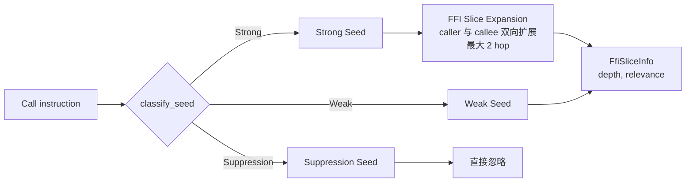

# FFI 边界检测

OmniScope-rs 的 FFI 边界识别由"语言识别 → 边界种子 → 双证据门控 → 资源族跨族匹配 → Issue 候选"五层叠加组成。本文按真实代码路径逐层说明。

## 1. 语言识别

源文件：`crates/omniscope-semantics/src/language_detector.rs`。

`LanguageDetector::detect_from_function`（`language_detector.rs:24-40`）的优先级：

1. **Rust v0 / Itanium 预检**：`function_name.starts_with("_ZN")` 且 `is_rust_zn_mangling(name)` 为真时直接返回 `Language::Rust`。
2. **通用模式匹配**：遍历 `build_patterns()` 声明的模式表：

| 语言 | 关键模式（节选） |
|---|---|
| Rust | `_R`（v0 mangling）、`__rust_`、`_ZN4core` / `_ZN5alloc` / `_ZN3std` |
| C++ | `_ZN` / `_ZS` / `_Z` 前缀、`std::` / `::` 包含 |
| Zig | `zig.` / `zig_allocator_` / `heap.` 等前缀 |
| Go | `_Cfunc_` / `_cgo_` / `runtime.` 前缀 |
| Python | `Py` 前缀、`PyObject` 包含 |
| Java | `Java_` 前缀、`JNI` 包含 |
| C# | `System.Runtime.InteropServices` / `DllImport` / `P/Invoke` 包含 |

3. **未命中**：返回 `Language::Unknown`。

## 2. 边界种子分类

源文件：`crates/omniscope-pass/src/analysis/boundary_seeds.rs`。

每个 call site 进入 `classify_seed`，落入三种 `SeedClassification` 之一：



**Strong seed**：明确跨语言边界的情况，包括已知 cross-lang edge、用户配置的边界函数、非 C 语言调用外部 Unknown 声明等。

**Weak seed**：可能边界，如同语言下出现已知 FFI 契约符号、包装函数内部出现 dangerous libc 调用等。

**Suppression seed**：明确排除的情况，如 LLVM intrinsics（`llvm.*`）、无所有权传递的纯 libc helper 等。

## 3. 双证据门控

### 3.1 `FfiEvidence` 枚举

`crates/omniscope-core/src/issue_candidate.rs:21-43`：

```rust
pub enum FfiEvidence {
    CrossLanguageCall { caller_lang, callee_lang },
    CrossFamilyRelease { alloc_family, release_family },
    CallbackEscape,
    OwnershipTransfer,
    FfiReturnUnchecked { callee },
    ConfiguredBoundary,
}
```

`IssueCandidate::has_ffi_evidence`（`issue_candidate.rs:207`）判断候选是否带有证据。

### 3.2 在 IssueCandidateBuilder 中的统计与降级

`IssueCandidateBuilder` 在生成候选之后做精度统计（`mod.rs:995-1032`）：`ffi_evidence_count`、`boundary_evidence_count`、`needs_model_count`、`local_bug_count`、`boundary_suppressed`。

### 3.3 单语言短路

`ModuleIndex.is_single_language == true` 时：
- `FFIBoundaryPass`、`LanguageAdapterFactPass` 直接返回空
- `IssueVerifierPass` 跳过所有 FFI 专属 Issue 类型

## 4. ResourceFamily 与跨族匹配

源文件：`crates/omniscope-types/src/resource_family.rs`。

### 4.1 内置家族列表

`FamilyId` 是 `u16` 包装，**共 24 个内置家族**：

| FamilyId | 名称 | 涵盖符号示例 |
|---|---|---|
| 1 | `C_HEAP` | malloc / calloc / realloc + free |
| 2 | `CPP_NEW_SCALAR` | `operator new` / `operator delete`（标量） |
| 3 | `CPP_NEW_ARRAY` | `operator new[]` / `operator delete[]` |
| 4 | `RUST_GLOBAL` | `__rust_alloc` / `__rust_dealloc` |
| 5 | `PYTHON_OBJECT` | `PyObject_New` / `PyObject_Free` |
| 6 | `PYTHON_MEM` | `PyMem_Malloc` / `PyMem_Free` |
| 7 | `PYTHON_MEM_RAW` | `PyMem_RawMalloc` / `PyMem_RawFree` |
| 8 | `JAVA_LOCAL_REF` | `NewLocalRef` / `DeleteLocalRef` |
| 9 | `JAVA_GLOBAL_REF` | `NewGlobalRef` / `DeleteGlobalRef` |
| 10 | `CSHARP_HGLOBAL` | `Marshal.AllocHGlobal` / `FreeHGlobal` |
| 11 | `CSHARP_COTASK` | `CoTaskMemAlloc` / `CoTaskMemFree` |
| 12 | `GO_GC` | `runtime.mallocgc` |
| 13 | `ZIG_ALLOCATOR` | 通过 allocator-vtable evidence 建模 |
| 14 | `ZLIB_STREAM` | `inflateInit_/inflateEnd`、`deflateInit_/deflateEnd` |
| 15 | `OPENSSL_RESOURCE` | `EVP_CIPHER_CTX_new/_free`、`BIO_new/_free` 等 |
| 16 | `SQLITE_RESOURCE` | `sqlite3_open/_close`、`sqlite3_prepare_v2/_finalize` |
| 17 | `GO_CGO` | `_cgo_allocate/_cgo_free`、`_Cfunc_GoMalloc/_Cfunc_GoFree` |
| 18 | `MIMALLOC` | `mi_malloc/mi_free/mi_realloc/mi_heap_destroy` |
| 19 | `CSHARP_COM` | COM interop |
| 20 | `RUST_RAW_OWNERSHIP` | `Box::into_raw/from_raw`、`CString::into_raw/from_raw` |
| 21 | `FILE_DESCRIPTOR` | `open/creat/socket/accept/dup/pipe` + `close` |
| 22 | `UNKNOWN` | 占位，FFI 返回值或未识别资源 |
| 23 | `WIN32_HEAP` | `HeapAlloc/HeapFree/HeapReAlloc` |
| 24 | `WIN32_VIRTUAL` | `VirtualAlloc/VirtualFree` |

`USER_FAMILY_START = 256`，`FamilyId::custom(name)` 用 `DefaultHasher` 把字符串映射到 256..u16::MAX 区间。

## 5. IssueKind —— 28 个变体

`crates/omniscope-core/src/issue.rs:27-96` 中的 `IssueKind` enum **实际包含 28 个变体**。

### FFI 边界类（8）

| 变体 | CWE | 含义 |
|---|---|---|
| `CrossLanguageFree` | 762 | 跨语言 free 不匹配 |
| `OwnershipViolation` | 763 | 所有权传递违反 |
| `FfiTypeMismatch` | 843 | ABI 类型不匹配 |
| `AbiMismatch` | 758 | 调用约定不匹配 |
| `UncheckedReturn` | 252 | FFI 返回值未检查 |
| `FfiUnsafeCall` | 119 | 语义危险的 FFI 调用 |
| `CallbackEscape` | 749 | 回调跨语言逃逸 |
| `LengthTruncation` | 197 | 长度截断（usize→u32 等） |

### 本地内存类（7）

| 变体 | CWE | 含义 |
|---|---|---|
| `DoubleFree` | 415 | 同一分配二次释放 |
| `UseAfterFree` | 416 | 悬空指针解引用 |
| `InvalidFree` | 763 | 释放非 malloc 指针 |
| `MemoryLeak` | 401 | 未释放的分配 |
| `BufferOverflow` | 120 | 越界写入 |
| `NullDereference` | 476 | NULL 指针解引用 |
| `IntegerOverflow` | 190 | 整数溢出 |

### 资源契约类（9）

| 变体 | CWE | 含义 |
|---|---|---|
| `CrossFamilyFree` | 762 | 跨资源族 free |
| `ConditionalLeak` | 772 | 部分路径泄漏 |
| `DefiniteLeak` | 772 | 全路径泄漏 |
| `BorrowEscape` | 822 | 借用指针逃出上下文 |
| `CallbackEscapeIssue` | 749 | 指针逃逸到回调 |
| `NeedsModel` | — | 需要模型注释 |
| `WriteToImmutable` | 123 | 写入不可变内存 |
| `DoubleReclaim` | 415 | 同一裸指针多次 from_raw |
| `OwnershipEscapeLeak` | 772 | into_raw 后未 from_raw |

### 并发类（3）+ 未分类（1）

`DataRace`（362）、`LockOrderViolation`（833）、`ThreadCrossing`（362）、`Unknown`。

## 6. 自动边界推断

`crates/omniscope-pass/src/analysis/boundary_inference.rs::infer_boundaries`（`boundary_inference.rs:26-89`）在 CLI 没有 `--cross` 也没有 config 中 `ffi_boundary` 时自动调用，按三层启发式生成 `FFIBoundaryConfig`：

1. **C++ mangled 名**：所有 `_Z` 开头的函数 → 假设 caller=C、callee=C++
2. **外部声明**：扫描 declarations，按命名约定猜测对端语言
3. **语言专属命名**：`Py*` → Python；`Java_*` → Java；`_cgo_*` → Go；等等

## 7. SRT 抑制门控对照表

`crates/omniscope-pass/src/resource/issue_gate.rs:14-39` 直接列出 R-N 抑制规则的覆盖矩阵：

| Issue Kind | 抑制信号 | R-N 编号 |
|---|---|---|
| `BorrowEscape` | `HeapProvenance` / `GlobalProvenance` | R-1 |
| `BorrowEscape` | `FromParameter`（非栈） | R-8 |
| `WriteToImmutable` | `MutableParam` | R-0 |
| `WriteToImmutable` | `InteriorMutability` | R-2 |
| `UseAfterFree` | `RaiiDropRelease` | R-3 |
| `CrossLanguageFree` | `IntoRawTransfer` | R-6 |
| `CrossLanguageFree` | `File/Network/ProcessOp` | R-4 |
| `CrossLanguageFree` | `LibraryRelease` | R-7 |
| `DoubleFree` | `RaiiDropRelease` | R-3 |
| `UncheckedReturn` | `HeapProvenance`（allocator） | R-9 |
| `ConditionalLeak`/`DefiniteLeak` | `RaiiDropRelease`/`CppDestructor`/`GoDeferCleanup` 等 | R-3+ |
| `OwnershipEscapeLeak` | `RaiiDropRelease`/`IntoRawTransfer`/`RuntimeInternal` | R-3/R-6/RuntimeInternal |