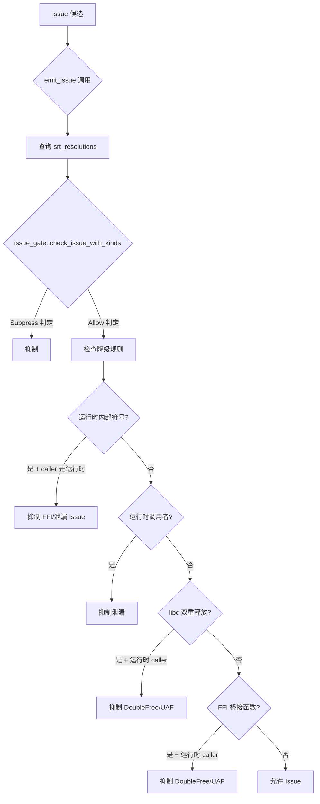

# FP 抑制（SRT 门控）

OmniScope-rs 使用称为 **SRT Gate**（Suppress/Review/Track）的多层假阳性抑制系统。本文档描述抑制规则及其工作原理。

## 概述

SRT 门控位于 `PassContext::emit_issue`（`crates/omniscope-pass/src/pass.rs:377-580`）。每个 Issue 在记录前都需通过此门控。门控查询 `srt_resolutions`（由 `StructuralInferencePass` 填充的 `HashMap<String, Vec<SemanticKind>>`）并应用分层抑制规则。

## R-N 抑制规则

规则定义在 `crates/omniscope-pass/src/resource/issue_gate.rs:14-39`。每条规则对应 README 假阳性抑制表中的 "R-N" 标签。

| 规则 | Issue 类型 | 抑制信号 | 源码位置 |
|---|---|---|---|
| R-0 | `WriteToImmutable` | `MutableParam`（LLVM readonly/noalias 参数属性） | `issue_gate.rs` |
| R-1 | `BorrowEscape` | `HeapProvenance` / `GlobalProvenance` | `issue_gate.rs` |
| R-2 | `WriteToImmutable` | `InteriorMutability`（UnsafeCell, mutable） | `issue_gate.rs` |
| R-3 | `UseAfterFree`, `DoubleFree`, `ConditionalLeak`, `DefiniteLeak`, `OwnershipEscapeLeak` | `RaiiDropRelease`（drop_in_place, tail dealloc） | `issue_gate.rs` |
| R-4 | `CrossLanguageFree` | `FileOp`, `NetworkOp`, `ProcessOp`（POSIX 系统调用分类） | `issue_gate.rs` |
| R-6 | `CrossLanguageFree`, `OwnershipEscapeLeak` | `IntoRawTransfer`（Box::into_raw, CString::into_raw） | `issue_gate.rs` |
| R-7 | `CrossLanguageFree` | `LibraryRelease`（库拥有资源） | `issue_gate.rs` |
| R-8 | `BorrowEscape` | `FromParameter`（非栈来源） | `issue_gate.rs` |
| R-9 | `UncheckedReturn` | `HeapProvenance`（分配器返回值） | `issue_gate.rs` |

## 降级规则

在 SRT 门控之外，`emit_issue` 还应用四条额外的降级规则（`pass.rs:443-577`）：

### 1. 运行时内部符号抑制

当 `is_runtime_internal(symbol)` 为真**且** caller 也是运行时内部函数时，以下 Issue 类型被抑制：
- `FfiUnsafeCall`、`ConditionalLeak`、`DefiniteLeak`、`OwnershipEscapeLeak`、`CrossLanguageFree`、`OwnershipViolation`

### 2. 运行时调用者泄漏抑制

当 caller 是运行时内部函数时，泄漏类 Issue（`ConditionalLeak`、`DefiniteLeak`、`OwnershipEscapeLeak`）被抑制，无论 callee 是什么符号。

### 3. libc 双重释放抑制

当 `symbol` 是已知 libc 函数且 caller 是运行时内部时，`DoubleFree` 和 `UseAfterFree` 被抑制。这处理了运行时分配器调用 free 释放自身分配的常见情况。

### 4. FFI 桥接函数抑制

当函数名以 `c_`、`rust_`、`zig_`、`py_`、`java_` 或 `go_` 开头且 caller 是运行时内部时，`DoubleFree` 和 `UseAfterFree` 被抑制。这些桥接函数是受信任的 FFI 胶水代码。

## 双证据门控

双证据门控（`IssueCandidateBuilderPass`）是一个在候选级别运作的独立抑制机制。匹配 FFI/跨族模式但缺乏 `FfiEvidence` 的候选会被降级，不作为 FFI 问题报告。详见 [docs/zh/ffi_detection.md](ffi_detection.md)。

## 单语言短路

当 `ModuleIndex.is_single_language == true` 时：
- `FFIBoundaryPass` 返回空结果（`analysis/mod.rs:84-92`）
- `LanguageAdapterFactPass` 跳过语言特定事实（`language_adapter_fact_pass.rs:79-84`）
- `IssueVerifierPass` 仅处理本地内存 Issue（`issue_verifier.rs:128-153`），跳过所有 FFI 相关类型

## 关键源文件

| 组件 | 文件 |
|---|---|
| SRT 门控（emit_issue） | `crates/omniscope-pass/src/pass.rs:377-580` |
| issue_gate 规则 | `crates/omniscope-pass/src/resource/issue_gate.rs:14-39` |
| NoiseReduction 工具 | `crates/omniscope-pass/src/analysis/noise_reduction.rs` |
| 双证据门控 | `crates/omniscope-pass/src/resource/issue_candidate_builder/mod.rs:995-1032` |
| 验证器 FFI 门控 | `crates/omniscope-pass/src/resource/issue_verifier.rs:155-182` |
| StructuralInference（填充 SRT） | `crates/omniscope-pass/src/resource/structural_inference_pass.rs` |
| SemanticKind 枚举 | `crates/omniscope-semantics/src/resource/semantic_tree/kind.rs` |
| RaiiDrop 检测（R-3） | `crates/omniscope-pass/src/analysis/raii_drop.rs` |
| InteriorMutability 检测（R-2） | `crates/omniscope-pass/src/analysis/interior_mutability.rs` |
| HeapProvenance 检测（R-1） | `crates/omniscope-pass/src/analysis/heap_provenance.rs` |