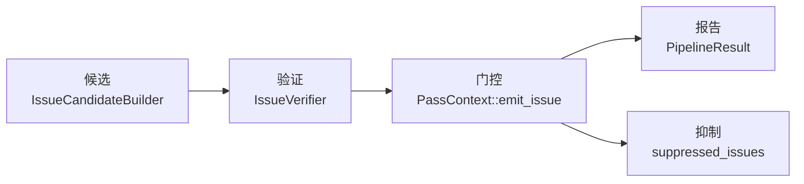

# Issue 模型

本文档描述 OmniScope-rs 的核心 Issue 类型体系，包括 `IssueKind`、`Severity`、`Confidence`、`VerifierVerdict` 以及 Issue 从检测到报告的生命周期。

## Issue 生命周期

Issue 在流水线中经历四个阶段：

1. **候选** — `IssueCandidateBuilderPass` 从所有权求解器和契约图产出原始候选
2. **验证** — `IssueVerifierPass` 对照 `BoundaryContext`、`FamilyRegistry`、`NoiseReduction` 检查每个候选，分配 `VerifierVerdict`
3. **门控** — `PassContext::emit_issue` 通过 SRT 门控（Suppress/Review/Track），可能基于语义证据抑制 Issue
4. **报告** — 存活的 Issue 被收集到 `PipelineResult.issues` 并由格式化器输出

## IssueKind

`IssueKind`（`crates/omniscope-core/src/issue.rs:27-96`）有 **28 个变体**，分为四组：

### FFI 边界组（8 个变体）

这是核心的 90% 优先级。`is_ffi_boundary()` 返回 true（`issue.rs:100-112`）。

| 变体 | CWE | 说明 |
|---|---|---|
| `CrossLanguageFree` | 762 | 一种语言分配的资源在另一种语言释放 |
| `OwnershipViolation` | 763 | 跨 FFI 边界所有权违反 |
| `FfiTypeMismatch` | 843 | FFI 接口类型不兼容 |
| `AbiMismatch` | 758 | ABI 调用约定不匹配 |
| `UncheckedReturn` | 252 | 可空 FFI 返回值未检查即解引用 |
| `FfiUnsafeCall` | 119 | 具有危险语义的 FFI 调用 |
| `CallbackEscape` | 749 | 回调逃逸到其他语言 |
| `LengthTruncation` | 197 | 长度/大小截断（如 usize→u32） |

### 本地内存组（7 个变体）

辅助的 10% 优先级。`is_local_memory()` 返回 true（`issue.rs:115-126`）。

| 变体 | CWE | 说明 |
|---|---|---|
| `DoubleFree` | 415 | 同一分配释放两次 |
| `UseAfterFree` | 416 | 悬空指针解引用 |
| `InvalidFree` | 763 | 释放非 malloc 返回的指针 |
| `MemoryLeak` | 401 | 分配从未释放 |
| `BufferOverflow` | 120 | 越界写入 |
| `NullDereference` | 476 | NULL 指针解引用 |
| `IntegerOverflow` | 190 | 整数溢出导致内存破坏 |

### 资源契约组（9 个变体）

`is_resource_contract()` 返回 true（`issue.rs:132-145`）。

| 变体 | CWE | 说明 |
|---|---|---|
| `CrossFamilyFree` | 762 | 分配和释放来自不同的资源族 |
| `ConditionalLeak` | 772 | 某些执行路径未释放资源 |
| `DefiniteLeak` | 772 | 所有路径均未释放资源 |
| `BorrowEscape` | 822 | 借用指针逃逸到需要所有权的上下文 |
| `CallbackEscapeIssue` | 749 | 指针逃逸到可能假定所有权的回调 |
| `NeedsModel` | — | 需要模型注解 |
| `WriteToImmutable` | 123 | 写入不可变内存位置 |
| `DoubleReclaim` | 415 | 同一裸指针多次 `from_raw` |
| `OwnershipEscapeLeak` | 772 | `into_raw` 后从未通过 `from_raw` 收回 |

### 并发组（3 个变体）

| 变体 | CWE | 说明 |
|---|---|---|
| `DataRace` | 362 | 跨 FFI 边界数据竞争 |
| `LockOrderViolation` | 833 | 锁顺序违反 |
| `ThreadCrossing` | 362 | 不安全指针跨线程边界 |

### 兜底（1 个变体）

| 变体 | 说明 |
|---|---|
| `Unknown` | 无法分类的 Issue |

## Severity（严重性）

`Severity`（`crates/omniscope-core/src/diagnostics.rs:16-27`）有四个级别：

| 级别 | 说明 |
|---|---|
| `Error` | 关键 — 分析无法继续或确认存在漏洞 |
| `Warning` | 潜在问题，需要人工审查 |
| `Note` | 额外的诊断信息 |
| `Help` | 修复建议 |

## Confidence（置信度）

`Confidence` 反映分析结果的可信程度：

| 级别 | 值 | 含义 |
|---|---|---|
| `High` | 1.0 | 多证据源确认 |
| `Medium` | 0.85 | 强证据但非确凿 |
| `Low` | 0.5-0.7 | 启发式模式匹配，可能是假阳性 |

## VerifierVerdict（验证器判定）

`VerifierVerdict`（`crates/omniscope-types/src/effect.rs:250-260`）是 `IssueVerifierPass` 对每个候选的输出：

| 判定 | 可报告 | 含义 |
|---|---|---|
| `ConfirmedIssue` | 是 | 高置信度确认的 Issue |
| `ProbableIssue` | 是 | 很可能真实，需人工审查 |
| `Diagnostic` | 否 | 非 bug，用于调试分析 |
| `ExplainedSafe` | 否 | 已调查并确定为安全 |

仅 `ConfirmedIssue` 和 `ProbableIssue` 出现在默认输出中。`is_reportable()` 方法（`effect.rs:264-269`）控制此行为。

## Issue 去重

`PipelineResult::with_issues`（`crates/omniscope-pipeline/src/result.rs:62-82`）按精确键去重：`(IssueKind, function, file, line, column, description_hash)`。碰撞时保留较高 `(severity, confidence)` 的 Issue，丢失的计入 `dedup_dropped`。

## 源码文件索引

| 类型 | 文件 |
|---|---|
| `IssueKind` | `crates/omniscope-core/src/issue.rs:27-96` |
| `Severity` | `crates/omniscope-core/src/diagnostics.rs:16-27` |
| `Confidence` | `crates/omniscope-core/src/issue.rs` |
| `VerifierVerdict` | `crates/omniscope-types/src/effect.rs:250-260` |
| `Issue` 结构体 | `crates/omniscope-core/src/issue.rs` |
| `IssueCandidate` | `crates/omniscope-core/src/issue_candidate.rs` |
| `IssueCandidateKind` | `crates/omniscope-types/src/evidence.rs:283-332` |
| `EmitOutcome` | `crates/omniscope-pass/src/pass.rs:60-79` |