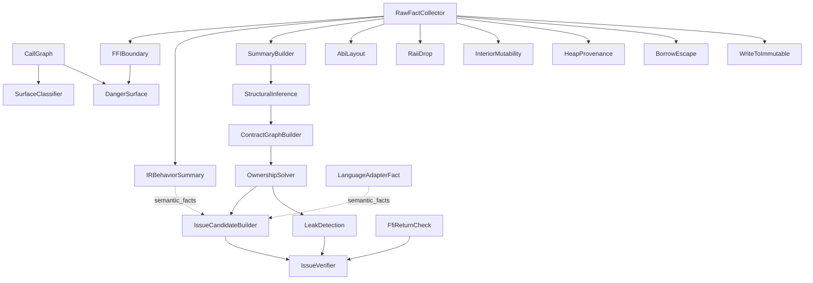

# 分析 Pass 清单

本文档列出 `Pipeline::register_default_passes`（`crates/omniscope-pipeline/src/pipeline.rs:85-127`）实际注册的全部 Pass。每个 Pass 的"名称"指 `fn name(&self)` 返回的字符串字面量。

流水线注册 **21 个**默认 Pass（包括新增的 `AbiLayoutPass`）。

## 完整注册清单

| # | 名称 | 文件路径 | Kind | 依赖 |
|---|---|---|---|---|
| 1 | `CallGraph` | `crates/omniscope-pass/src/analysis/call_graph.rs:36` | `Foundation` | 无 |
| 2 | `FFIBoundary` | `crates/omniscope-pass/src/analysis/mod.rs:67-79` | `Analysis` | `RawFactCollector` |
| 3 | `SurfaceClassifier` | `crates/omniscope-pass/src/analysis/surface_classifier_pass.rs:32-43` | `Analysis` | `CallGraph` |
| 4 | `DangerSurface` | `crates/omniscope-pass/src/analysis/danger_surface.rs:31-42` | `Analysis` | `CallGraph`, `FFIBoundary` |
| 5 | `RawFactCollector` | `crates/omniscope-pass/src/resource/raw_fact_collector.rs:314-325` | `Foundation` | 无 |
| 6 | `IRBehaviorSummary` | `crates/omniscope-pass/src/resource/ir_behavior_summary_pass.rs:51-62` | `Analysis` | `RawFactCollector` |
| 7 | `LanguageAdapterFact` | `crates/omniscope-pass/src/resource/language_adapter_fact_pass.rs:53-64` | `Analysis` | `ModuleIndex`（伪依赖） |
| 8 | `AbiLayout` | `crates/omniscope-pass/src/resource/abi_layout.rs` | `Analysis` | `RawFactCollector` |
| 9 | `SummaryBuilder` | `crates/omniscope-pass/src/resource/summary_builder.rs:34-45` | `Foundation` | `RawFactCollector` |
| 10 | `StructuralInference` | `crates/omniscope-pass/src/resource/structural_inference_pass.rs:56-67` | `Analysis` | `SummaryBuilder` |
| 11 | `ContractGraphBuilder` | `crates/omniscope-pass/src/resource/contract_graph_builder.rs:228-239` | `Analysis` | `StructuralInference` |
| 12 | `OwnershipSolver` | `crates/omniscope-pass/src/resource/ownership_solver.rs:61-72` | `Analysis` | `ContractGraphBuilder` |
| 13 | `IssueCandidateBuilder` | `crates/omniscope-pass/src/resource/issue_candidate_builder/mod.rs` | `Analysis` | `OwnershipSolver` |
| 14 | `IssueVerifier` | `crates/omniscope-pass/src/resource/issue_verifier.rs:50-61` | `Analysis` | `IssueCandidateBuilder`, `FfiReturnCheck`, `LeakDetection` |
| 15 | `LeakDetection` | `crates/omniscope-pass/src/resource/path_sensitive_leak.rs:96-107` | `Analysis` | `OwnershipSolver` |
| 16 | `RaiiDrop` | `crates/omniscope-pass/src/analysis/raii_drop.rs:29-40` | `Analysis` | `RawFactCollector` |
| 17 | `InteriorMutability` | `crates/omniscope-pass/src/analysis/interior_mutability.rs:27-38` | `Analysis` | `RawFactCollector` |
| 18 | `HeapProvenance` | `crates/omniscope-pass/src/analysis/heap_provenance.rs:28-39` | `Analysis` | `RawFactCollector` |
| 19 | `BorrowEscape` | `crates/omniscope-pass/src/analysis/borrow_escape.rs:29-40` | `Analysis` | `RawFactCollector` |
| 20 | `WriteToImmutable` | `crates/omniscope-pass/src/analysis/write_to_immutable.rs:28-39` | `Analysis` | `RawFactCollector` |
| 21 | `FfiReturnCheck` | `crates/omniscope-pass/src/resource/ffi_return_check.rs:39-50` | `Analysis` | 无（直接读 `ir_module`） |

所有源码路径相对于 `crates/omniscope-pass/src/`。

## 各 Pass 说明

### CallGraph（基础）
- 输入：`ctx.get_ir_module()`；可选 `module_index`
- 输出：`cross_lang_edges: Vec<CrossLangEdge>`、`call_graph_nodes/edges`
- 状态：**完整实现**

### FFIBoundary（分析）
- 输入：`cross_lang_edges`、`ir_module`、`module_index`、`FamilyRegistry`
- 输出：`Issue` 列表（`FfiUnsafeCall`/`CrossLanguageFree`/`OwnershipViolation`）
- 短路：`module_index.is_single_language == true` 时直接返回空结果
- 状态：**完整实现**，含三种检测路径

### SurfaceClassifier（分析）
- 输入：`ir_module`、`cross_lang_edges`
- 输出：`HashMap<String, FunctionSurface>` 存入 `function_surfaces`
- 状态：**完整实现**

### DangerSurface（分析）
- 输入：`cross_lang_edges`、`FamilyRegistry`
- 输出：`PassResult.stats["known_family"]`；**不发出 Issue**
- 状态：**诊断性**

### RawFactCollector（基础）
- 输入：优先 `module_index`，回退 `ir_module`
- 输出：`raw_resource_facts: Vec<RawResourceFact>`
- 状态：**完整实现**

### IRBehaviorSummary（分析）
- 输入：`ir_module`，可读 `summary_store`
- 输出：`function_behaviors: Vec<FunctionBehavior>`、`semantic_facts`
- 状态：**完整实现**

### LanguageAdapterFact（分析）
- 输入：`module_index`，五个语言适配器
- 输出：追加到 `semantic_facts: Vec<SemanticFact>`
- 短路：`is_single_language == true` 时跳过
- 状态：**完整实现**

### AbiLayout（分析）
- 输入：`ir_module`、`RawFactCollector` 输出
- 输出：`AbiMismatch` 和 `FfiTypeMismatch` Issue 候选
- 状态：**已实现**

### SummaryBuilder（基础）
- 输入：`FamilyRegistry`，可选 `function_behaviors`
- 输出：`summary_store: SummaryStore`、`family_registry: FamilyRegistry`
- 状态：**完整实现**

### StructuralInference（分析）
- 输入：`raw_resource_facts`、`summary_store`、`family_registry`
- 输出：扩展后的 `summary_store`、`srt_resolutions`（SRT 门控数据源）
- 状态：**完整实现**

### ContractGraphBuilder（分析）
- 输入：`raw_resource_facts`、`summary_store`，可选 `OmniScopeConfig`
- 输出：`contract_graph: ContractGraph`、`memory_graph: MemoryGraph`
- 状态：**完整实现**

### OwnershipSolver（分析）
- 输入：`contract_graph`
- 输出：`resource_instances`、`pointer_states`、所有权循环检测
- 状态：**完整实现**

### IssueCandidateBuilder（分析）
- 输入：`contract_graph`、`semantic_facts`、`boundary_context`
- 输出：`issue_candidates: Vec<IssueCandidate>` + 精度计数
- 状态：**完整实现，含双证据门控**

### IssueVerifier（分析）
- 输入：`issue_candidates`、`ffi_return_candidates`、`leak_candidates`
- 输出：通过 `ctx.emit_issue` 发出的 `Issue`，附 `VerifierVerdict`
- 状态：**完整实现**，是"唯一应该发出 Issue 的 Pass"

### LeakDetection（分析）
- 输入：`contract_graph`、`summary_store`、`pointer_states`
- 输出：`leak_candidates`（`ConditionalLeak` / `DefiniteLeak`）
- 状态：**部分实现**，`path_budget` 与 `max_path_length` 字段未使用

### 语义辅助 Pass（不发 Issue）
- **RaiiDrop**（R-3）：检测 `drop_in_place<T>`、尾位置 `__rust_dealloc`
- **InteriorMutability**（R-2）：检测 `UnsafeCell`/`Cell`/`RefCell`/C++ `mutable`
- **HeapProvenance**（R-1）：分类指针来源（heap/stack/global）

### BorrowEscape（分析）
- 检测栈分配指针跨 FFI 边界传递
- **会发出 Issue**（`Severity::Warning`）

### WriteToImmutable（分析）
- 检测写入不可变内存
- **会发出 Issue**

### FfiReturnCheck（分析）
- 扫描函数体，检测未检查的空值 FFI 返回值
- **会发出 Issue**

## Pass 依赖图

## 未注册的辅助模块

`omniscope info --passes` 列出的 `NoiseReduction`、`PrecisionMetrics`、`MemorySafety`、`PointerOwnership`、`BufferOverflow` 并不是真正的注册 Pass，而是内联使用的辅助模块或描述性名称。