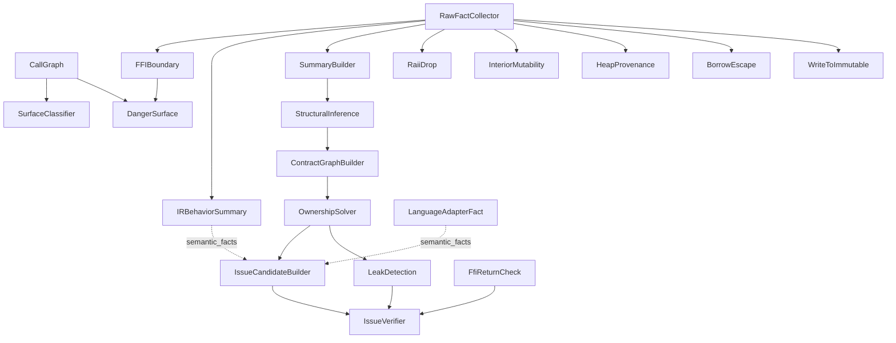

# 分析 Pass 清单

本文档列出 `Pipeline::register_default_passes`（`crates/omniscope-pipeline/src/pipeline.rs:85-126`）实际注册的全部 Pass。每个 Pass 的“名称”指 `fn name(&self)` 返回的字符串字面量，这是 `PassManager` 拓扑排序的稳定 key（`crates/omniscope-pass/src/manager.rs:41-70`）。

## 完整注册清单

`Pipeline::test_pipeline_with_default_passes`（`pipeline.rs:190-199`）断言默认共有 **20 个** Pass。下表按注册顺序列出：

| # | 名称 | 文件路径 | Kind | 依赖 |
|---|---|---|---|---|
| 1 | `CallGraph` | `crates/omniscope-pass/src/analysis/call_graph.rs:36` | `Foundation` | 无 |
| 2 | `FFIBoundary` | `crates/omniscope-pass/src/analysis/mod.rs:67-79` | `Analysis` | `RawFactCollector` |
| 3 | `SurfaceClassifier` | `crates/omniscope-pass/src/analysis/surface_classifier_pass.rs:32-43` | `Analysis` | `CallGraph` |
| 4 | `DangerSurface` | `crates/omniscope-pass/src/analysis/danger_surface.rs:31-42` | `Analysis` | `CallGraph`, `FFIBoundary` |
| 5 | `RawFactCollector` | `crates/omniscope-pass/src/resource/raw_fact_collector.rs:314-325` | `Foundation` | 无 |
| 6 | `IRBehaviorSummary` | `crates/omniscope-pass/src/resource/ir_behavior_summary_pass.rs:51-62` | `Analysis` | `RawFactCollector` |
| 7 | `LanguageAdapterFact` | `crates/omniscope-pass/src/resource/language_adapter_fact_pass.rs:53-64` | `Analysis` | `ModuleIndex`（伪依赖，见下） |
| 8 | `SummaryBuilder` | `crates/omniscope-pass/src/resource/summary_builder.rs:34-45` | `Foundation` | `RawFactCollector` |
| 9 | `StructuralInference` | `crates/omniscope-pass/src/resource/structural_inference_pass.rs:56-67` | `Analysis` | `SummaryBuilder` |
| 10 | `ContractGraphBuilder` | `crates/omniscope-pass/src/resource/contract_graph_builder.rs:228-239` | `Analysis` | `StructuralInference` |
| 11 | `OwnershipSolver` | `crates/omniscope-pass/src/resource/ownership_solver.rs:61-72` | `Analysis` | `ContractGraphBuilder` |
| 12 | `IssueCandidateBuilder` | `crates/omniscope-pass/src/resource/issue_candidate_builder/mod.rs` | `Analysis` | `OwnershipSolver` |
| 13 | `IssueVerifier` | `crates/omniscope-pass/src/resource/issue_verifier.rs:50-61` | `Analysis` | `IssueCandidateBuilder`, `FfiReturnCheck`, `LeakDetection` |
| 14 | `LeakDetection` | `crates/omniscope-pass/src/resource/path_sensitive_leak.rs:96-107` | `Analysis` | `OwnershipSolver` |
| 15 | `RaiiDrop` | `crates/omniscope-pass/src/analysis/raii_drop.rs:29-40` | `Analysis` | `RawFactCollector` |
| 16 | `InteriorMutability` | `crates/omniscope-pass/src/analysis/interior_mutability.rs:27-38` | `Analysis` | `RawFactCollector` |
| 17 | `HeapProvenance` | `crates/omniscope-pass/src/analysis/heap_provenance.rs:28-39` | `Analysis` | `RawFactCollector` |
| 18 | `BorrowEscape` | `crates/omniscope-pass/src/analysis/borrow_escape.rs:29-40` | `Analysis` | `RawFactCollector` |
| 19 | `WriteToImmutable` | `crates/omniscope-pass/src/analysis/write_to_immutable.rs:28-39` | `Analysis` | `RawFactCollector` |
| 20 | `FfiReturnCheck` | `crates/omniscope-pass/src/resource/ffi_return_check.rs:39-50` | `Analysis` | 无（直接读 `ir_module`） |

> **依赖说明**：`LanguageAdapterFact` 的 `dependencies()` 返回 `vec!["ModuleIndex"]`（`language_adapter_fact_pass.rs:62-64`），但 `ModuleIndex` 不是注册的 Pass，而是 `PassManager::run_all_with_ir_and_config` 在初始化时直接 `store("module_index", ...)` 的预计算缓存（`manager.rs:178-183`）。因此该依赖字符串在拓扑排序里被当作“未匹配”跳过，等价于无依赖。

## 各 Pass 的输入 / 输出 / 实现成熟度

下面按职责分组描述。

### A. Call Graph 与边界识别

#### CallGraph（基础）
- 文件：`crates/omniscope-pass/src/analysis/call_graph.rs`
- 输入：`ctx.get_ir_module()`；可选 `module_index`。
- 输出：`cross_lang_edges: Vec<CrossLangEdge>`、`call_graph_nodes: Vec<CallGraphNode>`、`call_graph_edges: Vec<CallGraphEdge>`（通过 `ctx.store` 写入）。
- 状态：**完整实现**。`run`（`call_graph.rs:48`）会优先走 `ModuleIndex` 的快速路径，对所有函数分类 `Internal`/`LibC`/`ExternalUnknown`。

#### FFIBoundary（分析）
- 文件：`crates/omniscope-pass/src/analysis/mod.rs:53-568`
- 输入：`cross_lang_edges`（来自 CallGraph）、`ir_module`、`module_index`、`FamilyRegistry`。
- 输出：`Issue` 列表（`FfiUnsafeCall`/`CrossLanguageFree`/`OwnershipViolation`），通过 `ctx.emit_issue` 走 SRT 门控。
- 状态：**完整实现**，含三种检测路径：
  - 优先消费 `cross_lang_edges`；
  - 否则用 `ModuleIndex.ffi_boundary_calls()`；
  - 最后回退到原始 `module.calls` 扫描，含**传递式 FFI 边界检测**（caller → local → external，`mod.rs:282-321`）。
- 短路：`module_index.is_single_language == true` 时直接返回空结果（`mod.rs:84-92`）。
- 语义评估：调用 `omniscope_semantics::assess_ffi_safety`（`analysis/mod.rs:370-397`），结合 `FFIVerdict`（`ConcernOwnershipTransfer`/`SafeNoOwnership`/`Unknown`）和 `FamilyRegistry` 决定 `IssueKind` 与 `Confidence`。

#### SurfaceClassifier（分析）
- 文件：`crates/omniscope-pass/src/analysis/surface_classifier_pass.rs`
- 输入：`ir_module`、`cross_lang_edges`。
- 输出：`HashMap<String, FunctionSurface>` 存入 `function_surfaces`。
- 状态：**完整实现**。L1（linkage）+ L2（路径启发式）来自 `SurfaceClassifier`（`omniscope-semantics`），L3 通过调用图可达性把 `Unknown` 升级为 `Boundary`。

#### DangerSurface（分析）
- 文件：`crates/omniscope-pass/src/analysis/danger_surface.rs`
- 输入：`cross_lang_edges`、`FamilyRegistry`。
- 输出：`PassResult.stats["known_family"]`；**不发出 Issue**（`danger_surface.rs:95-99`）。
- 状态：**精简实现 / 诊断性**。仅统计有多少 FFI 边界对应已知资源族，是后续 “tier-2 strict” 分析的入口预留。

### B. 资源契约（核心架构）

#### RawFactCollector（基础）
- 文件：`crates/omniscope-pass/src/resource/raw_fact_collector.rs`
- 输入：优先 `module_index`，回退 `ir_module`。
- 输出：`raw_resource_facts: Vec<RawResourceFact>`（含 `family`、`is_acquire`、`contract`、`boundary_evidence`）。
- 状态：**完整实现**。带 `MemoryPool` 池化的临时字符串分配（`raw_fact_collector.rs:14-17`），重置 `ctx.reset_pool()` 后每轮重用。

#### IRBehaviorSummary（分析）
- 文件：`crates/omniscope-pass/src/resource/ir_behavior_summary_pass.rs`
- 输入：`ir_module`，可读 `summary_store`。
- 输出：`function_behaviors: Vec<FunctionBehavior>`、追加到 `semantic_facts: Vec<SemanticFact>`、扩充 `summary_store`。
- 状态：**完整实现**（M1 milestone，`ir_behavior_summary_pass.rs:1-26`）。把基于 IR 指令模式（PureComputation、ConditionalRelease 等）的行为映射为 `ResourceSummary` 与 `SemanticFact`，是后续 SRT 门控的关键事实源之一。

#### LanguageAdapterFact（分析）
- 文件：`crates/omniscope-pass/src/resource/language_adapter_fact_pass.rs`
- 输入：`module_index`（必须，缺则返回空结果），五个语言适配器（CppAdapter、PythonAdapter、JavaAdapter、GoAdapter、CSharpAdapter）。
- 输出：追加到 `semantic_facts: Vec<SemanticFact>`，统计 `cpp_count`/`python_count`/`java_count`/`go_count`/`csharp_count`。
- 状态：**完整实现，但分析深度依赖各适配器**。语言识别走三级 fallback：`call_metas` 的 caller/callee_lang → `function_metas.language` → 名字启发（`looks_like_cpp` 等）。短路：`is_single_language == true` 时跳过（`language_adapter_fact_pass.rs:79-84`）。

#### SummaryBuilder（基础）
- 文件：`crates/omniscope-pass/src/resource/summary_builder.rs`
- 输入：`FamilyRegistry`（内部 `new()`），可选 `function_behaviors`。
- 输出：`summary_store: SummaryStore`、`family_registry: FamilyRegistry`。
- 状态：**完整实现**。把家族注册表里所有已知符号的 summary 物化，加上 IR 行为派生的 summary。

#### StructuralInference（分析）
- 文件：`crates/omniscope-pass/src/resource/structural_inference_pass.rs`
- 输入：`raw_resource_facts`、`summary_store`、`family_registry`、可选 `function_behaviors`。
- 输出：扩展后的 `summary_store`、`srt_resolutions: HashMap<String, Vec<SemanticKind>>`（**SRT 门控所依赖的真正数据源**）。
- 状态：**完整实现**。优先用 IR 行为，回退到 `infer_summary_for_symbol`（基于符号名的析构函数 / 桥接 / 引用计数 / 静态生命周期推断）。注释 `structural_inference_pass.rs:1-26` 明确说明：没有这一步，SRT 门控就没有数据可查。

#### ContractGraphBuilder（分析）
- 文件：`crates/omniscope-pass/src/resource/contract_graph_builder.rs`
- 输入：`raw_resource_facts`、`summary_store`，可选 `OmniScopeConfig`。
- 输出：`contract_graph: ContractGraph`、`memory_graph: MemoryGraph`。
- 状态：**完整实现**。`ContractEdge` 包含 `Acquire`/`Release`/`Borrow`/`Escape` 等 `Effect`，按 `(func_id, family)` 进行 FIFO 配对（`contract_graph_builder.rs:271-304`），避免别名 callee 导致的错误配对。支持 `Pipeline::with_omniscope_config` 注入的资源族配置。

#### OwnershipSolver（分析）
- 文件：`crates/omniscope-pass/src/resource/ownership_solver.rs`
- 输入：`contract_graph`。
- 输出：`resource_instances: Vec<ResourceInstance>`、`pointer_states: PointerStateMap`、`ownership_cycle_detector` 状态、`rust_drop_tracker` 状态。
- 状态：**完整实现**。两阶段：先创建 `ResourceInstance`，再对 Release/Escape/Transfer 边应用状态机；带 `OwnershipCycleDetector` 抑制 escape↔reclaim 死循环，带 `RustDropTracker`（`resource/rust_drop_tracker.rs`）识别 RAII drop。

#### IssueCandidateBuilder（分析）
- 文件：`crates/omniscope-pass/src/resource/issue_candidate_builder/mod.rs`（含子模块 `grouping.rs`、`tests_dual_evidence.rs`）。
- 输入：`contract_graph`、`semantic_facts`、`boundary_context`、`AllocatorShimDetector`、`FamilyRegistry`、`LanguageDetector`。
- 输出：`issue_candidates: Vec<IssueCandidate>` + `PassResult.stats` 中的精度计数（`ffi_evidence_count`、`boundary_evidence_count`、`needs_model_count`、`local_bug_count`、`boundary_suppressed`）。
- 状态：**完整实现，含双证据门控**。候选种类（`IssueCandidateKind`，定义于 `crates/omniscope-types/src/evidence.rs:283-332`）：`CrossFamilyFree`、`DoubleRelease`、`ConditionalLeak`、`DefiniteLeak`、`BorrowEscape`、`UseAfterRelease`、`UseAfterFree`、`DoubleReclaim`、`OwnershipEscapeLeak`、`InvalidBorrowedFree`、`UncheckedFfiReturn`、`NullDereference`、`CallbackEscape`、`CrossLanguageFree`、`NeedsModel`。
- 自定义分配器过滤：`AllocatorShimDetector::is_custom_allocator_shim` 过滤掉项目内的分配器包装函数（`issue_candidate_builder/mod.rs:1034-1046`）。

#### IssueVerifier（分析）
- 文件：`crates/omniscope-pass/src/resource/issue_verifier.rs`
- 输入：`issue_candidates`、`ffi_return_candidates`、`leak_candidates`、`memory_graph`、`srt_resolutions`、`family_registry`、`boundary_context`、`OmniScopeConfig`、`NoiseReduction`。
- 输出：通过 `ctx.emit_issue` 发出的 `Issue`、`verified_candidates: Vec<IssueCandidate>`（含 `VerifierVerdict::ConfirmedIssue`/`ProbableIssue`/`Diagnostic`/`ExplainedSafe`）。
- 状态：**完整实现**，是“唯一应该发出 Issue 的 Pass”（`issue_verifier.rs:1-10`）。检查序列：单语言短路 → FFI Gate（runtime-internal leak 抑制，要求**无 FFI evidence + 是 leak + 符号与 caller 均为 runtime-internal**）→ MemoryGraph 状态 → SRT 解析 → `NoiseReduction.should_suppress` → runtime-caller 抑制 → 三档 runtime allocator/deallocator 抑制。最后只对 `is_reportable()` 的候选调用 `ctx.next_issue_id()` 并 `emit_issue`。

#### LeakDetection（分析）
- 文件：`crates/omniscope-pass/src/resource/path_sensitive_leak.rs`
- 输入：`contract_graph`、`summary_store`、`pointer_states`、`raw_resource_facts`。
- 输出：`leak_candidates: Vec<IssueCandidate>`（`ConditionalLeak` / `DefiniteLeak`）。
- 状态：**部分实现**。结构与字段齐全，但 `path_budget` 与 `max_path_length` 字段被显式标注 “Not yet used in `run()` — reserved for path-sensitive upgrade”（`path_sensitive_leak.rs:65-71`）。当前实现是按 contract graph 边判断 leak，**还不是真正的路径敏感切片**。

#### FfiReturnCheck（分析）
- 文件：`crates/omniscope-pass/src/resource/ffi_return_check.rs`
- 输入：`ir_module`。
- 输出：`ffi_return_candidates: Vec<IssueCandidate>`（`UncheckedFfiReturn` / `NullDereference`）。
- 状态：**完整实现**。扫描函数体，对外部声明返回的指针做 `icmp eq/ne null` 跟踪；过滤掉 Rust runtime、分配器、`Box::into_raw`/`from_raw`。

### C. 语义辅助（提供 SemanticTree / SRT 提示）

下列五个 Pass 都不发出 Issue，只把 `SemanticResolution`/`SemanticKind` 写进 `*_tree` 共享键（`raii_drop_tree`、`heap_provenance_tree`、`interior_mutability_tree`、`write_to_immutable_tree`、`borrow_escape_tree`），供后续 SRT 门控参考。

#### RaiiDrop（分析）
- 文件：`crates/omniscope-pass/src/analysis/raii_drop.rs`
- 检测模式（R-3）：`drop_in_place<T>` 调用、尾位置 `__rust_dealloc`、`Arc/Rc` 引用计数递减 + 条件 dealloc。
- 状态：**完整实现**（基于 `SemanticTree` 的模式识别，`raii_drop.rs:42-101`）。

#### InteriorMutability（分析）
- 文件：`crates/omniscope-pass/src/analysis/interior_mutability.rs`
- 检测模式（R-2）：`UnsafeCell` / `Cell` / `RefCell` / `Mutex` / `RwLock` / `Atomic*` / `OnceLock` / `LazyLock` / C++ `mutable`。
- 状态：**完整实现**，基于名字模式。

#### HeapProvenance（分析）
- 文件：`crates/omniscope-pass/src/analysis/heap_provenance.rs`
- 检测模式（R-1）：`HeapProvenance` / `GlobalProvenance` / `StackProvenance`，覆盖 malloc / `__rust_alloc` / `Box::new` / `Vec::with_capacity` / 静态变量 / alloca。
- 状态：**完整实现**，分层启发式（`heap_provenance.rs:75-105+`）。

#### BorrowEscape（分析）
- 文件：`crates/omniscope-pass/src/analysis/borrow_escape.rs`
- 检测对象：栈分配的指针跨 FFI 边界传递的 `BorrowEscape` Issue。
- 状态：**会发出 Issue**（`Severity::Warning`），借助 `SemanticTree` 抑制 R-1（heap/global）和 R-8（参数来源）的误报。

#### WriteToImmutable（分析）
- 文件：`crates/omniscope-pass/src/analysis/write_to_immutable.rs`
- 检测对象：写入不可变内存的 `WriteToImmutable` Issue。
- 状态：**会发出 Issue**。优先用 `ModuleIndex.function_meta(name).has_stores` 预筛函数体，跳过运行时内部函数。

### D. 注册但未在 Pipeline 中默认启用的相关代码

`omniscope-pass/src/lib.rs:20-44` 还公开了若干辅助模块（`NoiseReduction`、`PrecisionMetrics`、`infer_boundaries`、`RiskScore` 等），它们不是独立 Pass，而是被其它 Pass 内嵌调用：

- `NoiseReduction`（`analysis/noise_reduction.rs`）：`IssueVerifier` 在 Layer 1 调用它做快速字符串黑名单抑制。
- `infer_boundaries`（`analysis/boundary_inference.rs`）：CLI 在 `--cross` 未提供时调用，自动从 IR 推断 FFI 边界并塞回 `FFIBoundaryConfig`（`crates/omniscope-cli/src/main.rs:311-330`）。
- `compute_risk_score` / `RiskScore`（`resource/risk_scoring.rs`）：被 `IssueCandidateBuilder` 调用，给 candidate 计算风险分数。

## Pass 依赖图

> 虚线表示数据流（共享 `semantic_facts` 键），实线为 `Pass::dependencies()` 声明的拓扑依赖。

## Stub / 占位状态汇总

| Pass | 状态 | 备注 |
|---|---|---|
| `DangerSurface` | **诊断性**（不发 Issue） | 仅统计已知资源族 |
| `LeakDetection` | **部分实现** | `path_budget` / `max_path_length` 字段未使用 |
| `RaiiDrop` / `InteriorMutability` / `HeapProvenance` | **完整**但只生成 SemanticTree | 它们不发 Issue，是给 SRT 门控提供数据 |
| 其余 16 个 Pass | **完整实现** | 详细字段、错误处理与测试均在源码中 |

> 全部 Pass 的单元测试位于各文件的 `#[cfg(test)] mod tests`，并有专项的 `tests_dual_evidence.rs`（`issue_candidate_builder/`）覆盖双证据门控。
